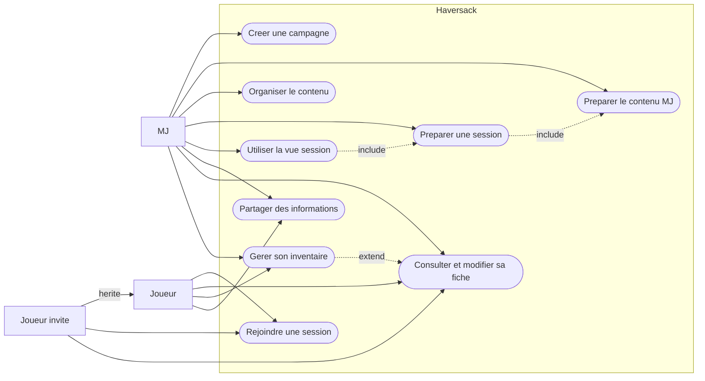
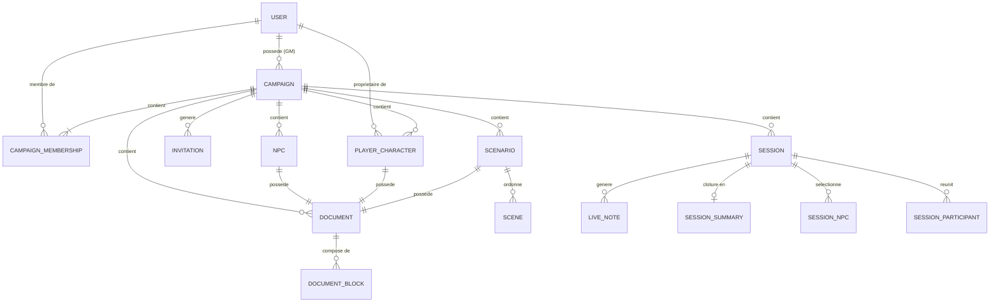

# Haversack

> Outil d'aide à la préparation et à la conduite de parties de jeu de rôle

---

## Présentation du service

**Nom :** Haversack

**Logo :** _(à créer)_

**Slogan :** _(à définir)_

---

## Charte graphique

> _À définir : palette de couleurs (3-5), typographies, style d'illustrations, ambiance visuelle._

---

## Expression des besoins

### Problème

Un Maître du Jeu (MJ) actif gère simultanément une quantité considérable d'informations : scénarios, PNJ, notes secrètes, fiches personnages, informations à partager aux joueurs, suivi narratif, lore. Ces informations sont aujourd'hui dispersées sur plusieurs outils non spécialisés :

| Support | Problème principal |
|---|---|
| Fichiers texte / Word | Difficile à parcourir pendant la session |
| Notion / Google Docs | Pas conçu pour le JDR |
| Discord | Informations perdues dans le scroll |
| Papier | Non cherchable, risque de perte |
| Roll20 / Foundry | Centré sur le combat, pas la narration |

Cette fragmentation casse le rythme de jeu, génère une charge mentale élevée et provoque des oublis en session.

### Public cible

**Utilisateur principal :** le Maître du Jeu — c'est lui qui prépare la campagne, choisit les outils et porte la charge organisationnelle.

**Utilisateurs secondaires :** les joueurs, qui accèdent à leur fiche personnage, inventaire, notes et informations partagées par le MJ.

### Fonctionnalité principale

**La vue session** — un tableau de bord de conduite qui regroupe en un seul endroit tout ce dont le MJ a besoin pendant la partie : scénario actif, PNJ, notes, accès aux fiches joueurs, prise de notes rapide. Objectif : ne plus quitter l'application pour retrouver une information.

### Fonctionnalités secondaires (MVP)

- Création et organisation de campagnes
- Structuration de scénarios (découpage en scènes)
- Gestion des PNJ
- Gestion des notes (privées / partagées)
- Fiches personnages simples
- Gestion d'inventaire
- Partage d'informations aux joueurs (visibilité configurable)
- Recherche plein texte dans la campagne
- Invitation des joueurs (lien ou email)
- Accès joueur sans compte (lien temporaire)

### Hors périmètre MVP

Table virtuelle visuelle, cartes interactives, système de combat automatisé, IA, marketplace, plugins, audio/vidéo.

### Zoning / wireframes

> _À créer : esquisses des vues principales (tableau de bord MJ, vue session, fiche campagne, fiche PNJ)._

---

## Stack technique

| Couche | Technologie |
|---|---|
| **Landing page** | Next.js (React, SSR/SSG) |
| **Application web** | Angular (SPA) |
| **Backend** | .NET / ASP.NET Core (C#) |
| **Base de données** | PostgreSQL |
| **ORM** | Entity Framework Core |
| **Authentification** | ASP.NET Identity |

**Architecture :** Clean Architecture, monolithe modulaire, Domain-Driven Design (DDD), 4 Bounded Contexts.

**Structure de la solution :**

```
Haversack.SharedKernel
Haversack.Domain
Haversack.Application
Haversack.Infrastructure.Persistence
Haversack.Infrastructure.Notifications
Haversack.Api
```

**Clients de présentation futurs** (post-MVP) :

| Client | Technologie | Effort |
|---|---|---|
| Mobile / Desktop installable | PWA (`@angular/pwa`) | Quasi nul |
| Desktop natif Win/Linux/macOS | Tauri (wrape Angular) | Faible |
| iOS / Android stores | Capacitor (wrape Angular) | Modéré |
| .NET natif multi-plateforme | MAUI (projet séparé, UI propre) | Élevé |

> [Détail des choix techniques, justifications, points forts/faibles et évolutions](docs/conception/stack.md)
> [Structure complète de la solution et clients futurs](docs/architecture/06-structure-projets.md)

---

## Diagramme de cas d'utilisation

> Vue simplifiée — [voir le détail complet](docs/conception/diagrams/use-cases.md)



---

## MCD — Modèle Conceptuel de Données

> Vue globale — [voir le détail par bounded context](docs/conception/data/README.md)



---

## Documentation

- [Conception complète](docs/conception/README.md)
- [Architecture](docs/architecture/ArchitectureIndex.md)
- [Use cases détaillés](docs/conception/usecases/README.md)
- [Décisions d'architecture (ADR)](docs/conception/domain/adr/README.md)
