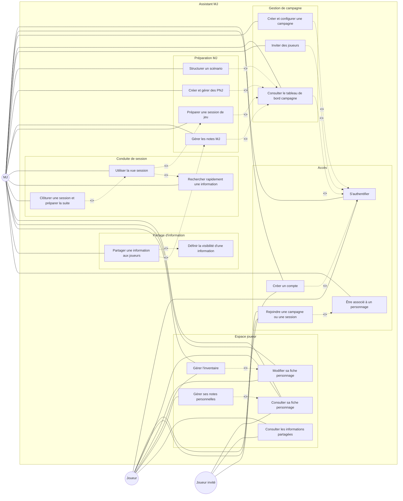
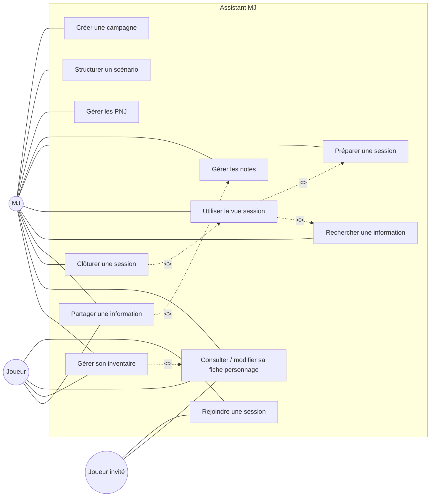
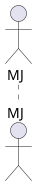

# Diagramme de cas d’utilisation — Assistant MJ

> Version compatible README Markdown / GitHub avec Mermaid.
>
> Note : Mermaid ne propose pas de vrai diagramme de cas d’utilisation UML natif.  
> Le diagramme ci-dessous est donc une représentation lisible en `flowchart`, compatible README.
> Pour un diagramme UML strict, il vaut mieux générer une image PlantUML en PNG/SVG et l’intégrer dans le README.

## Diagramme principal

## Version simplifiée

## Pourquoi PlantUML ne s’affiche pas toujours ?

Un bloc comme celui-ci :

ne s’affiche généralement pas directement dans un README GitHub classique.

Pour utiliser PlantUML, il faut soit :

- générer une image `.png` ou `.svg` depuis le fichier PlantUML ;
- intégrer cette image dans le README ;
- ou utiliser un outil/documentation qui supporte PlantUML, comme certains pipelines GitLab, MkDocs avec plugin, Asciidoctor, Kroki, etc.

## Recommandation

Pour le README du projet, utiliser la version Mermaid ci-dessus.

Pour le dossier de conception ou la soutenance, générer une image propre depuis PlantUML afin d’avoir un vrai diagramme UML plus conventionnel.