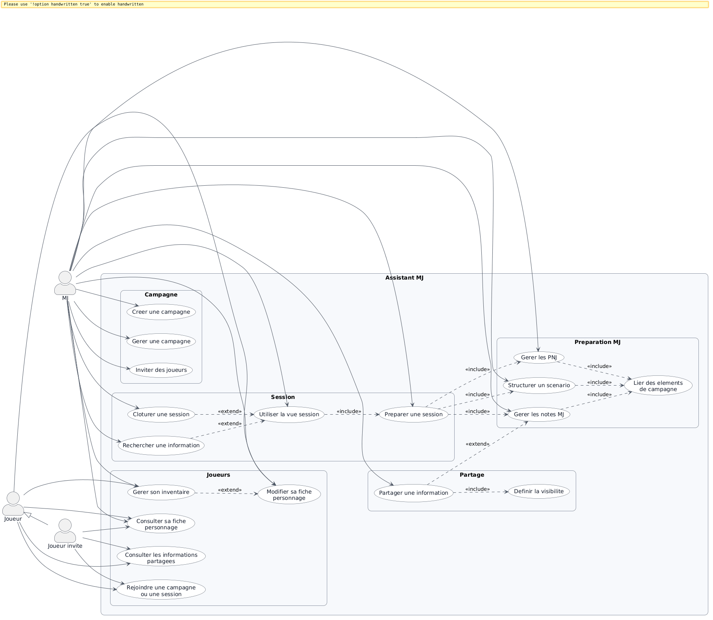
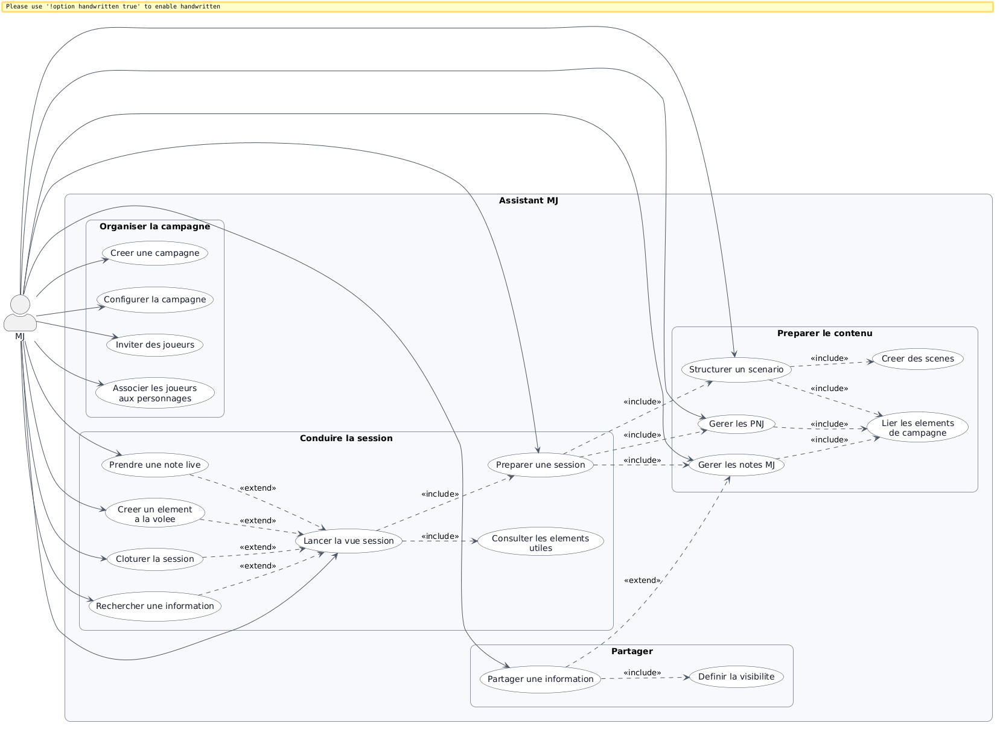
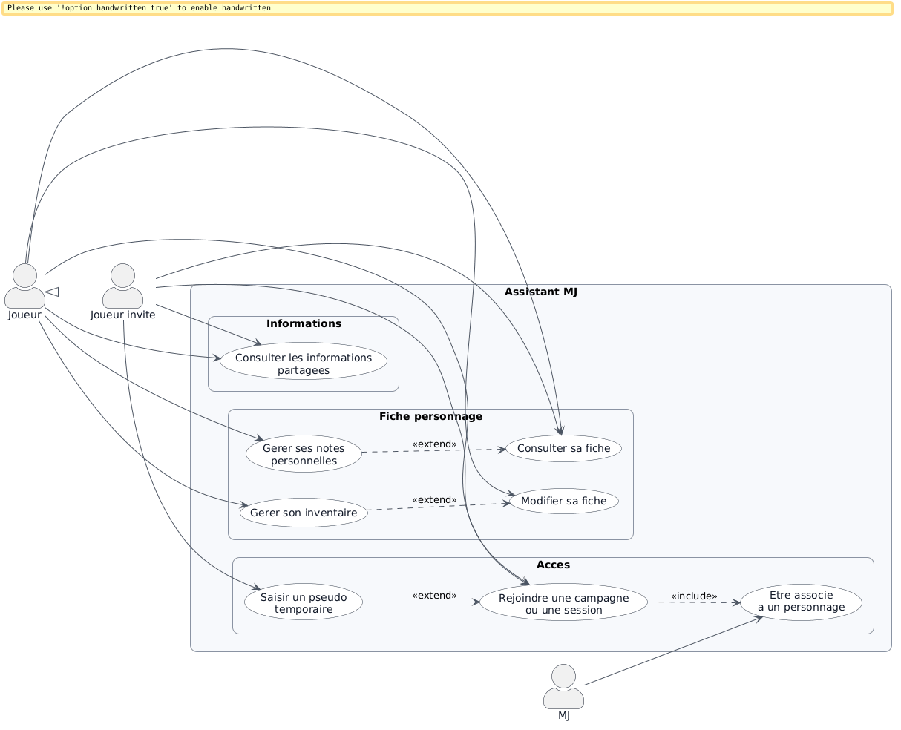
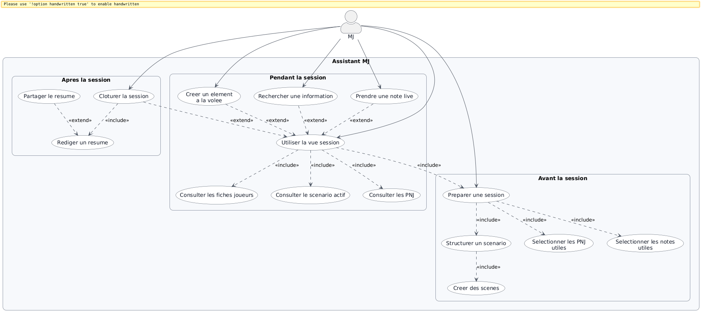
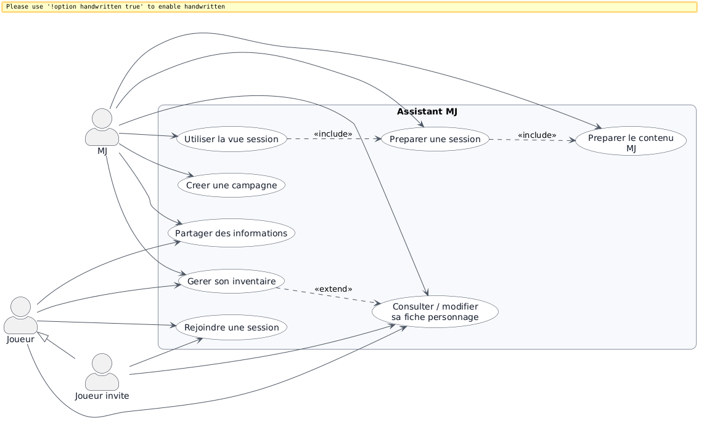

# Diagrammes de cas d’utilisation

Ce document présente les diagrammes de cas d’utilisation du projet **Assistant MJ**.

---

## Contenu

Le dossier contient plusieurs diagrammes, chacun avec un objectif différent :

- **01_global_synthese_lisible.png**  
  Vue d’ensemble du périmètre fonctionnel du MVP.

- **02_centre_mj_lisible.png**  
  Diagramme centré sur le **Maître du Jeu (MJ)**, qui est l’utilisateur principal du produit.

- **03_centre_joueur_lisible.png**  
  Diagramme centré sur le **joueur** et le **joueur invité**.

- **04_preparation_session_lisible.png**  
  Diagramme détaillant le cycle **préparation → session → clôture**.

- **05_soutenance_simplifie_lisible.png**  
  Version simplifiée.

---

## 1. Diagramme global de synthèse

Ce diagramme donne une vision générale du système et de ses grands cas d’utilisation.



---

## 2. Diagramme centré MJ

Ce diagramme met l’accent sur le cœur du produit :  
**aider le MJ à préparer, organiser et conduire ses sessions**.



---

## 3. Diagramme centré joueur

Ce diagramme montre les fonctionnalités côté joueur, tout en gardant une logique simple et secondaire par rapport au MJ.



---

## 4. Diagramme préparation / session

Ce diagramme est particulièrement utile pour montrer la proposition de valeur du produit :

- préparer en amont ;
- retrouver les informations pendant la session ;
- clôturer proprement la session ensuite.



---

## 5. Diagramme simplifié pour soutenance

Ce diagramme est une version plus légère, pensée pour être lisible rapidement dans un support de présentation.



---

## Recommandation d’usage

### Pour le dossier de conception
Il est conseillé d’utiliser :

- le **diagramme global de synthèse** ;
- le **diagramme centré MJ** ;
- le **diagramme préparation / session**.

### Pour une soutenance
Il est conseillé d’utiliser principalement :

- le **diagramme simplifié** ;
- éventuellement le **diagramme centré MJ** en annexe ou en backup.

---

## Important

Ce README suppose que les fichiers PNG se trouvent **dans le même dossier que ce fichier README**.

Si tu ranges les images dans un sous-dossier (par exemple `./images/` ou `./docs/diagrams/`), il faudra adapter les chemins dans les balises Markdown.

Exemple :

```md

```

---

## Source

Les diagrammes PNG sont issus des fichiers PlantUML du projet, afin d’avoir :

- un rendu plus propre ;
- une lecture plus simple ;
- une compatibilité directe avec GitHub / GitLab / READ