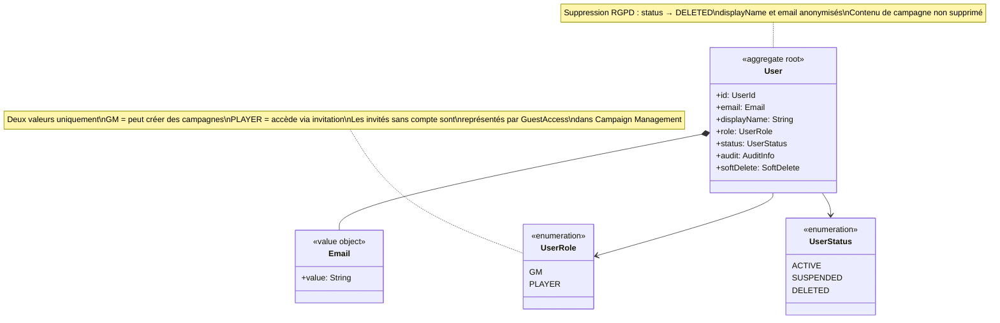
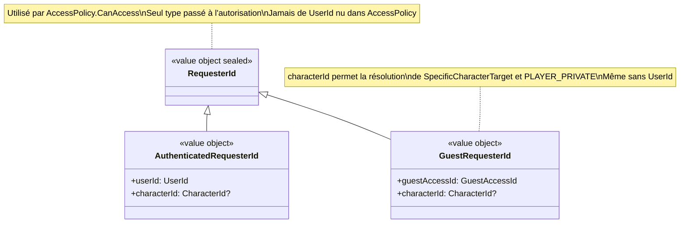
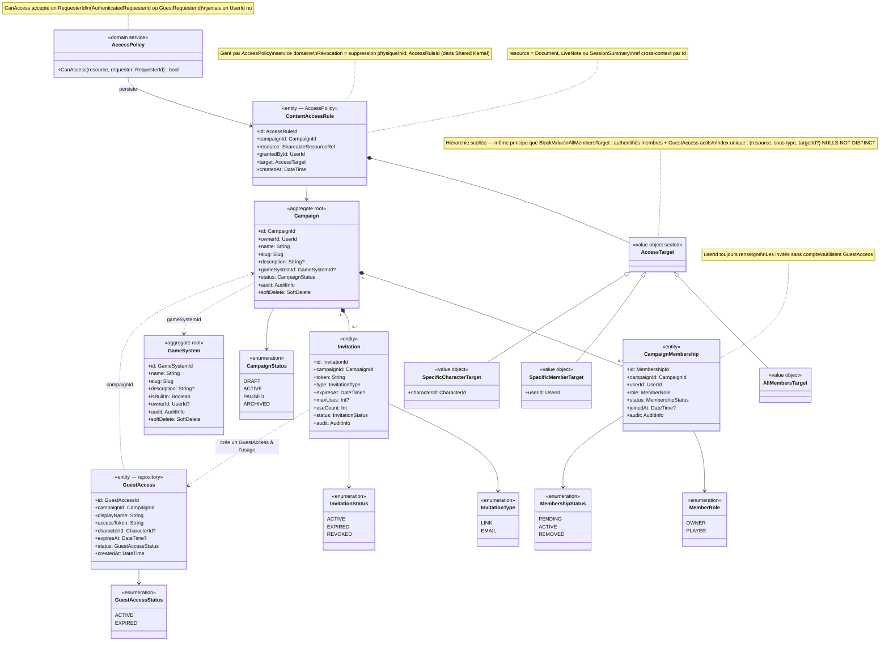
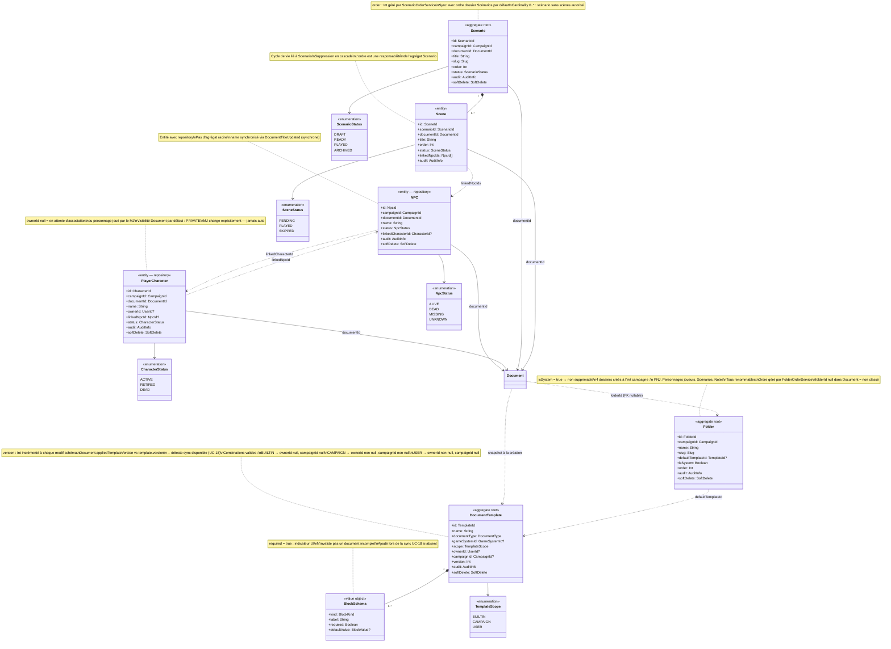
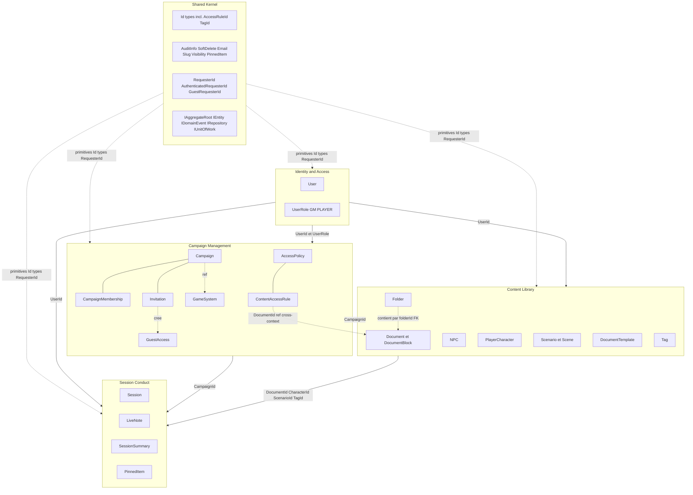

# Diagrammes de classes

## Légende des relations

| Notation | Signification |
|---|---|
| `*--` | Composition — cycle de vie lié, l'enfant ne vit pas sans le parent |
| `-->` | Association — dépendance directionnelle |
| `..>` | Référence légère — Id uniquement, cycle de vie indépendant |
| `<|--` | Héritage / spécialisation |

---

## 1. Identity & Access

Contexte le plus simple et le plus stable. Un seul agrégat racine : `User`.
Il représente uniquement les utilisateurs authentifiés avec une identité persistante.
Les joueurs invités sans compte ne sont pas des `User` — ils vivent dans Campaign Management
sous la forme d'un `GuestAccess`. `UserRole` est intentionnellement limité à deux valeurs :
un rôle global ne dit pas ce qu'un utilisateur peut faire dans une campagne précise,
cela relève de `MemberRole` dans Campaign Management.

---

## 2. Shared Kernel — RequesterId

`RequesterId` est un type union scellé du Shared Kernel permettant à `AccessPolicy`
de traiter uniformément les utilisateurs authentifiés et les invités sans compte.
Ce type résout le problème d'autorisation des GuestAccess qui n'ont pas de UserId.

---

## 3. Campaign Management

Contexte organisationnel. `Campaign` est l'agrégat racine central — il encapsule
ses membres (`CampaignMembership`) et ses invitations (`Invitation`) dont le cycle
de vie lui est entièrement lié.

`GuestAccess` est une entité avec repository distincte de `CampaignMembership` :
un invité sans compte n'est pas un membre au sens plein — c'est un accès temporaire
créé depuis une invitation, sans identité persistante dans le système.
Du point de vue de la visibilité, un GuestAccess actif est traité comme un joueur ordinaire
sur le périmètre de son personnage : PUBLIC, SHARED et PLAYER_PRIVATE si le `characterId`
correspond.

`AccessPolicy` est un service domaine, pas un agrégat. Il persiste des `ContentAccessRule`
immuables. Sa méthode `CanAccess` accepte un `RequesterId` (Shared Kernel) pour gérer
uniformément authentifiés et invités.

`GameSystem` est un agrégat léger indépendant — point d'extension futur pour les règles
de jeu. Référencé optionnellement par une campagne.

---

## 4. Content Library — Document, blocs et tags

`Document` est l'agrégat racine du contenu modulaire. Tout contenu éditorial dans
Haversack est un `Document` typé composé de `DocumentBlock`.

Chaque `DocumentBlock` porte une `BlockValue` fortement typée — une hiérarchie
de value objects scellés, un sous-type concret par `BlockKind`. Ce design évite
les champs optionnels sans sens : un `StatBarBlockValue` n'a que `current` et `max`,
un `TextBlockValue` n'a que `content`. Aucune ambiguïté sur ce qui est valide.

`Tag` est une entité légère appartenant à une campagne, créée par le MJ et réutilisable
sur n'importe quel `Document` de la même campagne. `Document.tagIds[]` référence ces Tags.
Le soft delete d'un `Tag` déclenche `TagDeleted` — un handler synchrone purge les `tagIds`
de tous les documents concernés.

```mermaid
classDiagram
    direction TB
    class Document {
        <<aggregate root>>
        +id: DocumentId
        +campaignId: CampaignId
        +type: DocumentType
        +customType: String?
        +title: String
        +slug: Slug
        +visibility: Visibility
        +ownerCharacterId: CharacterId?
        +templateId: TemplateId?
        +folderId: FolderId?
        +appliedTemplateVersion: Int?
        +tagIds: TagId[]
        +audit: AuditInfo
        +softDelete: SoftDelete
    }
    class DocumentBlock {
        <<entity>>
        +id: BlockId
        +documentId: DocumentId
        +kind: BlockKind
        +label: String?
        +order: Int
        +value: BlockValue
        +isPrivate: Boolean
        +isLocked: Boolean
        +audit: AuditInfo
    }
    class BlockValue {
        <<value object abstract>>
    }
    class TextBlockValue {
        <<value object>>
        +content: String
    }
    class FieldBlockValue {
        <<value object>>
        +value: String
    }
    class StatBarBlockValue {
        <<value object>>
        +current: Int
        +max: Int
    }
    class RelationBlockValue {
        <<value object>>
        +targetId: DocumentId
        +targetType: DocumentType
    }
    class ListBlockValue {
        <<value object>>
        +items: String[]
    }
    class ItemBlockValue {
        <<value object>>
        +name: String
        +quantity: Int
        +properties: Map
    }
    class ChecklistBlockValue {
        <<value object>>
        +items: ChecklistItem[]
    }
    class ImageBlockValue {
        <<value object>>
        +url: String
        +caption: String?
    }
    class Tag {
        <<entity — repository>>
        +id: TagId
        +campaignId: CampaignId
        +label: String
        +color: String?
        +audit: AuditInfo
        +softDelete: SoftDelete
    }
    class Visibility {
        <<enumeration — Shared Kernel>>
        PRIVATE
        PLAYER_PRIVATE
        SHARED
        PUBLIC
    }
    class DocumentType {
        <<enumeration>>
        NOTE
        NPC
        CHARACTER
        SCENARIO
        SCENE
        LOCATION
        CUSTOM
    }
    class BlockKind {
        <<enumeration>>
        TEXT
        FIELD
        STAT_BAR
        RELATION
        LIST
        ITEM
        CHECKLIST
        IMAGE
    }
    Document "1" *-- "0..*" DocumentBlock
    Document --> DocumentType
    Document --> Visibility
    Document "0..*" ..> "0..*" Tag : tagIds
    DocumentBlock *-- BlockValue
    DocumentBlock --> BlockKind
    BlockValue <|-- TextBlockValue
    BlockValue <|-- FieldBlockValue
    BlockValue <|-- StatBarBlockValue
    BlockValue <|-- RelationBlockValue
    BlockValue <|-- ListBlockValue
    BlockValue <|-- ItemBlockValue
    BlockValue <|-- ChecklistBlockValue
    BlockValue <|-- ImageBlockValue
    note for Document "customType obligatoire si type = CUSTOM\nCo-création obligatoire pour NPC/CHARACTER/SCENARIO/SCENE\nVoir ADR-22\nfolderId FK nullable (intra-contexte)\nappliedTemplateVersion comparé à DocumentTemplate.version → UC-18"
    note for DocumentBlock "isPrivate = true → jamais exposé aux joueurs\nMême si Document est SHARED\nisLocked = true → non modifiable joueur\n(modélisé, inactif en MVP)\nZéro ou plusieurs blocs par Document"
    note for Visibility "PRIVATE = MJ uniquement\nPLAYER_PRIVATE = ownerCharacterId (MJ exclu)\nSHARED = membres ciblés via ContentAccessRule\nPUBLIC = tous les membres (joueurs + invités actifs)"
    note for RelationBlockValue "Backlinks orphelins : si targetId pointe vers\nun document soft-deleted, le backlink n'est pas affiché\nFiltré à la requête (isDeleted = false) — ADR-23"
    note for Tag "label unique par campagne (insensible casse)\nSoft delete Tag → TagDeleted event\nHandler synchrone nettoie Document.tagIds\nNon partageable entre campagnes\nGéré via UC-19"
```

---

## 5. Content Library — Enveloppes métier et dossiers

Le pattern structurant de Content Library : chaque concept métier (`NPC`, `PlayerCharacter`,
`Scenario`, `Scene`) possède un `Document` pour son contenu variable, et porte
ses propres règles métier dans une enveloppe séparée.

`NPC` et `PlayerCharacter` sont des **profils spécialisés de Document**.
Leur contenu variable reste dans le Document ; leurs tables dédiées portent les métadonnées
requêtables et les règles transverses.

`Scenario` est un agrégat racine car il protège l'ordre et la cohérence de sa collection
de `Scene`. Une scène ne peut pas exister sans son scénario parent.

Le lien `NPC ↔ PlayerCharacter` est une **association narrative bidirectionnelle optionnelle**.
Les deux entités ont des cycles de vie indépendants.

`DocumentTemplate` définit un schéma de blocs attendus. Le champ `version` est incrémenté
à chaque modification du schéma. `Document.appliedTemplateVersion` est comparé à `template.version`
pour détecter qu'une synchronisation est disponible (UC-18).

`Folder` est un agrégat racine léger — il protège l'invariant "un dossier système ne peut pas
être supprimé" et gère son ordre. Les `Document` le référencent par FK (`folderId` nullable).

---

## 6. Session Conduct

Contexte opérationnel. `Session` est le seul agrégat racine — il encapsule les notes
prises en temps réel ou a posteriori (`LiveNote`) et le compte-rendu final (`SessionSummary`).

Tous les liens vers les autres contextes (sections 1 à 5) sont des **références légères par Id** :
`campaignId`, `scenarioId`, `participantIds`, `selectedNpcIds`, `pinnedItems.documentId`.
Session Conduct ne possède aucune entité des autres contextes — il les consomme par Id.

`LiveNote` peut être créée par le MJ ou par un joueur. Le `authorRole` détermine
les règles de visibilité par défaut et les contraintes applicables (voir UC-06).

```mermaid
classDiagram
    direction TB
    class Session {
        <<aggregate root>>
        +id: SessionId
        +campaignId: CampaignId
        +scenarioId: ScenarioId?
        +title: String
        +slug: Slug
        +scheduledAt: DateTime?
        +startedAt: DateTime?
        +endedAt: DateTime?
        +status: SessionStatus
        +participantIds: CharacterId[]
        +selectedNpcIds: NpcId[]
        +pinnedItems: PinnedItem[]
        +audit: AuditInfo
        +softDelete: SoftDelete
    }
    class PinnedItem {
        <<value object>>
        +documentId: DocumentId
        +order: Int
        +pinnedAt: DateTime
    }
    class LiveNote {
        <<entity>>
        +id: LiveNoteId
        +sessionId: SessionId
        +content: String
        +authorUserId: UserId?
        +authorGuestAccessId: GuestAccessId?
        +ownerCharacterId: CharacterId?
        +authorRole: LiveNoteAuthorRole
        +visibility: Visibility
        +linkedDocumentId: DocumentId?
        +audit: AuditInfo
    }
    class SessionSummary {
        <<entity>>
        +id: SummaryId
        +sessionId: SessionId
        +content: String
        +visibility: Visibility
        +ownerCharacterId: CharacterId?
        +audit: AuditInfo
        +softDelete: SoftDelete
    }
    class SessionStatus {
        <<enumeration>>
        PLANNED
        LIVE
        CLOSED
        ARCHIVED
    }
    class LiveNoteAuthorRole {
        <<enumeration>>
        GM
        PLAYER
    }
    Session "1" *-- "0..*" PinnedItem
    Session "1" *-- "0..*" LiveNote
    Session "1" *-- "0..1" SessionSummary
    Session --> SessionStatus
    LiveNote --> LiveNoteAuthorRole
    note for Session "Références cross-context par Id uniquement\n─────────────────────────────────────\ncampaignId → Campaign Management\nscenarioId → Content Library\nparticipantIds → Content Library\nselectedNpcIds → Content Library (NpcId[])\npinnedItems.documentId → Content Library\n─────────────────────────────────────\nselectedNpcIds : auto-déduit depuis scènes du scénario\npar SessionNpcSelector (application service)\nSurcharge manuelle possible par le MJ\n─────────────────────────────────────\nInvariant : une seule session LIVE par campagne\nTransitions : PLANNED→LIVE→CLOSED→ARCHIVED\nCLOSED = contenu éditable MJ, ARCHIVED = lecture seule"
    note for LiveNote "authorRole = GM : défaut PRIVATE\nPeut partager (SHARED ou PUBLIC)\nJamais PLAYER_PRIVATE\n─────────────────────────────────────\nauthorRole = PLAYER : défaut PLAYER_PRIVATE\nownerCharacterId obligatoire\nPeut partager (SHARED ou PUBLIC)\nJamais PRIVATE\n─────────────────────────────────────\nJoueurs : créent LiveNotes uniquement sur session LIVE\nMJ : créé sur LIVE et CLOSED (rétroactif)"
    note for SessionSummary "PRIVATE = MJ uniquement\nSHARED ou PUBLIC = joueurs ciblés\nvisibility jamais PLAYER_PRIVATE"
    note for PinnedItem "Capture ordre et date d'épinglage"
```

---

## 7. Context Map

Vue globale des dépendances entre bounded contexts. Les flèches indiquent
la direction de consommation — il n'y a pas de dépendance circulaire.

Le **Shared Kernel** est la fondation commune consommée par tous les contextes.
Il contient uniquement des primitives stables sans règle métier, ainsi que
`RequesterId` (type union pour l'autorisation des GuestAccess).

**Identity & Access** est le contexte upstream — il fournit `UserId` à tous les autres.

**Campaign Management** fournit `CampaignId` aux deux contextes en aval. Il héberge
`AccessPolicy` dont la `ContentAccessRule` référence une `ShareableResourceRef`
(`Document`, `LiveNote` ou `SessionSummary`) par Id uniquement.

**Content Library** fournit ses Id (`DocumentId`, `CharacterId`, `ScenarioId`, `TagId`) à Session Conduct.

