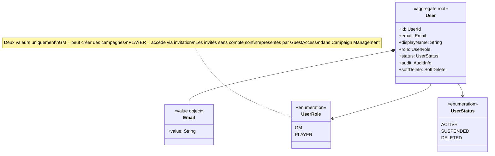
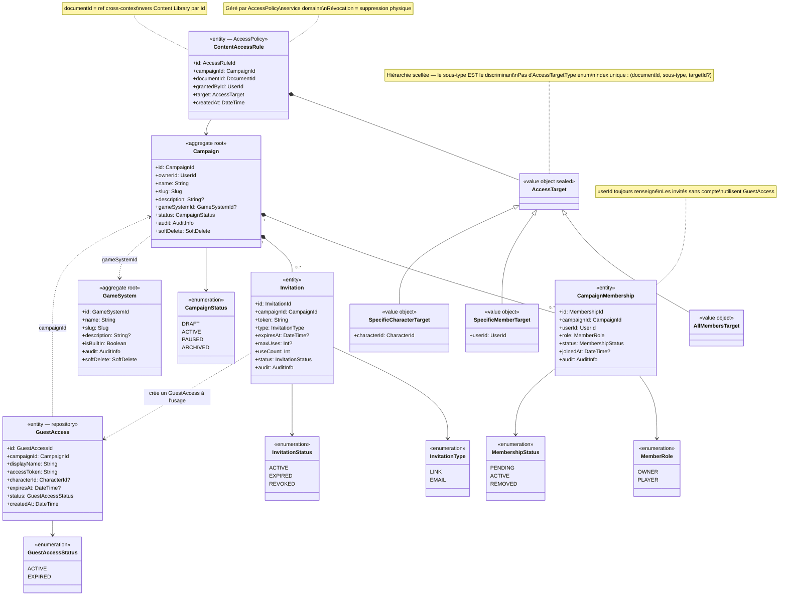
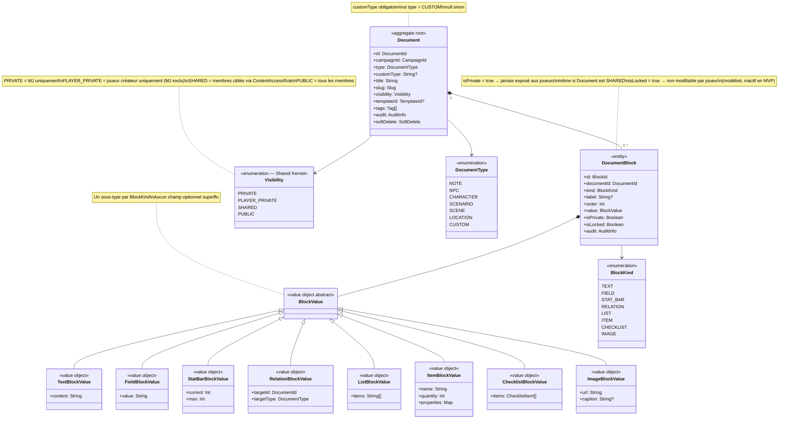
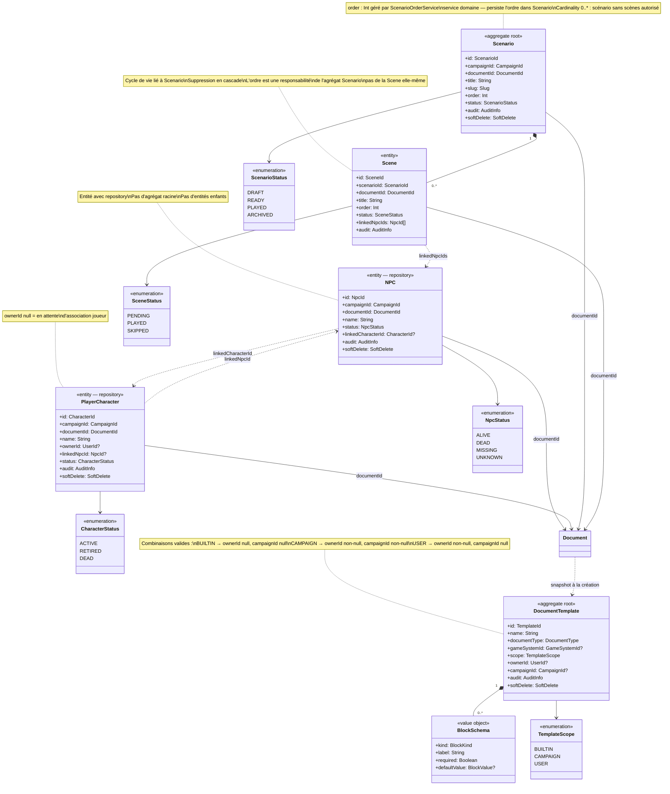
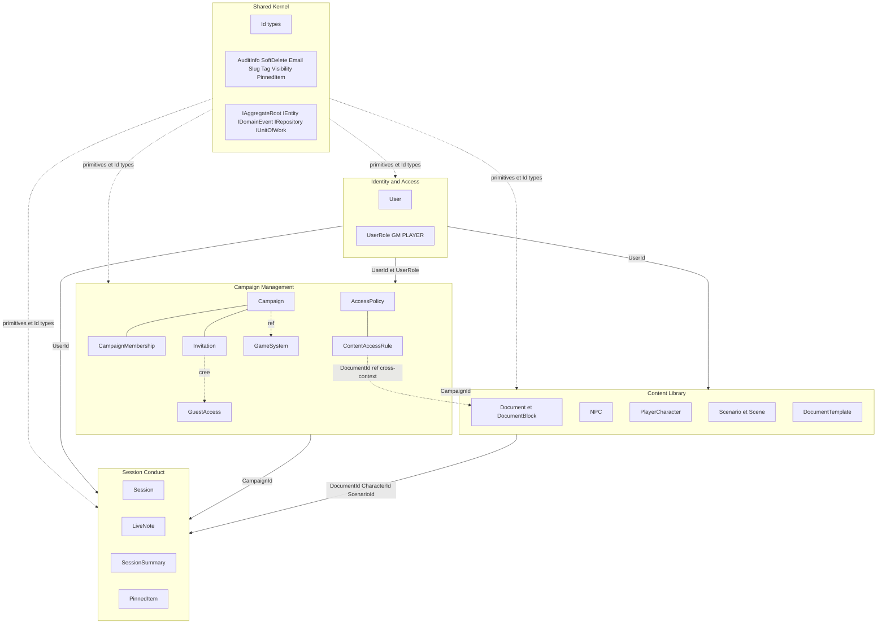

# Diagrammes de classes

## Légende des relations

| Notation | Signification |
|---|---|
| `*--` | Composition — cycle de vie lié, l'enfant ne vit pas sans le parent |
| `-->` | Association — dépendance directionnelle |
| `..>` | Référence légère — Id uniquement, cycle de vie indépendant |
| `<|--` | Héritage / spécialisation |

---

## 1. Identity & Access

Contexte le plus simple et le plus stable. Un seul agrégat racine : `User`.
Il représente uniquement les utilisateurs authentifiés avec une identité persistante.
Les joueurs invités sans compte ne sont pas des `User` — ils vivent dans Campaign Management
sous la forme d'un `GuestAccess`. `UserRole` est intentionnellement limité à deux valeurs :
un rôle global ne dit pas ce qu'un utilisateur peut faire dans une campagne précise,
cela relève de `MemberRole` dans Campaign Management.

---

## 2. Campaign Management

Contexte organisationnel. `Campaign` est l'agrégat racine central — il encapsule
ses membres (`CampaignMembership`) et ses invitations (`Invitation`) dont le cycle
de vie lui est entièrement lié.

`GuestAccess` est une entité avec repository distincte de `CampaignMembership` :
un invité sans compte n'est pas un membre au sens plein — c'est un accès temporaire
créé depuis une invitation, sans identité persistante dans le système.

`AccessPolicy` est un service domaine, pas un agrégat. Il persiste des `ContentAccessRule`
immuables qui définissent qui peut voir quel contenu. Une règle est créée ou révoquée
(suppression physique) — jamais modifiée. `ContentAccessRule.documentId` est une référence
cross-context vers Content Library par Id uniquement, conformément à la règle AD-14.

`GameSystem` est un agrégat léger indépendant — point d'extension futur pour les règles
de jeu. Référencé optionnellement par une campagne.

---

## 3. Content Library — Document et blocs

`Document` est l'agrégat racine du contenu modulaire. Tout contenu éditorial dans
Haversack est un `Document` typé composé de `DocumentBlock`.

Chaque `DocumentBlock` porte une `BlockValue` fortement typée — une hiérarchie
de value objects scellés, un sous-type concret par `BlockKind`. Ce design évite
les champs optionnels sans sens : un `StatBarBlockValue` n'a que `current` et `max`,
un `TextBlockValue` n'a que `content`. Aucune ambiguïté sur ce qui est valide.

Le champ `customType: String?` sur `Document` permet d'étendre les types de document
sans modifier l'énumération — `DocumentType.CUSTOM` avec un libellé libre couvre
les besoins non prévus et les futurs types système de jeu.

---

## 4. Content Library — Enveloppes métier

Le pattern structurant de Content Library : chaque concept métier (`NPC`, `PlayerCharacter`,
`Scenario`, `Scene`) possède un `Document` pour son contenu variable, et porte
ses propres règles métier dans une enveloppe séparée.

`NPC` et `PlayerCharacter` sont des **entités avec repository**, pas des agrégats racines.
Ils ont leur propre Id et leur propre cycle de vie, mais pas d'entités enfants à protéger
transactionnellement. Leurs seuls invariants propres sont leur statut et leurs liens narratifs.

`Scenario` est un agrégat racine car il protège l'ordre et la cohérence de sa collection
de `Scene`. Une scène ne peut pas exister sans son scénario parent.

Le lien `NPC ↔ PlayerCharacter` est une **association narrative bidirectionnelle optionnelle**.
Les deux entités ont des cycles de vie indépendants — la suppression de l'un ne supprime
pas l'autre. Ce lien prépare la future promotion NPC → Personnage joueur sans migration.

`DocumentTemplate` définit un schéma de blocs attendus pour un type de document.
Un document créé depuis un template est un snapshot indépendant — modifier le template
ne modifie pas les documents déjà créés.

---

## 5. Session Conduct

Contexte opérationnel. `Session` est le seul agrégat racine — il encapsule les notes
prises en temps réel (`LiveNote`) et le compte-rendu final (`SessionSummary`).

Tous les liens vers les autres contextes sont des **références légères par Id** :
`campaignId`, `scenarioId`, `participantIds`, `pinnedItems.documentId`. Session Conduct
ne possède aucune entité des autres contextes — il les consomme par Id conformément
à la règle d'isolation des bounded contexts.

`PinnedItem` est un value object qui enrichit la simple liste d'Ids : il capture
l'ordre d'affichage et la date d'épinglage, ce qui permet au MJ de réordonner
ses éléments de référence pendant la session.

`LiveNote.visibility` permet au MJ de partager une note en direct aux joueurs
pendant la session. La valeur par défaut `PRIVATE` garantit qu'aucune note
n'est exposée accidentellement.

L'invariant le plus fort de ce contexte : **une seule session `LIVE` par campagne
à la fois**. Les transitions de statut sont unidirectionnelles :
`PLANNED → LIVE → CLOSED → ARCHIVED`.

```mermaid
classDiagram
    direction TB
    class Session {
        <<aggregate root>>
        +id: SessionId
        +campaignId: CampaignId
        +scenarioId: ScenarioId?
        +title: String
        +slug: Slug
        +scheduledAt: DateTime?
        +startedAt: DateTime?
        +endedAt: DateTime?
        +status: SessionStatus
        +participantIds: CharacterId[]
        +selectedNpcIds: NpcId[]
        +pinnedItems: PinnedItem[]
        +audit: AuditInfo
        +softDelete: SoftDelete
    }
    class PinnedItem {
        <<value object>>
        +documentId: DocumentId
        +order: Int
        +pinnedAt: DateTime
    }
    class LiveNote {
        <<entity>>
        +id: LiveNoteId
        +sessionId: SessionId
        +content: String
        +authorId: UserId
        +visibility: Visibility
        +linkedDocumentId: DocumentId?
        +audit: AuditInfo
    }
    class SessionSummary {
        <<entity>>
        +id: SummaryId
        +sessionId: SessionId
        +content: String
        +visibility: Visibility
        +audit: AuditInfo
        +softDelete: SoftDelete
    }
    class SessionStatus {
        <<enumeration>>
        PLANNED
        LIVE
        CLOSED
        ARCHIVED
    }
    Session "1" *-- "0..*" PinnedItem
    Session "1" *-- "0..*" LiveNote
    Session "1" *-- "0..1" SessionSummary
    Session --> SessionStatus
    note for Session "Références cross-context par Id uniquement\n─────────────────────────────────────\ncampaignId → Campaign Management\nscenarioId → Content Library\nparticipantIds → Content Library\nselectedNpcIds → Content Library (NpcId[])\npinnedItems.documentId → Content Library\n─────────────────────────────────────\nselectedNpcIds : auto-déduit depuis scènes du scénario\npar SessionNpcSelector (domain service)\nSurcharge manuelle possible par le MJ\n─────────────────────────────────────\nInvariant : une seule session LIVE\npar campagne à la fois\nTransitions : PLANNED→LIVE→CLOSED→ARCHIVED\nCLOSED = contenu éditable, ARCHIVED = lecture seule"
    note for LiveNote "visibility = PRIVATE par défaut\nPeut être partagée aux joueurs\npendant la session (UC-06)"
    note for SessionSummary "PRIVATE = MJ uniquement\nSHARED = joueurs ciblés"
    note for PinnedItem "Remplace pinnedDocumentIds[]\nCapture ordre et date d'épinglage"
```

---

## 6. Context Map

Vue globale des dépendances entre bounded contexts. Les flèches indiquent
la direction de consommation — il n'y a pas de dépendance circulaire.

Le **Shared Kernel** est la fondation commune consommée par tous les contextes.
Il contient uniquement des primitives stables sans règle métier.

**Identity & Access** est le contexte upstream — il fournit `UserId` à tous les autres.
Aucun contexte ne remonte d'informations vers Identity.

**Campaign Management** fournit `CampaignId` aux deux contextes en aval. Il héberge
aussi `AccessPolicy` dont la `ContentAccessRule` référence des `DocumentId` de Content Library
par Id uniquement — la seule dépendance cross-context dans les données persistées.

**Content Library** fournit ses Id (`DocumentId`, `CharacterId`, `ScenarioId`) à Session Conduct
qui les consomme comme références légères.

