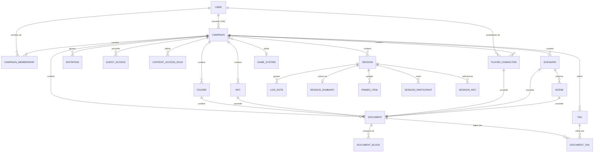
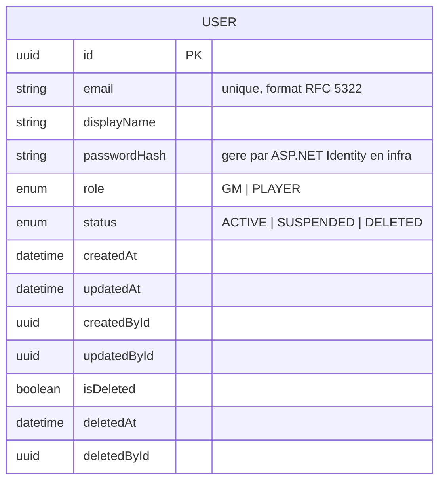
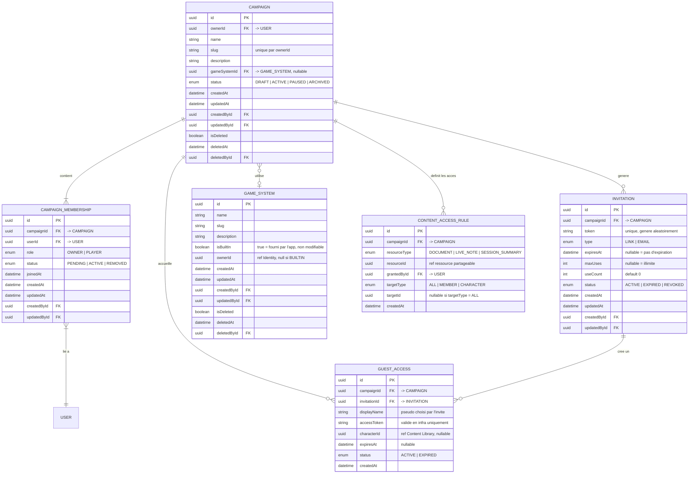
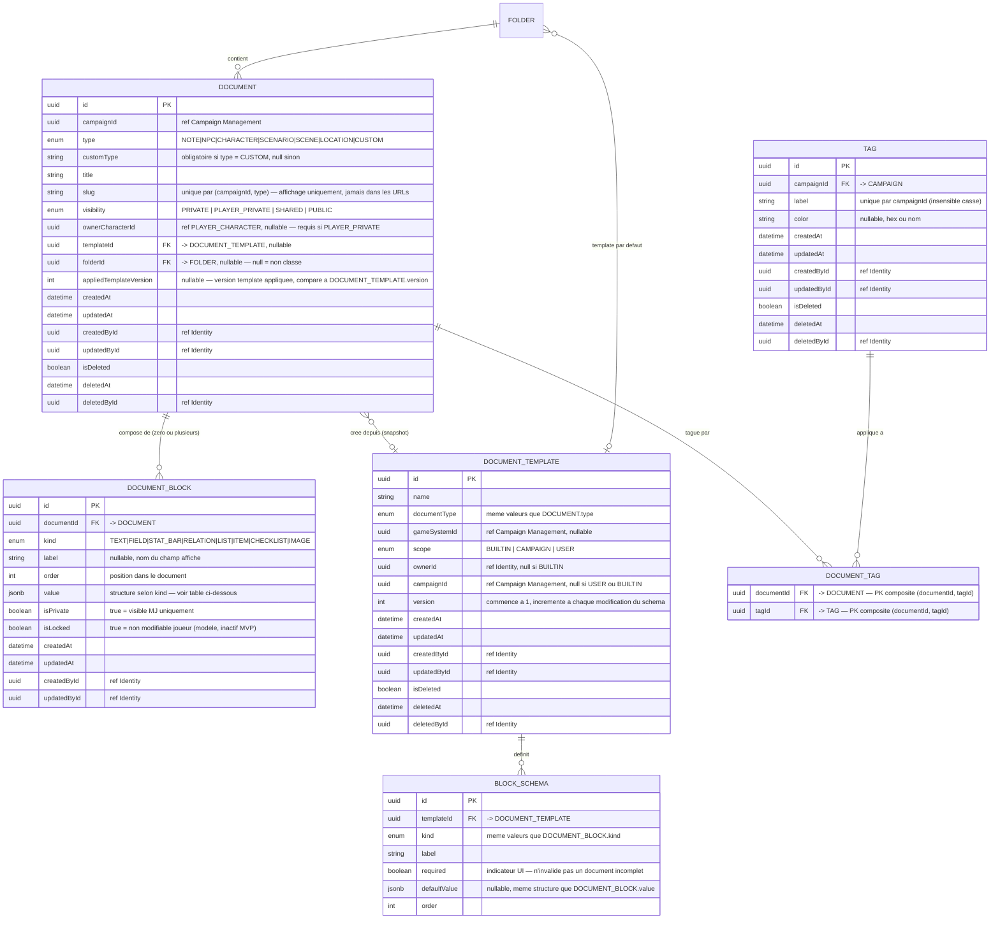
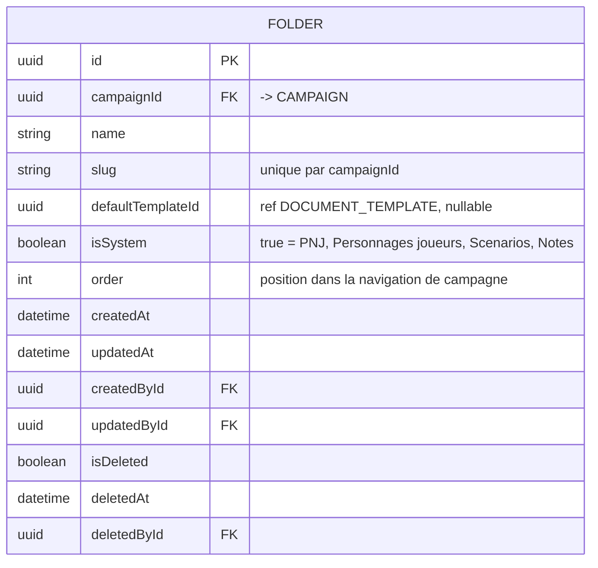
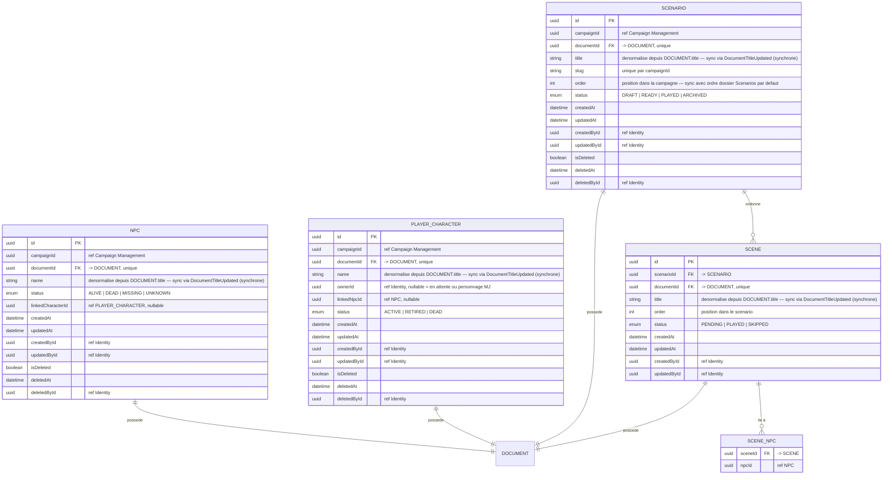
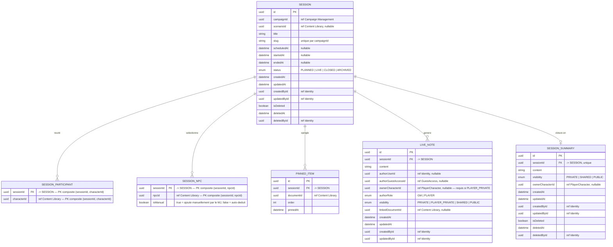

# MCD

## Conventions

| Notation | Signification |
|---|---|
| `PK` | Clé primaire |
| `FK` | Clé étrangère — contrainte d'intégrité référentielle en base |
| `ref` | Référence cross-context — Id sans contrainte FK en base, cohérence applicative |
| `||--||` | Un à un obligatoire |
| `||--o|` | Un à zéro ou un |
| `||--|{` | Un à un ou plusieurs |
| `||--o{` | Un à zéro ou plusieurs |
| `}o--o|` | Zéro ou plusieurs à zéro ou un |

**Références cross-context** : les champs annotés `ref` traversent les frontières
de bounded context. En base, aucune foreign key n'est posée sur ces colonnes —
la cohérence est garantie par la couche applicative. Le type reste `uuid`.

**Champ `value` dans `DOCUMENT_BLOCK`** : stocké en JSONB (PostgreSQL).
Sa structure interne dépend du `kind` du bloc — voir la section dédiée.

**Champs d'audit** : toutes les tables portent `createdAt`, `updatedAt`, `createdById`, `updatedById`.
Ils sont omis des diagrammes pour la lisibilité mais présents en base sur chaque table.

**Soft delete** : les tables marquées `[soft delete]` portent les colonnes
`isDeleted BOOLEAN DEFAULT false`, `deletedAt TIMESTAMP`, `deletedById UUID`.

**URLs** : les URLs de l'application utilisent les Id UUID. Les slugs ne sont
jamais dans les routes — ils servent à l'affichage et à la recherche uniquement.
Pattern : `/campaigns/{campaignId}/documents/{documentId}`.

---

## 1. Vue globale — relations entre contextes

Diagramme simplifié montrant les entités principales et leurs relations inter-contextes.
Les colonnes détaillées sont dans les sections par bounded context.

---

## 2. Identity & Access

Contexte upstream. Fournit `UserId` à tous les autres contextes.
Contient uniquement les utilisateurs authentifiés avec une identité persistante.
Les joueurs invités sans compte sont dans Campaign Management (`GUEST_ACCESS`).

### Notes Identity & Access

- `email` est unique dans le système — contrainte unique en base.
- `passwordHash` est géré par ASP.NET Core Identity en couche Infrastructure.
  L'entité domaine `User` ne connaît pas ce champ — il est dans le modèle de persistance.
- `role` est global. Le rôle dans une campagne précise est `MemberRole` dans `CAMPAIGN_MEMBERSHIP`.
- Soft delete obligatoire — un `User` supprimé reste en base pour l'intégrité référentielle.
- Suppression de compte (RGPD) : `status → DELETED`, `displayName` et `email` anonymisés.
  Les contenus de campagne ne sont pas supprimés — `createdById` reste intact pour l'intégrité.

---

## 3. Campaign Management

Contexte organisationnel. Gère le cycle de vie des campagnes, des membres,
des invitations, des accès invités et des autorisations de contenu.

### Notes Campaign Management

- `CAMPAIGN` a exactement un membre avec `role = OWNER` — invariant garanti applicativement.
- `CAMPAIGN_MEMBERSHIP.userId` est toujours renseigné — les accès sans compte utilisent `GUEST_ACCESS`.
- `INVITATION.status` passe automatiquement à `EXPIRED` quand `useCount >= maxUses`
  ou quand `expiresAt` est dépassé — logique applicative.
- `CONTENT_ACCESS_RULE` est immuable : pas de `updatedAt`, pas de soft delete.
  La révocation est une suppression physique.
- `CONTENT_ACCESS_RULE.resourceId` est une référence cross-context sans FK en base.
- `CONTENT_ACCESS_RULE` : index unique sur `(resourceType, resourceId, targetType, targetId)` avec
  `NULLS NOT DISTINCT` pour gérer le cas `targetType = ALL` (targetId = NULL).
- `GAME_SYSTEM.ownerId` : null pour les systèmes BUILTIN, non-null pour les systèmes custom (scope privé MVP).
- Index recommandés : `CAMPAIGN(ownerId)`, `CAMPAIGN_MEMBERSHIP(campaignId, userId)`,
  `INVITATION(token)` unique, `CONTENT_ACCESS_RULE(campaignId, documentId)`.

---

## 4. Content Library

Contexte central du contenu éditorial. Pattern structurant : chaque entité métier
(`NPC`, `PLAYER_CHARACTER`, `SCENARIO`, `SCENE`) possède un `DOCUMENT` pour son
contenu variable, et porte ses propres métadonnées dans une table séparée.

### 4.1 Document et blocs

### 4.1b Table FOLDER

**Dossiers système créés à l'initialisation de chaque campagne :**

| name | isSystem | defaultTemplateId |
|---|---|---|
| PNJ | true | → template "Fiche PNJ générique" |
| Personnages joueurs | true | → template "Fiche personnage générique" |
| Scénarios | true | null |
| Notes | true | null |

- Dossiers système : `isSystem = true`, non supprimables, renommables.
- `slug` : unique par `campaignId`, généré à la création, non modifiable après.
- `order` : géré par `FolderOrderService` (application service).
- Index recommandés : `FOLDER(campaignId)`, `FOLDER(campaignId, slug)` unique, `FOLDER(campaignId, isSystem)`.

### Notes sur les Tags

- `TAG.label` : contrainte unique sur `(campaignId, LOWER(label))` pour insensibilité à la casse.
- `DOCUMENT_TAG` : PK composite `(documentId, tagId)` — pas de colonne `id`.
- Suppression d'un TAG (`isDeleted = true`) : supprimer physiquement toutes les lignes `DOCUMENT_TAG` correspondantes.
  Ce nettoyage est déclenché par le domain event `TagDeleted` via un handler synchrone.
- Index recommandés : `TAG(campaignId)`, `DOCUMENT_TAG(documentId)`, `DOCUMENT_TAG(tagId)`.

### Structure de DOCUMENT_BLOCK.value selon kind

| kind | Structure JSON |
|---|---|
| `TEXT` | `{ "content": "string" }` |
| `FIELD` | `{ "value": "string" }` |
| `STAT_BAR` | `{ "current": 14, "max": 20 }` |
| `RELATION` | `{ "targetId": "uuid", "targetType": "NPC" }` |
| `LIST` | `{ "items": ["string", "string"] }` |
| `ITEM` | `{ "name": "string", "quantity": 1, "properties": { "weight": "2kg" } }` |
| `CHECKLIST` | `{ "items": [{ "label": "string", "checked": false }] }` |
| `IMAGE` | `{ "url": "string", "caption": "string" }` |

**Convention de migration** : toute modification de la structure JSON d'un `BlockKind` doit être
rétrocompatible ou accompagnée d'une migration de données JSONB.

### 4.2 Entités métier

### Notes Content Library

- `NPC.documentId` et `PLAYER_CHARACTER.documentId` ont une contrainte unique —
  un document ne peut appartenir qu'a une seule entite metier.
- **Co-création obligatoire** : NPC, PLAYER_CHARACTER, SCENARIO et SCENE sont toujours
  créés via leur factory domaine, jamais par création directe d'un DOCUMENT.
- `NPC.name`, `PLAYER_CHARACTER.name`, `SCENARIO.title`, `SCENE.title` sont des champs
  dénormalisés depuis `DOCUMENT.title`. Mis à jour via le domain event `DocumentTitleUpdated`
  dispatchés synchrone in-process dans la même transaction.
- `NPC.linkedCharacterId` et `PLAYER_CHARACTER.linkedNpcId` sont des références
  sans FK en base — association narrative, cycle de vie indépendant.
- Soft delete `NPC` ou `PLAYER_CHARACTER` : mettre `isDeleted = true` sur l'entité
  ET sur son `DOCUMENT` associé dans la même transaction.
- Soft delete `SCENARIO` : mettre `isDeleted = true` sur le scénario ET sur son `DOCUMENT`,
  puis supprimer physiquement les `SCENE` et mettre `isDeleted = true` sur leurs `DOCUMENT`.
- Suppression d'un `DOCUMENT` (soft delete) : supprimer physiquement tous ses `DOCUMENT_BLOCK`.
- `SCENE_NPC` : si un NPC est soft-deleted, supprimer physiquement les lignes correspondantes.
- `DOCUMENT_TEMPLATE` avec `scope = BUILTIN` : pas de modification possible,
  protégé applicativement. `version` commence à 1.
- Contraintes de scope sur `DOCUMENT_TEMPLATE` :
  - `BUILTIN` → `ownerId IS NULL AND campaignId IS NULL`
  - `CAMPAIGN` → `ownerId IS NOT NULL AND campaignId IS NOT NULL`
  - `USER` → `ownerId IS NOT NULL AND campaignId IS NULL`
- **Backlinks** : la requête `SELECT documentId FROM DOCUMENT_BLOCK WHERE kind = 'RELATION'
  AND value->>'targetId' = :targetId` filtre `DOCUMENT.isDeleted = false` via jointure.
  Les backlinks pointant vers des documents supprimés ne sont pas affichés.
- Index recommandés : `DOCUMENT(campaignId, type)`, `DOCUMENT(campaignId, type, slug)` unique,
  `DOCUMENT_BLOCK(documentId, order)`, `NPC(campaignId)`, `PLAYER_CHARACTER(campaignId)`,
  `PLAYER_CHARACTER(ownerId)`, `SCENARIO(campaignId)`, `SCENARIO(campaignId, order)`,
  `SCENE(scenarioId, order)`.
- Index GIN recommandé sur `DOCUMENT_BLOCK.value` pour les requêtes dans le JSON.
- Index GIN recommandé sur `DOCUMENT_BLOCK.value->>'targetId'` pour les backlinks.
- Index GIN recommandé sur `DOCUMENT.title` et `DOCUMENT_BLOCK.value` pour la recherche FTS
  (PostgreSQL `tsvector`, configuration linguistique : `french`).

---

## 5. Session Conduct

Contexte opérationnel. Gère le cycle de vie des sessions.
Toutes les références vers les autres contextes sont des références cross-context
sans FK en base.

### Notes Session Conduct

- Invariant fort : une seule session avec `status = LIVE` par `campaignId` à un instant donné.
  Index partiel : `CREATE UNIQUE INDEX ON SESSION (campaignId) WHERE status = 'LIVE'`.
- Transitions autorisées : `PLANNED → LIVE → CLOSED → ARCHIVED`. Aucun retour — enforce applicativement.
- `CLOSED` = contenu éditable (résumé, LiveNotes rétroactives MJ). `ARCHIVED` = lecture seule complète.
- `SESSION_SUMMARY.sessionId` est unique — une session a au plus un résumé.
- **LiveNote — règles de visibilité** :
  - `authorRole = GM` → visibilité parmi `{PRIVATE, SHARED, PUBLIC}`, défaut `PRIVATE`.
    Contrainte `CHECK` : `authorRole = 'GM' → visibility != 'PLAYER_PRIVATE'`.
  - `authorRole = PLAYER` → visibilité parmi `{PLAYER_PRIVATE, SHARED, PUBLIC}`, défaut `PLAYER_PRIVATE`.
    Contrainte `CHECK` : `authorRole = 'PLAYER' → visibility != 'PRIVATE'`.
  - `visibility = PLAYER_PRIVATE` → `ownerCharacterId IS NOT NULL`.
  - Une note joueur invitée renseigne `authorGuestAccessId`; l'accès futur reste résolu par `ownerCharacterId`.
  - Les joueurs ne peuvent créer des LiveNotes que sur une session LIVE (enforce applicatif).
  - Le MJ peut créer des LiveNotes sur une session LIVE ou CLOSED.
- `SESSION_NPC.isManual` : les lignes `isManual = false` sont recalculées par `SessionNpcSelector`
  à chaque changement de scénario. Les lignes `isManual = true` sont conservées.
- Soft delete `SESSION` : supprimer physiquement `LIVE_NOTE`, `SESSION_PARTICIPANT`, `SESSION_NPC`,
  soft delete le `SESSION_SUMMARY` associé.
- `PINNED_ITEM` et `SESSION_PARTICIPANT` : si une entité référencée est soft-deleted
  dans son contexte, supprimer physiquement la ligne ici.
- `LIVE_NOTE` : pas de soft delete, suppression physique.
- `SESSION_PARTICIPANT` : PK composite `(sessionId, characterId)`.
- `SESSION_NPC` : PK composite `(sessionId, npcId)`.
- Index recommandés : `SESSION(campaignId, status)`, `SESSION_PARTICIPANT(sessionId)`,
  `SESSION_NPC(sessionId)`, `PINNED_ITEM(sessionId, order)`, `LIVE_NOTE(sessionId)`,
  `LIVE_NOTE(sessionId, authorRole)`.

---

## 6. Récapitulatif des tables

| Table | Contexte | Type | Soft delete |
|---|---|---|---|
| `USER` | Identity & Access | Aggregate root | Oui |
| `CAMPAIGN` | Campaign Management | Aggregate root | Oui |
| `CAMPAIGN_MEMBERSHIP` | Campaign Management | Entité enfant | Non |
| `INVITATION` | Campaign Management | Entité enfant | Non |
| `GUEST_ACCESS` | Campaign Management | Entité | Non |
| `GAME_SYSTEM` | Campaign Management | Aggregate root | Oui |
| `CONTENT_ACCESS_RULE` | Campaign Management | Entité (AccessPolicy) | Non — suppression physique |
| `DOCUMENT` | Content Library | Aggregate root | Oui |
| `DOCUMENT_BLOCK` | Content Library | Entité enfant | Non — suppression physique |
| `DOCUMENT_TEMPLATE` | Content Library | Aggregate root | Oui |
| `BLOCK_SCHEMA` | Content Library | Entité enfant | Non — suppression physique |
| `FOLDER` | Content Library | Aggregate root | Oui |
| `TAG` | Content Library | Entité (repository) | Oui |
| `DOCUMENT_TAG` | Content Library | Table de liaison | Non — suppression physique |
| `NPC` | Content Library | Entité (repository) | Oui |
| `PLAYER_CHARACTER` | Content Library | Entité (repository) | Oui |
| `SCENARIO` | Content Library | Aggregate root | Oui |
| `SCENE` | Content Library | Entité enfant | Non — suppression en cascade |
| `SCENE_NPC` | Content Library | Table de liaison | Non — suppression physique |
| `SESSION` | Session Conduct | Aggregate root | Oui |
| `SESSION_PARTICIPANT` | Session Conduct | Table de liaison (PK composite) | Non — suppression physique |
| `SESSION_NPC` | Session Conduct | Table de liaison (PK composite) | Non — suppression physique |
| `PINNED_ITEM` | Session Conduct | Entité enfant (VO) | Non — suppression physique |
| `LIVE_NOTE` | Session Conduct | Entité enfant | Non — suppression physique |
| `SESSION_SUMMARY` | Session Conduct | Entité enfant | Oui |

---

## 7. Références cross-context — récapitulatif

Ces colonnes contiennent des UUID vers des entités d'un autre bounded context.
**Aucune FK en base** sur ces colonnes — la cohérence est garantie applicativement.

| Table | Colonne | Cible |
|---|---|---|
| `CAMPAIGN` | `ownerId` | `USER.id` (FK réelle — exception documentée ADR-12) |
| `GUEST_ACCESS` | `characterId` | `PLAYER_CHARACTER.id` (Content Library) |
| `CONTENT_ACCESS_RULE` | `resourceId` | `DOCUMENT.id`, `LIVE_NOTE.id` ou `SESSION_SUMMARY.id` selon `resourceType` |
| `CONTENT_ACCESS_RULE` | `targetId` | `USER.id` ou `PLAYER_CHARACTER.id` selon `targetType` |
| `DOCUMENT` | `campaignId` | `CAMPAIGN.id` (Campaign Management) |
| `FOLDER` | `campaignId` | `CAMPAIGN.id` (Campaign Management) |
| `TAG` | `campaignId` | `CAMPAIGN.id` (Campaign Management) |
| `NPC` | `campaignId` | `CAMPAIGN.id` (Campaign Management) |
| `NPC` | `linkedCharacterId` | `PLAYER_CHARACTER.id` (même contexte, ref narrative) |
| `PLAYER_CHARACTER` | `campaignId` | `CAMPAIGN.id` (Campaign Management) |
| `PLAYER_CHARACTER` | `ownerId` | `USER.id` (Identity) |
| `PLAYER_CHARACTER` | `linkedNpcId` | `NPC.id` (même contexte, ref narrative) |
| `SCENARIO` | `campaignId` | `CAMPAIGN.id` (Campaign Management) |
| `DOCUMENT_TEMPLATE` | `gameSystemId` | `GAME_SYSTEM.id` (Campaign Management) |
| `SESSION` | `campaignId` | `CAMPAIGN.id` (Campaign Management) |
| `SESSION` | `scenarioId` | `SCENARIO.id` (Content Library) |
| `SESSION_PARTICIPANT` | `characterId` | `PLAYER_CHARACTER.id` (Content Library) |
| `SESSION_NPC` | `npcId` | `NPC.id` (Content Library) |
| `PINNED_ITEM` | `documentId` | `DOCUMENT.id` (Content Library) |
| `LIVE_NOTE` | `authorUserId` | `USER.id` (Identity) |
| `LIVE_NOTE` | `authorGuestAccessId` | `GUEST_ACCESS.id` (Campaign Management) |
| `LIVE_NOTE` | `ownerCharacterId` | `PLAYER_CHARACTER.id` (Content Library) |
| `LIVE_NOTE` | `linkedDocumentId` | `DOCUMENT.id` (Content Library) |
| `SESSION_SUMMARY` | `ownerCharacterId` | `PLAYER_CHARACTER.id` (Content Library) |
