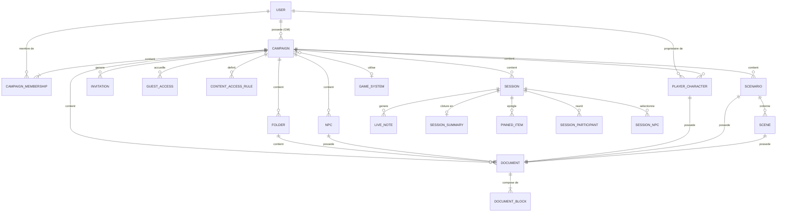
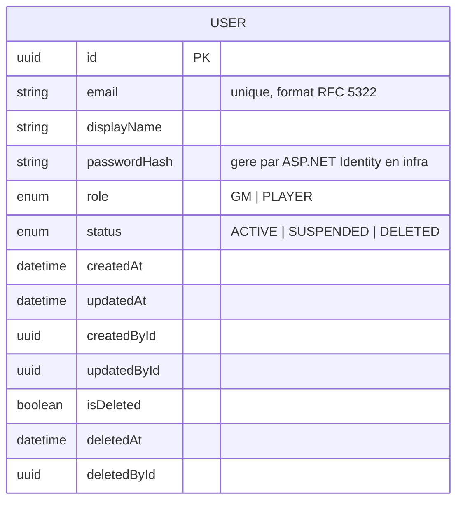
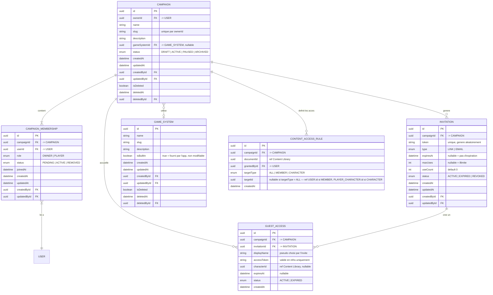
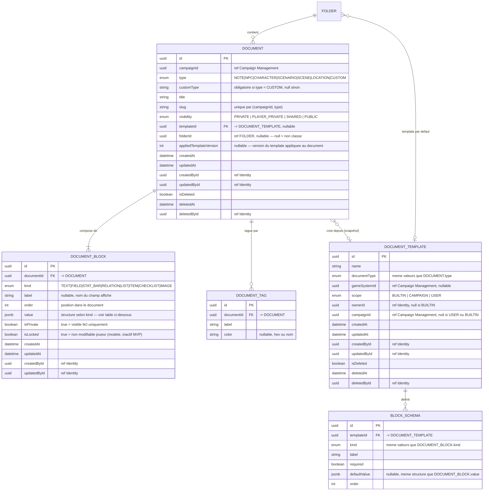
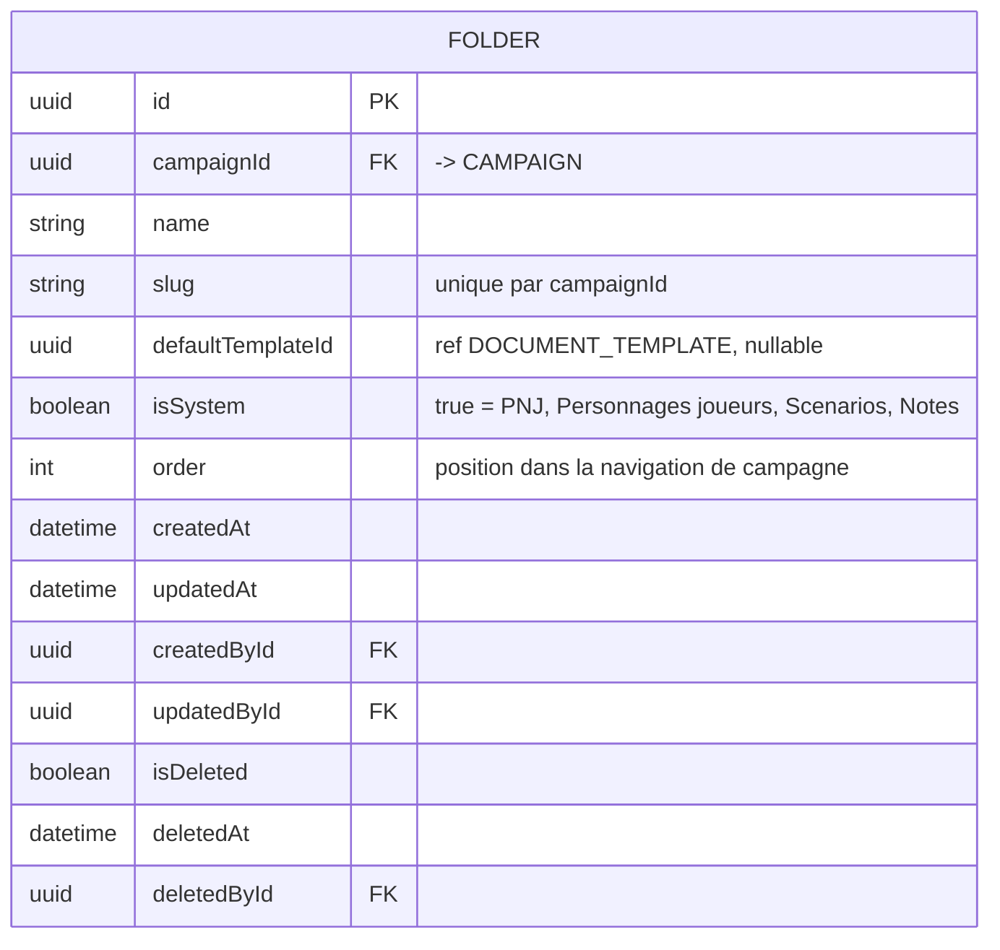
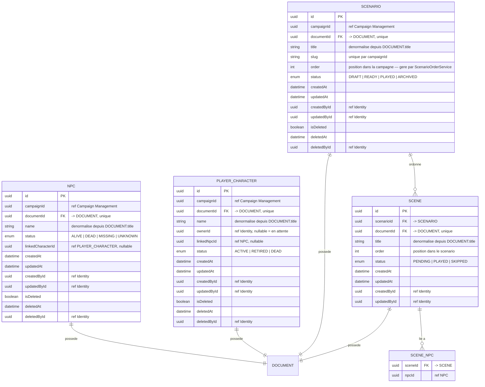
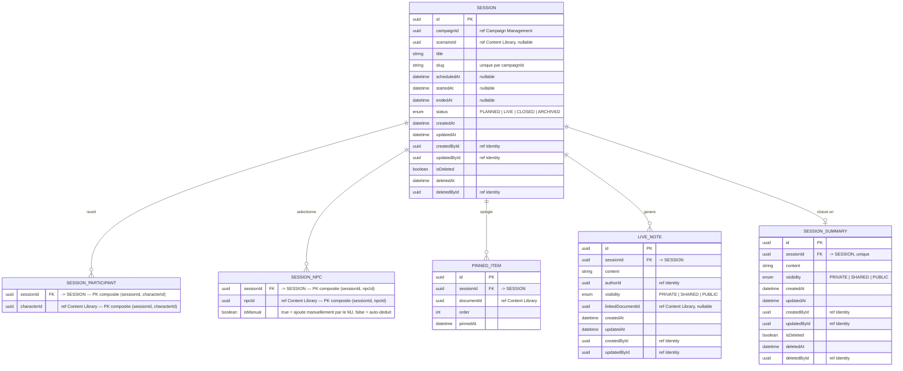

# MCD

## Conventions

| Notation | Signification |
|---|---|
| `PK` | Clé primaire |
| `FK` | Clé étrangère — contrainte d'intégrité référentielle en base |
| `ref` | Référence cross-context — Id sans contrainte FK en base, cohérence applicative |
| `||--||` | Un à un obligatoire |
| `||--o|` | Un à zéro ou un |
| `||--|{` | Un à un ou plusieurs |
| `||--o{` | Un à zéro ou plusieurs |
| `}o--o|` | Zéro ou plusieurs à zéro ou un |

**Références cross-context** : les champs annotés `ref` traversent les frontières
de bounded context. En base, aucune foreign key n'est posée sur ces colonnes —
la cohérence est garantie par la couche applicative. Le type reste `uuid`.

**Champ `value` dans `DOCUMENT_BLOCK`** : stocké en JSONB (PostgreSQL).
Sa structure interne dépend du `kind` du bloc — voir la section dédiée.

**Champs d'audit** : toutes les tables portent `createdAt`, `updatedAt`, `createdById`, `updatedById`.
Ils sont omis des diagrammes pour la lisibilité mais présents en base sur chaque table.

**Soft delete** : les tables marquées `[soft delete]` portent les colonnes
`isDeleted BOOLEAN DEFAULT false`, `deletedAt TIMESTAMP`, `deletedById UUID`.

---

## 1. Vue globale — relations entre contextes

Diagramme simplifié montrant les entités principales et leurs relations inter-contextes.
Les colonnes détaillées sont dans les sections par bounded context.

---

## 2. Identity & Access

Contexte upstream. Fournit `UserId` à tous les autres contextes.
Contient uniquement les utilisateurs authentifiés avec une identité persistante.
Les joueurs invités sans compte sont dans Campaign Management (`GUEST_ACCESS`).

### Notes Identity & Access

- `email` est unique dans le système — contrainte unique en base.
- `passwordHash` est géré par ASP.NET Core Identity en couche Infrastructure.
  L'entité domaine `User` ne connaît pas ce champ — il est dans le modèle de persistance.
- `role` est global. Le rôle dans une campagne précise est `MemberRole` dans `CAMPAIGN_MEMBERSHIP`.
- Soft delete obligatoire — un `User` supprimé reste en base pour l'intégrité référentielle
  des autres tables qui référencent son `id`.

---

## 3. Campaign Management

Contexte organisationnel. Gère le cycle de vie des campagnes, des membres,
des invitations, des accès invités et des autorisations de contenu.

### Notes Campaign Management

- `CAMPAIGN` a exactement un membre avec `role = OWNER` — invariant garanti applicativement.
  Un transfert de propriété crée un nouveau `CAMPAIGN_MEMBERSHIP` OWNER et retire l'ancien.
- `CAMPAIGN_MEMBERSHIP.userId` est toujours renseigné — les accès sans compte utilisent `GUEST_ACCESS`.
- `INVITATION.status` passe automatiquement à `EXPIRED` quand `useCount >= maxUses`
  ou quand `expiresAt` est dépassé — logique applicative.
- `CONTENT_ACCESS_RULE` est immuable : pas de `updatedAt`, pas de soft delete.
  La révocation est une suppression physique.
- `CONTENT_ACCESS_RULE.documentId` est une référence cross-context sans FK en base.
- Index recommandés : `CAMPAIGN(ownerId)`, `CAMPAIGN_MEMBERSHIP(campaignId, userId)`,
  `INVITATION(token)` unique, `CONTENT_ACCESS_RULE(campaignId, documentId)`.

---

## 4. Content Library

Contexte central du contenu éditorial. Pattern structurant : chaque entité métier
(`NPC`, `PLAYER_CHARACTER`, `SCENARIO`, `SCENE`) possède un `DOCUMENT` pour son
contenu variable, et porte ses propres métadonnées dans une table séparée.

### 4.1 Document et blocs

### 4.1b Table FOLDER

**Dossiers système créés à l'initialisation de chaque campagne :**

| name | isSystem | defaultTemplateId |
|---|---|---|
| PNJ | true | → template "Fiche PNJ générique" |
| Personnages joueurs | true | → template "Fiche personnage générique" |
| Scénarios | true | null |
| Notes | true | null |

- Dossiers système : `isSystem = true`, non supprimables, renommables.
- `slug` : unique par `campaignId`, généré à la création, non modifiable après.
- `order` : géré par `FolderOrderService` (domain service).
- Index recommandés : `FOLDER(campaignId)`, `FOLDER(campaignId, slug)` unique, `FOLDER(campaignId, isSystem)`.

### Structure de DOCUMENT_BLOCK.value selon kind

| kind | Structure JSON |
|---|---|
| `TEXT` | `{ "content": "string" }` |
| `FIELD` | `{ "value": "string" }` |
| `STAT_BAR` | `{ "current": 14, "max": 20 }` |
| `RELATION` | `{ "targetId": "uuid", "targetType": "NPC" }` |
| `LIST` | `{ "items": ["string", "string"] }` |
| `ITEM` | `{ "name": "string", "quantity": 1, "properties": { "weight": "2kg" } }` |
| `CHECKLIST` | `{ "items": [{ "label": "string", "checked": false }] }` |
| `IMAGE` | `{ "url": "string", "caption": "string" }` |

### 4.2 Entités métier

### Notes Content Library

- `NPC.documentId` et `PLAYER_CHARACTER.documentId` ont une contrainte unique —
  un document ne peut appartenir qu'a une seule entite metier.
- `NPC.name`, `PLAYER_CHARACTER.name`, `SCENARIO.title`, `SCENE.title` sont des champs
  denormalises depuis `DOCUMENT.title`. Mis a jour via le domain event `DocumentTitleUpdated`.
- `NPC.linkedCharacterId` et `PLAYER_CHARACTER.linkedNpcId` sont des references
  sans FK en base — association narrative, cycle de vie independant.
- Soft delete `NPC` ou `PLAYER_CHARACTER` : mettre `isDeleted = true` sur l'entite
  ET sur son `DOCUMENT` associe dans la meme transaction.
- Soft delete `SCENARIO` : mettre `isDeleted = true` sur le scenario ET sur son `DOCUMENT`,
  puis supprimer physiquement les `SCENE` et mettre `isDeleted = true` sur leurs `DOCUMENT`.
- Suppression d'un `DOCUMENT` (soft delete) : supprimer physiquement tous ses `DOCUMENT_BLOCK`.
- `SCENE_NPC` : si un NPC est soft-deleted, supprimer physiquement les lignes correspondantes.
- `DOCUMENT_TEMPLATE` avec `scope = BUILTIN` : pas de `isDeleted`, pas de modification possible,
  protege applicativement.
- Contraintes de scope sur `DOCUMENT_TEMPLATE` :
  - `BUILTIN` → `ownerId IS NULL AND campaignId IS NULL`
  - `CAMPAIGN` → `ownerId IS NOT NULL AND campaignId IS NOT NULL`
  - `USER` → `ownerId IS NOT NULL AND campaignId IS NULL`
- Index recommandes : `DOCUMENT(campaignId, type)`, `DOCUMENT(campaignId, type, slug)` unique,
  `DOCUMENT_BLOCK(documentId, order)`, `NPC(campaignId)`, `PLAYER_CHARACTER(campaignId)`,
  `PLAYER_CHARACTER(ownerId)`, `SCENARIO(campaignId)`, `SCENARIO(campaignId, order)`,
  `SCENE(scenarioId, order)`.
- Index GIN recommande sur `DOCUMENT_BLOCK.value` pour les requetes dans le JSON.
- Index GIN recommande sur `DOCUMENT_BLOCK.value->>'targetId'` pour les requetes de backlinks (blocs `RELATION` pointant vers un document cible).
- Index GIN recommande sur `DOCUMENT.title` et `DOCUMENT_BLOCK.value` pour la recherche FTS (PostgreSQL tsvector).
- `CONTENT_ACCESS_RULE` : index unique sur `(documentId, targetType, targetId)` pour eviter les doublons.

---

## 5. Session Conduct

Contexte operationnel. Gere le cycle de vie des sessions.
Toutes les references vers les autres contextes sont des references cross-context
sans FK en base.

### Notes Session Conduct

- Invariant fort : une seule session avec `status = LIVE` par `campaignId` a un instant donne.
  Contrainte enforced applicativement + index partiel possible :
  `CREATE UNIQUE INDEX ON SESSION (campaignId) WHERE status = 'LIVE'`.
- Transitions de statut autorisees uniquement : `PLANNED → LIVE → CLOSED → ARCHIVED`.
  Aucun retour en arriere — enforce applicativement.
- `CLOSED` = contenu éditable (résumé, LiveNotes rétroactives). `ARCHIVED` = lecture seule complète.
- `SESSION_SUMMARY.sessionId` est unique — une session a au plus un resume.
- `SESSION_NPC.isManual` : les lignes avec `isManual = false` sont recalculées par `SessionNpcSelector`
  (service domaine) à chaque changement de scénario. Les lignes `isManual = true` sont conservées.
- Soft delete `SESSION` : supprimer physiquement les `LIVE_NOTE`, `SESSION_PARTICIPANT` et `SESSION_NPC`,
  soft delete le `SESSION_SUMMARY` associe.
- `PINNED_ITEM` et `SESSION_PARTICIPANT` : si une entite referencee est soft-deleted
  dans son contexte, supprimer physiquement la ligne ici.
- `LIVE_NOTE` : pas de soft delete, suppression physique.
- `SESSION_PARTICIPANT` : clé primaire composite `(sessionId, characterId)` — pas de colonne `id`.
- `SESSION_NPC` : clé primaire composite `(sessionId, npcId)` — pas de colonne `id`.
- Index recommandes : `SESSION(campaignId, status)`, `SESSION_PARTICIPANT(sessionId)`,
  `SESSION_NPC(sessionId)`, `PINNED_ITEM(sessionId, order)`, `LIVE_NOTE(sessionId)`.

---

## 6. Recapitulatif des tables

| Table | Contexte | Type | Soft delete |
|---|---|---|---|
| `USER` | Identity & Access | Aggregate root | Oui |
| `CAMPAIGN` | Campaign Management | Aggregate root | Oui |
| `CAMPAIGN_MEMBERSHIP` | Campaign Management | Entite enfant | Non |
| `INVITATION` | Campaign Management | Entite enfant | Non |
| `GUEST_ACCESS` | Campaign Management | Entite | Non |
| `GAME_SYSTEM` | Campaign Management | Aggregate root | Oui |
| `CONTENT_ACCESS_RULE` | Campaign Management | Entite (AccessPolicy) | Non — suppression physique |
| `DOCUMENT` | Content Library | Aggregate root | Oui |
| `DOCUMENT_BLOCK` | Content Library | Entite enfant | Non — suppression physique |
| `DOCUMENT_TAG` | Content Library | Entite enfant | Non — suppression physique |
| `DOCUMENT_TEMPLATE` | Content Library | Aggregate root | Oui |
| `BLOCK_SCHEMA` | Content Library | Entite enfant | Non — suppression physique |
| `FOLDER` | Content Library | Aggregate root | Oui |
| `NPC` | Content Library | Entite (repository) | Oui |
| `PLAYER_CHARACTER` | Content Library | Entite (repository) | Oui |
| `SCENARIO` | Content Library | Aggregate root | Oui |
| `SCENE` | Content Library | Entite enfant | Non — suppression en cascade |
| `SCENE_NPC` | Content Library | Table de liaison | Non — suppression physique |
| `SESSION` | Session Conduct | Aggregate root | Oui |
| `SESSION_PARTICIPANT` | Session Conduct | Table de liaison (PK composite) | Non — suppression physique |
| `SESSION_NPC` | Session Conduct | Table de liaison (PK composite) | Non — suppression physique |
| `PINNED_ITEM` | Session Conduct | Entite enfant (VO) | Non — suppression physique |
| `LIVE_NOTE` | Session Conduct | Entite enfant | Non — suppression physique |
| `SESSION_SUMMARY` | Session Conduct | Entite enfant | Oui |

---

## 7. References cross-context — recapitulatif

Ces colonnes contiennent des UUID vers des entites d'un autre bounded context.
**Aucune FK en base** sur ces colonnes — la cohérence est garantie applicativement.

| Table | Colonne | Cible |
|---|---|---|
| `CAMPAIGN` | `ownerId` | `USER.id` (FK reelle — meme contexte applicatif) |
| `GUEST_ACCESS` | `characterId` | `PLAYER_CHARACTER.id` (Content Library) |
| `CONTENT_ACCESS_RULE` | `documentId` | `DOCUMENT.id` (Content Library) |
| `CONTENT_ACCESS_RULE` | `targetId` | `USER.id` ou `PLAYER_CHARACTER.id` selon `targetType` |
| `DOCUMENT` | `campaignId` | `CAMPAIGN.id` (Campaign Management) |
| `FOLDER` | `campaignId` | `CAMPAIGN.id` (Campaign Management) |
| `NPC` | `campaignId` | `CAMPAIGN.id` (Campaign Management) |
| `NPC` | `linkedCharacterId` | `PLAYER_CHARACTER.id` (meme contexte, ref narrative) |
| `PLAYER_CHARACTER` | `campaignId` | `CAMPAIGN.id` (Campaign Management) |
| `PLAYER_CHARACTER` | `ownerId` | `USER.id` (Identity) |
| `PLAYER_CHARACTER` | `linkedNpcId` | `NPC.id` (meme contexte, ref narrative) |
| `SCENARIO` | `campaignId` | `CAMPAIGN.id` (Campaign Management) |
| `DOCUMENT_TEMPLATE` | `gameSystemId` | `GAME_SYSTEM.id` (Campaign Management) |
| `SESSION` | `campaignId` | `CAMPAIGN.id` (Campaign Management) |
| `SESSION` | `scenarioId` | `SCENARIO.id` (Content Library) |
| `SESSION_PARTICIPANT` | `characterId` | `PLAYER_CHARACTER.id` (Content Library) |
| `SESSION_NPC` | `npcId` | `NPC.id` (Content Library) |
| `PINNED_ITEM` | `documentId` | `DOCUMENT.id` (Content Library) |
| `LIVE_NOTE` | `authorId` | `USER.id` (Identity) |
| `LIVE_NOTE` | `linkedDocumentId` | `DOCUMENT.id` (Content Library) |