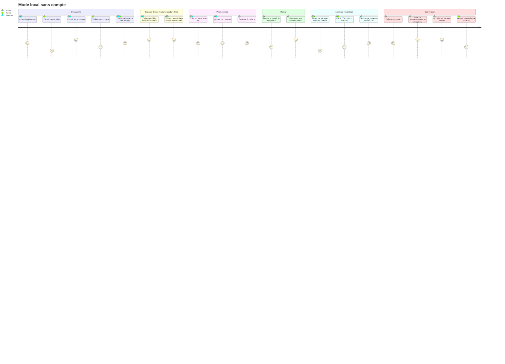
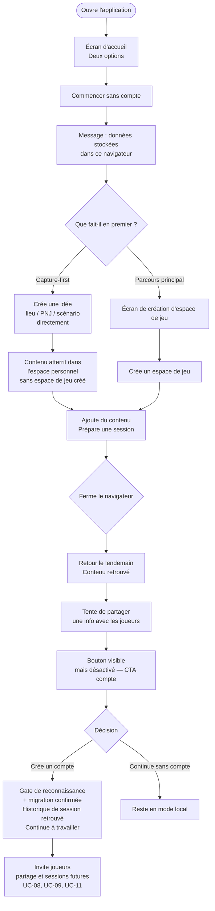

# User Journey — Mode local sans compte

## Périmètre

Ce parcours couvre l'expérience d'un Maître du Jeu qui utilise Haversack pour la première fois sans créer de compte, depuis la découverte de l'application jusqu'à la conversion éventuelle en compte enregistré.

Il inclut les scénarios de limite atteinte et de retour après vidage de cache, ainsi que la variante **capture-first** : le MJ crée du contenu immédiatement dans son espace personnel, sans passer par la création d'un espace de jeu partagé.

---

## Personas concernés

| Persona | Profil | Objectif dans ce parcours |
|---|---|---|
| **Nadia** | MJ occasionnelle, a abandonné Notion | Valeur rapide — va jusqu'à la conversion |
| **Thomas** | MJ Obsidian, évaluateur | Tester sans s'engager — reste en mode local |
| **Rémi** | MJ papier, résistant au numérique | Tester le partage de résumé — expérience de démarrage médiocre |

---

## Vue d'ensemble du parcours

### Carte d'expérience

### Flux fonctionnel

---

## Détail des étapes

| Étape | Persona(s) | Friction | Opportunité produit |
|---|---|---|---|
| Ouvrir l'application | Rémi | Méfiance initiale, interface perçue comme complexe | Écran d'accueil épuré, deux choix clairs et équivalents |
| Choisir sans compte | Tous | Libellé technique ou hiérarchie culpabilisante | "Commencer sans compte" — ton rassurant, pas technique |
| Lire le message de démarrage | Tous | Message trop long ou alarmiste | Court, non bloquant, factuel — disparaît au premier clic |
| **Créer du contenu directement (capture-first)** | **Nadia, Thomas** | **Redirection imposée « créez un espace de jeu d'abord »** | **Premier écran = espace de travail ; idée/lieu/PNJ/scénario atterrit dans l'espace personnel sans création d'espace de jeu requise** |
| Créer un espace de jeu | Nadia, Thomas | Trop de champs obligatoires à la création | Création en un clic, nom par défaut modifiable |
| Ajouter du contenu | Nadia, Thomas | Navigation confuse, actions introuvables | Actions essentielles accessibles sans formation |
| Retour après fermeture | Nadia | Crainte de perte de données | Atterrit directement sur le dernier espace ouvert |
| Tenter de partager | Nadia, Rémi | Bouton absent ou message de blocage agressif | Bouton visible mais désactivé, CTA discret et optionnel |
| Créer un compte + migration | Nadia | Migration longue ou signalée en erreur | Gate de reconnaissance pré-import (espaces détectés avec historique de session, confirmation explicite — ADR-016 §4) ; indicateur de progression pour gros volumes ; après migration, l'historique de session (sessions passées, notes, épingles) est retrouvé intact pour enchaîner vers le partage joueurs |

---

## Scénarios alternatifs et d'erreur

**Nadia / Thomas — Capture-first (sans espace de jeu)**
- Le MJ ouvre l'application, voit son espace de travail personnel et crée immédiatement une idée (lieu, PNJ ou scénario) sans avoir à nommer ou créer un espace de jeu au préalable.
- Le contenu atterrit dans son espace personnel (`SpaceType.PERSONAL`).
- Point de friction éliminé : plus de redirection "créer un espace de jeu d'abord" qui brisait l'élan créatif.
- Tension à surveiller : si le MJ veut ensuite rattacher ce contenu à un espace de jeu, le geste de déplacement doit être découvrable sans formation.

**Thomas — Évaluation sans engagement**
- Crée une campagne de test, explore l'interface, constate que le partage nécessite un compte.
- Décide de rester en mode local — ne doit pas se sentir poussé vers la création de compte à chaque interaction.

**Retour après vidage de cache (Nadia)**
- L'application détecte l'absence de données : message distinct de la première visite (ton "données possiblement perdues", pas alarmiste).
- Deux options : nouvel espace de jeu ou connexion. Suggère discrètement que le compte évite ce cas.

**Stockage du navigateur saturé**
- Il n'existe aucun plafond de nombre d'espaces en mode local : le MJ peut créer autant de campagnes ou de one-shots qu'il le souhaite. Seule la capacité de stockage du navigateur (~50–100 Mo en pratique) peut interrompre la création (E1).
- Si le stockage est plein, la création est bloquée avec un message valorisant la création de compte pour migrer vers le cloud. Le plafond de 3 espaces synchronisés (RB-02-10) ne s'applique qu'au compte gratuit, jamais à la création en mode local.

---

## Points de conversion clés

| Moment | Déclencheur | Action attendue |
|---|---|---|
| Première visite | Curiosité / recommandation | Choisit "Commencer sans compte" |
| Retour J+1 | Contenu retrouvé intact | Confiance installée — continue à utiliser |
| Tentative de partage | Besoin fonctionnel réel | Envisage la création de compte |
| Stockage navigateur saturé | Capacité de stockage atteinte (aucun plafond de nombre d'espaces en mode local) | Conversion vers le compte pour migrer les données |
| Retour post-vidage cache | Perte de données | Conversion comme solution à un problème vécu |

---

## Liens

- Use case associé : `docs/conception/besoin/usecases/UC-01-mode-local-sans-compte.md`
- Vision produit : `docs/conception/besoin/vision/vision-produit.md`
- Conception source : identity-access : `docs/conception/domain/identity-access.md`
