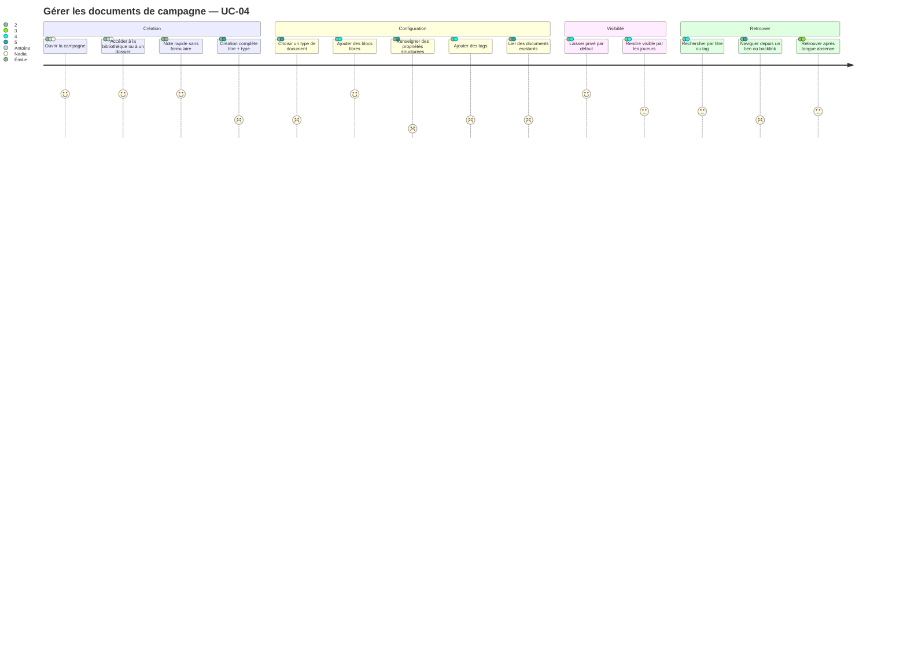
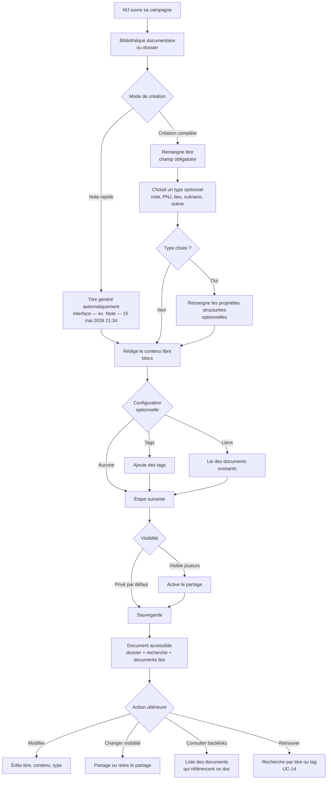

# User Journey — Gérer les documents de campagne (UC-04)

## Périmètre

Parcours du MJ depuis l'accès à sa campagne jusqu'à la création, la configuration et la récupération
d'un document durable. Couvre la note rapide (Émilie), le document modulaire avec blocs, type et
liens (Antoine), et la navigation après une longue absence (Nadia). Le workflow des notes prises
pendant une session reste hors périmètre (UC-06/07).

---

## Personas concernés

| Persona | Mode de travail | Attente principale | Risque de friction |
|---|---|---|---|
| Émilie | Note rapide, improvisation | Créer en 2 touches, capturer sans interrompre le jeu | Toute étape de configuration obligatoire |
| Antoine | Documents riches, PNJ détaillés, liens entre éléments | Types, propriétés structurées, backlinks navigables | Absence de liaison entre documents, pas de types disponibles |
| Nadia | Peu de création, usage intermittent | Retrouver ses documents après 6 semaines d'absence | Recherche absente ou lente, documents mal organisés |

---

## Vue d'ensemble du parcours

### Carte d'expérience

### Flux fonctionnel

---

## Détail des étapes

| Étape | Persona(s) | Friction potentielle | Opportunité produit |
|---|---|---|---|
| Ouvrir la campagne et naviguer vers les documents | Tous | Bibliothèque peu visible si la campagne a beaucoup d'entrées | Entrée directe "Documents" + raccourcis vers les dossiers courants |
| Créer une note rapide | Émilie | Formulaire trop long, étapes obligatoires | Bouton "Note rapide" distinct, titre généré, éditeur ouvert immédiatement |
| Créer un document complet avec type | Antoine | Absence de types disponibles ou types peu clairs | Types affichés avec icône et description courte dans le sélecteur, sans masquer l'option libre |
| Ajouter des blocs libres | Tous | Éditeur perçu comme trop abstrait si les blocs sont trop techniques | Blocs simples par défaut : texte, liste, checklist, tableau, image, séparateur |
| Renseigner des propriétés structurées | Antoine | Confusion entre propriétés et contenu libre | Propriétés dans un panneau secondaire, contenu libre toujours central |
| Ajouter des tags | Antoine, Nadia | Référentiel de tags vide ou suggestions absentes | Suggestions basées sur les tags existants de l'espace |
| Lier des documents existants | Antoine, Thomas | Recherche de documents inexistante ou lente | Recherche rapide par titre dans l'espace, suggestion des documents récents |
| Définir la visibilité | Tous | Statut privé par défaut non perçu, MJ oublie de partager | Indicateur visuel clair du statut de visibilité sur la fiche du document |
| Sauvegarder | Tous | Perte de données si la sauvegarde n'est pas automatique | Sauvegarde automatique + indicateur de synchronisation |
| Retrouver un document après longue absence | Nadia | Aucun filtre, liste non triée, recherche absente | Tri par date de modification, filtre par type et tag, recherche plein texte (UC-14) |
| Consulter les backlinks | Thomas, Antoine | Section backlinks absente ou non visible | Panneau latéral "Référencé par" sur la fiche du document |

---

## Scénarios alternatifs et d'erreur

- **A1 — Note rapide sans titre** : le titre est généré côté interface ("Note — 15 mai 2026 21:34"). Le système conserve toujours un titre non vide. Le MJ peut renommer ensuite.
- **A2 — Note partagée à la création** : le MJ rend la note visible par les joueurs au moment de la création ou immédiatement après.
- **A3 — Changement de visibilité après coup** : le partage et le retrait du partage sont disponibles depuis la fiche du document à tout moment. Le partage vise le groupe dans le MVP.
- **A4 — Document créé depuis la vue session** : si le MJ crée un document durable depuis UC-06/UC-07, le flux de création repose sur UC-04. Le document peut être épinglé dans la session et reste accessible après la partie.
- **A5 — Document depuis template** : si le point d'entrée est un dossier avec modèle par défaut, le document part d'une copie indépendante de ce modèle.
- **Erreur — titre manquant (création complète)** : la création est bloquée si le MJ laisse le titre vide en mode création complète. Message d'erreur inline.
- **Erreur — document lié introuvable** : un lien vers un document supprimé affiche un lien cassé identifiable et permet de le retirer.
- **Erreur — perte de connexion** : si la sauvegarde automatique est implémentée, buffer local à vider à la reconnexion.

---

## Points de conversion clés

| Point de conversion | Indicateur de succès | Risque d'abandon |
|---|---|---|
| Premier document créé | MJ atteint l'éditeur avec un titre sauvegardé | Formulaire de création trop long ou bloquant |
| Note rapide créée en session | Document sauvegardé sans quitter le flux de jeu | Trop d'étapes, titre obligatoire |
| Premier document partagé avec les joueurs | Au moins un document visible côté joueurs | Mécanique de partage non trouvée ou non comprise |
| Premier lien entre documents | Lien créé entre deux documents de l'espace | Recherche de documents absente ou trop lente |
| Document retrouvé après longue absence | Le MJ accède au bon document via recherche ou navigation | Absence de filtre ou de tri pertinent |

---

## Liens

- Use case source : [`docs/conception/besoin/usecases/`](../usecases/)
- User stories associées : [`US-UC-04-gerer-documents-campagne.md`](../user-stories/US-UC-04-gerer-documents-campagne.md)
- Conception documentaire source : [`docs/conception/domain/content-library.md`](../../domain/content-library.md)
- UC-03 Structurer un scénario (liens entre documents) : [`docs/conception/besoin/user-journeys/UJ-UC-03-structurer-scenario.md`](UJ-UC-03-structurer-scenario.md)
- UC-06 Vue session (notes de session hors périmètre UC-04) : [`docs/conception/besoin/usecases/UC-06-vue-session.md`](../usecases/UC-06-vue-session.md)
- UC-14 Recherche (dépendance US-04-04 tags) : [`docs/conception/besoin/user-journeys/UJ-UC-14-recherche.md`](UJ-UC-14-recherche.md)

---

## Transitions inter-UC

### Depuis UC-02 (création de l'espace de jeu)

Lorsqu'une campagne est créée (UC-02), les quatre dossiers système — **Personnages**, **Joueurs**, **Scénarios**, **Notes** — et le dossier virtuel « Non classés » sont disponibles immédiatement. UC-04 peut démarrer sans étape intermédiaire : le MJ accède directement à la bibliothèque ou à un dossier et crée ses premiers documents. Les documents créés sans dossier explicite atterrissent dans « Non classés » (accessible via la recherche mais non visible en navigation).

### Depuis UC-05 (organisation en dossiers)

UC-05 et UC-04 s'activent en parallèle dès la création de la campagne — il n'y a pas de séquencement obligatoire. Un `Document` créé dans un dossier portant un document réutilisable comme modèle par défaut (`defaultTemplateDocumentId`) est initialisé à partir d'une copie indépendante de ce modèle. Les modifications ultérieures du modèle source n'affectent pas les documents déjà créés. Si Thomas a configuré ses dossiers dans UC-05 avant de créer ses documents dans UC-04, chaque création depuis un dossier à modèle bénéficie de cette initialisation. Si la configuration des dossiers est faite après la création des premiers documents, les documents existants ne sont pas rétroactivement modifiés.

### Vers UC-06 (vue session)

Les documents créés dans UC-04 — fiches de PNJ, lieux, scénarios, notes de préparation — constituent le contenu que la vue session (UC-06) exposera dans ses panneaux. La `SessionViewConfig` de la campagne définit quels dossiers apparaissent dans ces panneaux. Un document créé et organisé dans UC-04 est immédiatement disponible en vue session via son dossier ou via la barre de recherche globale, sans étape de publication supplémentaire (la visibilité reste `GM_ONLY` par défaut — le MJ seul le voit en session). Les documents créés à la volée pendant une session (UC-07) suivent le modèle documentaire de UC-04 : ils sont persistés comme `Document` ordinaires dans la campagne, rangés dans leur dossier, accessibles après la session.

### Vers UC-14 (recherche)

Les tags posés sur un document dans UC-04 (story US-04-04) constituent les critères de retrouvabilité du document en recherche (UC-14). Nadia, après plusieurs semaines d'absence, utilise la barre de recherche pour retrouver un PNJ ou un scénario par titre ou par tag. Émilie, en session, retrouve un document non épinglé via la recherche globale sans interrompre le flux de jeu. UC-14 repose sur les métadonnées (titre, type, tags) créées dans UC-04 — sans tags, la recherche reste opérante sur le titre mais offre moins de précision au filtrage. La dépendance du filtrage par tag à la recherche est documentée comme Should Have dans UC-14.

### Vers UC-13 (scénario réutilisable)

Un scénario créé et structuré dans UC-04 peut être marqué réutilisable et rejoint alors la bibliothèque personnelle du MJ (UC-13, Should Have — post-MVP). Le MJ peut alors le rejouer avec un groupe différent en créant une instance indépendante du scénario source — copie complète de la structure et des documents liés au moment de la création d'instance. Le scénario source reste intact ; les modifications apportées à l'instance n'affectent que celle-ci. Cette mécanique de réutilisabilité est distincte du modèle par défaut de dossier décrit en « Depuis UC-05 » — elle porte spécifiquement sur le scénario comme entité reproductible au niveau du compte, pas sur l'initialisation de tout document créé dans un dossier.
