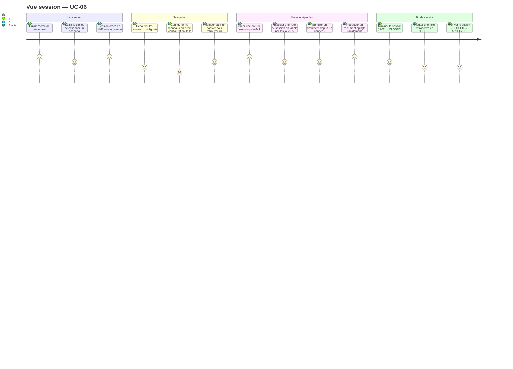
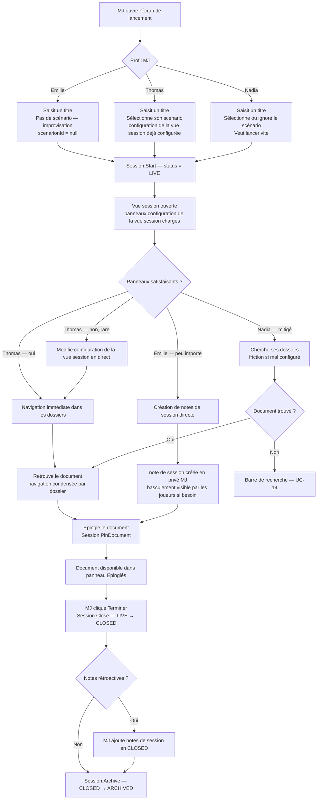

# User Journey — Vue session (UC-06)

## Périmètre

Parcours du MJ depuis le lancement d'une session jusqu'à sa fermeture, en passant par la navigation dans les dossiers, la prise de notes de session et l'épinglage de documents. Couvre trois profils : Émilie (improvisatrice, notes de session intensives), Thomas (préparation en amont, valeur centrée sur les panneaux configurés), Nadia (lancement rapide, peu de configuration). La vue joueur est traitée en tant qu'étape du parcours session mais son détail est couvert par UC-09.

---

## Personas concernés

| Persona | Mode de travail | Attente principale | Risque de friction |
|---|---|---|---|
| Émilie | Improvisatrice, notes de session intensives, création à la volée | Créer une note en deux secondes, sans navigation | Configuration initiale des panneaux — pas sa priorité |
| Thomas | Préparation hors session, dossiers configurés à l'avance | Ouvrir la vue session et trouver ses dossiers immédiatement dans le bon ordre | Vue mal organisée si configuration de la vue session n'est pas configurée |
| Nadia | Lancement rapide, peu de configuration | Lancer, voir ses PNJ et ses notes, ne pas chercher | Retrouver un document spécifique au milieu d'une session sans structure claire |

---

## Vue d'ensemble du parcours

### Carte d'expérience

### Flux fonctionnel

---

## Points de friction

| Étape | Persona(s) | Friction potentielle | Opportunité produit |
|---|---|---|---|
| Ouvrir l'écran de lancement | Tous | Trop d'étapes avant d'atteindre le bouton "Lancer" | Accès direct depuis le tableau de bord campagne en un clic |
| Saisir le titre et sélectionner un scénario | Thomas, Sonia | Sélection du scénario obligatoire si l'UX n'indique pas que c'est optionnel | Champ scénario clairement marqué "optionnel", lancement possible sans sélection |
| Vue session ouverte — panneaux chargés | Thomas | Panneaux dans un ordre inattendu si configuration de la vue session non configurée | Message d'invitation à configurer les panneaux à la première session |
| Configurer les panneaux en direct | Émilie, Nadia | Accès à la configuration non évident depuis la vue session | Icône de configuration accessible directement dans la barre de la vue session |
| Naviguer dans un dossier | Thomas, Nadia | Documents peu lisibles si la vue condensée n'est pas suffisamment informative | Afficher le type de document et les propriétés clés en vue condensée |
| Créer une note de session | Émilie | Zone de saisie non visible sans scroll si les panneaux occupent tout l'espace | Zone de saisie note de session persistante et accessible sans défilement |
| Basculer une note de session en visible par les joueurs | Émilie, Thomas | Action non trouvée si le basculement n'est pas visible inline | Icône de basculement visible directement sur la note, sans passer par un menu |
| Épingler un document | Tous | Action d'épinglage non intuitive depuis la vue condensée | Icône d'épingle au survol du document dans le panneau |
| Retrouver un document épinglé | Émilie, Nadia | Panneau Épinglés non visible si masqué ou en bas de page | Panneau Épinglés affiché en premier ou en position fixe dans la vue session |
| Terminer la session | Nadia | Confirmation redondante si l'action est simple | Une confirmation simple suffit — pas de dialogue complexe |
| Ajouter une note rétroactive en CLOSED | Thomas | Statut CLOSED peu visible — MJ peut penser être en LIVE | Indicateur de statut visible dans la barre de la vue session |
| Archiver | Thomas | Transition CLOSED → ARCHIVED irréversible mal comprise | Avertissement explicite que l'archivage est définitif et passe en lecture seule |

---

## Scénarios par persona

### Émilie — Improvisatrice, notes de session intensives

Émilie lance une session sans scénario — elle improvise. Elle saisit "Séance 4 - Les Ruines" et clique "Lancer". La session est en `LIVE`. Elle ne regarde pas les panneaux et cherche immédiatement la zone de saisie des notes de session. Elle crée dix notes en trente minutes, toutes en privé MJ. À mi-session, elle crée un PNJ à la volée (UC-07) — il est épinglé automatiquement. Elle bascule deux notes en visible par les joueurs pour les partager avec les joueurs. Elle ne reconfigure pas les panneaux — elle n'en a pas besoin pour ce qu'elle fait. En fin de session, elle clique "Terminer" et la session passe en `CLOSED`. Elle n'ajoute pas de notes rétroactives.

**Points de conversion** :
- Première note de session créée sans friction depuis la vue session.
- Basculement visible par les joueurs effectif et immédiatement visible en vue joueur.
- PNJ créé à la volée et épinglé automatiquement.

**Risques** :
- Zone de saisie non visible si les panneaux prennent tout l'espace.
- Basculement visible par les joueurs non trouvé si l'icône n'est pas visible inline.

---

### Thomas — Préparation en amont, panneaux configurés

Thomas a configuré ses panneaux la veille depuis les paramètres de sa campagne : "PNJ" en premier, "Factions" en second, "Notes" en troisième. Il lance la session "Séance 7 - L'Embuscade", sélectionne son scénario et clique "Lancer". La vue session s'ouvre avec ses panneaux dans l'ordre exact qu'il a défini — score maximum. Il navigue dans "PNJ", retrouve la fiche de Ragnar en deux clics et l'épingle. Il prend deux notes de session privé MJ pendant la confrontation. Quand les joueurs découvrent la trahison de Ragnar, il bascule une note en visible par les joueurs. À la fin, il clique "Terminer" puis ajoute deux notes rétroactives sur les conséquences narratives avant d'archiver.

**Points de conversion** :
- Panneaux dans le bon ordre dès l'ouverture — valeur centrale pour Thomas.
- Navigation rapide vers le bon document sans chercher.
- Notes rétroactives disponibles en CLOSED avant archivage.

**Risques** :
- Si la configuration de la vue session n'a pas été configurée avant la session, Thomas arrive sur une vue générique — forte friction initiale.
- Si la config n'est pas persistée correctement entre deux sessions, Thomas devra reconfigurer à chaque fois — abandon probable.

---

### Nadia — Lancement rapide, peu de configuration

Nadia prépare une session de Dungeon World. Elle veut lancer en moins de 30 secondes. Elle clique "Lancer une session", saisit "Séance 2", ignore la sélection de scénario et valide. La session est en `LIVE`. Elle voit ses panneaux — les dossiers par défaut de la campagne. Elle cherche son PNJ principal dans "Personnages" et met vingt secondes à le trouver parce qu'il y a quinze documents dans le dossier et la vue condensée n'est pas assez informative. Elle l'épingle pour ne plus chercher. Elle prend deux notes de session pendant la session. En fin de soirée, elle clique "Terminer" et ferme l'onglet.

**Points de conversion** :
- Lancement en moins de 30 secondes — objectif atteint.
- Document épinglé — accessible pour le reste de la session.

**Risques** :
- Retrouver le bon PNJ dans un dossier dense sans structure claire : forte friction si la vue condensée est insuffisante.
- Si Nadia n'a pas configuré les panneaux, les dossiers par défaut peuvent ne pas correspondre à sa priorité du moment.

---

## Scénarios alternatifs et d'erreur

- **A1 — Lancement sans scénario** : `scenarioId = null`. La session est créée en `LIVE` normalement. Aucun contenu de scénario n'est préchargé dans les panneaux.
- **A2 — Modification configuration de la vue session en direct** : la config est modifiable pendant la session LIVE sans interrompre la session. La modification est effective immédiatement. La session reste en `LIVE`.
- **A3 — Notes rétroactives en CLOSED** : disponibles uniquement pour le MJ. Les joueurs ne peuvent plus créer de notes de session en `CLOSED`.
- **E1 — Perte de connexion pendant la saisie d'une note de session** : le contenu est conservé en draft local. Synchronisation automatique au retour de la connexion. La note n'est pas perdue.
- **Mode local** : la vue session MJ est disponible sans compte. Les notes de session joueurs et la vue joueur ne sont pas disponibles. La session est persistée en IndexedDB.
- **personnelle joueur inaccessible au MJ** : règle forte — même le rôle OWNER/GM ne peut pas lire les notes de session personnelle joueur d'un joueur.

---

## Opportunités UX

| Point de conversion | Indicateur de succès | Risque d'abandon |
|---|---|---|
| Lancement de session en moins de 30 secondes | Session en `LIVE` avec vue ouverte avant 30 secondes | Trop d'étapes ou champ scénario mal présenté comme optionnel |
| Panneaux dans le bon ordre à l'ouverture | configuration de la vue session persistée entre deux sessions | Config réinitialisée à chaque session — Thomas abandonne |
| Première note de session créée sans friction | note de session enregistrée depuis la zone de saisie directe | Zone de saisie masquée ou inaccessible sans scroll |
| Document retrouvé et épinglé rapidement | Document dans le panneau Épinglés en moins de 3 clics | Vue condensée peu informative, dossier dense |
| Basculement note de session privé MJ → visible par les joueurs efficace | Joueurs voient la note immédiatement | Icône de basculement non visible inline |
| Fermeture de session sans perte de données | notes de session et épingles présents en CLOSED | Confusion entre fermeture accidentelle et clôture intentionnelle |

---

## Liens

- Use case source : [`docs/conception/besoin/usecases/UC-06-vue-session.md`](../usecases/UC-06-vue-session.md)
- User stories associées : [`US-UC-06-vue-session.md`](../user-stories/US-UC-06-vue-session.md)
- Conception source : la conduite de session : [`docs/conception/domain/session-conduct.md`](../../domain/session-conduct.md)
- UC-05 Organiser le contenu : [`docs/conception/besoin/user-journeys/UJ-UC-05-organiser-contenu-dossiers.md`](UJ-UC-05-organiser-contenu-dossiers.md)
- UC-07 Création à la volée : [`docs/conception/besoin/user-journeys/UJ-UC-07-creation-volee-session.md`](UJ-UC-07-creation-volee-session.md)
- UC-08 Partage de document : [`docs/conception/besoin/user-journeys/UJ-UC-08-partager-information.md`](UJ-UC-08-partager-information.md)
- UC-09 Accès joueur sans compte : [`docs/conception/besoin/user-journeys/UJ-UC-09-acces-session-joueur.md`](UJ-UC-09-acces-session-joueur.md)
- UC-14 Recherche globale : [`docs/conception/besoin/user-journeys/UJ-UC-14-recherche.md`](UJ-UC-14-recherche.md)

---

## Transitions inter-UC

### Depuis UC-04 / UC-05 (préparation du contenu)

La vue session (UC-06) consomme sans transformation le contenu préparé dans UC-04 (documents) et la structure de dossiers configurée dans UC-05. Les panneaux de la `SessionViewConfig` référencent des dossiers par leur identifiant — les documents qu'ils contiennent sont affichés tels quels, avec le nom de dossier actuel (renommages UC-05 inclus). La configuration des panneaux peut être faite avant la session (recommandé pour Thomas) ou ajustée en direct pendant la session `LIVE` sans l'interrompre. Un document préparé dans UC-04 avec `visibility = GM_ONLY` est visible uniquement dans la vue MJ ; il ne devient visible dans la vue joueur qu'après une action explicite de partage (UC-08).

### Vers UC-07 (création à la volée)

Depuis la vue session `LIVE`, le MJ peut créer un document ou une note sans quitter la vue session. UC-07 gère ce flux de création rapide ; le document résultant est un `Document` ordinaire au sens de UC-04, automatiquement épinglé dans `pinnedDocumentIds` de la session active. La visibilité par défaut du document créé à la volée est `GM_ONLY`. UC-07 retourne le contrôle à la vue session UC-06 sans transition visible pour le MJ.

### Vers UC-08 (partage d'un document)

Depuis la vue session `LIVE`, le MJ peut déclencher le partage d'un document via l'action « Partager » sur n'importe quel document visible. UC-08 gère la transition de `visibility = GM_ONLY` vers `PUBLIC` ; ce changement est **durable** au-delà de la session. En retour vers UC-06, le document partagé est automatiquement ajouté à `pinnedDocumentIds` de la session pour un accès rapide, et les joueurs ayant un `GuestAccess` actif ou un `SpaceMembership` voient immédiatement le document dans leur vue joueur. Cette transition UC-06 → UC-08 → UC-06 est transparente pour le MJ — il ne quitte pas la vue session.

### Vers UC-09 (vue joueur)

La vue joueur exposée par UC-09 est le pendant de la vue session MJ : elle affiche les documents `PUBLIC` de la campagne et les notes de session `PLAYER_PRIVATE` propres au joueur. La vue joueur est disponible uniquement si le MJ a un compte actif (mode local exclu — RB-01-06). Les joueurs accèdent à leur vue via un lien de session ponctuel (`GuestAccess`, portée `SESSION`) généré par le MJ depuis la vue session ou le panneau membres. Les documents que le MJ partage en session (UC-08) apparaissent dans la vue joueur en temps réel ; les documents restés `GM_ONLY` n'y sont jamais visibles même s'ils sont épinglés dans la session MJ.

### Vers UC-14 (recherche globale)

Depuis la vue session `LIVE`, le MJ dispose d'une barre de recherche globale pour retrouver un document non épinglé et non visible dans les panneaux configurés. Nadia cherche un PNJ spécifique au milieu d'une session sans quitter la vue session ; Émilie retrouve une note de session ou un scénario mémorisé par titre ou tag. Les résultats de recherche sont ouverts dans un panneau latéral sans interrompre le contexte de session. UC-14 décrit le système de recherche global (indexation, filtrage par type, visibilité des résultats) ; UC-06 exprime son usage : accès rapide pendant une session `LIVE`.
