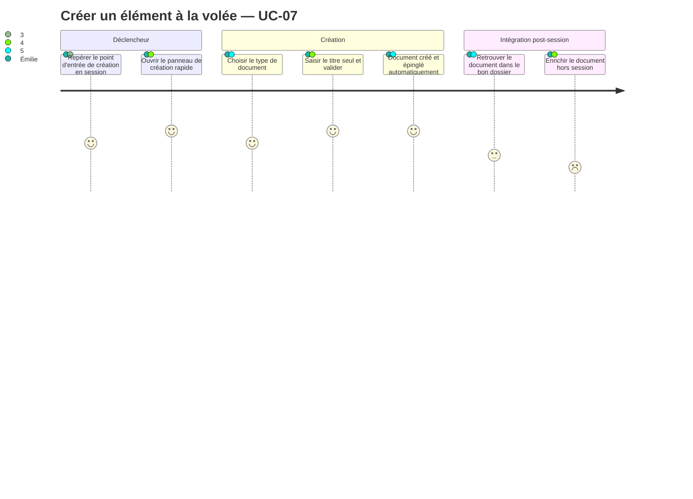
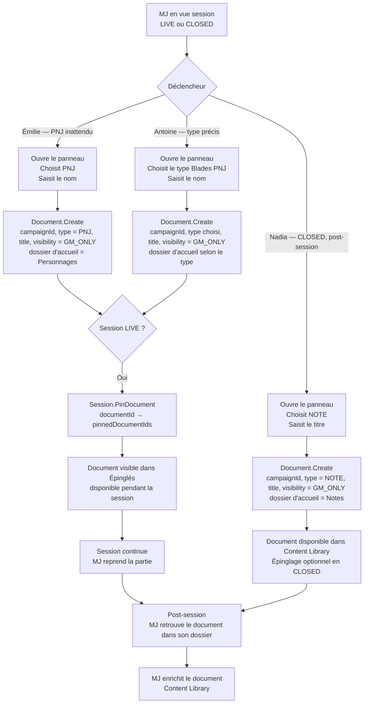

# User Journey — Créer un élément à la volée pendant la session (UC-07)

## Périmètre

Parcours du MJ depuis le déclencheur de création rapide en session jusqu'à la disponibilité du document dans l'espace. Couvre trois profils : Émilie (improvisatrice, PNJ à la volée en moins de 5 secondes), Antoine (MJ structuré, création typée et retrouvabilité post-session), Nadia (note rétroactive depuis une session CLOSED). La gestion de session (lancement, fermeture) est couverte par UC-06.

---

## Personas concernés

| Persona | Mode de travail | Attente principale | Risque de friction |
|---|---|---|---|
| Émilie | Improvisation intensive, création à la volée au fil des imprévus | Créer un PNJ ou une note en moins de 5 secondes, titre seul | Trop de champs affichés — frein immédiat |
| Antoine | Création typée, retrouvabilité après la session | Document du bon type placé dans le bon dossier dès la création | Type non trouvé dans la liste, ou document mal classé |
| Nadia | Peu de création en cours de session, note rétroactive après la partie | Créer un document depuis une session CLOSED sans friction | Ne sait pas que c'est possible en CLOSED |

---

## Vue d'ensemble du parcours

### Carte d'expérience

### Flux fonctionnel

---

## Points de friction

| Étape | Persona(s) | Friction potentielle | Opportunité produit |
|---|---|---|---|
| Repérer le point d'entrée de création | Émilie | Bouton "Créer" non visible sans scroll ou enfoui dans un menu | Bouton "Créer" fixe et visible en permanence dans la barre de la vue session |
| Ouvrir le panneau de création rapide | Tous | Panneau lent à s'afficher — brise le rythme | Affichage instantané, sans animation bloquante |
| Choisir le type de document | Antoine | Liste de types longue ou désordonnée | Types fréquents en tête de liste ; types récents affichés en premier |
| Saisir le titre et valider | Émilie, Nadia | Formulaire avec champs non obligatoires visibles — donne l'impression qu'il faut les remplir | Un seul champ visible par défaut : le titre. Champs optionnels masqués ou en accordéon |
| Document créé et épinglé | Émilie, Antoine | Confirmation d'épinglage non visible — le MJ ne sait pas que le document est épinglé | Toast ou indicateur visuel bref confirmant la création et l'épinglage |
| Retrouver le document dans son dossier | Antoine | Document classé dans "Non classés" au lieu du dossier attendu | Résolution automatique du dossier d'accueil selon le type ; visible dès la création |
| Enrichir le document hors session | Antoine | MJ ne retrouve pas le document créé à la volée parmi d'autres | Vue "Récemment créés" ou filtre "Créés en session" dans Content Library |

---

## Scénarios par persona

### Émilie — MJ improvisatrice, création PNJ en moins de 5 secondes

Les joueurs d'Émilie décident d'interroger un passant anonyme qu'elle n'a pas préparé. Elle a deux secondes. Elle clique sur "Créer" dans la barre de la vue session. Le panneau s'ouvre immédiatement. Elle choisit PNJ, saisit "Marchand de soie", valide. Le PNJ est créé, épinglé dans la session — elle le voit immédiatement dans le panneau Épinglés. Elle continue la session sans avoir quitté le contexte de partie. Après la session, elle ignore le document — il est dans Content Library si elle en a besoin plus tard.

**Score de l'étape "Saisir le titre et valider"** : 5/5 si un seul champ est visible. Score : 2/5 si plusieurs champs sont affichés et semblent obligatoires.

**Points de conversion** :
- Panneau ouvert en moins d'une seconde.
- Un seul champ visible à la création — le titre.
- Document épinglé automatiquement et visible sans action supplémentaire.

**Risques** :
- Bouton "Créer" non accessible en un clic depuis la vue session.
- Formulaire trop chargé — abandon au profit d'une note mentale.
- Délai de création perceptible — brise l'immersion.

---

### Antoine — MJ structuré, création typée et retrouvabilité post-session

Antoine mène une campagne Blades in the Dark. Pendant la session, les joueurs créent un lien inattendu avec une faction non préparée. Il ouvre le panneau de création rapide, cherche le type "Faction", saisit "Les Fils de l'Anguille", valide. La faction est créée, liée à l'espace, placée dans le dossier Factions. Elle est épinglée dans la session. Après la partie, Antoine retrouve la faction dans son dossier, avec le bon type — il peut l'enrichir directement depuis Content Library sans la recréer.

**Score de l'étape "Choisir le type de document"** : 5/5 si les types personnalisés de l'espace sont disponibles. Score : 3/5 si seuls les types génériques sont proposés.

**Points de conversion** :
- Type de document choisi en deux clics.
- Document placé dans le dossier correct dès la création.
- Retrouvabilité post-session sans effort de recherche.

**Risques** :
- Type souhaité absent de la liste — Antoine crée un document générique et doit le reclasser manuellement après.
- Document classé dans "Non classés" si le dossier d'accueil n'est pas résolu — friction à l'enrichissement post-session.

---

### Nadia — Note rétroactive depuis une session CLOSED

La session de Nadia est terminée depuis vingt minutes. Elle vient de se souvenir qu'elle a improvisé un PNJ important qu'elle n'a pas saisi à chaud. Elle rouvre la campagne, navigue jusqu'à la session CLOSED. Elle ouvre le panneau de création rapide — elle n'était pas sûre que ce soit possible en CLOSED. Elle choisit NOTE, saisit "Capitaine du Vieux Port — allié potentiel", valide. Le document est créé dans Content Library, lié à l'espace. La session reste CLOSED.

**Score de l'étape "Ouvrir le panneau de création rapide en CLOSED"** : 4/5 si le panneau est disponible et que son état (CLOSED) est indiqué clairement. Score : 2/5 si le bouton "Créer" est masqué ou désactivé en CLOSED.

**Points de conversion** :
- Panneau de création rapide accessible depuis une session CLOSED.
- Indicateur de statut clair (CLOSED) — Nadia sait qu'elle n'est pas en LIVE.
- Document créé sans friction et persisté dans Content Library.

**Risques** :
- Bouton "Créer" visuellement désactivé en CLOSED — Nadia abandonne sans essayer.
- Confusion entre création d'une note de session rétroactive (UC-06, LIVE_NOTE) et création d'un document durable à la volée (UC-07, Document) — terminologie à soigner dans l'interface.

---

## Scénarios alternatifs et d'erreur

- **E1 — Titre vide** : le panneau empêche la validation si le titre est vide ou composé uniquement d'espaces. Message d'erreur inline sur le champ.
- **E2 — Session ARCHIVED** : le panneau de création rapide est désactivé. Aucune création possible.
- **A2 — Personnage joueur** : le PJ est créé avec le titre seul. Le champ "joueur associé" est vide — assignable après la session. Pas de blocage.
- **Mode local** : la création à la volée fonctionne en mode local. Pas de différence de parcours pour Émilie.

---

## Opportunités UX

| Point de conversion | Indicateur de succès | Risque d'abandon |
|---|---|---|
| Panneau de création rapide accessible en moins de 2 clics | MJ atteint le formulaire sans navigation | Bouton enfoui dans un menu secondaire |
| Formulaire réduit au titre | MJ valide sans remplir d'autres champs | Champs optionnels visibles — donne l'impression d'obligation |
| Document épinglé automatiquement en LIVE | Document visible dans Épinglés immédiatement après création | Épinglage silencieux — MJ ne sait pas que le document est disponible |
| Dossier d'accueil résolu automatiquement | Document dans le bon dossier sans action manuelle | Document dans "Non classés" — friction post-session pour Antoine |
| Création disponible en CLOSED | MJ retrouve l'élément improvisé après la partie | Bouton désactivé en CLOSED — Nadia abandonne |

---

## Liens

- Use case source : [`docs/conception/besoin/usecases/UC-07-creation-volee-session.md`](../usecases/UC-07-creation-volee-session.md)
- User stories associées : [`US-UC-07-creation-volee-session.md`](../user-stories/US-UC-07-creation-volee-session.md)
- UC-06 Vue session : [`docs/conception/besoin/user-journeys/UJ-UC-06-vue-session.md`](UJ-UC-06-vue-session.md)
- Conception source Content Library : [`docs/conception/domain/content-library.md`](../../domain/content-library.md)
- Conception source Session Conduct : [`docs/conception/domain/session-conduct.md`](../../domain/session-conduct.md)
