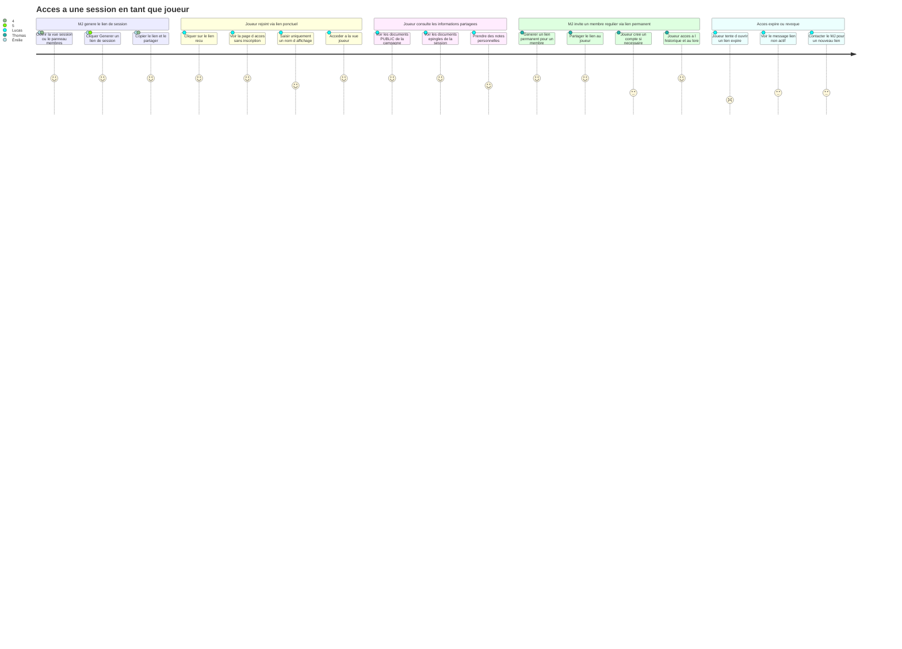
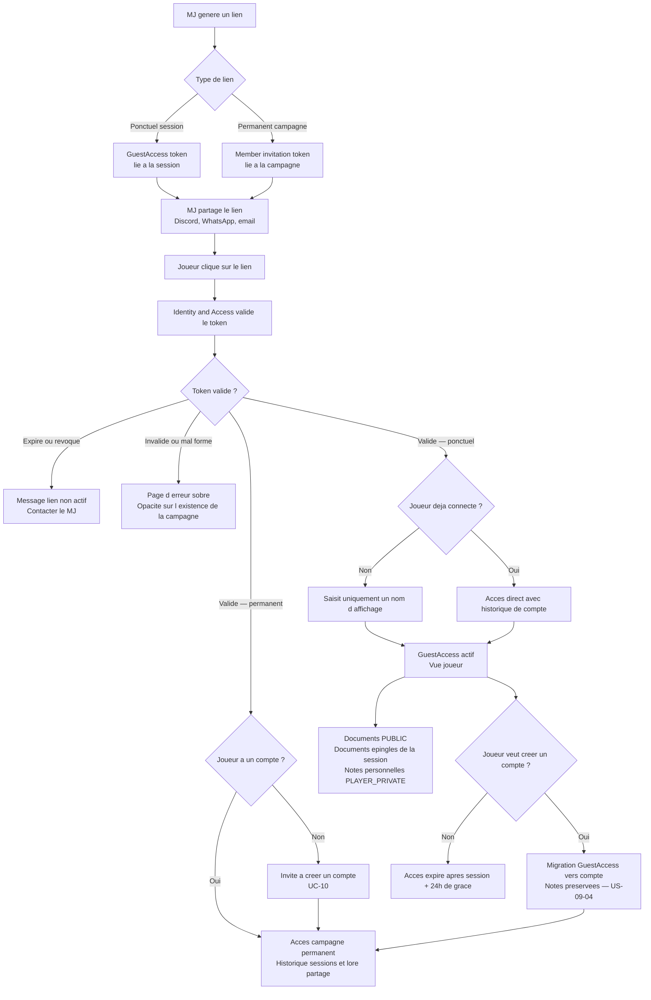

# User Journey — Accéder à une session en tant que joueur (UC-09)

## Périmètre

Parcours couvrant deux flux distincts : l'accès d'un joueur via lien ponctuel sans compte (Lucas, Émilie), et la génération du lien par le MJ ainsi que l'accès via lien permanent (Thomas). Le flux central est celui de Lucas — joueur type sans compte, profil d'adoption critique. La gestion des membres de campagne est couverte par UC-11. La création de compte est couverte par UC-10.

---

## Carte d'expérience

---

## Flux fonctionnel

---

## Points de friction identifiés

- **Saisie du nom d'affichage superflue si le joueur est déjà connecté** : Lucas peut avoir un compte Haversack sans le savoir ou sans être connecté. L'interface doit détecter silencieusement une session existante et proposer "Continuer en tant que Lucas (connecté)" plutôt que redemander un nom.

- **Manque de retour visuel sur l'expiration imminente** : Lucas ne sait pas que son accès expire 24 heures après la fin de session. Si le MJ clôture la session tard dans la nuit, Lucas peut perdre l'accès à ses notes avant de les relire — sans avoir été averti.

- **Friction lors de la création de compte depuis l'accès invité** : le moment où Lucas veut créer un compte pour garder ses notes coïncide souvent avec la fin de session (fatigue, rush). Si la procédure d'inscription est longue ou exige une validation d'email immédiate, il abandonne.

- **Opacité du message d'erreur pour un lien expiré vs invalide** : le principe d'opacité est correct d'un point de vue sécurité, mais Lucas ne comprend pas pourquoi le lien ne fonctionne pas. Le message doit être sobre mais suffisamment actionnable ("contacter le MJ") pour éviter la confusion.

- **Génération du lien — Thomas ne sait pas si le lien permanent est déjà actif** : si Thomas génère plusieurs liens pour la même campagne ou modifie les membres, l'interface doit clairement indiquer l'état actif/révoqué de chaque lien dans le panneau membres.

---

## Opportunités UX

- **Accès en un clic avec nom pré-rempli depuis Discord / WhatsApp** : si le lien est accompagné d'un paramètre de nom (optionnel, fourni par le MJ), la page d'accès peut pré-remplir le champ de nom d'affichage. Lucas n'a qu'à confirmer — friction réduite à zéro.

- **Détection silencieuse de session existante** : à l'arrivée sur la page de lien, l'interface vérifie si un compte est déjà connecté et propose directement l'accès avec ce compte, sans redemander le nom. Un lien discret "Continuer en tant qu'invité" reste disponible.

- **Bandeau de migration non intrusif** : après quelques sessions passées en invité, un bandeau discret en bas de la vue joueur propose "Créer un compte pour garder tes notes". Il ne bloque pas l'accès et ne s'affiche qu'une fois par session.

- **Indicateur d'expiration visible dans la vue joueur** : une mention discrète ("Accès valide jusqu'au [date+24h]") dans la vue joueur permet à Lucas d'anticiper l'expiration et de créer un compte ou de demander un nouveau lien à temps.

- **Copie du lien en un clic depuis la vue session** : Émilie génère et partage le lien sans quitter la vue session. Un bouton "Copier le lien" avec retour visuel (toast) suffit — pas de popup, pas de navigation.

- **Panneau membres avec état des liens pour Thomas** : chaque membre ou `GuestAccess` dans le panneau affiche son état (actif, expiré, révoqué) avec une action rapide "Révoquer" ou "Générer un nouveau lien".

---

## Liens

- Use case source : [`docs/conception/besoin/usecases/UC-09-acces-session-joueur.md`](../usecases/UC-09-acces-session-joueur.md)
- User stories associées : [`US-UC-09-acces-session-joueur.md`](../user-stories/US-UC-09-acces-session-joueur.md)
- UC-10 Compte cloud : [`docs/conception/besoin/usecases/UC-10-compte-cloud.md`](../usecases/UC-10-compte-cloud.md)
- UC-11 Gérer membres campagne : [`docs/conception/besoin/usecases/UC-11-gerer-membres-campagne.md`](../usecases/UC-11-gerer-membres-campagne.md)
- UC-08 Partager information : [`docs/conception/besoin/user-journeys/UJ-UC-08-partager-information.md`](UJ-UC-08-partager-information.md)
- Conception Identity and Access : [`docs/conception/domain/identity-access.md`](../../domain/identity-access.md)
- Conception Space Management : [`docs/conception/domain/space-management.md`](../../domain/space-management.md)
- Conception Session Conduct : [`docs/conception/domain/session-conduct.md`](../../domain/session-conduct.md)
