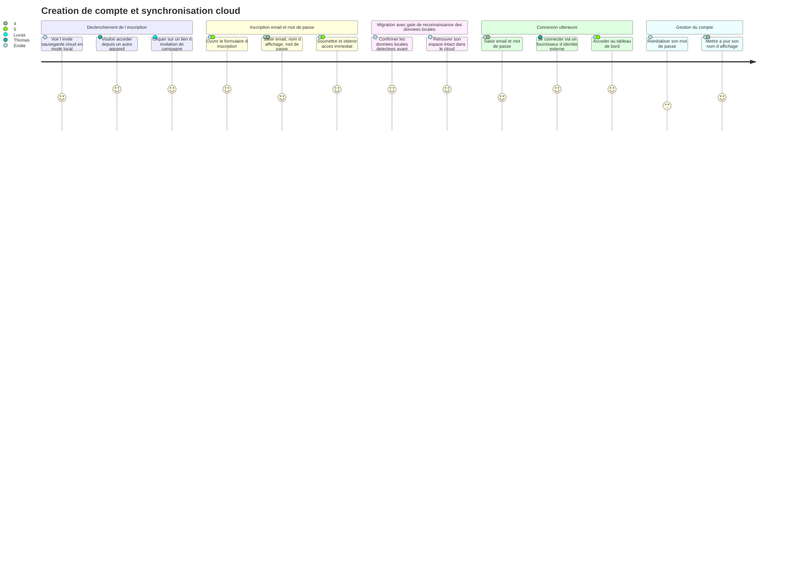
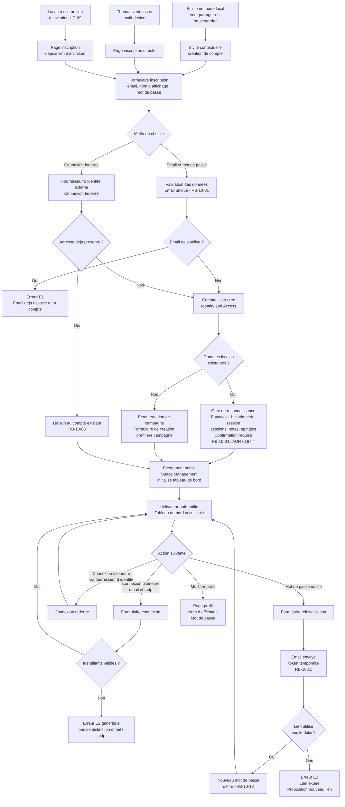

# User Journey — Créer un compte et synchroniser dans le cloud (UC-10)

## Périmètre

Parcours couvrant trois flux d'entrée : l'inscription par un MJ venant du mode local (Émilie), la création directe de compte pour usage multi-device (Thomas), et la création de compte depuis un lien d'invitation par un joueur (Lucas). La migration avec gate de reconnaissance des données locales est intégrée dans le flux d'Émilie. La suppression de compte (A4) est couverte par UC-10 et US-10-06 ; son flux détaillé fait l'objet d'une section dédiée ci-dessous.

---

## Carte d'expérience

---

## Flux fonctionnel

---

## Points de friction identifiés

- **Invite contextuelle peu visible en mode local** : Émilie peut passer plusieurs sessions sans voir l'invite de sauvegarde cloud. Si le bandeau est discret ou apparait en bas d'écran, le déclencheur naturel de l'inscription peut être raté. Le contexte idéal pour l'afficher est la première tentative de partage avec un joueur.

- **Friction à la saisie du mot de passe pour Lucas** : Lucas arrive depuis un lien d'invitation — il vient d'utiliser l'application sans mot de passe (mode invité). Lui demander de choisir un mot de passe sécurisé à ce moment peut créer un abandon. La connexion fédérée réduit ce frein mais ne couvre pas tous les cas.

- **Sessions en cours à clôturer avant migration** : Émilie peut avoir une session ouverte (LIVE) au moment où elle souhaite créer son compte et migrer. Le gate de reconnaissance signale cette session et indique qu'elle doit être clôturée — si ce message n'est pas clair, Émilie peut être frustrée de ne pas pouvoir procéder immédiatement.

- **Progression de la migration pour gros volumes** : le gate de reconnaissance (ADR-016 §4) répond à l'opacité pré-import — Émilie voit les espaces détectés (y compris leur historique de session) avant de confirmer. Pour les volumes importants, l'absence de retour visuel pendant la migration elle-même (barre de progression, indicateur "synchronisation en cours") reste une friction résiduelle à adresser.

- **Réinitialisation de mot de passe avec délai d'expiration court** : si le token expire rapidement (exemple : 1 heure) et que l'utilisateur ne voit pas l'email immédiatement, il devra recommencer le processus. La durée d'expiration est à calibrer.

- **Pas de différenciation des erreurs de connexion** : le message générique (E2) est correct sur le plan de la sécurité, mais peut frustrer un utilisateur légitime qui ne sait pas si c'est son email ou son mot de passe qui est en cause. L'aide doit orienter vers la réinitialisation du mot de passe.

---

## Opportunités UX

- **Invite contextuelle au bon moment** : déclencher la proposition de création de compte précisément lorsque le MJ tente une action qui nécessite un compte (clic sur "Partager avec les joueurs", "Accéder depuis un autre appareil"). L'invite est ainsi justifiée par le besoin et non perçue comme une interruption.

- **Toast de confirmation post-migration** : après la migration, afficher une confirmation discrète "Vos X espaces et Y documents ont été synchronisés" rassure Émilie sans interrompre son flux. Ce toast est une amélioration UX facultative, distincte du gate de reconnaissance pré-import (ADR-016 §4) qui, lui, est décidé et obligatoire.

- **Connexion fédérée en premier plan** : sur les pages d'inscription et de connexion, la connexion fédérée peut être présentée en priorité (bouton principal) pour réduire la friction, notamment pour Lucas qui arrive depuis un lien et veut un accès rapide.

- **Pré-remplissage de l'email depuis le lien d'invitation** : si le lien d'invitation UC-09 contient un contexte de campagne, la page d'inscription peut afficher "Vous rejoignez la campagne de [MJ]" et contextualiser l'inscription — la conversion est meilleure quand le but est explicite.

- **Retour visuel sur la progression de la migration** : pour les MJ avec beaucoup de données locales, une barre de progression discrète ou un indicateur "Synchronisation en cours..." évite l'inquiétude pendant la migration.

- **Lien direct vers réinitialisation depuis E2** : le message d'erreur générique peut contenir un lien discret "Mot de passe oublié ?" — sans révéler si l'email existe, mais en proposant la sortie naturelle pour l'utilisateur légitime bloqué.

---

## Après la migration — Continuité vers le partage

Une fois la migration réussie, Émilie retrouve ses espaces avec tout leur historique de session : ses sessions passées sont consultables, ses notes et documents épinglés sont en place. Elle peut alors enchaîner naturellement vers l'invitation de ses joueurs dans ces mêmes espaces pour des sessions futures (UC-08, UC-09, UC-11), en garantissant la continuité entre ses sessions solo passées et ses sessions futures avec joueurs. Le parcours solo→joueurs est ainsi fluide et sans rupture.

---

## Liens

- Use case source : [`docs/conception/besoin/usecases/UC-10-compte-cloud.md`](../usecases/UC-10-compte-cloud.md)
- User stories associées : [`US-UC-10-compte-cloud.md`](../user-stories/US-UC-10-compte-cloud.md)
- UC-01 Mode local : [`docs/conception/besoin/usecases/UC-01-mode-local-sans-compte.md`](../usecases/UC-01-mode-local-sans-compte.md)
- UC-09 Accès session joueur : [`docs/conception/besoin/usecases/UC-09-acces-session-joueur.md`](../usecases/UC-09-acces-session-joueur.md)
- UC-11 Gérer les membres d'un espace : [`docs/conception/besoin/usecases/UC-11-gerer-membres-espace-partage.md`](../usecases/UC-11-gerer-membres-espace-partage.md)
- UC-12 Consulter son espace (vue joueur) : [`docs/conception/besoin/usecases/UC-12-consulter-espace-joueur.md`](../usecases/UC-12-consulter-espace-joueur.md)
- User Journey UC-09 : [`UJ-UC-09-acces-session-joueur.md`](UJ-UC-09-acces-session-joueur.md)
- Conception Identity and Access : [`docs/conception/domain/identity-access.md`](../../domain/identity-access.md)
- Conception Space Management : [`docs/conception/domain/space-management.md`](../../domain/space-management.md)
