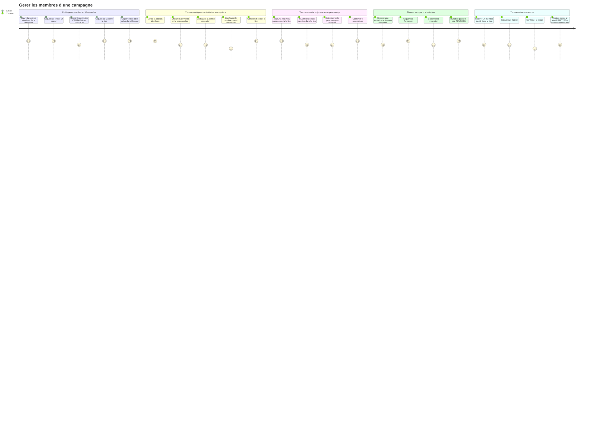
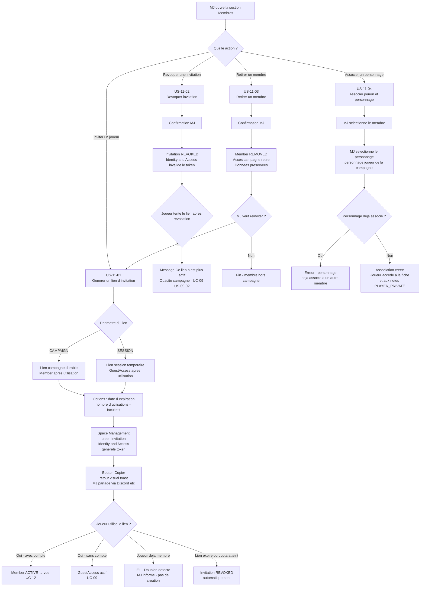

# User Journey — Gérer les membres d'une campagne (UC-11)

## Périmètre

Parcours couvrant deux flux distincts du point de vue du MJ : la gestion rapide des invitations (Émilie — table occasionnelle, friction minimale) et la gestion complète des membres (Thomas — table stable, association joueur-personnage, surveillance des accès). Le flux du joueur qui rejoint suite à une invitation est couvert par UC-09 (scénario nominal campagne, avec compte) et UC-09 (sans compte) ; UC-12 couvre la vue obtenue par le joueur après l'accès. L'invitation par email est hors MVP.

---

## Carte d'expérience

---

## Flux fonctionnel

---

## Points de friction identifiés

- **Choix du périmètre peu intuitif pour Émilie** : la distinction `CAMPAIGN` / `SESSION` est technique. Émilie veut juste "inviter ses joueurs pour ce soir". Un libellé orienté usage ("Accès permanent à la campagne" / "Accès pour cette session") réduirait la friction cognitive.

- **Génération du lien hors de la vue session** : Émilie veut souvent inviter ses joueurs juste avant de démarrer la session. Si le point d'entrée est uniquement dans la section "Membres" de la campagne, elle doit naviguer hors de la vue session en cours. Un raccourci depuis la vue session (UC-06) éviterait cette rupture.

- **Absence de confirmation visuelle que le joueur a rejoint** : Thomas génère un lien et attend. Sans indication dans l'interface que le lien a été utilisé, il ne sait pas si son joueur a bien rejoint. L'état de l'invitation (`PENDING` → `ACTIVE`) doit être visible en temps réel dans le panneau membres.

- **Association joueur-personnage silencieuse** : Thomas associe un joueur à son personnage mais ne sait pas si le joueur l'a vu. Si l'association a lieu alors que le joueur est déjà connecté, une notification in-app côté joueur éviterait les demandes répétées ("tu as ma fiche ?").

- **Retrait d'un membre — confirmation anxiogène** : le MJ craint de supprimer des données. Un message de confirmation explicite ("les données du joueur — personnage, notes — sont conservées dans la campagne") réduit l'hésitation.

- **Quota d'usages — valeur par défaut ambiguë** : si Thomas ne renseigne pas de nombre maximum d'utilisations, le comportement par défaut (illimité ou 1 ?) n'est pas évident. La valeur par défaut doit être visible et documentée dans le formulaire.

---

## Opportunités UX

- **Bouton "Inviter" dans la vue session** : depuis la vue session active (UC-06), un bouton "Inviter" génère directement un lien `SESSION` sans quitter la vue. Émilie invite ses joueurs en une action depuis l'endroit où elle se trouve déjà.

- **Libellés orientés usage plutôt que techniques** : remplacer `CAMPAIGN` / `SESSION` par "Accès durable à la campagne" / "Accès pour une session" dans le formulaire, tout en conservant les codes internes dans les données.

- **Indicateur d'état en temps réel dans le panneau membres** : chaque invitation affiche son état actuel (`PENDING`, `ACTIVE`, `REVOKED`) avec une mise à jour en temps réel quand un joueur l'utilise. Thomas sait immédiatement que son joueur a rejoint.

- **Copie du lien en un clic avec toast** : un bouton "Copier le lien" avec retour visuel discret (toast "Lien copié !") suffit. Pas de popup, pas de modale, pas de navigation.

- **Message de confirmation rassurant au retrait** : lors du retrait d'un membre, un message explicite ("Le personnage et les notes de ce joueur restent dans la campagne. Seul l'accès est retiré.") réduit l'anxiété de suppression.

- **Réinvitation depuis la fiche membre REMOVED** : depuis la fiche d'un membre `REMOVED`, un bouton "Réinviter" déclenche directement la génération d'un nouveau lien (US-11-01) pré-configuré pour ce membre, sans navigation supplémentaire.

- **Panneau membres synthétique** : Thomas dispose d'un panneau unique listant membres actifs, invitations en attente et membres retirés, avec le statut de chaque accès, l'association personnage, et les actions disponibles (Révoquer, Retirer, Associer, Réinviter).

---

## Liens

- Use case source : [`docs/conception/besoin/usecases/UC-11-gerer-membres-campagne.md`](../usecases/UC-11-gerer-membres-campagne.md)
- User stories associées : [`US-UC-11-gerer-membres-campagne.md`](../user-stories/US-UC-11-gerer-membres-campagne.md)
- UC-09 Accès session joueur : [`docs/conception/besoin/usecases/UC-09-acces-session-joueur.md`](../usecases/UC-09-acces-session-joueur.md)
- UC-12 Consulter sa campagne (vue joueur) : [`docs/conception/besoin/usecases/UC-12-rejoindre-campagne.md`](../usecases/UC-12-rejoindre-campagne.md)
- User Journey UC-09 : [`UJ-UC-09-acces-session-joueur.md`](UJ-UC-09-acces-session-joueur.md)
- Conception Space Management : [`docs/conception/domain/space-management.md`](../../domain/space-management.md)
- Conception Identity and Access : [`docs/conception/domain/identity-access.md`](../../domain/identity-access.md)
