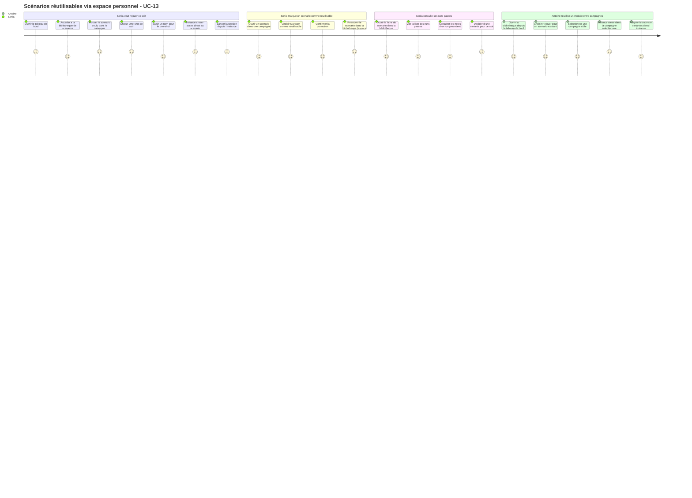
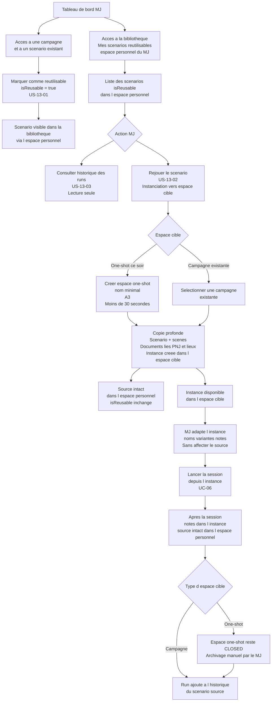

# User Journey — Utiliser un scénario réutilisable (UC-13)

> **Should Have — hors première livraison (post-MVP)** — Ce parcours décrit la cible produit complète. En première livraison, le one-shot se crée via le parcours espace de jeu nominal (UC-02, `type = ONE_SHOT`). La bibliothèque de scénarios réutilisables et le parcours express sont reportés post-MVP — voir UC-13 et vision §5bis.

## Périmètre

Ce parcours couvre deux profils distincts : Sonia, qui anime des one-shots avec un catalogue de 15 scénarios qu'elle rejoue avec des groupes différents, et Antoine, qui veut réutiliser des structures entre ses 3 campagnes simultanées. Le parcours part du moment où le MJ décide de rejouer un scénario et s'arrête au lancement de la session depuis l'instance créée.

Les flux de création d'espace de jeu sont couverts par UC-02. La gestion des membres et l'accès joueur sont couverts par UC-11 et UC-09. UC-13 couvre uniquement la bibliothèque de scénarios réutilisables (vue sur l'espace personnel du MJ), le marquage `isReusable`, la création d'instances dans un espace cible et la consultation de l'historique.

---

## Carte d'expérience

---

## Flux fonctionnel

---

## Points de friction identifiés

- **Absence de distinction claire entre source et instance dans l'interface** : si le MJ n'a pas conscience qu'il travaille sur une instance et non sur le source, il peut penser que ses modifications vont dans le scénario réutilisable. L'interface doit indiquer en permanence qu'il s'agit d'une instance, avec un lien vers le scénario source dans l'espace personnel.

- **Catalogue vide au premier accès** : Sonia ouvre la bibliothèque pour la première fois et le catalogue est vide. Sans scénario marqué `isReusable` depuis ses campagnes, elle ne peut pas encore "rejouer". Ce point d'entrée vide peut dérouter — un message d'invite ("Aucun scénario réutilisable encore. Marquez un scénario depuis l'une de vos campagnes.") et un raccourci direct vers ses campagnes réduiraient la friction.

- **Copie profonde invisible et silencieuse** : lors de la création d'une instance dans l'espace cible, la copie profonde (scénario + scènes + `Document` liés) peut prendre un moment ou produire un volume de contenu inattendu pour Sonia. Une indication visuelle du périmètre copié ("15 documents, 6 scènes inclus") permet d'éviter la surprise.

- **One-shot sans archivage automatique** : Sonia s'attend peut-être à ce que l'espace one-shot disparaisse ou soit rangé automatiquement après la session. L'interface doit rappeler explicitement que l'espace reste à l'état CLOSED et que l'archivage est une action manuelle — sous peine d'une accumulation de one-shots non archivés dans le tableau de bord.

- **Historique des runs peu actionnable sans notes** : si Sonia n'a pas pris de notes MJ pendant le run, l'entrée d'historique n'affiche qu'une date et un contexte. La valeur perçue est faible. Un rappel à la fin de la session ("Ajoutez des notes à cette instance pour enrichir votre historique") augmente la probabilité que l'historique soit utile à terme.

- **Antoine entre dans la campagne par la bibliothèque** : pour Antoine, la bibliothèque de scénarios réutilisables est un outil de gestion multi-campagnes. S'il doit quitter le contexte de la campagne pour accéder à la bibliothèque, puis y revenir, les allers-retours sont fastidieux. Un accès à la bibliothèque depuis la vue campagne réduirait les ruptures de contexte.

---

## Opportunités UX

- **Badge "Source" ou "Instance" permanent** : toute vue d'un scénario doit indiquer de manière claire et non ambiguë s'il s'agit du scénario source (dans l'espace personnel, `isReusable`) ou d'une instance (dans un espace cible). Ce badge évite les modifications accidentelles du source depuis une instance.

- **Création de one-shot depuis la bibliothèque en un seul geste** : le flux "One-shot ce soir" doit permettre de passer du catalogue au lancement de session en moins de 30 secondes. Un formulaire minimal (nom du one-shot, confirmation) sans étapes intermédiaires atteint cet objectif.

- **Note de fin de run suggérée** : à la fin d'une session jouée depuis une instance, l'application propose une fenêtre légère pour saisir une note de run (ce qui a bien fonctionné, la variante jouée, les joueurs présents). Cette note alimente directement l'historique visible dans US-13-03.

- **Accès rapide au dernier run depuis la fiche du scénario** : sur la fiche d'un scénario dans la bibliothèque, le dernier run est affiché en bref (date, contexte, note courte). Cela donne à Sonia un repère immédiat sans ouvrir l'historique complet.

- **Personnalisation de l'instance après copie** : juste après la création d'une instance dans l'espace cible, l'application propose une étape optionnelle de personnalisation rapide (renommer un PNJ, ajuster une accroche) avant le lancement. Cette étape n'est pas bloquante — le MJ peut passer directement à la session.

- **Indicateur de fréquence d'utilisation dans le catalogue** : le catalogue peut afficher le nombre de fois qu'un scénario a été joué, pour que Sonia identifie d'un coup d'œil ses scénarios éprouvés. Cet indicateur est dérivé du nombre d'entrées dans l'historique des runs.

---

## Liens

- Use case source : [`docs/conception/besoin/usecases/UC-13-scenario-reutilisable.md`](../usecases/UC-13-scenario-reutilisable.md)
- User stories associées : [`US-UC-13-scenario-reutilisable.md`](../user-stories/US-UC-13-scenario-reutilisable.md)
- UC-02 Créer un espace de jeu (one-shot A1) : [`docs/conception/besoin/usecases/UC-02-creer-espace-jeu.md`](../usecases/UC-02-creer-espace-jeu.md)
- UC-03 Structurer un scénario : [`docs/conception/besoin/usecases/UC-03-structurer-scenario.md`](../usecases/UC-03-structurer-scenario.md)
- UC-06 Vue session : [`docs/conception/besoin/usecases/UC-06-vue-session.md`](../usecases/UC-06-vue-session.md)
- User Journey UC-02 : [`UJ-UC-02-creer-espace-jeu.md`](UJ-UC-02-creer-espace-jeu.md)
- User Journey UC-03 : [`UJ-UC-03-structurer-scenario.md`](UJ-UC-03-structurer-scenario.md)
- Conception Content Library : [`docs/conception/domain/content-library.md`](../../domain/content-library.md)
- Conception Space Management : [`docs/conception/domain/space-management.md`](../../domain/space-management.md)
