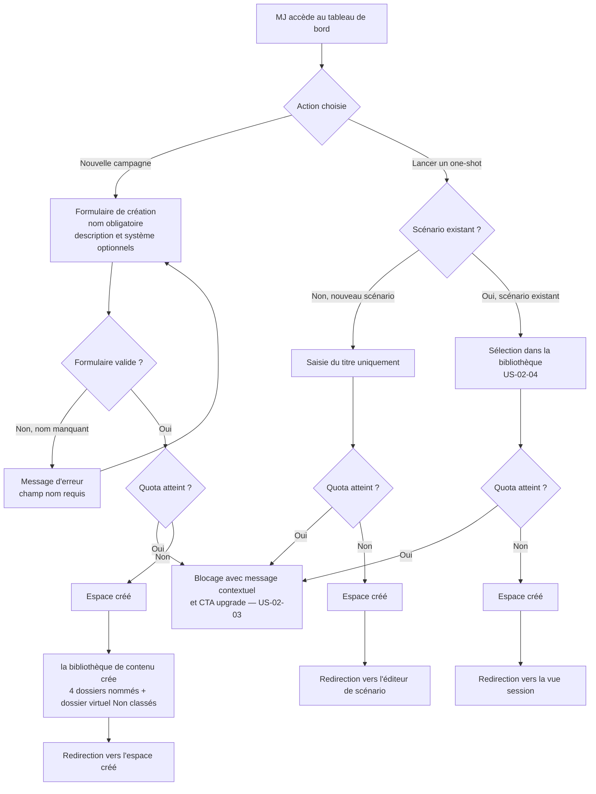
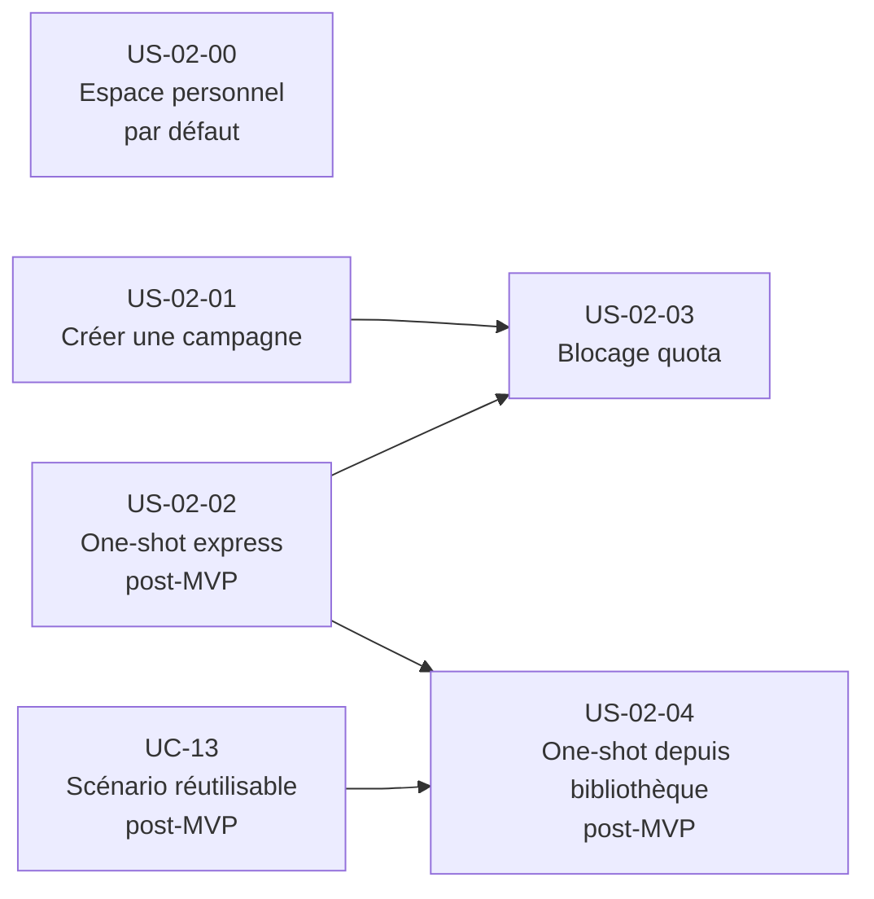

# Epic — Créer un espace de jeu

---

## Objectif utilisateur

Permettre à un MJ de créer un espace de travail pour organiser une campagne longue ou lancer un one-shot, avec un niveau de configuration adapté au contexte. L'objectif est de minimiser la friction à la création, d'offrir un parcours express pour les one-shots (< 30 secondes), et de permettre une configuration progressive pour les campagnes.

Les espaces de type `CAMPAIGN` et `ONE_SHOT` sont créés par ces parcours. L'espace de type `PERSONAL` préexiste : il est créé automatiquement à la création du compte (ou fourni comme conteneur par défaut en mode local) et n'est pas accessible via ces parcours de création.

---

## Personas concernés

| Persona | Profil | Douleur principale | Lien avec cet epic |
|---|---|---|---|
| **Nadia** | MJ infirmière, 42 ans, session mensuelle | Configuration initiale trop longue | Bénéficiaire directe — campagne créable avec juste un nom |
| **Antoine** | MJ multi-campagnes, 3 systèmes différents | Structure imposée et non agnostique | Espace agnostique sans système de jeu obligatoire |
| **Sonia** | MJ one-shot exclusif, 3 à 5 one-shots/mois | Lancer un one-shot prend trop de temps | Parcours express one-shot < 30 secondes |
| **Émilie** | MJ improvisatrice | Devoir tout configurer avant de commencer | Création minimaliste, enrichissement en cours de route |
| **Thomas** | MJ Obsidian | Migration de contenu forcée | Espace créé sans importer de contenu |

---

## Use cases couverts

- **UC-02** — Créer un espace de jeu (intégralité du périmètre)
- **UC-13** — Scénario réutilisable (dépendance externe pour US-02-04)

---

## Priorité MoSCoW

| Story | Priorité |
|---|---|
| US-02-00 | Must Have |
| US-02-01 | Must Have |
| US-02-02 | Should Have — post-MVP (dépend UC-13 ; voir vision §5bis et UC-02 §A1) |
| US-02-03 | Must Have |
| US-02-04 | Should Have (dépend UC-13) |
| US-02-05 | Exclue |

---

## Bounded contexts pressentis

- **Space Management** — création de l'espace, application des règles métier (quota, ownership, type), publication de création d'espace
- **la bibliothèque de contenu** — réception de création d'espace, création des dossiers système (Personnages, Joueurs, Scénarios, Notes, Non classés)
- **Identity & Access** — vérification de l'id du MJ propriétaire, plan d'abonnement (gratuit/PRO)
- **la conduite de session** — redirection vers la vue session à l'issue du parcours one-shot depuis scénario existant (US-02-04)

La création des dossiers système n'appartient pas à Space Management. Ce périmètre fonctionnel publie uniquement l'événement création d'espace. C'est la bibliothèque de contenu qui réagit à cet événement pour créer les dossiers système.

---

## Vue d'ensemble



---

## Dépendances



---

## User stories

---

### US-02-00 — Disposer d'un espace personnel par défaut

**Format**

> En tant que MJ,
> je dispose d'un espace personnel (`PERSONAL`) sans avoir à le créer,
> afin d'avoir un espace de travail privé disponible dès l'ouverture du compte ou de l'application.

**Métadonnées**

| Champ | Valeur |
|---|---|
| Priorité | Must Have |
| Source | UC-02 — ontologie des types d'espace, décision ADR-018 |
| Bounded context | Space Management, Identity & Access |

**Critères d'acceptation**

```gherkin
Feature: Espace personnel par défaut

  Scenario: Le MJ crée un compte et dispose immédiatement d'un espace personnel
    Given un MJ vient de créer son compte
    When il accède à son tableau de bord pour la première fois
    Then un espace de type PERSONAL est déjà présent
    And cet espace contient le dossier virtuel "Non classés"
    And aucune action de création n'a été nécessaire de la part du MJ

  Scenario: Le MJ en mode local dispose d'un espace personnel comme conteneur par défaut
    Given le MJ utilise l'application en mode local sans compte
    When il accède à l'application pour la première fois
    Then un espace PERSONAL est présent comme conteneur par défaut
    And cet espace contient le dossier virtuel "Non classés"

  Scenario: L'espace personnel n'apparaît pas dans le quota FREE
    Given le MJ possède un compte gratuit
    And son espace personnel PERSONAL est actif
    When le système calcule le quota d'espaces actifs
    Then l'espace PERSONAL n'est pas décompté dans le quota
    And le MJ dispose bien de 3 emplacements CAMPAIGN/ONE_SHOT disponibles
```

**Règles métier**

- RB-02-18 : L'espace `PERSONAL` est créé automatiquement à la création du compte. En mode local, il est fourni comme conteneur par défaut. Le MJ ne passe jamais par un parcours de création pour cet espace.
- RB-02-19 : L'espace `PERSONAL` n'est pas décompté dans le quota d'espaces actifs (`CAMPAIGN`/`ONE_SHOT`). Il est hors quota pour tous les plans (gratuit, PRO, local).
- RB-02-20 : L'espace `PERSONAL` reçoit uniquement le dossier virtuel « Non classés ». Il ne reçoit pas les 4 dossiers nommés (Personnages, Joueurs, Scénarios, Notes).

**Notes de conception**

- La création automatique de l'espace `PERSONAL` est déclenchée par Space Management au moment de la création du compte (ou de l'initialisation locale). Ce n'est pas un événement déclenché par le MJ.
- L'espace `PERSONAL` ne doit pas apparaître dans les parcours de création d'espace (US-02-01, US-02-02). Il est visible dans le tableau de bord comme espace distinct.

---

### US-02-01 — Créer une campagne depuis le tableau de bord

**Format**

> En tant que MJ,
> je veux créer un espace de campagne depuis mon tableau de bord en renseignant uniquement un nom,
> afin de commencer à préparer ma campagne sans configuration longue.

**Métadonnées**

| Champ | Valeur |
|---|---|
| Priorité | Must Have |
| Source | UC-02 — scénario nominal |
| Bounded context | Space Management, la bibliothèque de contenu |

**Critères d'acceptation**

```gherkin
Feature: Création d'une campagne

  Scenario: Le MJ crée une campagne avec le nom uniquement
    Given le MJ est connecté et accède à son tableau de bord
    And son quota d'espaces CAMPAIGN/ONE_SHOT actifs n'est pas atteint
    When il choisit "Nouvelle campagne"
    And il renseigne uniquement un nom
    And il valide
    Then un espace de campagne est créé
    And les 4 dossiers système nommés sont créés automatiquement : Personnages, Joueurs, Scénarios, Notes
    And le dossier virtuel "Non classés" est créé automatiquement
    And le MJ est redirigé vers le nouvel espace

  Scenario: Le MJ crée une campagne avec tous les champs
    Given le MJ est connecté et accède à son tableau de bord
    And son quota d'espaces CAMPAIGN/ONE_SHOT actifs n'est pas atteint
    When il choisit "Nouvelle campagne"
    And il renseigne un nom, une description courte et un système de jeu
    And il valide
    Then un espace de campagne est créé avec les informations fournies
    And les 4 dossiers système nommés et le dossier virtuel "Non classés" sont créés automatiquement

  Scenario: Le MJ tente de créer une campagne sans renseigner de nom
    Given le MJ accède au formulaire de création de campagne
    When il valide sans renseigner de nom
    Then un message d'erreur indique que le nom est obligatoire
    And aucun espace n'est créé

  Scenario: Le MJ crée une campagne sans système de jeu
    Given le MJ accède au formulaire de création de campagne
    When il valide sans renseigner de système de jeu
    Then l'espace est créé en mode générique
    And les 4 dossiers système nommés et le dossier virtuel "Non classés" sont créés avec leurs labels neutres

  Scenario: Le MJ est en mode local et crée une campagne
    Given le MJ utilise l'application en mode local sans compte
    When il crée une campagne avec un nom
    Then l'espace est créé et pleinement fonctionnel
    And les 4 dossiers système nommés et le dossier virtuel "Non classés" sont créés automatiquement
```

**Règles métier**

- RB-02-01 : Le nom est obligatoire pour créer une campagne. Description et système de jeu sont facultatifs.
- RB-02-02 : L'espace créé appartient à un seul propriétaire avec le rôle `MemberRole.OWNER`.
- RB-02-03 : Les 4 dossiers système nommés (Personnages, Joueurs, Scénarios, Notes) et le dossier virtuel « Non classés » sont créés automatiquement pour un espace partagé (`CAMPAIGN` ou `ONE_SHOT`). Les dossiers nommés sont renommables et supprimables (`isSystem` est informatif, non restrictif).
- RB-02-04 : Un espace créé sans système de jeu est en mode générique — comportement recommandé par défaut.
- RB-02-05 : Un espace créé en mode local est pleinement fonctionnel, au même titre qu'un espace cloud.

**Notes de conception**

- La création d'un espace de jeu publie l'événement création d'espace. Space Management ne crée pas les dossiers système directement. C'est la bibliothèque de contenu qui consomme création d'espace et déclenche la création des 4 dossiers nommés et du dossier virtuel. Ce point d'architecture transverse doit être documenté dans les contrats d'intégration.
- Le `type` est positionné à `CAMPAIGN` pour ce scénario. L'utilisateur ne voit jamais ce détail technique.
- L'absence de système de jeu est le comportement par défaut. Aucune valeur pré-sélectionnée ne doit orienter le MJ vers un système spécifique.

---

### US-02-02 — Lancer un one-shot en parcours express

> **Post-MVP** — Cette story décrit le parcours express one-shot (point d'entrée dédié « Lancer un one-shot »). En première livraison, un one-shot se crée via le parcours campagne nominal avec `type = ONE_SHOT` (US-02-01). La livraison de cette story est conditionnée à celle de UC-13 — voir vision §5bis et UC-02 §A1.

**Format**

> En tant que MJ,
> je veux lancer un one-shot depuis le tableau de bord en moins de 30 secondes avec un titre uniquement,
> afin de ne pas perdre de temps en configuration avant une partie.

**Métadonnées**

| Champ | Valeur |
|---|---|
| Priorité | Should Have — post-MVP (dépend UC-13) |
| Source | UC-02 — scénario alternatif A1 |
| Bounded context | Space Management |

**Critères d'acceptation**

```gherkin
Feature: Lancement d'un one-shot en parcours express

  Scenario: Le MJ lance un one-shot avec un nouveau scénario
    Given le MJ est connecté et accède à son tableau de bord
    And son quota d'espaces CAMPAIGN/ONE_SHOT actifs n'est pas atteint
    When il choisit "Lancer un one-shot"
    And il saisit uniquement un titre de scénario
    And il valide
    Then un espace one-shot est créé
    And le MJ est redirigé vers l'éditeur de scénario

  Scenario: Le parcours one-shot est complété en moins de 30 secondes
    Given le MJ est connecté et accède à son tableau de bord
    When il choisit "Lancer un one-shot" et saisit un titre
    And il valide
    Then l'espace est créé et le MJ est redirigé en moins de 30 secondes depuis l'action initiale
```

**Règles métier**

- RB-02-06 : Un one-shot est techniquement un espace avec type `ONE_SHOT`. Cette distinction n'est pas exposée à l'utilisateur.
- RB-02-07 : Pour un one-shot avec nouveau scénario, le titre est le seul champ obligatoire.
- RB-02-08 : L'archivage d'un one-shot est manuel, comme pour une campagne.
- RB-02-09 : Un espace archivé n'est pas supprimé définitivement.

**Notes de conception**

- Le parcours "Lancer un one-shot" doit être mesuré de bout en bout (depuis le clic sur l'action jusqu'à la redirection finale) pour vérifier le critère < 30 secondes. Il s'agit d'un critère d'acceptation mesurable.

---

### US-02-03 — Être bloqué et guidé quand la limite d'espaces est atteinte

**Format**

> En tant que MJ,
> je veux recevoir un message clair et contextuel quand je ne peux pas créer de nouvel espace,
> afin de comprendre pourquoi je suis bloqué et de savoir comment débloquer la situation.

**Métadonnées**

| Champ | Valeur |
|---|---|
| Priorité | Must Have |
| Source | UC-02 — règles métier, règle stable gratuit |
| Bounded context | Space Management |

**Critères d'acceptation**

```gherkin
Feature: Blocage à la limite d'espaces CAMPAIGN/ONE_SHOT actifs

  Scenario: Le MJ gratuit tente de créer un 4e espace CAMPAIGN ou ONE_SHOT actif
    Given le MJ possède un compte gratuit
    And il a déjà 3 espaces CAMPAIGN/ONE_SHOT actifs
    When il tente de créer une nouvelle campagne ou de lancer un one-shot
    Then la création est bloquée
    And un message indique qu'il a atteint la limite de 3 espaces CAMPAIGN/ONE_SHOT actifs pour un compte gratuit
    And un CTA l'invite à passer en PRO pour bénéficier d'un nombre illimité d'espaces
    And son espace PERSONAL n'est pas mentionné dans ce décompte

  Scenario: Le MJ gratuit peut créer un nouvel espace après avoir archivé un espace
    Given le MJ possède un compte gratuit
    And il a 3 espaces CAMPAIGN/ONE_SHOT actifs
    When il archive l'un de ses espaces CAMPAIGN ou ONE_SHOT
    And il tente de créer une nouvelle campagne
    Then la création est autorisée

  Scenario: Le MJ PRO n'est jamais bloqué
    Given le MJ possède un compte PRO
    And il a déjà 3 espaces CAMPAIGN/ONE_SHOT actifs ou plus
    When il tente de créer une nouvelle campagne
    Then la création est autorisée sans restriction

  Scenario: Le MJ en mode local n'est jamais bloqué par un quota d'espaces
    Given le MJ utilise l'application en mode local sans compte
    And il a déjà créé 3 espaces CAMPAIGN/ONE_SHOT
    When il crée un 4e espace CAMPAIGN ou ONE_SHOT
    Then la création est autorisée sans restriction
    And aucun message de blocage n'est affiché
```

**Règles métier**

- RB-02-10 : Un utilisateur gratuit ne peut pas avoir plus de 3 espaces `CAMPAIGN`/`ONE_SHOT` actifs simultanément. L'espace `PERSONAL` n'est pas décompté. Cette règle stable est vérifiée côté serveur dans Space Management.
- RB-02-11 : **Retirée** (arbitrage produit, cf. US-UC-01 RB-01-03). Cette règle prétendait qu'un cap à 3 espaces `CAMPAIGN`/`ONE_SHOT` s'appliquait aussi en mode local, comme règle d'interface. UC-01 ne porte aucun plafond de comptage en mode local : la seule contrainte du mode local est la capacité de stockage du navigateur. L'identifiant `RB-02-11` n'est pas réattribué.
- RB-02-12 : Le message de blocage informe le MJ gratuit qu'il a atteint la limite de 3 espaces `CAMPAIGN`/`ONE_SHOT` actifs et l'invite à passer en PRO. Ce blocage ne concerne que le compte gratuit — le mode local n'est jamais bloqué par un quota d'espaces (RB-01-03 retirée, US-UC-01).
- RB-02-13 : Les espaces archivés ne comptent pas dans le quota actif.
- RB-02-14 : Un utilisateur PRO ne rencontre jamais ce blocage.

**Notes de conception**

- La limite du compte gratuit (3 espaces `CAMPAIGN`/`ONE_SHOT` actifs maximum) est vérifiée à la création côté serveur. Le rejet est une règle fonctionnelle, pas seulement une validation d'écran.
- Le mode local n'est soumis à aucun quota d'espaces : il n'y a pas de compte utilisateur côté serveur en mode local, et aucun plafond de création n'y existe (arbitrage produit, RB-01-03 retirée dans US-UC-01). Cette story ne couvre donc que le blocage du compte gratuit face au plan PRO.

---

### US-02-04 — Lancer un one-shot depuis un scénario de bibliothèque

**Format**

> En tant que MJ,
> je veux lancer un one-shot directement depuis un scénario de ma bibliothèque,
> afin de démarrer une session sans re-saisir le titre ni naviguer manuellement vers l'espace.

**Métadonnées**

| Champ | Valeur |
|---|---|
| Priorité | Should Have (dépend UC-13) |
| Source | UC-02 — scénario alternatif A1, option "scénario existant" |
| Bounded context | Space Management, la bibliothèque de contenu, la conduite de session |

**Critères d'acceptation**

```gherkin
Feature: One-shot depuis un scénario de bibliothèque

  Scenario: Le MJ lance un one-shot depuis un scénario existant
    Given le MJ est connecté et accède à son tableau de bord
    And son quota d'espaces CAMPAIGN/ONE_SHOT actifs n'est pas atteint
    When il choisit "Lancer un one-shot"
    And il sélectionne un scénario existant dans sa bibliothèque
    And il valide
    Then un espace one-shot est créé
    And le nom du scénario est pré-rempli comme nom de l'espace
    And le MJ est redirigé directement vers la vue session

  Scenario: Le nom de l'espace est pré-rempli depuis le titre du scénario
    Given le MJ sélectionne un scénario existant pour un one-shot
    When l'espace est créé
    Then le nom de l'espace correspond au titre du scénario sélectionné
    And le MJ peut modifier ce nom avant de valider

  Scenario: Le MJ est redirigé vers la vue session sans étape intermédiaire
    Given le MJ a sélectionné un scénario existant
    When il valide la création du one-shot
    Then il est redirigé directement vers la vue session (UC-06)
    And aucune étape de configuration supplémentaire n'est présentée
```

**Règles métier**

- RB-02-15 : Lors d'un one-shot depuis scénario existant, le nom de l'espace est pré-rempli avec le titre du scénario.
- RB-02-16 : La redirection est directe vers la vue session (UC-06) — aucune étape intermédiaire.
- RB-02-17 : Le quota d'espaces `CAMPAIGN`/`ONE_SHOT` actifs est vérifié de la même façon que pour les autres créations.

**Notes de conception**

- Cette story dépend de UC-13 (scénario réutilisable). Elle ne peut être livrée qu'après stabilisation d'UC-13. Marquer en bloquée si UC-13 n'est pas livré.
- La redirection vers la vue session implique la conduite de session. L'intégration transverse (Space Management → la conduite de session) doit être définie dans les contrats d'intégration.
- Le scénario sélectionné est associé à l'espace one-shot nouvellement créé. La bibliothèque de contenu doit exposer la liste des scénarios disponibles pour la sélection dans ce parcours.

---

## Stories exclues ou repoussées

- **US-02-02** — Should Have — post-MVP. Le parcours express one-shot (point d'entrée dédié) est reporté après la première livraison. En MVP, le one-shot se crée via le parcours campagne nominal avec `type = ONE_SHOT` (US-02-01). Conditionné à la livraison de UC-13.
- **US-02-04** — Should Have (non bloquante pour le MVP, dépend de UC-13).
- **US-02-05 — Sauvegarder une campagne en brouillon** — Exclue. Hors MVP. Le formulaire de création est minimal (1 champ obligatoire). Si implémenté, ce sera un état purement interface (brouillon local) sans statut DRAFT dans le modèle fonctionnel.

---

## Ordre de livraison recommandé

**MVP (première livraison) :**

1. **US-02-00** — Espace personnel par défaut (socle ontologique, aucune action requise du MJ)
2. **US-02-01** — Créer une campagne (fondation de l'epic, couvre aussi la création de one-shot via `type = ONE_SHOT`)
3. **US-02-03** — Blocage quota (corollaire obligatoire de US-02-01, la création sans garde est risquée)

**Post-MVP (après livraison de UC-13) :**

4. **US-02-02** — One-shot express (parcours express dédié, conditionné à UC-13)
5. **US-02-04** — One-shot depuis bibliothèque (conditionné à UC-13 et US-02-02)

---

## Vérification de couverture

| Règle métier UC-02 | Story couvrant la règle |
|---|---|
| Un espace appartient à un seul propriétaire (MemberRole.OWNER) | US-02-01 |
| Nom obligatoire pour les campagnes | US-02-01 |
| Nom pré-rempli pour un one-shot depuis scénario existant | US-02-04 |
| Dossiers système créés automatiquement, renommables et supprimables (`isSystem` informatif) | US-02-01 |
| Espace PERSONAL : uniquement dossier virtuel "Non classés" | US-02-00, US-02-01 (RB-02-03, RB-02-20) |
| One-shot archivable manuellement par le MJ, comme une campagne | US-02-02 |
| Un espace peut être archivé sans suppression définitive | US-02-02, US-02-03 |
| Espace PERSONAL préexiste, non créé par le MJ | US-02-00 |
| Quota FREE : 3 espaces CAMPAIGN/ONE_SHOT, PERSONAL non décompté | US-02-00, US-02-03 |
| Aucun plafond de création en mode local (RB-01-03 retirée, US-UC-01) | US-02-01, US-02-03 |

| Critère d'acceptation UC-02 | Story couvrant le critère |
|---|---|
| MJ peut créer une campagne avec juste un nom | US-02-01 |
| MJ peut lancer un one-shot en moins de 30 secondes | US-02-02 |
| One-shot depuis scénario existant redirige vers la vue session | US-02-04 |
| Les 4 dossiers nommés + dossier virtuel "Non classés" existent | US-02-01 |
| Un espace créé en mode local est pleinement fonctionnel | US-02-01 |
| One-shot archivable manuellement (comme une campagne) | US-02-02 |
| MJ dispose d'un espace PERSONAL sans le créer | US-02-00 |

| Scénario alternatif UC-02 | Story couvrant le scénario |
|---|---|
| A1 — One-shot express (nouveau scénario) | US-02-02 |
| A1 — One-shot depuis scénario existant | US-02-04 |
| A2 — Brouillon | US-02-05 (exclue, hors MVP) |
| A3 — Sans système de jeu | US-02-01 |

---

## Questions ouvertes — CLOSES

1. **Séparation visuelle campagnes / one-shots dans le tableau de bord**

**Résolution** : Liste/grille unifiée de cartes-espaces avec **indicateur de type par carte** (CAMPAIGN/ONE_SHOT). L'espace personnel préexiste en tête, distinct du quota (hors quota). Cohérent avec la persona Sonia qui pense en scénarios, pas en catégories d'espaces.

**Renvoi** : wireframe `tableau-de-bord.md` §S9 ; UC-02 Postconditions pour les règles métier (RB-02-19 : PERSONAL hors quota).

**Validation terrain (DIFFÉRÉE)** : La validation du terrain — le MJ perçoit-il bien la distinction visuelle entre campagnes et one-shots ? — reste reportée en interview utilisateur (UC-02 §Questions à valider). Non bloquante MVP.

---

2. **Renommage des dossiers système à la création**

**Résolution** : Les dossiers système ne sont renommables que **après création de l'espace**, non dès le formulaire.

**Justification** : Les dossiers système (Personnages, Joueurs, Scénarios, Notes) naissent sur l'événement `SpaceCreated` (ils n'existent pas au moment du formulaire). Le formulaire de création reste minimal — 1 champ obligatoire (nom) — pour friction nulle et parcours express. Les renommer dès le formulaire impliquerait une couche de configuration prématurée, contraire au design. Le renommage intervient après création, dans l'espace créé (par ailleurs autorisé : RB-02-03, `isSystem` informatif).

**Règle métier afférente** : RB-02-03 — Dossiers système renommables et supprimables (post-création).
