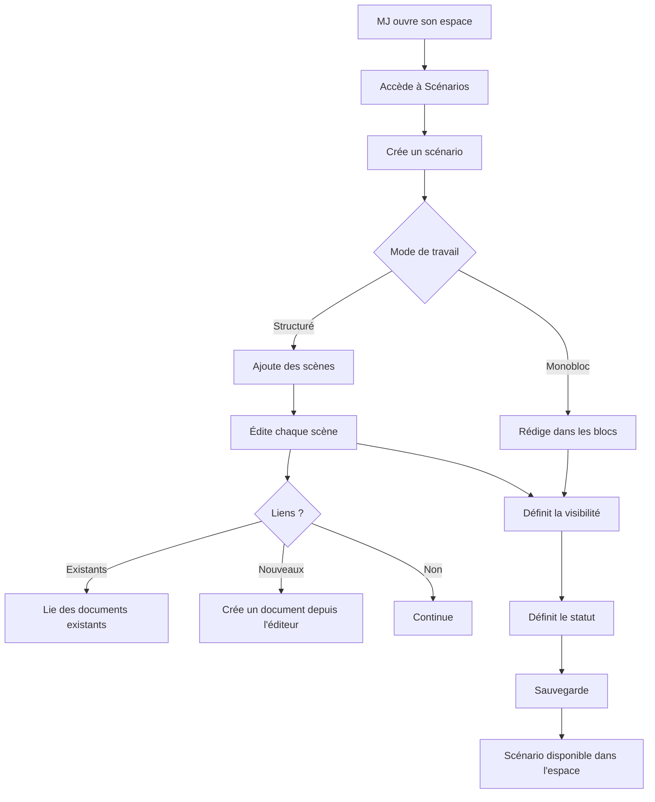
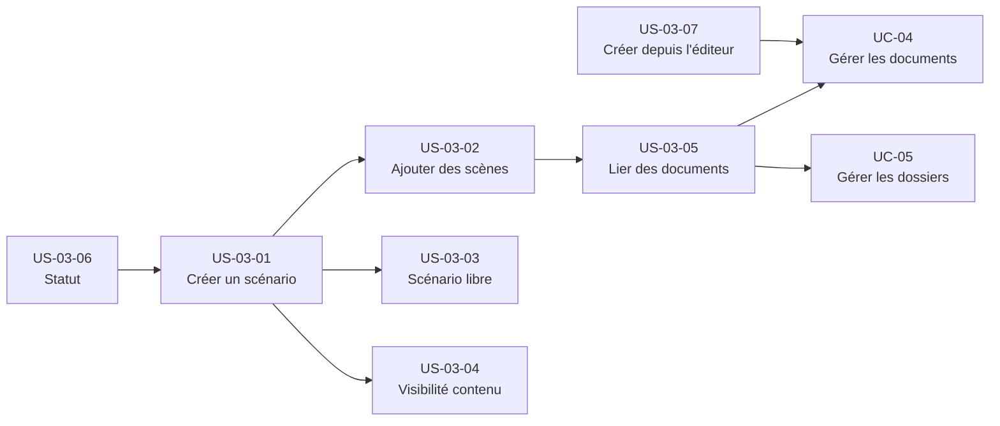

# Epic — Structurer un scénario

## Objectif utilisateur

Permettre au MJ de préparer un scénario utilisable en session : création, structuration en scènes, visibilité du contenu, liens vers d'autres documents, gestion du statut.

---

## Personas concernés

| Persona | Motivation principale |
|---|---|
| Émilie | Écrire librement, sans structure imposée |
| Antoine | Structurer en scènes, lier des PNJ et des lieux |
| Nadia | Préparer vite, sans configuration |
| Sonia | Créer des scénarios réutilisables |
| Thomas | Contrôler la structure librement |

---

## Use cases couverts

- **UC-03** — Structurer un scénario
  - Nominal : création complète avec scènes
  - A1 : scénario libre sans découpage
  - A2 : lier des éléments existants
  - A3 : créer un élément depuis l'éditeur
  - A4 : scénario improvisé minimal

---

## Priorité MoSCoW

| Priorité | Stories |
|---|---|
| Must Have | US-03-01, US-03-02, US-03-03, US-03-04 |
| Should Have | US-03-05, US-03-06, US-03-07 |
| Could Have | — |
| Won't Have (MVP) | Visibilité par bloc |

---

## Bounded contexts pressentis

- **Bibliothèque de contenu** — toutes les stories (documents, dossiers, liens entre documents)

---

## Vue d'ensemble Mermaid



---

## Dépendances Mermaid



---

## User stories

### US-03-01 — Créer un scénario dans un espace

**Priorité** : Must Have

**En tant que** MJ,  
**je veux** créer un scénario dans mon espace,  
**afin de** disposer d'un document de préparation rattaché à cet espace.

**Notes de conception** :
- Un scénario est un document scénario placé dans le dossier système "Scénarios" (`isSystem=true`).
- Seul le titre est obligatoire. Résumé, contexte et objectif narratif sont des champs optionnels, stockés dans les propriétés du type `SCENARIO` ou en blocs libres.
- Couvre le cas A4 (scénario improvisé) : une création minimale avec titre uniquement est un usage valide.

**Règles métier** :
- RB-03-01 : Le titre est le seul champ obligatoire à la création d'un scénario. Résumé, contexte et objectif narratif sont optionnels.
- RB-03-02 : Un scénario créé avec titre uniquement est valide et fonctionnel (scénario improvisé, cas A4).

**Critères d'acceptation** :

```gherkin
Scenario: Créer un scénario avec titre uniquement
  Given le MJ est dans la vue de son espace, section Scénarios
  When il crée un scénario en saisissant uniquement un titre
  Then le scénario est créé et apparaît dans la liste des scénarios de l'espace

Scenario: Le titre est le seul champ obligatoire
  Given le MJ est dans le formulaire de création de scénario
  When il soumet le formulaire sans remplir les champs optionnels (résumé, contexte, objectif)
  Then le scénario est créé sans erreur

Scenario: Un scénario improvisé minimal est valide (A4)
  Given le MJ crée un scénario avec titre uniquement
  When la création est confirmée
  Then le scénario est fonctionnel et accessible dans l'espace sans configuration supplémentaire
```

- [ ] Le MJ peut créer un scénario depuis la vue de son espace (section Scénarios).
- [ ] Le titre est le seul champ obligatoire à la création.
- [ ] Le scénario est visible dans la liste des scénarios de l'espace après création.
- [ ] Un scénario créé avec titre uniquement est valide (A4 couvert).

---

### US-03-02 — Ajouter et ordonner des scènes dans un scénario

**Priorité** : Must Have

**En tant que** MJ,  
**je veux** ajouter des scènes à mon scénario et les ordonner,  
**afin de** structurer ma session en étapes distinctes.

**Notes de conception** :
- Une scène est un document de scène relié à un scénario.
- L'ordre des scènes est porté par ordre des scènes.
- Une scène peut elle-même contenir des lien entre documents vers des PNJ, lieux, etc.
- Ajouter une scène = créer un document scène + appeler création d'un lien entre documents sur le scénario.
- Supprimer une scène du scénario = supprimer le lien entre documents, pas le document. Le document scène peut subsister comme document orphelin ou être supprimé séparément.

**Règles métier** :
- RB-03-03 : Les scènes d'un scénario s'affichent dans l'ordre défini par "ordre des scènes".
- RB-03-04 : Supprimer une scène d'un scénario supprime le lien entre le scénario et la scène ; le document de scène n'est pas supprimé automatiquement.
- RB-03-05 : Un scénario peut contenir zéro scène.

**Critères d'acceptation** :

```gherkin
Scenario: Ajouter une scène à un scénario existant
  Given le MJ est dans l'éditeur d'un scénario existant
  When il ajoute une nouvelle scène
  Then la scène apparaît dans le scénario à la position attendue

Scenario: Les scènes respectent l'ordre défini
  Given un scénario avec plusieurs scènes ordonnées
  When le MJ consulte le scénario
  Then les scènes s'affichent dans l'ordre défini par "ordre des scènes"

Scenario: Modifier le titre et le contenu d'une scène
  Given le MJ est dans l'éditeur d'une scène
  When il modifie le titre et le contenu
  Then les modifications sont sauvegardées et visibles dans le scénario

Scenario: Supprimer une scène du scénario
  Given un scénario contenant une scène
  When le MJ supprime cette scène du scénario
  Then le lien entre la scène et le scénario est supprimé
  And le document de scène n'est pas supprimé automatiquement

Scenario: Un scénario peut contenir zéro scène
  Given un scénario sans aucune scène ajoutée
  When le MJ consulte ce scénario
  Then le scénario est valide et fonctionnel
```

- [ ] Le MJ peut ajouter une ou plusieurs scènes à un scénario existant.
- [ ] Les scènes s'affichent dans l'ordre défini par ordre des scènes.
- [ ] Le MJ peut modifier le titre et le contenu d'une scène.
- [ ] Le MJ peut supprimer une scène du scénario.
- [ ] Un scénario peut contenir zéro scène (cohérent avec US-03-03).

---

### US-03-03 — Écrire un scénario libre sans découpage en scènes

**Priorité** : Must Have

**En tant que** MJ,  
**je veux** écrire mon scénario comme un document monobloc, sans scènes,  
**afin de** préparer librement sans contrainte de structure.

**Notes de conception** :
- Un scénario libre = document scénario avec `documents liés = []` et tout le contenu dans les blocs.
- C'est le mode par défaut recommandé pour Émilie et Nadia.
- Le MJ peut commencer libre et ajouter des scènes plus tard (évolution non destructive).
- Aucune contrainte de structure n'est imposée par le.

**Règles métier** :
- RB-03-06 : Un scénario libre, sans scène, est valide et fonctionnel.
- RB-03-07 : Le MJ peut ajouter des scènes à un scénario libre a posteriori, sans perte du contenu existant.

**Critères d'acceptation** :

```gherkin
Scenario: Écrire un scénario monobloc sans scènes
  Given le MJ a créé un scénario
  When il rédige du contenu libre dans les blocs du scénario sans ajouter de scènes
  Then le scénario est valide et accessible dans l'espace

Scenario: Ajouter des scènes à un scénario libre a posteriori
  Given un scénario existant sans aucune scène
  When le MJ décide d'y ajouter des scènes
  Then les scènes sont ajoutées sans perte du contenu libre existant
```

- [ ] Le MJ peut créer un scénario et y écrire du contenu libre sans ajouter de scènes.
- [ ] Un scénario sans scènes est valide et fonctionnel.
- [ ] Le MJ peut ultérieurement ajouter des scènes à un scénario qui en avait zéro.

---

### US-03-04 — Distinguer le contenu privé du contenu partageable dans une scène

**Priorité** : Must Have

**En tant que** MJ,  
**je veux** ajouter des révélations joueurs à une scène sans mélanger mes notes privées de MJ,  
**afin de** préparer le contenu partageable directement depuis l'éditeur de scène, en gardant mes notes pour moi.

**Notes de conception** :
- Approche retenue : **Option A — deux documents liés**. Le document de scène principal reste privé MJ (notes privées, préparation MJ). Quand le MJ veut préparer du contenu à révéler aux joueurs, il crée un document lié à la scène avec `visibility = visible par les joueurs` (ou privé MJ jusqu'à révélation via UC-08).
- L'UX doit masquer la complexité des deux documents : un bouton "Ajouter une révélation" dans l'éditeur de scène crée et lie automatiquement ce document sans que le MJ ait à gérer manuellement la création. Le MJ ne voit pas qu'il crée deux documents — il voit une section "Révélations joueurs" dans sa scène.
- Le contenu privé reste dans le document de scène (privé MJ). Le contenu partageable est un document distinct lié à la scène.
- visible par les joueurs signifie accessible en permanence aux joueurs — ce n'est pas un partage temporaire. La révélation pendant une session est gérée par UC-08.
- Ce choix impacte directement la vue session (UC-06) : la surface de partage est au niveau document.

**Règles métier** :
- RB-03-08 : Un document de scène est privé MJ par défaut.
- RB-03-09 : Le contenu destiné aux joueurs (révélation) est porté par un document distinct lié à la scène, avec sa propre visibilité.

**Critères d'acceptation** :

```gherkin
Scénario : Le MJ ajoute une révélation depuis l'éditeur de scène
  Étant donné que le MJ édite une scène de son scénario
  Quand il clique sur "Ajouter une révélation"
  Alors un document lié à la scène est créé automatiquement avec visibility = privé MJ
  Et ce document apparaît dans la section "Révélations joueurs" de l'éditeur de scène
  Et le MJ peut y écrire le contenu destiné aux joueurs

Scénario : Le contenu privé et le contenu partageable sont bien séparés
  Étant donné que le MJ a une scène avec des notes privées et une révélation joueurs
  Alors le document de scène principal est privé MJ
  Et le document de révélation est un document distinct lié à la scène
  Et un joueur connecté ne voit pas le contenu du document de scène privé MJ
```

- [ ] Un document de type `SCENE` est créé avec la visibilité privé MJ par défaut.
- [ ] Le bouton "Ajouter une révélation" crée et lie automatiquement un document de révélation à la scène courante.
- [ ] Le MJ voit la section "Révélations joueurs" dans l'éditeur de scène sans manipuler manuellement la création du document lié.
- [ ] Un document lié à une scène peut avoir une visibilité différente de la scène elle-même.

---

### US-03-05 — Lier des documents existants à un scénario ou une scène

**Priorité** : Should Have

**En tant que** MJ,  
**je veux** lier des PNJ, lieux ou notes existants à mon scénario ou à une scène,  
**afin de** centraliser les références sans dupliquer le contenu.

**Notes de conception** :
- Lier = appeler création d'un lien entre documents sur le document source (scénario ou scène).
- Les documents liés peuvent être de n'importe quel type : `NPC`, `LOCATION`, `NOTE`, etc.
- Les backlinks (ex. : quels scénarios référencent ce PNJ) sont calculés en lecture — ils ne sont pas stockés dans le modèle fonctionnel.
- Dépend de UC-04 (les documents liés doivent exister) et UC-05 (navigation dans les dossiers pour sélectionner un document).

**Critères d'acceptation** :

```gherkin
Scenario: Lier un document existant à un scénario
  Given le MJ est dans l'éditeur d'un scénario
  When il recherche et sélectionne un document existant de l'espace pour le lier
  Then le document apparaît dans la liste des documents liés du scénario

Scenario: Lier un document existant à une scène
  Given le MJ est dans l'éditeur d'une scène
  When il recherche et sélectionne un document existant de l'espace pour le lier
  Then le document apparaît dans la liste des documents liés de la scène

Scenario: Supprimer un lien sans supprimer le document cible
  Given un scénario avec un document lié (ex. un PNJ)
  When le MJ supprime ce lien depuis l'éditeur
  Then le lien est supprimé
  And le document cible (PNJ) n'est pas supprimé et reste accessible dans l'espace

Scenario: Voir les backlinks depuis la fiche d'un PNJ
  Given un PNJ référencé dans un ou plusieurs scénarios
  When le MJ consulte la fiche du PNJ
  Then il voit la liste des scénarios qui référencent ce PNJ
```

- [ ] Le MJ peut rechercher et lier un document existant de l'espace à un scénario.
- [ ] Le MJ peut rechercher et lier un document existant de l'espace à une scène.
- [ ] Les documents liés sont visibles depuis l'éditeur du scénario/de la scène.
- [ ] Le MJ peut supprimer un lien sans supprimer le document cible.
- [ ] Depuis la fiche d'un PNJ, le MJ peut voir les scénarios qui le référencent (backlinks).

---

### US-03-06 — Gérer le statut d'un scénario

**Priorité** : Should Have

**En tant que** MJ,  
**je veux** attribuer un statut à mon scénario (brouillon, prêt, joué, archivé),  
**afin de** suivre l'état de préparation de mes scénarios.

**Notes de conception** :
- Les statuts ne sont pas un champ du document actuel.
- Option A : stocker dans propriétés structurées du type `SCENARIO` — moins intrusif, prévu pour des métadonnées spécifiques au type.
- Option B : ajouter un champ statut au niveau du document — plus générique, applicable à d'autres types.
- Recommandation : option A (propriétés structurées du type `SCENARIO`) pour le MVP.

**Option A arrêtée** : les statuts sont dans propriétés structurées du type `SCENARIO` (voir section Questions ouvertes, item 2, pour la rationale complète : choix aligné ADR-002 et content-library).

**Règles métier** :
- RB-03-10 : Un scénario porte un statut parmi brouillon, prêt, joué, archivé, stocké dans les propriétés structurées du type `SCENARIO`.
- RB-03-11 : Le statut par défaut à la création est "brouillon".

**Critères d'acceptation** :

```gherkin
Scenario: Définir le statut d'un scénario
  Given le MJ est dans l'éditeur ou la fiche d'un scénario
  When il choisit un statut parmi : brouillon, prêt, joué, archivé
  Then le statut est enregistré et visible dans la liste des scénarios de l'espace

Scenario: Statut par défaut à la création
  Given le MJ crée un scénario sans choisir de statut explicite
  When le scénario est créé
  Then son statut est "brouillon" par défaut

Scenario: Filtrer les scénarios par statut
  Given le MJ consulte la liste des scénarios de son espace
  When il applique un filtre sur un statut donné (ex. "prêt")
  Then seuls les scénarios ayant ce statut sont affichés
```

- [ ] Le MJ peut définir le statut d'un scénario parmi : brouillon, prêt, joué, archivé.
- [ ] Le statut est visible dans la liste des scénarios de l'espace.
- [ ] Le MJ peut filtrer ou identifier ses scénarios par statut.
- [ ] Un scénario créé sans statut explicite est en "brouillon" par défaut.

---

### US-03-07 — Créer un document depuis l'éditeur de scénario

**Priorité** : Should Have

**En tant que** MJ,  
**je veux** créer un PNJ ou une note directement depuis l'éditeur de mon scénario,  
**afin de** capturer un élément à la volée sans quitter ma préparation.

**Notes de conception** :
- Créer depuis l'éditeur = créer un document du type choisi + ajouter automatiquement un lien entre documents depuis le scénario ou la scène courante.
- Logique identique à UC-07 (création à la volée) mais en mode préparation — pas en session LIVE.
- Le document créé est placé dans le dossier correspondant à son type dans l'espace.
- Dépend de UC-04.

**Règles métier** :
- RB-03-12 : Un document créé depuis l'éditeur de scénario ou de scène est automatiquement lié au scénario ou à la scène courante.
- RB-03-13 : Le document créé depuis l'éditeur est placé dans le dossier correspondant à son type dans l'espace.

**Critères d'acceptation** :

```gherkin
Scenario: Créer un document à la volée depuis l'éditeur de scénario
  Given le MJ est dans l'éditeur d'un scénario ou d'une scène
  When il crée un nouveau document d'un type donné (ex. NPC) depuis l'éditeur
  Then le document est créé et automatiquement lié au scénario ou à la scène courante
  And le document est accessible depuis son dossier de type dans l'espace
```

- [ ] Le MJ peut créer un document d'un type donné (ex. NPC) depuis l'éditeur de scénario.
- [ ] Le document créé est automatiquement lié au scénario ou à la scène courante.
- [ ] Le document créé est accessible depuis son dossier de type dans l'espace.

---

## Stories exclues ou repoussées

| Story / Feature | Raison |
|---|---|
| Visibilité par bloc (privé MJ sur un bloc de contenu) | Non supportée en MVP — la visibilité est au niveau document. Décision prise : Option A (deux documents liés via bouton "Ajouter une révélation"). |
| Réordonnancement par drag-and-drop des scènes | UX définie en wireframe (`editeur-scenario.md`). Mécanique retenue : **déplacement explicite** (annoncé assistivement, NFR-ACC-02 ; hérite du réordonnancement de blocs, NFR-ACC-01). L'ordre fonctionnel est porté par `DocumentLink.order`. |
| Partage temporaire d'un contenu pendant une session | Couvert par UC-08 (révélation en session), hors périmètre UC-03. |
| Duplication d'un scénario | Non défini dans UC-03, à envisager dans une version ultérieure. |

---

## Ordre de livraison recommandé

1. **US-03-01** — Créer un scénario (socle, bloque tout le reste)
2. **US-03-03** — Scénario libre (valeur immédiate pour Émilie et Nadia, coût faible)
3. **US-03-02** — Ajouter des scènes (Antoine, Thomas)
4. **US-03-04** — Visibilité contenu (nécessaire avant UC-06)
5. **US-03-06** — Statut (Should Have, peu de dépendances)
6. **US-03-05** — Lier des documents existants (dépend UC-04, UC-05)
7. **US-03-07** — Créer depuis l'éditeur (dépend UC-04, valeur additionnelle)

---

## Vérification de couverture

| Cas UC-03 | Story couvrant |
|---|---|
| Nominal — création complète avec scènes | US-03-01 + US-03-02 |
| A1 — scénario libre | US-03-03 |
| A2 — lier des éléments existants | US-03-05 |
| A3 — créer un élément depuis l'éditeur | US-03-07 |
| A4 — scénario improvisé minimal | US-03-01 (création minimale) |
| Statuts | US-03-06 |
| Contenu privé vs partageable | US-03-04 |

---

## Questions ouvertes

1. **Visibilité par bloc** : DÉCIDÉ — Option A (deux documents liés). L'UX crée et lie le document de révélation automatiquement via un bouton dédié. La visibilité par bloc n'est pas supportée en MVP.
2. **Statuts** : DÉCIDÉ — Option A arrêtée. `scenarioStatus` (enum `DRAFT|READY|PLAYED|ARCHIVED`, défaut `DRAFT`) dans `Document.properties` du type `SCENARIO`. Rationale : propriétés structurées = seul chemin d'écriture validé (ADR-002) ; champ générique ne s'applique qu'aux scénarios, non aux autres types (NOTE, PNJ, LIEU).
3. **Réordonnancement des scènes** : DÉCIDÉ — Mécanique = **déplacement explicite** (wireframe `editeur-scenario.md` ; NFR-ACC-02 annonce assistive, hérite NFR-ACC-01 ; drag-and-drop *pur* écarté). L'ordre fonctionnel est porté par `DocumentLink.order`.
4. **Scène multi-scénarios** : DÉCIDÉ — multi-parent autorisé nativement. Une scène = `Document` type SCENE, liée via `DocumentLink` par plusieurs scénarios (cardinalité n↔n). Sémantique : « **Ajouter une scène** » (US-03-02) crée **toujours une scène fraîche possédée** (create+link) ; le **partage** n'est atteignable que via « **lier un document existant** » (US-03-05, où SCENE devient cible éligible) — ce chemin **expose l'intention** de liaison. Supprimer une scène d'un scénario = supprimer le **lien**, pas le document (la scène survit pour l'autre scénario). Le **backlink calculé** « référencée par N scénarios » doit être visible en lecture sur la fiche de la scène.
