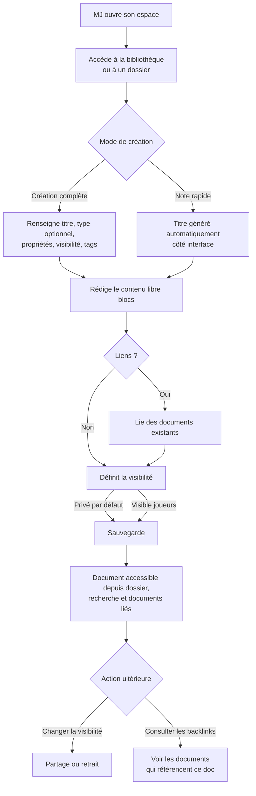
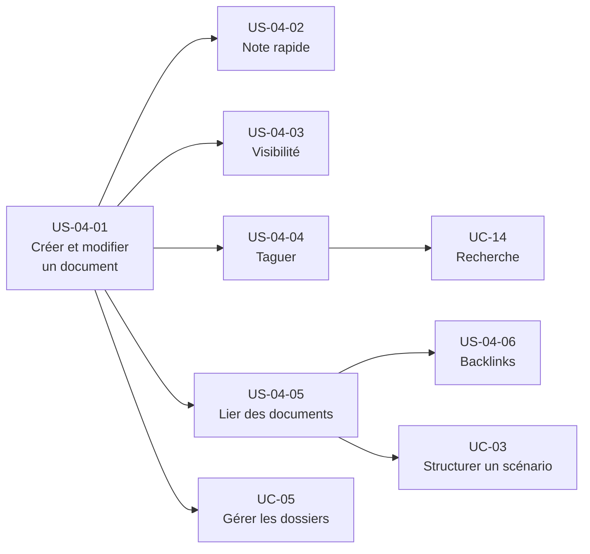

# Epic — Créer et gérer des documents d'espace modulaires

## Objectif utilisateur

Permettre au MJ de créer, modifier, organiser, retrouver et éventuellement partager des documents
d'espace modulaires : notes libres, scénarios, scènes, lore, lieux, PNJ, personnages joueurs,
objets, factions, aides de jeu, rappels ou idées. Les notes sont un usage particulier du document
d'espace : le type est une aide optionnelle, la structure reste libre en blocs.

---

## Personas concernés

| Persona | Motivation principale |
|---|---|
| Émilie | Capturer vite, note rapide en 2 touches, réorganiser après |
| Antoine | Créer des documents détaillés avec types et propriétés, lier ses documents |
| Nadia | Peu de création, mais retrouver ses documents après 6 semaines d'absence |
| Thomas | Backlinks et organisation libre style Obsidian |
| Rémi | Usage partiel, léger, utile sans reconstruire toute sa campagne |
| Sonia | Documents ponctuels réutilisables ou liés à un scénario one-shot |

---

## Use cases couverts

- **UC-04** — Créer et gérer des documents d'espace modulaires
  - Nominal : création complète avec blocs, type optionnel, propriétés, visibilité, tags et liens
  - A1 : note rapide sans titre (titre généré côté interface)
  - A2 : document typé
  - A3 : document créé depuis un template
  - A4 : changement de visibilité après création
  - A5 : document durable utilisé pendant une session

---

## Priorité MoSCoW

| Priorité | Stories |
|---|---|
| Must Have | US-04-01, US-04-02, US-04-03 |
| Should Have | US-04-04, US-04-05 |
| Could Have | US-04-06 |
| Won't Have (MVP) | Partage sélectif par joueur |

---

## Bounded contexts pressentis

- Création et modification des documents d'espace
- Classement dans les dossiers
- Liens entre documents
- Tags, recherche et visibilité

---

## Vue d'ensemble Mermaid



---

## Dépendances Mermaid



---

## User stories

### US-04-01 — Créer et modifier un document d'espace

**Priorité** : Must Have

**En tant que** MJ,  
**je veux** créer un document modulaire dans mon espace, y rédiger un contenu libre en blocs
et le modifier à tout moment,  
**afin de** disposer d'un espace durable pour représenter mes éléments sans structure imposée.

**Notes de conception** :
- Le type de document est optionnel. Les types proposés peuvent inclure note, PNJ, lieu,
  personnage joueur, scénario, scène, note de session ou révélation.
- UC-04 porte le modèle documentaire général. Les workflows narratifs des scénarios et scènes
  restent dans UC-03 ; les notes de session restent dans UC-06/UC-07.
- Le dossier d'accueil dépend du point d'entrée : dossier courant, dossier système adapté, dossier "Notes" pour une note rapide, ou dossier virtuel "Non classés" si aucun dossier explicite n'est choisi.
- Un document créé est privé par défaut.
- La suppression MVP masque le document de l'espace actif sans imposer de suppression physique immédiate.
- Le contenu est structuré en blocs libres. Aucune contrainte de format n'est imposée.
- Les propriétés structurées dépendent du type et ne remplacent jamais les blocs.

**Règles métier** :
- RB-04-01 : Un document créé est privé par défaut.
- RB-04-02 : Le MJ peut supprimer un document durable de son espace actif.
- RB-04-03 : Un document peut être déplacé dans n'importe quel dossier de l'espace après création.
- RB-04-04 : Un document peut rester libre, sans type.
- RB-04-05 : Un document typé conserve un corps libre en blocs.

**Critères d'acceptation** :
- [ ] Le MJ peut créer un document depuis la bibliothèque, un dossier ou un raccourci de création.
- [ ] Le titre est le seul champ obligatoire à la création.
- [ ] Le type, les propriétés, les tags et la visibilité sont optionnels à la création.
- [ ] Un document créé sans configuration explicite est privé.
- [ ] Le MJ peut modifier le titre, les blocs, les propriétés et le type d'un document existant.
- [ ] Un document supprimé n'est plus visible dans l'espace actif (suppression logique).

```gherkin
Scénario : Le MJ supprime un document
  Étant donné que le MJ dispose d'un document visible dans son espace
  Quand il choisit de supprimer ce document
  Alors le document est masqué de la bibliothèque active
  Et il n'apparaît plus dans les listes courantes

Scénario : Le MJ déplace un document vers un autre dossier
  Étant donné que le MJ dispose d'un document dans un dossier
  Quand il déplace ce document vers un autre dossier de l'espace
  Alors le document apparaît dans le dossier cible
  Et le document n'apparaît plus dans le dossier source
```

---

### US-04-02 — Créer une note rapide sans configuration

**Priorité** : Must Have

**En tant que** MJ,  
**je veux** créer une note immédiatement sans remplir de formulaire,  
**afin de** capturer une idée ou une information en session sans interrompre le jeu.

**Notes de conception** :
- La logique de titre généré est **interface uniquement** : le système conserve toujours un titre non vide.
- Format de titre suggéré : "Note — {date} {heure}" (ex. "Note — 15 mai 2026 21:34"), ou les N premiers caractères du contenu si l'utilisateur a saisi du texte avant de déclencher la sauvegarde.
- La note rapide est un document standard, pas un objet fonctionnel séparé. Elle est créée dans le dossier "Notes" par défaut.
- Le MJ peut renommer la note après création (couvert par US-04-01).
- Cible principale : Émilie (capture rapide) et Nadia/Rémi (faible configuration). L'objectif UX est d'atteindre l'éditeur en 2 interactions depuis la vue de l'espace ou depuis la vue session.

**Note de conception — intégration UC-06/UC-07** : L'accès depuis la vue session est un point
d'intégration avec le parcours de session. La note rapide durable reste un document d'espace.
Une note de session est créée dans le contexte d'une session et traitée par UC-06/UC-07.

**Critères d'acceptation** :
- [ ] Le MJ peut créer une note sans renseigner aucun champ.
- [ ] Un titre est généré automatiquement côté interface si aucun titre n'est fourni.
- [ ] La note est placée dans le dossier "Notes" par défaut.
- [ ] La note est un document standard : elle peut être retrouvée, modifiée et liée comme n'importe quel autre document.
- [ ] Le MJ peut renommer la note après création.
- [ ] La note rapide est accessible depuis la bibliothèque de l'espace ET depuis la vue session.

```gherkin
Scénario : Le MJ crée une note sans renseigner aucun champ
  Étant donné que le MJ accède à la création rapide de note
  Quand il valide sans renseigner de titre
  Alors la note est créée
  Et un titre est généré automatiquement côté interface

Scénario : La note rapide est placée dans le dossier "Notes" par défaut
  Étant donné que le MJ crée une note rapide sans choisir de dossier
  Quand la note est enregistrée
  Alors elle est placée dans le dossier "Notes" par défaut

Scénario : La note rapide est un document standard
  Étant donné que le MJ a créé une note rapide
  Alors elle peut être retrouvée, modifiée et liée comme n'importe quel autre document de l'espace
  Et le MJ peut la renommer après création

Scénario : La note rapide est accessible depuis la bibliothèque et depuis la vue session
  Étant donné que le MJ souhaite capturer une note rapide
  Quand il déclenche la création depuis la bibliothèque de l'espace ou depuis la vue session
  Alors la note est créée de la même façon dans les deux cas
```

---

### US-04-03 — Contrôler la visibilité d'un document

**Priorité** : Must Have

**En tant que** MJ,  
**je veux** définir si un document est privé ou visible par tous les membres de mon espace,  
**afin de** partager certains éléments avec mes joueurs tout en gardant mes notes pour moi.

**Notes de conception** :
- Le MJ peut rendre un document visible par les joueurs.
- Le MJ peut retirer ce partage et rendre le document à nouveau privé.
- Partage = tous les membres de l'espace et accès invités actifs. Pas de granularité par joueur en MVP — décision actée.
- Un document partagé reste accessible entre les sessions (pas un partage temporaire).
- Seul le MJ peut modifier la visibilité d'un document d'espace.
- Les notes personnelles joueur ne sont pas un flux actif du MJ dans UC-04.

**Critères d'acceptation** :

```gherkin
Scénario : Le MJ partage un document
  Étant donné que le MJ dispose d'un document privé
  Quand il choisit de partager ce document
  Alors le document devient visible par les joueurs
  Et le document est accessible par tous les membres de l'espace

Scénario : Le MJ retire le partage d'un document
  Étant donné que le MJ dispose d'un document partagé
  Quand il choisit de retirer le partage
  Alors le document redevient privé
  Et le document n'est plus visible par les joueurs

Scénario : Un joueur ne voit pas un document privé
  Étant donné qu'un document est privé
  Quand un joueur consulte la bibliothèque de l'espace
  Alors le document n'apparaît pas dans sa vue
```

- [ ] Le MJ peut définir la visibilité à la création.
- [ ] Le MJ peut modifier la visibilité d'un document existant.
- [ ] Un document privé n'est pas visible par les joueurs.
- [ ] Un document partagé est accessible par tous les membres actifs de l'espace.
- [ ] Seul le MJ peut modifier la visibilité d'un document d'espace.

---

### US-04-04 — Taguer un document

**Priorité** : Should Have — **confirmée** (arbitrage produit, cf. UC-04 § Tags)

**En tant que** MJ,  
**je veux** associer librement des tags à mes documents pour les organiser selon mes propres catégories,  
**afin de** structurer mon contenu comme je l'entends, indépendamment de tout dossier, type ou lien — et, une fois la recherche par tag disponible, de les retrouver par thème.

**Notes de conception** :
- **Résolution de l'arbitrage** : la fonction tag répond à un besoin propre d'organisation du MJ, indépendant de la recherche — le MJ en fait ce qu'il veut. Ce n'est pas une fonction subordonnée au filtrage en recherche : elle a sa propre valeur d'usage, même sans recherche par tag disponible. La priorité `Should Have` est confirmée sur cette base (UC-04 § Tags, § Règles métier).
- Les tags sont associés directement au document. Un document peut en porter zéro, un ou plusieurs.
- Le MJ crée librement de nouveaux tags à la volée depuis l'éditeur de document et les retire à tout moment ; aucune taxonomie, hiérarchie ou structure n'est imposée par l'application.
- Le filtrage par tag en recherche (UC-14 A3) reste `Could Have — hors MVP` : il constitue un usage complémentaire et différé des tags, pas leur justification. Un document sans tags reste pleinement utilisable.
- La gestion du référentiel de tags (création, suppression, renommage centralisés) est hors périmètre UC-04.
- **Trois sous-questions initialement ouvertes dans UC-04 sont désormais tranchées** (UC-04 § Règles métier) : un tag n'a pas de portée propre — c'est une valeur libre portée par le document, sans entité ni espace de nommage dédié — aucune limite de nombre n'est imposée, et la casse est normalisée (une même variante de casse d'un tag existant ne crée pas de doublon). Le scénario ci-dessous couvre le comportement observable de normalisation de casse.

**Critères d'acceptation** :
- [ ] Le MJ peut ajouter un ou plusieurs tags à un document à la création ou après, sans validation ni structure imposée.
- [ ] Le MJ peut retirer un tag d'un document à tout moment.
- [ ] Un document sans tags est pleinement fonctionnel.
- [ ] Les tags d'un document seront utilisables comme critères de filtrage dans la recherche une fois UC-14 A3 livré (`Could Have — hors MVP` ; non requis pour la valeur d'usage propre du tag).
- [ ] Une variante de casse d'un tag déjà porté par un document est reconnue comme ce même tag, sans créer de doublon.

```gherkin
Scénario : Le MJ ajoute un tag à un document
  Étant donné que le MJ dispose d'un document
  Quand il ajoute un tag à ce document
  Alors le tag est associé au document

Scénario : Le MJ retire un tag d'un document
  Étant donné qu'un document porte un tag
  Quand le MJ retire ce tag
  Alors le document n'est plus associé à ce tag

Scénario : Un document sans tags reste pleinement fonctionnel
  Étant donné qu'un document ne porte aucun tag
  Quand le MJ le consulte ou le modifie
  Alors le document est utilisable normalement

Scénario : Le MJ saisit une variante de casse d'un tag existant
  Étant donné qu'un document porte déjà un tag
  Quand le MJ ajoute à ce document le même tag saisi avec une casse différente
  Alors le document reste associé à un seul et même tag
  Et aucun tag distinct n'est créé
```

---

### US-04-05 — Lier un document à d'autres éléments d'espace

**Priorité** : Should Have

**En tant que** MJ,  
**je veux** lier mes documents entre eux,  
**afin de** naviguer entre un PNJ, ses scènes, ses notes associées, sans dupliquer le contenu.

**Notes de conception** :
- Le lien part d'un document vers un ou plusieurs autres documents.
- Exemples : PNJ vers scène, note vers scénario, lieu vers PNJ.
- Les documents liés peuvent être de n'importe quel type disponible dans l'espace.
- Complémentaire à US-03-05 qui lie depuis un scénario ou une scène vers d'autres documents.
- Dépend de UC-05 pour la navigation dans les dossiers lors de la sélection d'un document à lier.

**Critères d'acceptation** :
- [ ] Le MJ peut rechercher et lier un document existant de l'espace depuis la fiche d'un document.
- [ ] Les documents liés sont visibles depuis l'éditeur du document source.
- [ ] Le MJ peut supprimer un lien sans supprimer le document cible.
- [ ] Un document peut être lié à plusieurs autres documents simultanément.

```gherkin
Scénario : Le MJ lie un document existant depuis la fiche d'un document
  Étant donné que le MJ consulte la fiche d'un document
  Quand il recherche et sélectionne un document existant de l'espace pour le lier
  Alors le document apparaît dans la liste des documents liés

Scénario : Le MJ supprime un lien sans supprimer le document cible
  Étant donné qu'un document est lié à un autre document
  Quand le MJ supprime ce lien
  Alors le lien est supprimé
  Et le document cible n'est pas supprimé et reste accessible

Scénario : Un document peut être lié à plusieurs autres documents
  Étant donné que le MJ dispose d'un document
  Quand il lie ce document à plusieurs autres documents existants
  Alors tous les liens créés sont visibles depuis l'éditeur du document source
```

---

### US-04-06 — Consulter les backlinks d'un document

**Priorité** : Could Have

**En tant que** MJ,  
**je veux** voir quels documents référencent le document que je consulte,  
**afin de** naviguer dans le graphe de mon espace et comprendre les dépendances entre éléments.

**Notes de conception** :
- Les backlinks sont la liste des documents qui pointent vers le document courant.
- Performance à surveiller sur les PNJ très référencés.
- Valeur principale pour Thomas (graphe de relations style Obsidian).
- Dépend de US-04-05 : sans liens créés, il n'y a pas de backlinks à afficher.

**Critères d'acceptation** :
- [ ] Le MJ peut voir la liste des documents qui référencent le document courant.
- [ ] Les backlinks sont accessibles depuis la fiche du document (section dédiée ou panneau latéral).
- [ ] Un clic sur un backlink navigue vers le document source.
- [ ] Si aucun document ne référence le document courant, la section est vide (pas d'erreur).

```gherkin
Scénario : Le MJ consulte les backlinks d'un document
  Étant donné qu'un document est référencé par un ou plusieurs autres documents
  Quand le MJ consulte la fiche de ce document
  Alors il voit la liste des documents qui le référencent

Scénario : Le MJ navigue depuis un backlink
  Étant donné que le MJ consulte la liste des backlinks d'un document
  Quand il clique sur un backlink
  Alors il est redirigé vers le document source

Scénario : Un document sans backlink affiche une section vide
  Étant donné qu'aucun document ne référence le document courant
  Quand le MJ consulte la section backlinks
  Alors la section est vide et aucune erreur n'est affichée
```

---

## Stories exclues ou repoussées

| Story / Feature | Raison |
|---|---|
| Partage sélectif par joueur | Hors périmètre MVP. Le partage vise le groupe. Décision actée. |
| Workflow des notes de session | Couvert par UC-06/07. UC-04 garde le modèle général des documents d'espace. |
| Suppression physique définitive d'un document | Hors périmètre MVP. Le besoin métier décrit surtout le retrait de la bibliothèque active. |
| Déplacement d'un document entre dossiers | DÉCIDÉ : le déplacement de dossier est possible. Couvert par US-04-01 (RB-04-03). |
| Graphe de relations visuel | UX non définie. Les backlinks (US-04-06) posent le socle technique, la visualisation est une étape ultérieure. |
| Visibilité par bloc | Hors périmètre MVP. La visibilité est au niveau document ; un contenu joueur doit être un document lié. |

---

## Ordre de livraison recommandé

1. **US-04-01** — Créer et modifier un document (socle, bloque tout le reste)
2. **US-04-02** — Note rapide (valeur immédiate pour Émilie, coût faible)
3. **US-04-03** — Visibilité (nécessaire avant tout partage avec les joueurs)
4. **US-04-05** — Lier des documents (dépend US-04-01, valeur pour Antoine et Thomas)
5. **US-04-04** — Taguer (Should Have, valeur propre d'organisation MJ ; le filtrage en recherche via UC-14 A3 reste un complément différé, `Could Have — hors MVP`)
6. **US-04-06** — Backlinks (Could Have, dépend US-04-05)

---

## Vérification de couverture

| Cas UC-04 | Story couvrant |
|---|---|
| Nominal — création complète | US-04-01 + US-04-03 + US-04-04 + US-04-05 |
| A1 — note rapide sans titre | US-04-02 |
| A2 — document typé | US-04-01 |
| A3 — document depuis template | UC-05 + US-04-01 |
| A4 — changement de visibilité | US-04-03 |
| A5 — document utilisé en session | US-04-01 + UC-06/07 |
| Backlinks | US-04-06 |

---

## Questions ouvertes

1. **Suppression physique** : non retenue pour le MVP. Le besoin couvert est le retrait de la bibliothèque active.
2. **Déplacement de dossier** : DÉCIDÉ : le déplacement de dossier est possible.
3. **Note rapide depuis la vue session** : DÉCIDÉ : note rapide accessible depuis la bibliothèque et depuis la vue session.
