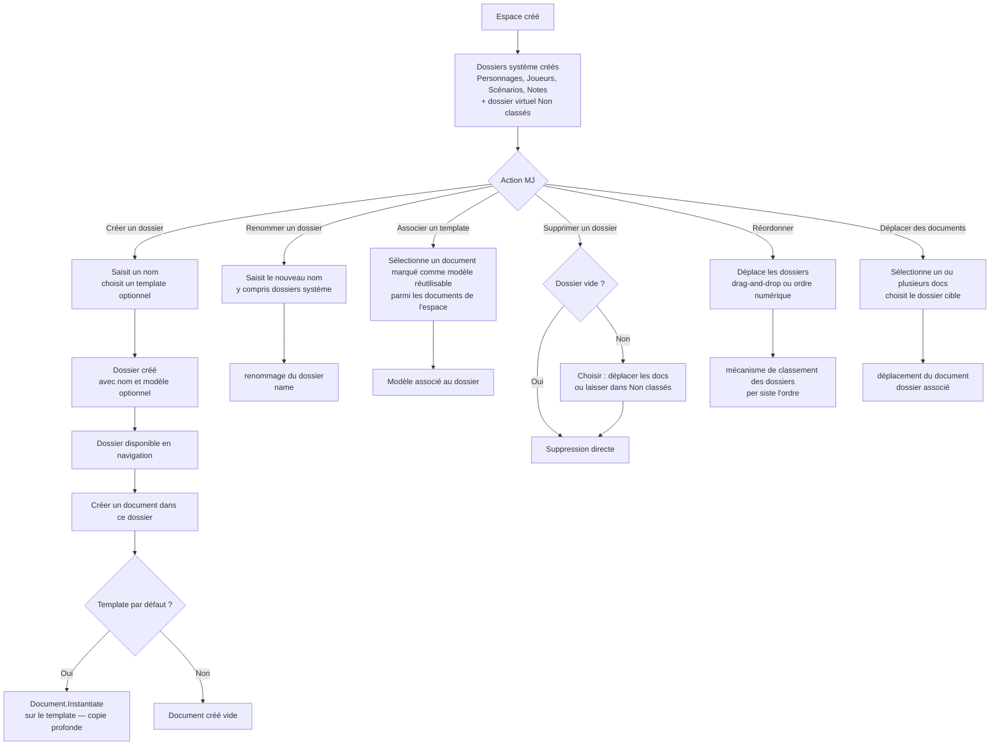
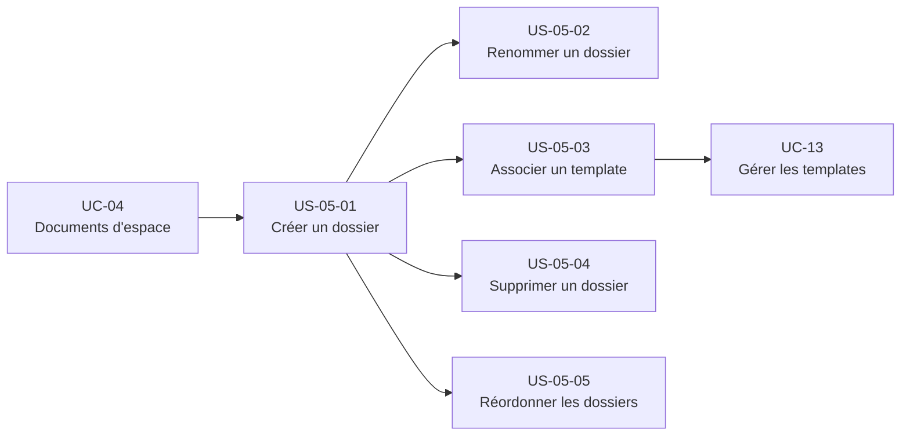

# Epic — Organiser le contenu en dossiers

## Objectif utilisateur

Permettre au MJ de structurer librement le contenu de son espace en dossiers nommés, d'associer un template par défaut pour accélérer la création de documents, et de déplacer des documents d'un dossier à l'autre. Les dossiers système créés automatiquement à la création de l'espace constituent le point de départ — ils sont renommables et supprimables comme n'importe quel dossier.

---

## Personas concernés

| Persona | Motivation principale |
|---|---|
| Antoine | Créer des dossiers thématiques (Factions, Indices, Objets), associer des templates, réordonner |
| Nadia | Utiliser les dossiers par défaut sans configuration, trouver ses documents sans effort |
| Thomas | Renommer les dossiers système pour adapter l'outil à sa logique (ex. "Factions" pour Blades in the Dark) |
| Émilie | Créer tout dans "Notes", déplacer les documents après coup |

---

## Use cases couverts

- **UC-05** — Organiser le contenu en dossiers
  - Nominal 1 : créer un dossier (nom + template optionnel)
  - Nominal 2 : associer un template par défaut à un dossier existant
  - Nominal 3 : déplacer un ou plusieurs documents vers un autre dossier
  - A1 : renommer un dossier (y compris système)
  - A2 : réordonner les dossiers
  - A3 : créer un document depuis un dossier (auto-placé + template appliqué)
  - A4 : document "non classé" → dossier virtuel invisible
  - A5 : dossier sans template → document créé vide
  - A6 : dossiers système créés à création d'espace

---

## Priorité MoSCoW

La priorité MoSCoW se lit exclusivement au grain du use case, dans `moscow.md`, qui distingue explicitement [§ UC-05 base — Organiser le contenu en dossiers (Must Have)](../vision/moscow.md) et [§ UC-05 riche — Dossiers et types de document élaborés (Should Have)](../vision/moscow.md) — seule autorité du corpus pour attribuer cette priorité (voir [`docs/conception/README.md`, § Ordre d'autorité entre artefacts](../../README.md), point 1 : les use cases sont la source de vérité du besoin, les user stories en dérivent et s'y conforment). Cette fiche ne répartit donc pas de priorité propre par story, et ne décide pas non plus quelle story relève de la base et laquelle relève de la couche riche : ce rattachement est une inférence que seule l'autorité de priorisation peut trancher — une fiche dérivée qui l'opérait recopierait une décision qu'elle n'a pas l'autorité de prendre, et qu'une révision ultérieure de `moscow.md` laisserait alors périmée ici sans le savoir.

---

## Bounded contexts pressentis

- **Bibliothèque de contenu** — toutes les stories (dossiers, documents, classement)

---

## Vue d'ensemble Mermaid



---

## Dépendances Mermaid



---

## User stories

### US-05-01 — Créer un dossier dans un espace

**En tant que** MJ,  
**je veux** créer un dossier nommé dans mon espace,  
**afin de** regrouper mes documents par thème ou catégorie.

**Notes de conception** :
- Création d'un dossier. Les sous-dossiers ne sont pas couverts par le MVP.
- `defaultTemplateDocumentId` est optionnel à la création. Il peut être défini plus tard via US-05-03.
- Un dossier appartient à exactement un espace — pas de partage inter-espaces.
- `isSystem = false` pour les dossiers créés manuellement par le MJ.
- L'ordre du nouveau dossier est ajouté en fin de liste par défaut.

**Règles métier** :
- RB-05-01 : Le nom est obligatoire et non vide.
- RB-05-02 : Un dossier appartient à un et un seul espace.
- RB-05-03 : Les sous-dossiers imbriqués sont hors périmètre MVP (`sous-dossier parent = null`).

**Critères d'acceptation** :
- [ ] Le MJ peut créer un dossier en saisissant uniquement un nom.
- [ ] La création est refusée si le nom est vide (E1).
- [ ] Le dossier créé apparaît immédiatement en navigation.
- [ ] Le MJ peut optionnellement associer un template à la création.
- [ ] L'ordre du nouveau dossier est défini en fin de liste.

```gherkin
Scénario : Le MJ crée un dossier avec un nom valide
  Étant donné que le MJ dispose d'un espace
  Quand il crée un dossier avec le nom "Factions"
  Alors le dossier "Factions" est créé dans l'espace
  Et il apparaît en navigation

Scénario : Le MJ tente de créer un dossier avec un nom vide
  Étant donné que le MJ dispose d'un espace
  Quand il soumet la création d'un dossier avec un nom vide
  Alors la création est refusée
  Et un message d'erreur est affiché (E1)
```

---

### US-05-02 — Renommer un dossier (y compris système)

**En tant que** MJ,  
**je veux** renommer n'importe quel dossier de mon espace, y compris les dossiers système,  
**afin d'** adapter les intitulés à mon système de jeu ou ma logique d'organisation.

**Notes de conception** :
- renommage du dossier.
- `isSystem = true` est informatif — il ne bloque ni le renommage ni la suppression. C'est une décision de conception actée.
- Le dossier virtuel "Non classés" (`isVirtual = true`) est non renommable — il est un mécanisme interne, invisible en navigation.
- Cas d'usage clé : Thomas renomme "Personnages" en "Factions" pour Blades in the Dark.

**Règles métier** :
- RB-05-01 : Le nom est obligatoire et non vide.
- RB-05-04 : Tous les dossiers visibles sont renommables, y compris les dossiers système.
- RB-05-05 : Le dossier virtuel "Non classés" n'est pas renommable.

**Critères d'acceptation** :
- [ ] Le MJ peut renommer un dossier créé manuellement.
- [ ] Le MJ peut renommer un dossier système (isSystem = true).
- [ ] Le renommage est refusé si le nouveau nom est vide (E1).
- [ ] Le dossier virtuel "Non classés" n'expose pas d'action de renommage.

```gherkin
Scénario : Le MJ renomme un dossier système
  Étant donné que l'espace dispose du dossier système "Personnages"
  Quand le MJ le renomme en "Factions"
  Alors le dossier s'appelle "Factions" en navigation
  Et son flag isSystem reste true

Scénario : Le MJ tente de renommer avec un nom vide
  Étant donné que le MJ dispose d'un dossier "Notes"
  Quand il soumet le renommage avec un nom vide
  Alors le renommage est refusé
  Et un message d'erreur est affiché
```

---

### US-05-03 — Associer un template par défaut à un dossier

**En tant que** MJ,  
**je veux** associer un template à un dossier pour que tout nouveau document créé dans ce dossier parte d'une structure prédéfinie,  
**afin de** gagner du temps sur les documents répétitifs (fiches PNJ, lieux, factions).

**Notes de conception** :
- association d'un modèle au dossier — pointe vers un document marqué comme modèle réutilisable.
- Lors de la création d'un document dans ce dossier : copie depuis le modèle est appelé sur le template → copie profonde indépendante. Le document créé n'est pas lié au template.
- Si le template est supprimé après association : `defaultTemplateDocumentId` passe à `null` sans erreur. Les documents existants (copies indépendantes) sont inchangés (E4).
- La création de templates (marqué comme modèle réutilisable) est hors périmètre UC-05. Le flow est à documenter dans UC-13.
- association d'un modèle au dossier retire l'association — les documents existants ne sont pas affectés.

**Règles métier** :
- RB-05-06 : Un dossier peut avoir 0 ou 1 template par défaut.
- RB-05-07 : Changer le template par défaut n'affecte pas les documents existants dans le dossier.
- RB-05-08 : Si le template est supprimé, `defaultTemplateDocumentId` passe à null. Les copies existantes sont inchangées.

**Critères d'acceptation** :
- [ ] Le MJ peut associer un template (marqué comme modèle réutilisable) à un dossier existant.
- [ ] Le MJ peut retirer l'association de template (remettre à null).
- [ ] Un document créé dans un dossier avec template part d'une copie profonde du template.
- [ ] Un document créé dans un dossier sans template est créé vide (A5).
- [ ] La suppression du template retire silencieusement l'association sans erreur (E4).
- [ ] Les documents existants ne sont pas modifiés lors du changement de template.

```gherkin
Scénario : Le MJ associe un template à un dossier
  Étant donné que le dossier "Factions" n'a pas de template
  Et que le document "Fiche Faction" est marqué comme modèle réutilisable
  Quand le MJ associe "Fiche Faction" comme template du dossier "Factions"
  Alors defaultTemplateDocumentId du dossier pointe vers "Fiche Faction"

Scénario : Création d'un document dans un dossier avec template
  Étant donné que le dossier "Factions" a un template associé
  Quand le MJ crée un nouveau document dans ce dossier
  Alors Document.Instantiate est appelé sur le template
  Et le nouveau document est une copie profonde indépendante

Scénario : Template supprimé après association
  Étant donné que le dossier "Factions" a un template associé
  Quand le template est supprimé
  Alors defaultTemplateDocumentId du dossier passe à null
  Et les documents existants dans le dossier sont inchangés
```

---

### US-05-04 — Supprimer un dossier

**En tant que** MJ,  
**je veux** supprimer un dossier dont je n'ai plus besoin,  
**afin de** garder une structure propre et lisible dans mon espace.

**Notes de conception** :
- E2 : suppression d'un dossier non vide → le MJ choisit entre (a) déplacer les documents vers un autre dossier, ou (b) laisser les documents dans "Non classés" (dossier virtuel).
- E3 : les dossiers système (`isSystem = true`) sont supprimables selon la même logique qu'E2. `isSystem` n'est pas une contrainte.
- Le dossier virtuel "Non classés" (`isVirtual = true`) est non supprimable — il est le filet de sécurité du système.
- dossier associé sur document est non-nullable : un document sans dossier explicite est rattaché au dossier virtuel.

**Règles métier** :
- RB-05-09 : La suppression d'un dossier non vide requiert de traiter les documents : déplacer ou laisser dans "Non classés".
- RB-05-10 : Les dossiers système sont supprimables. isSystem n'est pas une contrainte de suppression.
- RB-05-11 : Le dossier virtuel "Non classés" est non supprimable.

**Critères d'acceptation** :
- [ ] Le MJ peut supprimer un dossier vide directement.
- [ ] La suppression d'un dossier non vide propose : déplacer les documents ou les laisser dans "Non classés".
- [ ] Le MJ peut supprimer un dossier système (isSystem = true) selon la même logique.
- [ ] Le dossier virtuel "Non classés" n'expose pas d'action de suppression.
- [ ] Les documents laissés dans "Non classés" sont accessibles et non perdus.

```gherkin
Scénario : Le MJ supprime un dossier vide
  Étant donné que le dossier "Indices" est vide
  Quand le MJ le supprime
  Alors le dossier est supprimé
  Et il disparaît de la navigation

Scénario : Le MJ supprime un dossier non vide — option Non classés
  Étant donné que le dossier "Indices" contient 3 documents
  Quand le MJ le supprime et choisit "Laisser dans Non classés"
  Alors le dossier est supprimé
  Et les 3 documents sont rattachés au dossier virtuel Non classés

Scénario : Le MJ supprime un dossier non vide — option déplacer
  Étant donné que le dossier "Indices" contient 3 documents
  Quand le MJ le supprime et choisit de déplacer vers "Notes"
  Alors le dossier est supprimé
  Et les 3 documents se trouvent dans "Notes"

Scénario : Le MJ supprime un dossier système
  Étant donné que le dossier système "Scénarios" existe (isSystem = true)
  Quand le MJ le supprime
  Alors le dossier est supprimé selon la même logique qu'un dossier standard
```

---

### US-05-05 — Réordonner les dossiers

**En tant que** MJ,  
**je veux** modifier l'ordre d'affichage de mes dossiers,  
**afin de** mettre en avant les dossiers les plus utilisés et adapter la navigation à mon flux de travail.

**Notes de conception** :
- Le mécanisme de classement conserve l'ordre des dossiers.
- Question UX ouverte : drag-and-drop ou interface d'ordre numérique ? Voir questions ouvertes.
- L'ordre est propre à l'espace — pas partagé entre espaces.

**Règles métier** :
- RB-05-12 : L'ordre des dossiers est persisté par espace.

**Critères d'acceptation** :
- [ ] Le MJ peut modifier l'ordre des dossiers de son espace.
- [ ] L'ordre modifié est persisté et restauré à la prochaine ouverture de l'espace.
- [ ] Le dossier virtuel "Non classés" n'apparaît pas dans la liste ordonnée (invisible en navigation).

```gherkin
Scénario : Le MJ réordonne ses dossiers
  Étant donné que l'espace dispose de dossiers dans un ordre initial
  Quand le MJ modifie l'ordre des dossiers
  Alors le nouvel ordre est persisté
  Et la navigation reflète le nouvel ordre à la prochaine ouverture
```

---

## Stories exclues ou repoussées

| Story / Feature | Raison |
|---|---|
| Sous-dossiers imbriqués | Hors périmètre MVP. UC-05 ne couvre qu'un niveau de dossiers. |
| Création de templates (statut de modèle réutilisable) | Hors périmètre UC-05. Flow à documenter dans UC-13. |
| Drag-and-drop pour réordonner | Question UX ouverte. L'interface exacte n'est pas fixée en MVP. |

---

## Ordre de livraison recommandé

1. **US-05-01** — Créer un dossier (socle, nécessaire avant toute personnalisation)
2. **US-05-02** — Renommer un dossier (valeur immédiate pour Thomas et Antoine, coût faible)
3. **US-05-04** — Supprimer un dossier (complète le cycle de vie du dossier)
4. **US-05-03** — Associer un template (valeur pour Antoine, dépend de UC-13 pour les templates)
5. **US-05-05** — Réordonner (confort, pas bloquant)

---

## Vérification de couverture

| Cas UC-05 | Story couvrant |
|---|---|
| Nominal 1 — créer un dossier | US-05-01 |
| Nominal 2 — associer un template à un dossier existant | US-05-03 |
| Nominal 3 — déplacer des documents | US-04-01 RB-04-03 |
| A1 — renommer un dossier | US-05-02 |
| A2 — réordonner les dossiers | US-05-05 |
| A3 — créer un document depuis un dossier avec template | US-05-03 |
| A4 — document non classé → dossier virtuel | US-05-04 (E2/traitement) |
| A5 — dossier sans template → document vide | US-05-03 (critères) |
| A6 — dossiers système à la création d'espace | Initialisation automatique (hors stories MJ) |
| E1 — nom vide refusé | US-05-01, US-05-02 |
| E2 — suppression dossier non vide | US-05-04 |
| E3 — suppression dossier système | US-05-04 |
| E4 — template supprimé après association | US-05-03 |

---

## Questions ouvertes

1. DÉCIDÉ : pas de sous-dossiers en MVP. UC-05 couvre seulement les dossiers de premier niveau.
2. DÉCIDÉ : ordre numérique suffisant pour le MVP. Le drag-and-drop est post-MVP.
3. DÉCIDÉ : un template est un Document avec marqué comme modèle réutilisable. Le MJ marque n'importe quel document comme réutilisable et peut l'associer à un dossier. Flow complet documenté dans UC-13.
