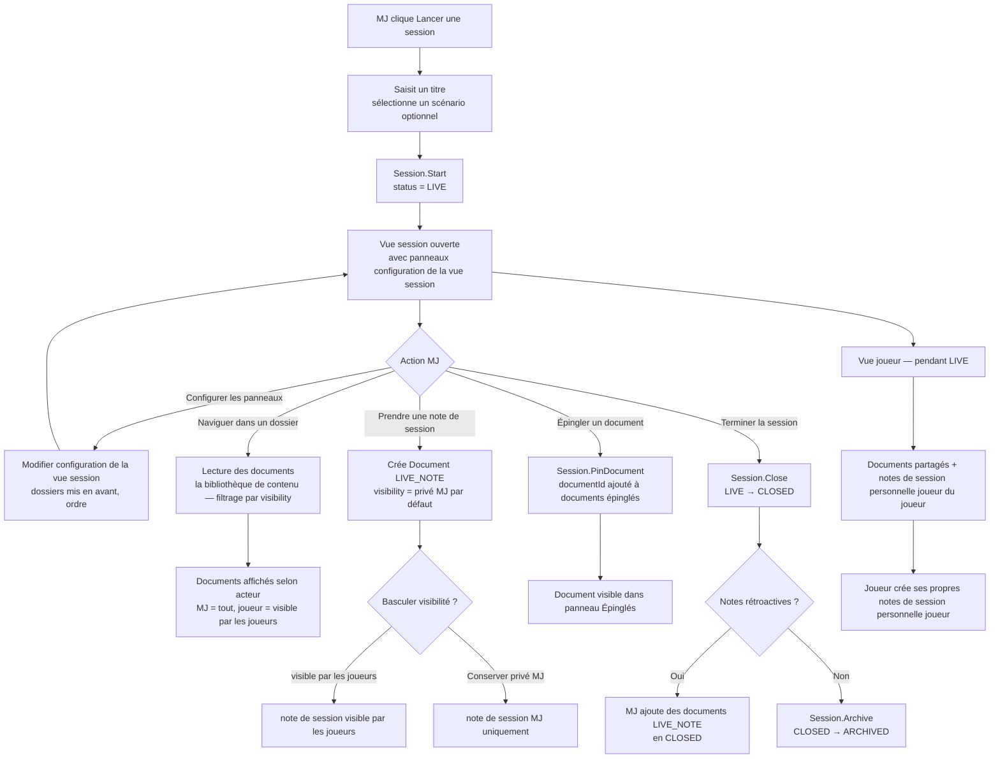
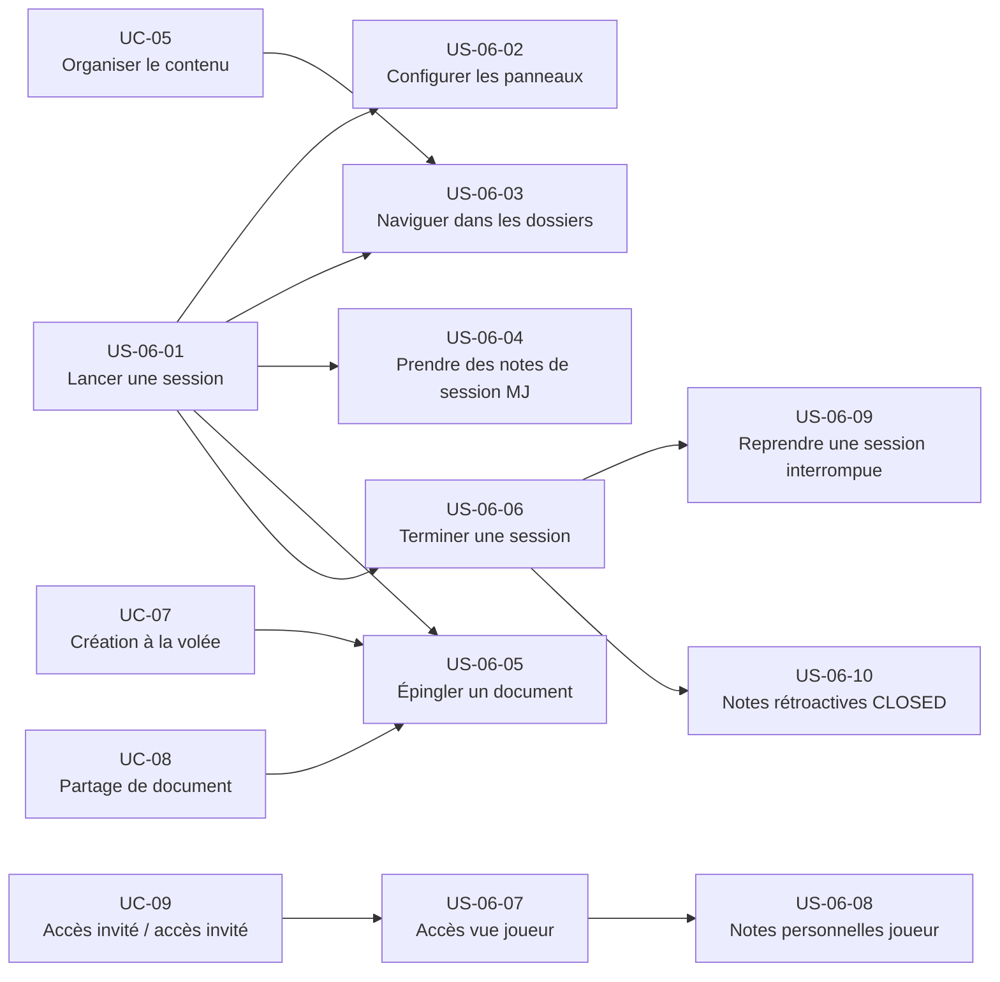

# Epic — Vue session (UC-06)

## Objectif utilisateur

Permettre au MJ de piloter une session de jeu depuis un tableau de bord configurable : lancement immédiat, accès aux documents de l'espace organisés par dossiers, prise de notes de session, épinglage de documents clés, partage avec les joueurs et fermeture propre de la session. La vue session est utilisable en mode local (sans compte) pour le MJ, et avec compte pour l'accès joueur.

---

## Personas concernés

| Persona | Motivation principale |
|---|---|
| Émilie | Lancer sans friction, prendre des notes de session rapidement, créer des PNJ à la volée |
| Thomas | Panneaux configurés avant la session, retrouver ses dossiers immédiatement |
| Nadia | Lancer en moins de 30 secondes, retrouver ses PNJ et notes sans effort |
| Sonia | Lancer depuis un scénario existant, session opérationnelle en 30 secondes |

---

## Use cases couverts

- **UC-06** — Vue session
  - Nominal 1 : lancement d'une session (avec ou sans scénario)
  - Nominal 2 : navigation dans les dossiers et documents pendant la session
  - Nominal 3 : prise de notes de session MJ et basculement de visibilité
  - Nominal 4 : épinglage d'un document
  - Nominal 5 : accès joueur à la vue partagée
  - Nominal 6 : fermeture de la session
  - A1 : lancement sans scénario (scénario improvisé)
  - A2 : modification de configuration de la vue session en direct
  - A3 : session CLOSED — notes rétroactives
  - A4 : épinglage automatique à la création à la volée ou au partage
  - E1 : perte de connexion pendant la saisie d'une note de session

---

## Priorité MoSCoW

La priorité MoSCoW se lit exclusivement au grain du use case, dans [`moscow.md`, § UC-06 — Utiliser la vue session](../vision/moscow.md) — seule autorité du corpus pour l'attribuer (voir [`docs/conception/README.md`, § Ordre d'autorité entre artefacts](../../README.md), point 1 : les use cases sont la source de vérité du besoin, les user stories en dérivent et s'y conforment). Cette fiche ne répartit donc pas de priorité propre par story : une répartition au grain story recopierait une valeur que seul `moscow.md` a l'autorité d'accorder, et qu'une révision ultérieure de ce document laisserait alors périmée ici sans le savoir.

---

## Bounded contexts pressentis

- **la conduite de session** — Session, configuration de la vue session, références aux documents de session
- **Bibliothèque de contenu** — dossiers, documents, notes de session

---

## Vue d'ensemble Mermaid



---

## Dépendances Mermaid



---

## User stories

### US-06-01 — Lancer une session

**En tant que** MJ,  
**je veux** lancer une session en saisissant un titre et en sélectionnant optionnellement un scénario,  
**afin d'** accéder immédiatement au tableau de bord de session.

**Notes de conception** :
- `Session.Start(espace associé, title, scenarioId?)` — crée la session directement en `LIVE`. Pas d'état intermédiaire PENDING.
- `scenarioId = null` est valide — scénario improvisé (A1).
- Mode local : session créée et stockée dans le stockage local du navigateur. Les notes de session joueurs ne sont pas disponibles en mode local.
- configuration de la vue session est chargée depuis l'espace si elle existe, ou initialisée avec les dossiers de l'espace dans leur ordre par défaut.

**Règles métier** :
- RB-06-01 : Le titre est obligatoire et non vide.
- RB-06-02 : La session est créée directement en `LIVE` — pas d'état PENDING.
- RB-06-03 : Le scénario est optionnel (`scenarioId = null` autorisé).
- RB-06-04 : En mode local, les notes de session joueurs et la vue joueur ne sont pas disponibles.

**Critères d'acceptation** :
- [ ] Le MJ peut lancer une session en saisissant uniquement un titre.
- [ ] La session est créée avec le statut `LIVE`.
- [ ] La vue session s'ouvre immédiatement avec les panneaux configuration de la vue session.
- [ ] Le MJ peut lancer une session sans scénario associé (A1).
- [ ] En mode local, la session reste accessible après fermeture et réouverture du navigateur.
- [ ] La création est refusée si le titre est vide.

```gherkin
Scénario : Le MJ lance une session avec un scénario
  Étant donné que le MJ dispose d'un espace avec un scénario "Nuit des Ombres"
  Quand il lance une session intitulée "Séance 3" avec ce scénario
  Alors la session est créée avec status = LIVE et scenarioId renseigné
  Et la vue session s'ouvre

Scénario : Le MJ lance une session sans scénario
  Étant donné que le MJ dispose d'un espace
  Quand il lance une session intitulée "Improvisation" sans sélectionner de scénario
  Alors la session est créée avec status = LIVE et scenarioId = null
  Et la vue session s'ouvre

Scénario : Lancement refusé si titre vide
  Étant donné que le MJ est sur l'écran de lancement
  Quand il soumet sans titre
  Alors la création est refusée et un message d'erreur est affiché
```

---

### US-06-02 — Configurer les panneaux de la vue session

**En tant que** MJ,  
**je veux** configurer les dossiers mis en avant dans la vue session et leur ordre,  
**afin de** disposer immédiatement des informations pertinentes lors de la session.

**Notes de conception** :
- La configuration est définie par espace, pas par session — elle persiste entre les sessions.
- Modifiable **à tout moment** : en mode édition sans session ET en direct pendant la session `LIVE`.
- Pas de panneau paramètres séparé — la config se fait directement dans la vue session.
- La vue session est accessible en mode édition sans lancer de session (pour configurer avant la partie).
- Sauvegarde automatique à chaque modification — pas de bouton "Enregistrer".
- Modifier la config en session ne ferme pas la session ni ne réinitialise son état.

**Règles métier** :
- RB-06-05 : La `SessionViewConfig` est sauvegardée automatiquement à chaque modification.
- RB-06-06 : La config est par espace — partagée entre toutes les sessions de l'espace.
- RB-06-07 : La config est initialisée avec les dossiers de l'espace si elle n'existe pas encore.
- RB-06-07b : La vue session est accessible en mode édition sans session active. Aucune `Session` n'est créée dans ce mode.

**Critères d'acceptation** :
- [ ] Le MJ peut ouvrir la vue session en mode édition sans lancer de session.
- [ ] Le MJ peut modifier les panneaux en direct pendant une session LIVE.
- [ ] Toute modification est sauvegardée automatiquement — pas de confirmation requise.
- [ ] La modification en session ne ferme pas ou ne réinitialise pas la session.
- [ ] L'ordre des dossiers est persisté et restauré à la session suivante.

```gherkin
Scénario : Le MJ configure ses panneaux sans lancer de session
  Étant donné que le MJ est sur son espace
  Quand il ouvre la vue session en mode édition
  Alors il peut ajouter, retirer et réordonner les panneaux de dossiers
  Et les modifications sont sauvegardées automatiquement
  Et aucune session n'est créée

Scénario : Le MJ modifie les panneaux en direct pendant une session LIVE
  Étant donné qu'une session est en status LIVE
  Quand le MJ modifie les panneaux depuis la vue session
  Alors la config est mise à jour immédiatement et sauvegardée automatiquement
  Et la session reste en LIVE sans interruption

Scénario : La config persiste entre deux sessions
  Étant donné que le MJ a configuré ses panneaux
  Quand il lance une nouvelle session
  Alors la même configuration est chargée automatiquement
```

---

### US-06-03 — Naviguer dans les dossiers pendant la session

**En tant que** MJ,  
**je veux** parcourir les dossiers et documents de mon espace depuis la vue session,  
**afin d'** accéder aux informations dont j'ai besoin sans quitter l'interface de session.

**Notes de conception** :
- la conduite de session **lit** le contenu depuis la bibliothèque de contenu — il ne le possède pas.
- Les documents sont filtrés par `visibility` selon l'acteur : MJ = tous les documents, joueur = documents partagés uniquement.
- Le type de document enrichit l'affichage condensé si renseigné (propriétés visibles en vue résumée).
- Les dossiers affichés correspondent aux dossiers mis en avant de configuration de la vue session. Les autres dossiers restent accessibles via la navigation secondaire ou la barre de recherche (UC-14).

**Règles métier** :
- RB-06-08 : Le MJ voit tous les documents de l'espace, quelle que soit leur visibilité, **sauf** les documents `PLAYER_PRIVATE` dont il n'est pas l'auteur — ceux-ci lui sont invisibles (ni lecture directe, ni énumération, ni métadonnées).
- RB-06-09 : Un joueur ne voit que les documents partagés.
- RB-06-10 : la conduite de session lit la bibliothèque de contenu — il n'en modifie pas le contenu.

**Critères d'acceptation** :
- [ ] Le MJ peut naviguer dans les dossiers configurés dans configuration de la vue session depuis la vue session.
- [ ] Les documents sont affichés avec leur vue condensée (titre, type, propriétés du type de document si renseigné).
- [ ] Le MJ voit tous les documents, y compris `GM_ONLY`, sauf les documents `PLAYER_PRIVATE` dont il n'est pas l'auteur.
- [ ] Un joueur ne voit que les documents avec `visibility = visible par les joueurs`.
- [ ] La navigation ne quitte pas la vue session.

```gherkin
Scénario : Le MJ consulte un dossier pendant la session
  Étant donné qu'une session est LIVE et que le dossier "PNJ" est dans dossiers mis en avant
  Quand le MJ ouvre le panneau "PNJ"
  Alors les documents du dossier sont affichés en vue condensée

Scénario : Le joueur ne voit pas les documents non publics
  Étant donné qu'une session est LIVE et que le document "Plan secret" a visibility != visible par les joueurs
  Quand le joueur consulte la vue joueur
  Alors "Plan secret" n'est pas affiché
```

---

### US-06-04 — Prendre des notes de session MJ

**En tant que** MJ,  
**je veux** prendre des notes rapides pendant la session et choisir si elles sont visibles par les joueurs,  
**afin de** tracer les événements importants et partager sélectivement avec ma table.

**Mapping de visibilité (référence implémentation)** :
- `privé MJ` dans ce document = `GM_ONLY` dans le domaine — lisible par `OWNER` et `GM`, invisible aux joueurs.
- `personnelle joueur` / `note personnelle joueur` dans ce document = `PLAYER_PRIVATE` dans le domaine — auteur seul (`createdById` / `guest_access_id`), **MJ exclu** (ADR-014 §Frontière fondamentale).
- `visible par les joueurs` dans ce document = `PUBLIC` dans le domaine.
- Ces deux valeurs (`GM_ONLY` et `PLAYER_PRIVATE`) sont distinctes et non interchangeables : un document `GM_ONLY` est lisible par le MJ ; un document `PLAYER_PRIVATE` ne l'est pas — y compris pour `OWNER`/`GM`.

**Notes de conception** :
- Une note de session est un note de session dans la bibliothèque de contenu, référencé par notes rattachées à la session.
- la conduite de session orchestre le moment de création et le rattachement à la session ; il ne possède pas le contenu des blocs.
- Visibilité par défaut : privé MJ (`GM_ONLY`). Le MJ bascule manuellement en visible par les joueurs (`PUBLIC`).
- Une `note de session visible par les joueurs` est visible immédiatement par les joueurs connectés.
- E1 (résilience réseau) : draft local si connexion perdue, synchronisation automatique au retour.
- Les métadonnées spécifiques (personnage associé, `guestAccessId`) sont stockées dans `Document.propriétés structurées`.
- Les LiveNotes des sessions précédentes sont consultables via la recherche globale (UC-14) comme tout document. Elles ne sont pas affichées dans le panneau de notes de la session courante.

**Règles métier** :
- RB-06-11 : La visibilité par défaut d'une note de session créée par le MJ est privé MJ.
- RB-06-12 : Le MJ peut basculer une note de session de privé MJ à visible par les joueurs.
- RB-06-13 : Une note de session visible par les joueurs est immédiatement visible par les joueurs connectés.
- RB-06-14 : En cas de perte de connexion, le contenu est conservé localement et synchronisé au retour.

**Critères d'acceptation** :
- [ ] Le MJ peut créer une note de session pendant une session LIVE.
- [ ] La note de session est créée comme document `LIVE_NOTE` et référencée par notes rattachées à la session.
- [ ] La note de session est créée avec `visibility = privé MJ` par défaut.
- [ ] Le MJ peut basculer la visibilité d'une note de session vers visible par les joueurs.
- [ ] Une note de session visible par les joueurs est visible par les joueurs connectés sans rechargement.
- [ ] En cas de perte de connexion, le contenu du draft est conservé localement (E1).
- [ ] La synchronisation se fait automatiquement au retour de la connexion (E1).

```gherkin
Scénario : Le MJ crée une note de session privé MJ
  Étant donné qu'une session est LIVE
  Quand le MJ saisit une note "Ragnar ment sur son passé"
  Alors la note de session est créée avec visibility = privé MJ
  Et elle n'est pas visible dans la vue joueur

Scénario : Le MJ rend une note de session publique
  Étant donné qu'une note de session existe avec visibility = privé MJ
  Quand le MJ bascule sa visibilité vers visible par les joueurs
  Alors la note de session est immédiatement visible dans la vue joueur

Scénario : Résilience réseau (E1)
  Étant donné que le MJ perd la connexion pendant la saisie
  Quand il continue de saisir sa note
  Alors le contenu est conservé en draft local
  Et la note de session est synchronisée automatiquement au retour de la connexion
```

---

### US-06-05 — Épingler un document pendant la session

**En tant que** MJ,  
**je veux** épingler des documents dans la vue session pour les garder accessibles sans navigation,  
**afin de** conserver sous la main les documents critiques pour la session en cours.

**Notes de conception** :
- épinglage du document / désépinglage du document — modifie documents épinglés.
- Un document épinglé reste intact dans la bibliothèque de contenu si désépinglé. L'épinglage ne modifie pas le document source.
- Épinglage automatique lors d'une création à la volée (UC-07) ou d'un partage (UC-08).

**Règles métier** :
- RB-06-15 : L'épinglage d'un document n'affecte pas le document source dans la bibliothèque de contenu.
- RB-06-16 : Un document peut être désépinglé — il reste disponible dans la bibliothèque de contenu.
- RB-06-17 : Les documents créés à la volée (UC-07) ou partagés (UC-08) sont épinglés automatiquement.

**Critères d'acceptation** :
- [ ] Le MJ peut épingler un document depuis la navigation ou un panneau de la vue session.
- [ ] Le document épinglé apparaît dans le panneau "Documents épinglés".
- [ ] Le MJ peut désépingler un document — le document reste dans la bibliothèque de contenu.
- [ ] Un document créé à la volée pendant la session est épinglé automatiquement.

```gherkin
Scénario : Le MJ épingle un document
  Étant donné qu'une session est LIVE et que le document "Carte du donjon" existe
  Quand le MJ épingle "Carte du donjon"
  Alors "Carte du donjon" apparaît dans le panneau Épinglés
  Et le document reste inchangé dans la bibliothèque de contenu

Scénario : Le MJ désépingle un document
  Étant donné que "Carte du donjon" est épinglé dans la session
  Quand le MJ désépingle ce document
  Alors il disparaît du panneau Épinglés
  Et reste accessible dans son dossier d'origine

Scénario : Épinglage automatique à la création à la volée
  Étant donné qu'une session est LIVE
  Quand le MJ crée un document à la volée via UC-07
  Alors le document est automatiquement ajouté à documents épinglés
```

---

### US-06-06 — Terminer une session

**En tant que** MJ,  
**je veux** terminer la session en cours,  
**afin de** clore proprement la session tout en pouvant ajouter des notes rétroactives avant archivage.

**Notes de conception** :
- `Session.Close()` → `LIVE → CLOSED`. Transition irréversible.
- En `CLOSED` : le MJ peut ajouter des notes de session rétroactives. Les joueurs ne peuvent plus en créer.
- `Session.Archive()` → `CLOSED → ARCHIVED`. Lecture seule intégrale.
- La machine d'états est unidirectionnelle : `LIVE → CLOSED → ARCHIVED`.

**Règles métier** :
- RB-06-18 : `LIVE → CLOSED` est irréversible.
- RB-06-19 : En `CLOSED`, le MJ peut ajouter des notes de session rétroactives. Les joueurs ne le peuvent pas.
- RB-06-20 : `CLOSED → ARCHIVED` est irréversible. `ARCHIVED` est en lecture seule intégrale.
- RB-06-21 : La machine d'états est unidirectionnelle — aucun retour en arrière possible.

**Critères d'acceptation** :
- [ ] Le MJ peut terminer une session LIVE en cliquant "Terminer".
- [ ] La session passe en `CLOSED` — irréversible.
- [ ] En `CLOSED`, le MJ peut ajouter des notes de session rétroactives.
- [ ] En `CLOSED`, les joueurs ne peuvent plus créer de notes de session.
- [ ] Le MJ peut archiver une session `CLOSED` → `ARCHIVED`.
- [ ] En `ARCHIVED`, aucune modification n'est possible (lecture seule).

```gherkin
Scénario : Le MJ termine une session LIVE
  Étant donné qu'une session est en status LIVE
  Quand le MJ clique "Terminer"
  Alors la session passe en status CLOSED

Scénario : Le MJ ajoute une note rétroactive en CLOSED
  Étant donné qu'une session est en status CLOSED
  Quand le MJ crée une note de session
  Alors la note de session est enregistrée avec la session CLOSED

Scénario : Un joueur ne peut pas créer de note de session en CLOSED
  Étant donné qu'une session est en status CLOSED
  Quand un joueur tente de créer une note de session
  Alors la création est refusée

Scénario : Le MJ archive une session CLOSED
  Étant donné qu'une session est en status CLOSED
  Quand le MJ l'archive
  Alors la session passe en status ARCHIVED
  Et aucune modification n'est possible
```

---

### US-06-07 — Accéder à la vue joueur pendant une session LIVE

**En tant que** joueur,  
**je veux** accéder à la vue de session partagée pendant une session LIVE,  
**afin de** consulter les documents partagés par le MJ et mes notes personnelles.

**Notes de conception** :
- La vue joueur nécessite un compte ou un accès invité (UC-09). Elle n'est pas disponible en mode local.
- Le joueur voit : documents partagés + ses propres notes de session personnelle joueur.
- Le joueur ne voit pas les notes de session privé MJ ni les notes de session personnelle joueur des autres joueurs.
- Dépendance forte à UC-09 (gestion du accès invité).

**Règles métier** :
- RB-06-22 : La vue joueur nécessite un compte ou un accès invité — non disponible en mode local.
- RB-06-23 : Le joueur voit uniquement les documents partagés et ses propres notes de session personnelle joueur.
- RB-06-24 : Les notes de session privé MJ sont invisibles pour les joueurs.
- RB-06-25 : Tout document `PLAYER_PRIVATE` est invisible pour les autres joueurs et pour le MJ — quel que soit le type de document. Seul l'auteur du document (`createdById` ou `guest_access_id`) peut y accéder.

**Critères d'acceptation** :
- [ ] Un joueur avec un compte ou accès invité peut accéder à la vue joueur d'une session LIVE.
- [ ] Le joueur voit les documents partagés de l'espace.
- [ ] Le joueur voit ses propres notes de session personnelle joueur.
- [ ] Le joueur ne voit pas les notes de session privé MJ.
- [ ] Le joueur ne voit pas les notes de session personnelle joueur des autres joueurs.
- [ ] La vue joueur n'est pas accessible en mode local (sans compte ni accès invité).

```gherkin
Scénario : Le joueur accède à la vue session
  Étant donné qu'une session est LIVE et que le joueur a un compte valide
  Quand le joueur accède à la vue session
  Alors il voit les documents partagés et ses notes de session personnelle joueur

Scénario : Le joueur ne voit pas les notes privé MJ
  Étant donné qu'une session est LIVE et qu'une note de session privé MJ existe
  Quand le joueur consulte la vue session
  Alors la note de session privé MJ n'est pas visible

Scénario : Accès refusé sans compte ni accès invité
  Étant donné que la session est en mode local
  Quand un joueur tente d'accéder à la vue session
  Alors l'accès est refusé
```

---

### US-06-08 — Prendre des notes de session personnelle joueur

**En tant que** joueur,  
**je veux** créer des notes personnelles visibles uniquement par moi,  
**afin de** consigner mes observations sans les partager avec le MJ ni les autres joueurs.

**Notes de conception** :
- Note de session personnelle, éventuellement associée au personnage du joueur.
- Inaccessible au MJ — règle générale sur tout document `PLAYER_PRIVATE`, sans exception de type de document ni de rôle (y compris OWNER/GM).
- Un joueur accès invité peut créer une note de session personnelle joueur s'il est associé à un personnage associé.
- Création possible uniquement pendant une session `LIVE`.

**Règles métier** :
- RB-06-26 : Tout document `PLAYER_PRIVATE` (y compris les `LIVE_NOTE` personnelle joueur) est inaccessible au MJ, même OWNER/GM. Règle sans exception, encodée dans `Document.CanBeReadBy()`.
- RB-06-27 : Un joueur ne peut créer des notes de session que pendant une session LIVE.
- RB-06-28 : Un joueur accès invité peut créer une note de session personnelle joueur s'il a un personnage associé associé.

**Critères d'acceptation** :
- [ ] Le joueur peut créer une note de session personnelle joueur pendant une session LIVE.
- [ ] La note de session personnelle joueur n'est pas accessible au MJ.
- [ ] La note de session personnelle joueur n'est pas visible par les autres joueurs.
- [ ] Un joueur accès invité avec personnage associé peut créer une note de session personnelle joueur.
- [ ] La création est impossible en dehors d'une session LIVE.

```gherkin
Scénario : Le joueur crée une note personnelle
  Étant donné qu'une session est LIVE et que le joueur est connecté
  Quand il crée une note de session "Je soupçonne Ragnar"
  Alors la note de session est créée avec visibility = personnelle joueur
  Et elle n'est pas visible dans la vue MJ

Scénario : La note personnelle joueur est inaccessible au MJ
  Étant donné qu'une note de session personnelle joueur existe
  Quand le MJ consulte les notes de session de la session
  Alors la note de session personnelle joueur n'est pas affichée

Scénario : Joueur accès invité avec personnage associé
  Étant donné qu'un joueur accès invité est associé au personnage associé "Kira"
  Quand il crée une note de session pendant la session LIVE
  Alors la note de session est créée pour "Kira" avec une visibilité personnelle
```

---

### US-06-09 — Reprendre une session interrompue

**En tant que** MJ,  
**je veux** reprendre une session qui s'est interrompue (coupure réseau, fermeture accidentelle),  
**afin de** ne pas perdre le contexte de la session en cours.

**Notes de conception** :
- Une session `LIVE` reste en `LIVE` tant que `Session.Close()` n'est pas appelé. Une interruption technique ne change pas le statut.
- Le MJ retrouve la session à son statut `LIVE` en rouvrant l'espace.
- En mode local : la session est restaurée depuis le stockage local du navigateur si non fermée explicitement.

**Règles métier** :
- RB-06-29 : Une interruption technique ne modifie pas le statut de la session — elle reste `LIVE`.
- RB-06-30 : Le MJ peut retrouver et rejoindre une session LIVE existante.

**Critères d'acceptation** :
- [ ] Une session `LIVE` interrompue reste en statut `LIVE`.
- [ ] Le MJ peut retrouver la session LIVE depuis l'espace et la rejoindre.
- [ ] Les notes de session créées avant l'interruption sont présentes.
- [ ] En mode local, une session interrompue est restaurée dans l'état laissé à la fermeture du navigateur.

```gherkin
Scénario : Le MJ reprend une session après interruption
  Étant donné qu'une session était LIVE lors de l'interruption
  Quand le MJ rouvre l'espace
  Alors la session est toujours en status LIVE
  Et les notes de session précédentes sont présentes
```

---

### US-06-10 — Ajouter des notes rétroactives après session CLOSED

**En tant que** MJ,  
**je veux** ajouter des notes de session à une session déjà terminée (CLOSED),  
**afin de** compléter la trace narrative après la session.

**Notes de conception** :
- Disponible uniquement en statut `CLOSED`. En `ARCHIVED`, aucune modification n'est possible.
- Les notes de session rétroactives suivent les mêmes règles de visibilité que les notes créées pendant la session.
- Les joueurs ne peuvent pas ajouter de notes rétroactives.

**Règles métier** :
- Cette story applique RB-06-19 et RB-06-20, définies dans US-06-06 (terminer une session) : en `CLOSED`, le MJ peut ajouter des notes de session rétroactives, les joueurs ne le peuvent pas ; `CLOSED → ARCHIVED` est irréversible et `ARCHIVED` est en lecture seule intégrale.

**Critères d'acceptation** :
- [ ] Le MJ peut ajouter une note de session à une session CLOSED.
- [ ] La note de session rétroactive est associée à la session CLOSED.
- [ ] Les joueurs ne peuvent pas ajouter de notes à une session CLOSED.
- [ ] Aucune note ne peut être ajoutée à une session ARCHIVED.

```gherkin
Scénario : Le MJ ajoute une note rétroactive
  Étant donné qu'une session est en status CLOSED
  Quand le MJ crée une note de session "Ragnar a menti sur son passé — confirmé"
  Alors la note de session est enregistrée avec la session CLOSED

Scénario : Création impossible en ARCHIVED
  Étant donné qu'une session est en status ARCHIVED
  Quand le MJ tente de créer une note de session
  Alors la création est refusée
```

---

## Stories exclues ou repoussées

| Story / Feature | Raison |
|---|---|
| Notification visuelle de connexion joueur | Question ouverte — non décidé pour le MVP |
| Historique des notes de session dans le panneau session courante | DÉCIDÉ hors périmètre : accessibles via la recherche globale (UC-14) |
| Template de vue session | Could Have post-MVP — permettrait de réutiliser une config entre campagnes / one-shots |
| Recherche globale en session | Hors périmètre UC-06. Documenté dans UC-14. |
| Partage de document | Hors périmètre UC-06. Documenté dans UC-08. Épinglage automatique couvert dans US-06-05. |
| Création de document à la volée | Hors périmètre UC-06. Documenté dans UC-07. Épinglage automatique couvert dans US-06-05. |

---

## Ordre de livraison recommandé

1. **US-06-01** — Lancer une session (socle de tout le périmètre fonctionnel)
2. **US-06-02** — Configurer les panneaux (valeur immédiate pour Thomas)
3. **US-06-03** — Naviguer dans les dossiers (navigation de base)
4. **US-06-04** — Prendre des notes de session MJ (valeur centrale pour Émilie et Nadia)
5. **US-06-05** — Épingler un document (complète la navigation rapide)
6. **US-06-06** — Terminer une session (cycle de vie complet)
7. **US-06-07** — Accès vue joueur (dépend UC-09)
8. **US-06-08** — Notes personnelles joueur (valeur joueur)
9. **US-06-09** — Reprendre une session interrompue (résilience)
10. **US-06-10** — Notes rétroactives CLOSED (complétion narrative)

---

## Vérification de couverture

| Cas UC-06 | Story couvrant |
|---|---|
| Nominal 1 — lancement session | US-06-01 |
| Nominal 2 — navigation dossiers | US-06-03 |
| Nominal 3 — notes de session MJ | US-06-04 |
| Nominal 4 — épinglage document | US-06-05 |
| Nominal 5 — accès vue joueur | US-06-07 |
| Nominal 6 — fermeture session | US-06-06 |
| A1 — lancement sans scénario | US-06-01 |
| A2 — modification configuration de la vue session en direct | US-06-02 |
| A3 — notes rétroactives CLOSED | US-06-10 |
| A4 — épinglage automatique UC-07/UC-08 | US-06-05 |
| E1 — perte connexion note de session | US-06-04 |
| personnelle joueur inaccessible MJ | US-06-07, US-06-08 |
| Machine d'états LIVE → CLOSED → ARCHIVED | US-06-06 |

---

## Questions ouvertes

1. **Repoussé post-MVP, ancré au registre AR-06.** Le MJ reçoit-il une notification visuelle quand un joueur se connecte à la session ?
   - **MVP (statut quo)**: Aucune notification active dédiée à la connexion joueur. Le paradigme appliqué demeure celui d'**AR-06** — notification ambiant, non-active. Seule une **annonce assistive orthogonale (NFR-ACC-02)** s'applique au MVP.
   - **Post-MVP (question ouverte)**: Une notification **active** sur la connexion joueur emprunterait le registre d'**AR-06** (paradigme de notification ambiant) étendu au versant MJ — (gated-interview, non bloquante) — et non un second paradigme de notification.
   - Voir **AR-06** pour la cohérence du modèle de notification globale (joueur ↔ MJ).
   - **Substance reportée**: les modalités concrètes de la notification future sont reportées à l'interview post-MVP — non tranchées à ce stade.
2. **DÉCIDÉ.** Les LiveNotes des sessions précédentes sont accessibles via la recherche globale (UC-14) comme tout document. Elles ne sont pas affichées dans le panneau de notes de la session courante.
3. **DÉCIDÉ.** Auto-save à chaque changement. Pas de panneau paramètres séparé. Mode édition de la vue session accessible sans lancer de session. Templates de vue session = Could Have post-MVP.
