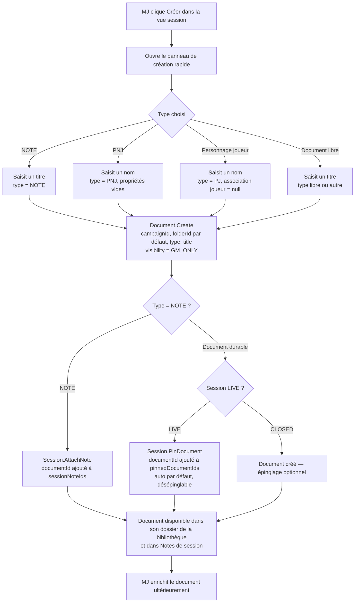
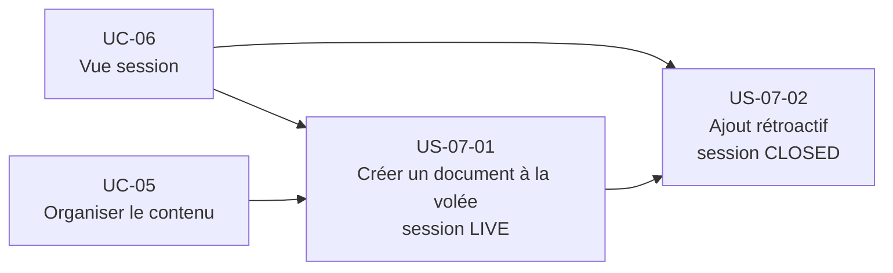

# Epic — Créer un élément à la volée pendant la session (UC-07)

## Objectif utilisateur

Permettre au MJ de créer instantanément un document durable dans la campagne depuis la vue session — note, PNJ, lieu, faction, personnage joueur, objet ou contenu libre — sans quitter le contexte de partie. Le titre seul suffit à valider la création. Un document durable est épinglé automatiquement par défaut dans la session (LIVE, désépinglable) ; une note de session est rattachée à la session via `AttachNote` (jamais épinglée). L'élément peut être enrichi après la partie.

---

## Personas concernés

| Persona | Motivation principale |
|---|---|
| Émilie | Créer un PNJ ou une note en moins de 5 secondes, sans interrompre le rythme |
| Antoine | Créer des éléments typés (PNJ Blades in the Dark) retrouvables proprement après la session |
| Nadia | Créer une note rétroactive depuis une session CLOSED pour ne pas oublier |

---

## Use cases couverts

- **UC-07** — Créer un élément à la volée pendant la session
  - Nominal : création rapide depuis le panneau de création rapide
  - A1 : PNJ à la volée (nom seul, propriétés vides, épinglé)
  - A2 : Personnage joueur à la volée (nom seul, associable à un joueur plus tard)
  - A3 : Note de session (`Document(type=NOTE)`, rattachée à la session via `AttachNote`/`sessionNoteIds`)
  - A4 : Document générique (lieu, faction, objet, lore)
  - A5 : Session CLOSED — ajout rétroactif
  - E1 : Titre vide — création refusée
  - E2 : Session ARCHIVED — création impossible

---

## Priorité MoSCoW

| Priorité | Stories |
|---|---|
| Must Have | US-07-01 |
| Should Have | US-07-02 |

---

## Bounded contexts pressentis

- **Content Library** — création du document, liaison à la campagne, dossier d'accueil
- **Session Conduct** — rattachement selon le type : `Session.AttachNote` (`sessionNoteIds`) pour une note de session, `Session.PinDocument` (`pinnedDocumentIds`, auto-épinglé par défaut en LIVE, désépinglable par le MJ) pour un document durable

La création à la volée est une opération cross-context : `Document.Create(...)` dans Content Library, puis — selon le type — `Session.AttachNote(documentId)` (note de session) ou `Session.PinDocument(documentId)` (document durable) dans Session Conduct.

---

## Vue d'ensemble Mermaid



---

## Dépendances Mermaid



---

## User stories

### US-07-01 — Créer un document à la volée depuis une session LIVE

**Priorité** : Must Have

**En tant que** MJ,  
**je veux** créer un document (note, PNJ, lieu, faction, personnage joueur ou document libre) depuis la vue session avec un titre seul,  
**afin de** maintenir la fluidité de la partie et retrouver l'élément proprement dans ma campagne après la session.

**Notes de conception** :
- Opération cross-context :
  1. `Document.Create(campaignId, folderId, title, typeId?)` dans Content Library.
  2. Selon le type : `Session.AttachNote(documentId)` (note de session) ou `Session.PinDocument(documentId)` (document durable) dans Session Conduct.
- Le dossier d'accueil est déterminé par le type : PNJ → dossier Personnages, NOTE → dossier Notes, PJ → dossier Personnages joueurs. Si aucun dossier typé n'existe ou si le type est indéterminé → dossier "Non classés".
- Visibilité par défaut : `GM_ONLY`.
- L'auto-épinglage (par défaut, désépinglable par le MJ) ne concerne que les documents durables en session LIVE ; il déclenche `Session.PinDocument`. Une `LIVE_NOTE` ne s'épingle jamais : elle se rattache via `Session.AttachNote` (cf. RB-07-04, Bounded contexts pressentis).
- Possible en mode local (sans compte) : document créé en IndexedDB.
- Auto-épinglage vs choix manuel du MJ : voir Question #1 des Questions ouvertes — **Résolue**, décision reprise ci-dessus (par défaut en LIVE, désépinglable).

**Règles métier** :
- RB-07-01 : Le titre est le seul champ obligatoire. La création est refusée si le titre est vide ou composé uniquement d'espaces.
- RB-07-02 : Le document créé est automatiquement lié à la campagne de la session en cours.
- RB-07-03 : La visibilité par défaut est `GM_ONLY`.
- RB-07-04 : Un document durable est auto-épinglé par défaut dans `Session.pinnedDocumentIds` en session LIVE ; le MJ peut le désépingler. En session CLOSED, l'épinglage reste optionnel. (Une note de session est rattachée via `Session.AttachNote` — cf. Bounded contexts pressentis.)
- RB-07-05 : La création à la volée est impossible depuis une session ARCHIVED.

**Critères d'acceptation** :
- [ ] Le MJ peut ouvrir un panneau de création rapide depuis la vue session.
- [ ] Le MJ peut choisir le type de document : NOTE, PNJ, PJ, document libre.
- [ ] La création est validée avec un titre seul.
- [ ] Le document est créé avec `visibility = GM_ONLY` et lié à la campagne courante.
- [ ] Le document est placé dans le dossier d'accueil correspondant à son type.
- [ ] Le document est ajouté à `Session.pinnedDocumentIds` automatiquement (session LIVE) — ceci ne vaut que pour un document durable ; une `LIVE_NOTE` est ajoutée à `sessionNoteIds` via `Session.AttachNote`.
- [ ] La création est refusée si le titre est vide (E1).
- [ ] La création est impossible depuis une session ARCHIVED (E2).
- [ ] En mode local, le document reste accessible après fermeture et réouverture du navigateur.

```gherkin
Scénario : Le MJ crée un PNJ à la volée (A1)
  Étant donné qu'une session est en status LIVE
  Quand le MJ ouvre le panneau de création rapide, choisit PNJ et saisit "Baronne Elara"
  Alors un document PNJ "Baronne Elara" est créé avec visibility = GM_ONLY et propriétés vides
  Et il est ajouté à Session.pinnedDocumentIds
  Et il est placé dans le dossier Personnages

Scénario : Le MJ crée une note de session à la volée (A3)
  Étant donné qu'une session est en status LIVE
  Quand le MJ ouvre le panneau de création rapide, choisit NOTE et saisit "Connexion faction Corbeau"
  Alors un document NOTE "Connexion faction Corbeau" est créé avec visibility = GM_ONLY
  Et il est ajouté à Session.sessionNoteIds via Session.AttachNote
  Et il est placé dans le dossier Notes

Scénario : Le MJ crée un document générique à la volée (A4)
  Étant donné qu'une session est en status LIVE
  Quand le MJ crée un document de type "Lieu" intitulé "Auberge du Pont Brisé"
  Alors le document est créé, lié à la campagne, visibility = GM_ONLY
  Et il est épinglé dans la session

Scénario : Création refusée si titre vide (E1)
  Étant donné qu'une session est en status LIVE
  Quand le MJ valide la création sans titre
  Alors la création est refusée et un message d'erreur est affiché

Scénario : Création impossible en ARCHIVED (E2)
  Étant donné qu'une session est en status ARCHIVED
  Quand le MJ tente d'ouvrir le panneau de création rapide
  Alors l'action est désactivée ou refusée
```

---

### US-07-02 — Ajouter un élément rétroactif depuis une session CLOSED

**Priorité** : Should Have

**En tant que** MJ,  
**je veux** créer un document depuis une session déjà terminée (CLOSED),  
**afin de** retrouver dans ma campagne un élément improvisé pendant la partie que je n'ai pas eu le temps de saisir à chaud.

**Notes de conception** :
- Session en statut `CLOSED` : `Session.pinnedDocumentIds` reste modifiable.
- Le document est créé dans Content Library de la même façon qu'en LIVE.
- L'épinglage automatique en CLOSED est optionnel — **décidé** (cf. Question #1 résolue).
- Le document est durable : il ne disparaît pas à l'archivage de la session.
- Impossible depuis une session ARCHIVED.

**Règles métier** :
- RB-07-06 : La création d'un document à la volée est possible depuis une session CLOSED.
- RB-07-07 : Le document créé en CLOSED est durable dans Content Library — il n'est pas lié à la clôture de la session.
- RB-07-08 : La création est impossible depuis une session ARCHIVED.

**Critères d'acceptation** :
- [ ] Le MJ peut ouvrir le panneau de création rapide depuis une session CLOSED.
- [ ] Le document est créé dans Content Library avec les mêmes règles qu'en LIVE.
- [ ] Le document reste accessible après archivage de la session.
- [ ] La création est impossible depuis une session ARCHIVED.

```gherkin
Scénario : Le MJ ajoute un PNJ rétroactivement en CLOSED (A5)
  Étant donné qu'une session est en status CLOSED
  Quand le MJ crée un PNJ "Capitaine Draven" depuis le panneau de création rapide
  Alors le document est créé dans Content Library avec visibility = GM_ONLY
  Et il est lié à la campagne de la session

Scénario : Le document créé en CLOSED est persisté après archivage
  Étant donné qu'un document a été créé à la volée depuis une session CLOSED
  Quand le MJ archive la session (CLOSED → ARCHIVED)
  Alors le document est toujours accessible dans Content Library

Scénario : Création impossible en ARCHIVED
  Étant donné qu'une session est en status ARCHIVED
  Quand le MJ tente d'ouvrir le panneau de création rapide
  Alors l'action est désactivée ou refusée
```

---

## Stories exclues ou repoussées

| Story / Feature | Raison |
|---|---|
| Enrichissement du document pendant la session | Hors périmètre UC-07. L'enrichissement est une consultation/édition de document (Content Library). |
| Association joueur / personnage joueur pendant la création | Hors scope UC-07. L'association est traitée lors de l'enrichissement post-session. |
| Création à la volée pour les joueurs | Hors périmètre — UC-07 est réservé au MJ. |
| Raccourci clavier pour le panneau de création rapide | Question ouverte — non décidé pour le MVP. |

---

## Ordre de livraison recommandé

1. **US-07-01** — Création à la volée en session LIVE (cas central, valeur immédiate pour Émilie et Antoine)
2. **US-07-02** — Ajout rétroactif en session CLOSED (valeur pour Nadia)

---

## Vérification de couverture

| Cas UC-07 | Story couvrant |
|---|---|
| Nominal — création rapide depuis panneau | US-07-01 |
| A1 — PNJ à la volée | US-07-01 |
| A2 — Personnage joueur à la volée | US-07-01 |
| A3 — Note de session | US-07-01 |
| A4 — Document générique | US-07-01 |
| A5 — Session CLOSED | US-07-02 |
| E1 — Titre vide | US-07-01 |
| E2 — Session ARCHIVED | US-07-01, US-07-02 |

---

## Questions ouvertes

1. ~~Le document créé à la volée est-il épinglé automatiquement, ou le MJ choisit de l'épingler manuellement ?~~ **Résolue** : un document durable est auto-épinglé par défaut en session LIVE, désépinglable par le MJ (aligné UC-07 amendé + AR-12) ; en session CLOSED, l'épinglage reste optionnel. Une note de session n'est jamais épinglée — elle est rattachée via `Session.AttachNote` (voir RB-07-04, Bounded contexts pressentis).
2. Y a-t-il un raccourci clavier pour ouvrir le panneau de création rapide en session ?
