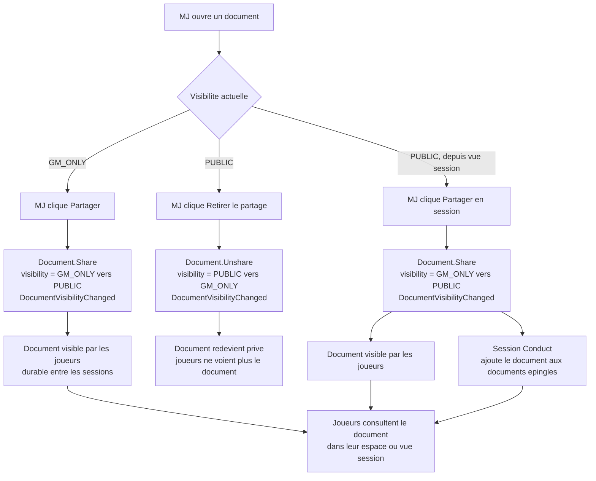
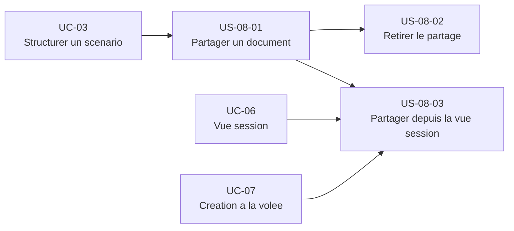

# Epic — Partager une information aux joueurs (UC-08)

## Objectif utilisateur

Permettre au MJ de contrôler la visibilité de ses documents d'espace. Tout document est `GM_ONLY` par défaut. Le MJ peut le rendre visible par tous les joueurs (`PUBLIC`) de façon durable, et retirer ce partage à tout moment. Ce n'est pas un partage temporaire de session — la visibilité persiste entre les séances jusqu'à action explicite du MJ.

---

## Personas concernés

| Persona | Motivation principale |
|---|---|
| Émilie | Partager une note ou un indice à la volée pendant la session, sans interrompre le rythme |
| Thomas | Préparer ses révélations à l'avance et les partager au moment précis en session |
| Nadia | Partager une aide de jeu ou un résumé, besoin simple et sans friction |
| Sonia | Partager une aide de jeu rapide au début d'une séance de convention |

---

## Use cases couverts

- **UC-08** — Partager une information aux joueurs
  - Nominal : partage d'un document depuis la bibliothèque de contenu
  - A1 : Retrait du partage
  - A2 : Partage d'une note de session
  - A3 : Partage depuis la vue session (avec auto-épinglage)
  - A4 : Partage d'un récapitulatif post-session
  - E1 : Document déjà `PUBLIC`
  - E2 : Accès joueur expiré ou révoqué

---

## Priorité MoSCoW

La priorité MoSCoW se lit exclusivement au grain du use case, dans [`moscow.md`, § UC-08 — Partager une information aux joueurs](../vision/moscow.md) — seule autorité du corpus pour l'attribuer (voir [`docs/conception/README.md`, § Ordre d'autorité entre artefacts](../../README.md), point 1 : les use cases sont la source de vérité du besoin, les user stories en dérivent et s'y conforment). Cette fiche ne répartit donc pas de priorité propre par story : une répartition au grain story recopierait une valeur que seul `moscow.md` a l'autorité d'accorder, et qu'une révision ultérieure de ce document laisserait alors périmée ici sans le savoir.

---

## Bounded contexts pressentis

- **Bibliothèque de contenu** — porte `Document.visibility`, expose `Document.Share()` et `Document.Unshare()`, produit `DocumentVisibilityChanged`.
- **Conduite de session** — consomme `DocumentVisibilityChanged` pour mettre à jour la vue joueur en temps réel et gère les `documents épinglés`.

---

## Vue d'ensemble Mermaid



---

## Dépendances Mermaid



---

## User stories

### US-08-01 — Partager un document avec les joueurs

**En tant que** MJ,  
**je veux** rendre un document d'espace visible par les joueurs,  
**afin de** leur transmettre une information (indice, aide de jeu, révélation, résumé) de façon durable.

**Notes de conception** :
- `Document.Share()` est la seule méthode de Content Library impliquée. Elle passe `visibility` de `GM_ONLY` à `PUBLIC` et produit `DocumentVisibilityChanged`.
- Le partage est permanent : le document reste `PUBLIC` entre les sessions jusqu'à `Document.Unshare()` explicite. Ce n'est pas un partage temporaire lié à une session.
- Le partage s'applique à tous les membres autorisés de l'espace et aux `GuestAccess` actifs — pas de ciblage individuel dans le MVP.
- Le type `REVEAL` (`documentTypeId = REVEAL`) est un type système conçu pour être partagé. Son partage suit exactement le même mécanisme — aucune règle spéciale.
- Si le document est déjà `PUBLIC`, `Share()` n'applique aucune modification (E1 — idempotence).

**Règles métier** :
- RB-08-01 : Seul un membre `OWNER` ou `GM` de l'espace peut partager un document.
- RB-08-02 : Le partage change `Document.visibility` de `GM_ONLY` à `PUBLIC`. Un document `PLAYER_PRIVATE` ne peut pas être partagé via cette action.
- RB-08-03 : Le partage est durable — il persiste entre les sessions jusqu'à retrait explicite.
- RB-08-04 : Le partage s'applique à tous les membres autorisés de l'espace et aux `GuestAccess` actifs. Pas de partage sélectif par joueur dans le MVP.
- RB-08-05 : Partager un document déjà `PUBLIC` ne produit aucun changement d'état.

**Critères d'acceptation** :
- [ ] Le MJ peut déclencher le partage d'un document `GM_ONLY` depuis la bibliothèque de contenu.
- [ ] Après partage, `Document.visibility` vaut `PUBLIC`.
- [ ] L'événement `DocumentVisibilityChanged` est produit.
- [ ] Les joueurs voient le document dans leur espace.
- [ ] Partager un document déjà `PUBLIC` est sans effet et signalé à l'interface (E1).
- [ ] Un joueur ne peut pas déclencher l'action de partage.

```gherkin
Scénario : Le MJ partage un document GM_ONLY (nominal)
  Étant donné qu'un document "Carte du donjon" a visibility = GM_ONLY
  Quand le MJ clique sur "Partager"
  Alors Document.visibility passe à PUBLIC
  Et l'événement DocumentVisibilityChanged est produit
  Et les joueurs voient "Carte du donjon" dans leur espace

Scénario : Partage d'un document REVEAL depuis une scène (UC-03)
  Étant donné qu'un document REVEAL "Inscription sur la porte" a visibility = GM_ONLY
  Quand le MJ clique sur "Partager"
  Alors Document.visibility passe à PUBLIC
  Et les joueurs voient l'inscription

Scénario : Document déjà PUBLIC (E1)
  Étant donné qu'un document a visibility = PUBLIC
  Quand le MJ clique sur "Partager"
  Alors aucune modification n'est appliquée
  Et l'interface indique que le document est déjà visible par les joueurs
```

---

### US-08-02 — Retirer le partage d'un document

**En tant que** MJ,  
**je veux** repasser un document `PUBLIC` en `GM_ONLY`,  
**afin de** garder le contrôle sur ce que les joueurs voient, notamment si une information ne doit plus être accessible.

**Notes de conception** :
- `Document.Unshare()` repasse `visibility` de `PUBLIC` à `GM_ONLY` et produit `DocumentVisibilityChanged`.
- Session Conduct consomme cet événement pour retirer le document de la vue joueur en temps réel si une session est en cours.
- Le retrait n'a pas d'effet sur les `documents épinglés` de la session : si le document était épinglé, il reste dans la liste épinglée mais n'est plus visible par les joueurs (seul le MJ le voit). L'épinglage et la visibilité sont deux dimensions indépendantes.
- `Document.Unshare()` et désépingler sont deux opérations distinctes — le MJ peut désépingler sans retirer le partage, et retirer le partage sans désépingler.

**Règles métier** :
- RB-08-06 : Seul un membre `OWNER` ou `GM` peut retirer le partage d'un document.
- RB-08-07 : Le retrait repasse `Document.visibility` à `GM_ONLY`. Le document n'est plus accessible aux joueurs dès la modification.
- RB-08-08 : Retirer le partage d'un document déjà `GM_ONLY` est sans effet.
- RB-08-08b : Si le document était épinglé dans une session LIVE, il reste dans les `documents épinglés` après retrait du partage. Il est visible pour le MJ uniquement.
- RB-08-08c : L'épinglage et la visibilité sont indépendants — le MJ peut désépingler sans retirer le partage, et retirer le partage sans désépingler.

**Critères d'acceptation** :
- [ ] Le MJ peut déclencher le retrait du partage d'un document `PUBLIC`.
- [ ] Après retrait, `Document.visibility` vaut `GM_ONLY`.
- [ ] L'événement `DocumentVisibilityChanged` est produit.
- [ ] Les joueurs ne voient plus le document dans leur espace.
- [ ] Retirer le partage d'un document déjà `GM_ONLY` est sans effet.

```gherkin
Scénario : Le MJ retire le partage d'un document PUBLIC (A1)
  Étant donné qu'un document "Carte du donjon" a visibility = PUBLIC
  Quand le MJ clique sur "Retirer le partage"
  Alors Document.visibility passe à GM_ONLY
  Et l'événement DocumentVisibilityChanged est produit
  Et les joueurs ne voient plus "Carte du donjon"

Scénario : Retrait du partage en session LIVE
  Étant donné qu'une session est en status LIVE
  Et qu'un document "Carte du donjon" a visibility = PUBLIC
  Quand le MJ retire le partage
  Alors le document disparaît de la vue joueur en temps réel

Scénario : Document déjà GM_ONLY
  Étant donné qu'un document a visibility = GM_ONLY
  Quand le MJ tente de retirer le partage
  Alors aucune modification n'est appliquée
```

---

### US-08-03 — Partager un document depuis la vue session

**En tant que** MJ,  
**je veux** partager un document directement depuis la vue session en cours,  
**afin de** transmettre une information aux joueurs sans quitter le contexte de partie, et que le document soit immédiatement visible dans les `documents épinglés` de la session.

**Notes de conception** :
- Opération cross-context :
  1. `Document.Share()` dans Content Library — `visibility` passe à `PUBLIC`, `DocumentVisibilityChanged` produit.
  2. Session Conduct reçoit `DocumentVisibilityChanged` et ajoute le document aux `documents épinglés` de la session.
- L'auto-épinglage est spécifique au partage depuis la vue session : partager un document depuis la bibliothèque de contenu (US-08-01) ne déclenche pas l'épinglage.
- La vue session affiche les documents `PUBLIC` et `GM_ONLY` au MJ, mais filtre automatiquement pour ne montrer aux joueurs que les documents `PUBLIC`.
- Ce scénario couvre le cas du type `REVEAL` (Thomas prépare ses révélations et les partage au moment voulu en session).

**Règles métier** :
- RB-08-09 : Partager un document depuis la vue session déclenche `Document.Share()` avec le même comportement que US-08-01.
- RB-08-10 : Un document partagé depuis une session LIVE est automatiquement ajouté aux `documents épinglés` de cette session.
- RB-08-11 : L'auto-épinglage ne s'applique qu'aux sessions en status LIVE.

**Critères d'acceptation** :
- [ ] Le MJ peut partager un document `GM_ONLY` depuis la vue session.
- [ ] Après partage, `Document.visibility` vaut `PUBLIC`.
- [ ] Le document est automatiquement ajouté aux `documents épinglés` de la session LIVE.
- [ ] Les joueurs voient le document dans la vue session sans action supplémentaire.
- [ ] L'auto-épinglage ne se produit pas si la session n'est pas en status LIVE.

```gherkin
Scénario : Le MJ partage un REVEAL depuis la vue session (A3, A2)
  Étant donné qu'une session est en status LIVE
  Et qu'un document REVEAL "Indice : inscription sur la porte" a visibility = GM_ONLY
  Quand le MJ clique sur "Partager" depuis la vue session
  Alors Document.visibility passe à PUBLIC
  Et le document est ajouté aux documents épinglés de la session
  Et les joueurs voient l'indice dans la vue session

Scénario : Partage d'une note improvisée en session (A2)
  Étant donné qu'une session est en status LIVE
  Et qu'une note "Connexion faction Corbeau" a visibility = GM_ONLY
  Quand le MJ la partage depuis la vue session
  Alors le document est PUBLIC et épinglé dans la session

Scénario : Partage depuis une session non LIVE
  Étant donné qu'une session est en status CLOSED
  Quand le MJ partage un document depuis cette vue de session
  Alors Document.visibility passe à PUBLIC
  Et le document n'est pas auto-épinglé (session non LIVE)
```

---

## Stories exclues ou repoussées

| Story / Feature | Raison |
|---|---|
| Partage sélectif par joueur | Hors MVP — RB-08-04 explicite. Prévu comme évolution future. |
| Partage temporaire de session (expiration automatique) | Hors MVP. Le partage est permanent jusqu'à retrait explicite. |
| Partage avec notification joueur (push / email) | Hors périmètre UC-08. Traité dans les fonctionnalités de notification. |
| Historique des partages | Could Have — la date de partage est tracée dans `AuditInfo` mais pas affichée dans le MVP. |

---

## Ordre de livraison recommandé

1. **US-08-01** — Partager un document (fondation du mécanisme, valeur immédiate pour Thomas et Sonia)
2. **US-08-02** — Retirer le partage (complète le cycle de contrôle de la visibilité)
3. **US-08-03** — Partager depuis la vue session avec auto-épinglage (valeur pour Émilie, dépend de US-08-01)

---

## Vérification de couverture

| Cas UC-08 | Story couvrant |
|---|---|
| Nominal — partage depuis la bibliothèque | US-08-01 |
| A1 — Retrait du partage | US-08-02 |
| A2 — Partage d'une note de session | US-08-01, US-08-03 |
| A3 — Partage depuis la vue session | US-08-03 |
| A4 — Partage d'un récapitulatif post-session | US-08-01 |
| E1 — Document déjà PUBLIC | US-08-01 |
| E2 — Accès joueur expiré | Couvert par Space Management (GuestAccess) — hors scope UC-08 |

---

## Questions ouvertes

Aucune question ouverte — les deux décisions structurantes ont été arbitrées :
- **DÉCIDÉ** : retrait du partage = document reste épinglé, visible MJ uniquement (joueurs ne le voient plus).
- **DÉCIDÉ** : épinglage et visibilité sont indépendants. Désépingler ≠ retirer le partage.
