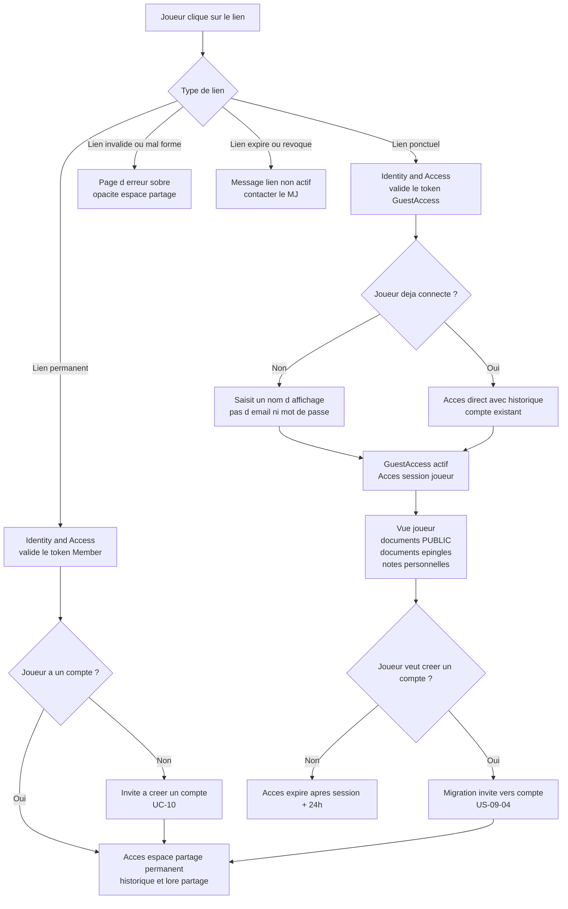
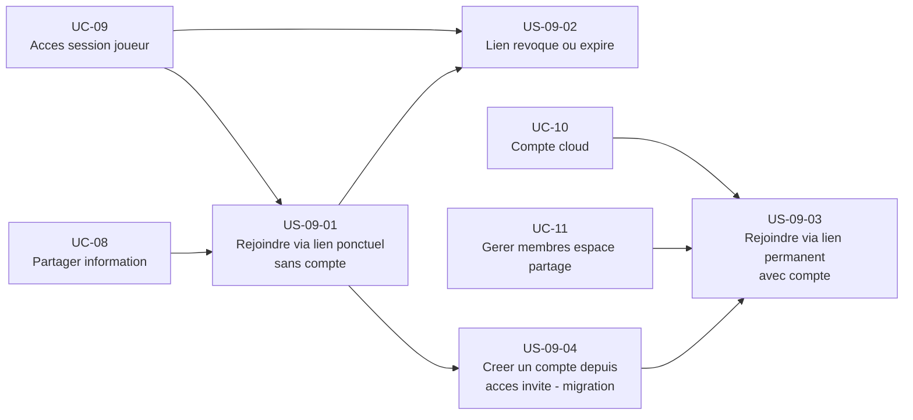

# Epic — Accéder à une session en tant que joueur (UC-09)

## Objectif utilisateur

Permettre à un joueur de rejoindre une session Haversack en cliquant sur un lien, sans créer de compte, avec une friction minimale. Le nom d'affichage seul suffit. Un lien d'espace partagé permanent (avec compte) est également couvert pour les membres réguliers.

---

## Personas concernés

| Persona | Motivation principale |
|---|---|
| Lucas | Accéder sans compte, sans inscription, sans délai — une case de nom et c'est tout |
| Émilie | Ses joueurs rejoignent sans friction — c'est la condition que ses joueurs utilisent l'outil |
| Thomas | Inviter des membres réguliers avec un accès durable et géré |

---

## Use cases couverts

- **UC-09** — Accéder à une session en tant que joueur (avec ou sans compte)
  - Nominal : accès via lien ponctuel, nom d'affichage seul
  - A1 : joueur déjà connecté à son compte Haversack
  - A2 : joueur invité qui crée un compte depuis l'accès invité (migration sans perte)
  - A3 : lien d'espace partagé permanent (membres réguliers, avec compte)
  - A4 : lien expiré ou révoqué
  - E1 : lien invalide ou mal formé

---

## Priorité MoSCoW

| Priorité | Stories |
|---|---|
| Must Have | US-09-01, US-09-02 |
| Should Have | US-09-03 (dépend UC-10), US-09-04 |

---

## Bounded contexts pressentis

- **Identity & Access** — gère `GuestAccess`, `Member`, génération et révocation des tokens de lien, validation des accès.
- **Space Management** — associe les membres et les `GuestAccess` à un espace partagé, contrôle la liste des participants.
- **Conduite de session** — consomme l'accès joueur pour afficher la vue joueur, expose les documents `PUBLIC` et les `documents épinglés` en temps réel.

---

## Vue d'ensemble Mermaid



---

## Dépendances Mermaid



---

## User stories

### US-09-01 — Rejoindre une session via lien ponctuel sans compte

**Priorité** : Must Have

**En tant que** joueur,
**je veux** accéder à une session en cliquant sur un lien et en saisissant uniquement un nom d'affichage,
**afin de** consulter les informations partagées par le MJ sans avoir à créer de compte.

**Notes de conception** :
- Identity & Access valide le token `GuestAccess` à réception du lien.
- La saisie du nom d'affichage est le seul prérequis à l'accès — pas d'email, pas de mot de passe.
- Le nom d'affichage seul suffit ; aucun pseudo ni code court n'est requis à la saisie. L'identité technique du joueur invité est portée par le `GuestAccessId` (généré à l'octroi de l'accès, jamais saisi par le joueur) — le nom d'affichage (`displayName`) est un simple label, sans garantie d'unicité. Deux joueurs peuvent saisir le même nom (deux « Marc ») sans que cela pose un problème de modèle : la désambiguïsation en cas d'homonymie relève de la **présentation** (par exemple un court suffixe dérivé du `GuestAccessId`, affiché dans la vue session du MJ), pas d'une contrainte d'unicité du modèle ni d'un identifiant obligatoire à la saisie — l'imposer sur-modéliserait un besoin de confort d'affichage.
- Si le joueur est déjà connecté à un compte Haversack (A1), l'étape de saisie du nom est sautée : il accède directement avec son identité de compte et son historique de session.
- Le `GuestAccess` est valide pendant la durée de la session + une fenêtre de grâce de 24 heures.
- Le joueur invité voit les documents `PUBLIC`, les `documents épinglés` de la session (uniquement ceux `PUBLIC`) et peut prendre des notes personnelles (`PLAYER_PRIVATE`) accessibles à lui seul. Il a accès à sa fiche de personnage si un personnage lui est associé. Les documents `PLAYER_PRIVATE` d'autres joueurs, et ceux d'un éventuel compte MJ, ne lui sont jamais visibles — la visibilité est respectée indépendamment de l'épinglage.
- Le nom d'affichage du joueur est visible par le MJ dans la vue session.

**Règles métier** :
- RB-09-01 : Un lien de session ponctuel est associé à un `GuestAccess` token. Il est valide pendant la durée de la session + 24 heures de grâce après la fin de session.
- RB-09-02 : La saisie d'un nom d'affichage est obligatoire pour activer le `GuestAccess`. L'email et le mot de passe ne sont pas requis.
- RB-09-03 : Un joueur déjà connecté à son compte Haversack saute l'étape de saisie du nom et accède directement.
- RB-09-04 : Le joueur invité dispose des mêmes droits fonctionnels qu'un joueur avec compte dans le périmètre de son `GuestAccess` : documents `PUBLIC`, `documents épinglés`, notes personnelles, fiche personnage si associée.
- RB-09-05 : Le MJ a besoin d'un compte pour générer le lien de session (le backend gère l'accès).
- RB-09-18 : À la fin définitive d'un `GuestAccess` (expiration après grâce ou révocation sans réactivation), les données personnelles qu'il porte (`displayName`, élément d'accès) cessent immédiatement d'être utilisées et affichées — plus aucune finalité produit. Leur effacement effectif intervient au plus tard 90 jours après la fin d'accès ; cette fenêtre bornée a pour seule finalité de permettre à l'invité d'exercer ses droits et de traiter une contestation, jamais un usage produit (RGPD Art. 5(1)(e) — limitation de la conservation). Si l'invité a été converti en compte, ses données suivent les règles du compte.
- RB-09-19 : À la fin définitive d'un `GuestAccess` non converti, les notes `PLAYER_PRIVATE` créées par cet invité sont supprimées physiquement. Seules les notes créées par cet invité sont concernées, jamais celles d'autres participants.
- RB-09-20 : Au moment où l'invité saisit son nom d'affichage (avant ou à l'entrée en session), il est informé de manière simple de ce qui est conservé (son nom d'affichage, ses notes privées éventuelles), pour combien de temps (durée de l'accès + grâce, puis effacement du nom d'affichage au plus tard 90 jours après la fin d'accès), et du sort de ses données à la fin de l'accès : ses notes privées sont supprimées s'il n'a pas créé de compte, son nom d'affichage n'est plus utilisé et est effacé dans le délai borné.
- RB-09-21 : Sur un compte `FREE`, une session est limitée à **4 joueurs distincts disposant d'un accès à la séance**, quel que soit le type d'accès (accès invité ponctuel, membre de l'espace partagé, ou autre type d'accès futur). Le MJ n'est jamais compté. La limite porte sur le nombre d'accès accordés au moment de leur octroi — c'est le refus du **5e accès** qui bloque, pas une mesure de présence en temps réel. La limite porte sur la taille de la table, pas sur le moyen d'y accéder — compter un seul type d'accès la rendrait contournable et viderait le levier de l'offre supérieure. Le joueur dont l'accès est refusé voit un message sobre d'erreur, sans révélation sur l'espace partagé (même registre que le message de lien expiré) ; le MJ reçoit le signalement de la limite atteinte avec une invitation à passer `PRO` pour la lever. Cette limite transpose, pour les joueurs d'une session, le précédent de blocage du compte `FREE` déjà établi pour les espaces partagés.
- RB-09-22 : Au-delà de l'information donnée à la saisie du nom (RB-09-20), l'invité est averti en temps utile — à un moment qui lui laisse la possibilité d'agir avant la fin de son accès — que ses notes personnelles ne seront conservées que s'il crée un compte avant cette fin. Cet avertissement traite le risque que l'information initiale ne soit plus présente à l'esprit lorsque l'accès prend fin, et laisse à l'invité le temps de décider de créer un compte pour conserver ses notes (US-09-04, RB-09-14).

**Critères d'acceptation** :
- [ ] Le joueur accède à la session en cliquant sur le lien et en saisissant uniquement un nom d'affichage.
- [ ] Aucun email, aucun mot de passe, aucune confirmation n'est demandée.
- [ ] Le joueur voit les documents `PUBLIC` de l'espace partagé et les `documents épinglés` de la session.
- [ ] Le joueur peut prendre des notes personnelles.
- [ ] Le nom d'affichage du joueur est visible par le MJ dans la vue session.
- [ ] Un joueur déjà connecté accède directement sans saisir de nom (A1).
- [ ] L'accès expire après la session + 24 heures (le token `GuestAccess` est invalidé).
- [ ] Avant ou au moment de saisir son nom d'affichage, le joueur reçoit une information simple sur les données conservées (nom d'affichage, notes privées), la durée de conservation (durée de l'accès + 24 h de grâce ; nom d'affichage effacé au plus tard 90 jours après la fin d'accès), et leur sort : notes privées supprimées sans délai à la fin d'accès si pas de compte créé, nom d'affichage cessant d'être utilisé immédiatement.

```gherkin
Scénario : Joueur rejoint via lien ponctuel sans compte (nominal)
  Etant donne qu'un MJ a genere un lien de session ponctuel
  Et que le GuestAccess token est valide
  Quand Lucas clique sur le lien et saisit "Lucas" comme nom d affichage
  Alors le GuestAccess est active pour cette session
  Et Lucas voit les documents PUBLIC et les documents epingles de la session
  Et le nom "Lucas" est visible par le MJ dans la vue session

Scénario : Joueur deja connecte a son compte (A1)
  Etant donne qu'un MJ a genere un lien de session ponctuel
  Et que Lucas est deja connecte a son compte Haversack
  Quand Lucas clique sur le lien
  Alors il accede directement a la session avec son historique
  Et l etape de saisie du nom est sautee

Scénario : Acces expire apres 24h de grace
  Etant donne qu'une session est passee en status CLOSED depuis plus de 24 heures
  Quand Lucas tente de rouvrir le lien ponctuel
  Alors le GuestAccess est invalide
  Et il voit le message lien non actif
```

---

### US-09-02 — Lien révoqué ou expiré

**Priorité** : Must Have

**En tant que** joueur,
**je veux** recevoir un message clair lorsque le lien que j'utilise n'est plus actif,
**afin de** comprendre la situation et savoir quoi faire (contacter le MJ), sans obtenir d'information sur l'existence de l'espace partagé.

**Notes de conception** :
- Identity & Access invalide le `GuestAccess` à l'expiration ou à la révocation explicite par le MJ.
- Les deux cas — lien expiré (A4) et lien invalide ou mal formé (E1) — affichent une page d'erreur sobre avec le même message de surface, afin de ne pas révéler si l'espace partagé existe ou non (principe d'opacité).
- La distinction interne entre expiration, révocation et token malformé reste dans les logs — elle n'est pas exposée au joueur.
- Le message propose de contacter le MJ pour obtenir un nouveau lien.

**Règles métier** :
- RB-09-06 : Un `GuestAccess` révoqué par le MJ est immédiatement invalidé.
- RB-09-07 : Un `GuestAccess` expiré (délai de grâce dépassé) est invalide.
- RB-09-08 : Un lien invalide ou mal formé est traité avec le même affichage qu'un lien expiré ou révoqué — aucune information sur l'existence de l'espace partagé n'est révélée.
- RB-09-09 : Le message affiché est sobre et invite le joueur à contacter le MJ.

**Critères d'acceptation** :
- [ ] Un lien de session expiré affiche un message "Ce lien n'est plus actif" et invite à contacter le MJ.
- [ ] Un lien révoqué affiche le même message qu'un lien expiré.
- [ ] Un lien mal formé affiche le même message — aucune information sur l'espace partagé n'est révélée.
- [ ] La page d'erreur est sobre et ne révèle pas l'existence de l'espace partagé.

```gherkin
Scénario : Lien de session expire (A4)
  Etant donne qu'une session est terminee depuis plus de 24 heures
  Quand Lucas clique sur l ancien lien de session
  Alors il voit un message "Ce lien n'est plus actif"
  Et le message invite a contacter le MJ pour un nouveau lien
  Et aucune information sur l espace partage n'est revele

Scénario : Lien revoque par le MJ (A4)
  Etant donne que le MJ a revoque le GuestAccess d une session
  Quand Lucas tente d y acceder
  Alors il voit le meme message que pour un lien expire

Scénario : Lien invalide ou mal forme (E1)
  Etant donne qu'un lien est incorrect ou malicieux
  Quand un joueur l ouvre
  Alors il voit une page d erreur sobre
  Et aucune information sur l existence de l espace partage n'est revele
```

---

### US-09-03 — Rejoindre un espace partagé via lien permanent avec compte

**Priorité** : Should Have (dépend UC-10, UC-11)

**En tant que** joueur régulier,
**je veux** accéder à un espace partagé via un lien permanent fourni par le MJ,
**afin de** consulter l'historique des sessions passées et les documents de lore partagés entre les séances.

**Notes de conception** :
- Le lien permanent est associé à un `Member` de l'espace partagé, géré par Identity & Access et Space Management.
- Contrairement au lien ponctuel (`GuestAccess`), l'accès permanent nécessite un compte Haversack — il est valide jusqu'à révocation par le MJ.
- Si le joueur n'a pas de compte, il est redirigé vers la création de compte (UC-10). Une fois le compte créé, il est associé comme `Member` de l'espace partagé.
- L'accès permanent donne accès à l'historique des sessions et aux documents de lore `PUBLIC`.
- La génération du lien permanent est couverte par UC-11 (Gérer les membres d'un espace partagé).

**Règles métier** :
- RB-09-10 : Un lien d'espace partagé permanent est valide jusqu'à révocation explicite par le MJ.
- RB-09-11 : L'accès permanent nécessite un compte Haversack (`Member`).
- RB-09-12 : Un joueur sans compte redirigé vers UC-10 devient `Member` de l'espace partagé après création de son compte.
- RB-09-13 : Le `Member` a accès à l'historique des sessions et aux documents de lore `PUBLIC` de l'espace partagé.

**Critères d'acceptation** :
- [ ] Le joueur avec un compte accède directement à l'espace partagé via le lien permanent.
- [ ] Le joueur sans compte est redirigé vers la création de compte (UC-10) avant d'obtenir l'accès.
- [ ] Après création de compte, le joueur est lié comme `Member` de l'espace partagé.
- [ ] Le joueur accède à l'historique des sessions passées et aux documents de lore `PUBLIC`.
- [ ] Le MJ peut révoquer l'accès permanent, ce qui invalide immédiatement le lien pour ce membre.

```gherkin
Scénario : Joueur avec compte rejoint via lien permanent (A3)
  Etant donne que Thomas a genere un lien d espace partage permanent pour son espace
  Et que le joueur a deja un compte Haversack
  Quand le joueur clique sur le lien permanent
  Alors il est lie comme Member de l espace partage
  Et il accede a l historique des sessions et aux documents de lore PUBLIC

Scénario : Joueur sans compte redirige vers UC-10 (A3)
  Etant donne qu'un joueur clique sur un lien permanent d espace partage
  Et qu'il n'a pas de compte Haversack
  Quand la page s affiche
  Alors il est invite a creer un compte via UC-10
  Et apres creation, il est automatiquement lie comme Member de l espace partage

Scénario : MJ revoque l acces permanent d un membre
  Etant donne qu'un Member a acces a l espace partage via lien permanent
  Quand le MJ revoque l acces de ce membre
  Alors le lien devient invalide pour ce membre
  Et le membre ne peut plus acceder a l espace partage
```

---

### US-09-04 — Créer un compte depuis un accès invité (migration sans perte)

**Priorité** : Should Have (dépend UC-10)

**En tant que** joueur invité,
**je veux** créer un compte Haversack depuis ma session invité et conserver toutes mes données existantes,
**afin de** ne pas perdre mes notes personnelles et d'accéder à l'espace partagé de façon permanente entre les séances.

**Notes de conception** :
- La migration est déclenchée volontairement par le joueur depuis la vue invité (bouton "Créer un compte").
- Identity & Access rattache le `GuestAccess` existant au nouveau compte créé (UC-10).
- Les notes personnelles prises en mode invité (`PLAYER_PRIVATE`) sont migrées vers le compte.
- L'accès existant (sessions rejointes, documents consultés) est préservé.
- Après migration, le joueur peut être proposé comme `Member` permanent de l'espace partagé — la validation reste à la main du MJ.
- L'accès du compte créé depuis la migration est immédiat ; la validation de l'adresse de messagerie n'est pas bloquante (RB-10-05, ADR-015 §2.1 — UC-10). La promotion en `Member` permanent (RB-09-16) dépend uniquement du consentement du MJ, jamais de l'état `emailVerified` du compte : ce sont deux gates indépendants, l'un ne conditionne pas l'autre.
- La migration ne doit générer aucune perte de données.

**Règles métier** :
- RB-09-14 : La migration invité vers compte préserve toutes les notes personnelles (`PLAYER_PRIVATE`) et l'historique d'accès du `GuestAccess`.
- RB-09-15 : Après migration, le `GuestAccess` est rattaché au compte. Le joueur n'a plus besoin d'un lien ponctuel pour les sessions déjà rejointes pendant la fenêtre de grâce.
- RB-09-16 : La promotion en `Member` permanent nécessite la validation du MJ.
- RB-09-17 : La migration est irréversible — l'invité ne peut pas repasser en mode sans compte sur ce compte.

**Critères d'acceptation** :
- [ ] Le joueur invité peut déclencher la création de compte depuis la vue invité.
- [ ] Après création de compte, toutes les notes personnelles prises en mode invité sont conservées.
- [ ] L'historique d'accès du `GuestAccess` est rattaché au nouveau compte.
- [ ] Aucune donnée n'est perdue durant la migration.
- [ ] Le MJ est notifié qu'un joueur invité a créé un compte et peut le promouvoir en `Member`.

```gherkin
Scénario : Joueur invite cree un compte et migre ses donnees (A2)
  Etant donne que Lucas a acces a plusieurs sessions en tant qu invité
  Et qu'il a pris des notes personnelles
  Quand Lucas clique sur "Creer un compte" depuis la vue invité
  Et qu'il complete la creation de compte via UC-10
  Alors ses notes personnelles sont migrees vers son nouveau compte
  Et son historique de GuestAccess est rattache au compte
  Et aucune note n est perdue

Scénario : MJ peut promouvoir le joueur migre en Member
  Etant donne qu un joueur invite vient de creer un compte
  Quand le MJ voit la notification dans le panneau membres
  Alors il peut valider la promotion du joueur en Member de l espace partage
```

---

## Stories exclues ou repoussées

| Story / Feature | Raison |
|---|---|
| Partage sélectif de documents par joueur | Hors MVP — RB-08-04 définit que le partage s'applique à tous les membres et GuestAccess actifs. |
| Notification joueur (email, push) à l'expiration du lien | Hors périmètre UC-09. Traité dans les fonctionnalités de notification. |
| Récapitulatif post-session envoyé par email au joueur sans compte | Could Have — nécessite une adresse email, hors scope MVP pour les invités. |
| Identifiant ou pseudo dédié pour désambiguïser les homonymes (nom d'affichage en collision) | **Clos (Q#1)** — le nom d'affichage seul suffit ; l'identité technique est le `GuestAccessId`. La désambiguïsation d'homonymes est un traitement de présentation (suffixe dérivé du `GuestAccessId`), pas un identifiant de modèle. |

---

## Ordre de livraison recommandé

1. **US-09-01** — Rejoindre via lien ponctuel sans compte (fondation : c'est la condition d'adoption du groupe)
2. **US-09-02** — Lien révoqué ou expiré (complète le cycle de sécurité et d'opacité)
3. **US-09-04** — Migration invité vers compte (valeur pour fidéliser Lucas, dépend UC-10)
4. **US-09-03** — Lien permanent avec compte (valeur pour Thomas, dépend UC-10 et UC-11)

---

## Vérification de couverture

| Cas UC-09 | Story couvrant |
|---|---|
| Nominal — accès via lien ponctuel, nom seul | US-09-01 |
| A1 — joueur déjà connecté à son compte | US-09-01 |
| A2 — joueur invité qui crée un compte (migration) | US-09-04 |
| A3 — lien d'espace partagé permanent avec compte | US-09-03 |
| A4 — lien expiré ou révoqué | US-09-02 |
| E1 — lien invalide ou mal formé | US-09-02 |

---

## Questions ouvertes

1. **RÉSOLU** — Le nom d'affichage seul suffit ; aucun identifiant léger (pseudo, code court) n'est requis à la saisie. L'identité technique du joueur invité est le `GuestAccessId` (généré à l'octroi de l'accès, jamais saisi) — le nom d'affichage est un label sans garantie d'unicité. La désambiguïsation en cas d'homonymie (deux « Marc ») est traitée en **présentation** (suffixe court dérivé du `GuestAccessId`, affiché dans la vue session du MJ), pas par une contrainte de modèle : imposer un pseudo ou un code obligatoire sur-modéliserait un besoin de confort d'affichage.
2. **RÉSOLU** — La durée de grâce est ratifiée à **24 h ferme** après la fin de session, alignée avec RB-09-01 et la règle 5 du domaine Space Management (`GuestAccess SESSION` expire à la fermeture de la session + 24h de grâce). Pas de variation par offre ni d'interview complémentaire requise.
3. **RÉSOLU** — Le joueur invité reçoit une mise à jour **ambiante et temps réel** du partage de documents sans notification active au MVP (voir zoning **AR-06**). L'annonce assistive est couverte orthogonalement par **NFR-ACC-02**.
4. **RÉSOLU** — L'accès est **immédiat** après migration invité→compte ; la validation de l'adresse de messagerie n'est **pas bloquante** (RB-10-05, ADR-015 §2.1 — cf. UC-10). L'accès `Member` permanent de l'espace partagé reste gouverné par le consentement explicite du MJ (RB-09-16), jamais par l'état `emailVerified` du compte — ces deux gates sont indépendants. *(Cette question re-litigeait une règle déjà tranchée par UC-10/RB-10-05 ; clôture par renvoi vers la source.)*
