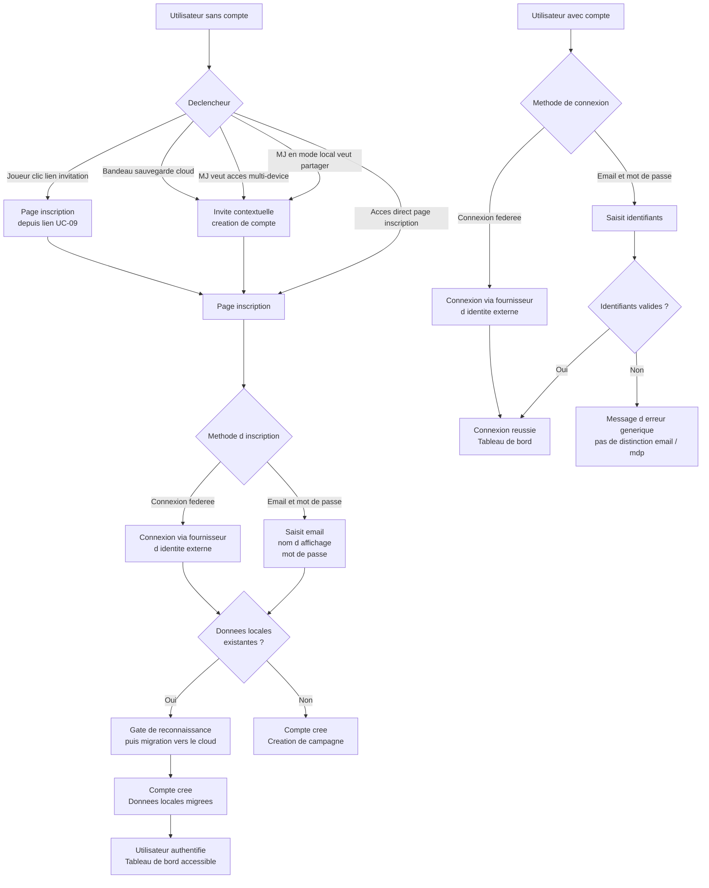
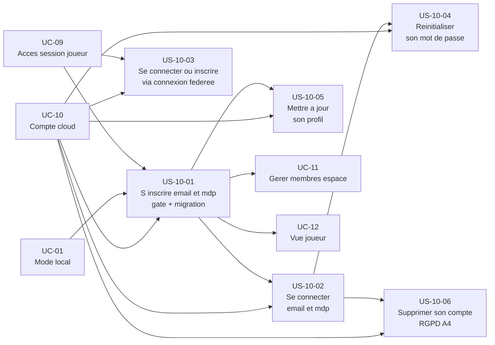

# Epic — Créer un compte et synchroniser dans le cloud (UC-10)

## Objectif utilisateur

Permettre à un utilisateur (MJ ou joueur) de créer un compte pour activer la synchronisation cloud, le partage avec les joueurs et l'accès multi-device. La création de compte est déclenchée par un besoin concret — elle n'est pas imposée au démarrage de l'application.

---

## Personas concernés

| Persona | Motivation principale |
|---|---|
| Émilie (MJ) | Démarre en mode local, passe au cloud pour partager ses campagnes avec ses joueurs |
| Thomas (MJ) | Crée directement un compte pour accéder à ses campagnes depuis plusieurs appareils |
| Lucas (joueur) | Crée un compte depuis un lien d'invitation pour conserver ses notes entre sessions |

---

## Use cases couverts

- **UC-10** — Créer un compte et synchroniser dans le cloud
  - Nominal 1 : inscription email + mot de passe avec gate de reconnaissance et migration des données locales
  - Nominal 2 : inscription sans données locales
  - Nominal 3 : connexion avec email + mot de passe
  - Nominal 4 : connexion via un fournisseur d'identité externe (connexion fédérée)
  - A1 : réinitialisation du mot de passe
  - A2 : mise à jour du profil (nom d'affichage)
  - A3 : joueur invité créant un compte depuis un lien d'invitation (lié à UC-09)
  - A4 : suppression du compte (droit à l'effacement RGPD)
  - E1 : email déjà utilisé
  - E2 : identifiants invalides
  - E3 : lien de réinitialisation expiré
  - E4 : suppression bloquée (propriétaire d'espaces `CAMPAIGN`/`ONE_SHOT` actifs)

---

## Priorité MoSCoW

La priorité MoSCoW se lit exclusivement au grain du use case, dans [`moscow.md`, § UC-10 — Créer un compte et synchroniser dans le cloud](../vision/moscow.md) — seule autorité du corpus pour l'attribuer (voir [`docs/conception/README.md`, § Ordre d'autorité entre artefacts](../../README.md), point 1 : les use cases sont la source de vérité du besoin, les user stories en dérivent et s'y conforment). Cette fiche ne répartit donc pas de priorité propre par story : une répartition au grain story recopierait une valeur que seul `moscow.md` a l'autorité d'accorder, et qu'une révision ultérieure de ce document laisserait alors périmée ici sans le savoir.

---

## Bounded contexts

- **Identity & Access** — gère les comptes `User`, authentification (adresse de messagerie et mot de passe, connexion fédérée), sessions, réinitialisation de mot de passe.
- **Space Management** — reçoit la notification de création de compte pour initialiser le tableau de bord.

## Liens ADR

- [ADR-015 — Sécurité authentification MVP](../../../architecture/decisions/ADR-015-securite-authentification-mvp.md) — trace du raisonnement sur validation d'adresse, liaison d'un compte via connexion fédérée, réinitialisation de mot de passe.
- [ADR-016 — Sérialisation locale et contrat de migration local→cloud](../../../architecture/decisions/ADR-016-serialisation-locale-migration.md) — raisonnement et alternatives pour le gate de confirmation avant migration des données locales, parcours d'échec par espace, conservation des données intactes.

---

## Vue d'ensemble Mermaid



---

## Diagramme de dépendances



---

## User stories

### US-10-01 — S'inscrire avec email et mot de passe

**En tant que** MJ ou joueur,
**je veux** créer un compte avec mon email et un mot de passe,
**afin de** activer la synchronisation cloud, le partage avec mes joueurs et l'accès multi-device.

**Notes de conception** :
- Si des données locales existent (UC-01), un **gate de reconnaissance** est présenté avant la migration : l'application affiche les espaces détectés (titre, volume, date) et affiche pour chaque espace l'historique de session qu'il contient (sessions terminées, notes de session, documents épinglés, résumés). Le gate signale aussi toute session en cours (LIVE) en indiquant qu'elle doit être clôturée pour que l'espace puisse migrer. L'application demande une confirmation explicite avant l'import. La migration n'est déclenchée qu'après cette confirmation. Cette confirmation est une exigence du système : aucune migration ne peut démarrer sans elle, quel que soit le moyen par lequel elle est déclenchée. Le passage par l'écran de présentation n'est pas le seul garde-fou — le système rejette toute demande de migration dépourvue de cette confirmation. Cette exigence vise à prévenir qu'un utilisateur s'approprie par inadvertance les données créées par quelqu'un d'autre sur un poste partagé en confirmant sans les reconnaître : en voyant précisément ce qui va être importé (y compris l'historique de session), il peut interrompre avant l'import. Si certains espaces sont refusés lors de la migration (en raison d'un contenu invalide, d'un intitulé en conflit avec un contenu existant, d'un type ou d'un format non reconnu), un rapport détaille la raison du refus pour chacun, et les données locales correspondantes restent intactes dans le navigateur ; les espaces acceptés sont migrés et accessibles avec tout leur historique de session. Le raisonnement ayant conduit à ce choix (et les alternatives écartées) est tracé dans [ADR-016](../../../architecture/decisions/ADR-016-serialisation-locale-migration.md) §4.
- Un joueur invité (`GuestAccess`) qui crée un compte via un lien d'invitation (A3, UC-09) voit ses notes personnelles (`PLAYER_PRIVATE`) migrées vers son nouveau compte dans le même flux.
- Identity & Access crée le `User` et publie un événement de domaine. Space Management initialise le tableau de bord en réponse.
- Le mot de passe est hashé en infrastructure — le domaine ne le connaît pas.
- L'accès est immédiat après inscription. La validation de l'adresse de messagerie n'est pas bloquante à la connexion, mais est requise avant les opérations sensibles (modification de l'adresse de messagerie, modification du mot de passe, liaison d'un compte via connexion fédérée, effacement RGPD) — voir RB-10-05.

**Règles métier** :
- RB-10-01 : L'email est unique dans le système. Une tentative d'inscription avec un email déjà utilisé est rejetée avec un message explicite (E1).
- RB-10-02 : Le mot de passe est hashé en infrastructure. Le domaine `User` ne manipule pas le mot de passe en clair.
- RB-10-03 : Un `User` n'a pas de rôle global. Le rôle MJ ou Joueur est défini dans chaque espace partagé (`CAMPAIGN` ou `ONE_SHOT`).
- RB-10-04 : Avant la migration des données locales vers le cloud, l'application présente les données détectées (titres des espaces, volume estimé, date de création) et affiche pour chaque espace son historique de session : les sessions terminées, les notes de session attachées, les documents épinglés, les résumés. Le gate signale toute session en cours (statut LIVE) en indiquant qu'elle doit être clôturée avant que l'espace puisse migrer. L'application requiert une confirmation explicite de l'utilisateur. La migration ne démarre qu'après cette confirmation. Cette confirmation est une exigence du système : aucune migration ne peut démarrer sans elle, quel que soit le moyen par lequel elle est déclenchée. Cette confirmation est nécessaire même en l'absence de preuve d'appartenance formelle (pas de compte local enregistré, poste potentiellement partagé), et elle vise à prévenir qu'un utilisateur s'approprie par inadvertance les données créées par quelqu'un d'autre en confirmant sans les reconnaître. En cas de rejet d'un espace lors de la migration (contenu invalide, intitulé en conflit avec un contenu existant, type ou format non reconnu), un rapport détaille la raison du refus pour chacun ; les données locales correspondantes restent intactes dans le navigateur, et les espaces acceptés sont migrés et accessibles. Ce gate borne le risque d'accident ou d'inattention ; il ne constitue pas une preuve d'appartenance des données. Un utilisateur physiquement présent devant le poste peut confirmer l'import de données qui ne lui appartiennent pas.
- RB-10-05 : L'accès est immédiat après inscription ; la validation de l'adresse de messagerie n'est pas bloquante à la connexion. L'adresse de messagerie est validée de manière non bloquante après inscription. La validation de l'adresse de messagerie est cependant requise avant les opérations sensibles (modification de l'adresse de messagerie, modification du mot de passe, liaison d'un compte via connexion fédérée, demande d'effacement des données personnelles). Cette validation est une exigence du système : le système refuse toute opération sensible tant que l'adresse de messagerie n'est pas validée, quel que soit le moyen par lequel l'opération est déclenchée. Un utilisateur qui s'inscrit via connexion fédérée n'a pas besoin de revalider son adresse de messagerie si elle est déjà tenue pour vérifiée par le fournisseur d'identité.

**Critères d'acceptation** :
- [ ] Le formulaire d'inscription exige email, nom d'affichage et mot de passe.
- [ ] Un compte est créé et l'utilisateur est authentifié immédiatement après soumission.
- [ ] Si des données locales existent, l'application présente les espaces détectés (titre, volume estimé, date de création) et affiche pour chaque espace son historique de session (sessions terminées, notes de session, documents épinglés, résumés), demande une confirmation explicite avant de démarrer la migration (gate de reconnaissance), et signale toute session en cours (LIVE) à clôturer avant que l'espace puisse migrer.
- [ ] La migration ne démarre qu'après confirmation explicite de l'utilisateur. Aucune migration ne peut démarrer sans cette confirmation, même si elle est déclenchée par un autre moyen que l'interface utilisateur.
- [ ] En cas de rejet d'un espace lors de la migration (contenu invalide, intitulé en conflit avec un contenu existant, type ou format non reconnu), un rapport détaille la raison du refus pour chacun et les données locales correspondantes sont conservées intactes dans le navigateur.
- [ ] L'utilisateur retrouve son espace de travail intact pour les espaces migrés avec succès, avec tout leur historique de session (sessions passées consultables, notes et documents épinglés en place).
- [ ] Un email déjà utilisé déclenche l'erreur E1 avec un message explicite.
- [ ] Aucune validation de l'adresse de messagerie ne bloque la connexion. La validation de l'adresse de messagerie est requise avant les opérations sensibles (modification de l'adresse de messagerie, modification du mot de passe, liaison d'un compte via connexion fédérée, effacement RGPD). Le système refuse ces opérations tant que l'adresse de messagerie n'est pas validée, quel que soit le moyen de déclenchement.
- [ ] Un nouvel inscrit sans données locales à migrer est redirigé directement vers l'écran de création de campagne, sans écran de bienvenue intercalé (UC-10 fait foi sur cette cible). Un utilisateur dont des données locales ont été migrées retrouve son espace de travail synchronisé et est redirigé vers son tableau de bord.

```gherkin
Scénario : Inscription depuis le mode local avec données locales (nominal 1)
  Étant donné qu'Émilie utilise l'application en mode local
  Et qu'elle a créé deux espaces et plusieurs documents localement
  Et qu'elle a également conduit des sessions en mode local avec des notes et documents épinglés
  Quand elle clique sur l'invite de sauvegarde cloud
  Et qu'elle saisit son email, son nom d'affichage et un mot de passe
  Et qu'elle soumet le formulaire d'inscription
  Alors son compte est créé immédiatement
  Et l'application lui présente les espaces locaux détectés avec titre, volume et date
  Et elle voit aussi pour chaque espace son historique de session (sessions terminées, notes, documents épinglés)
  Et elle confirme explicitement la migration
  Et ses espaces, documents et historique de session locaux sont migrés vers le cloud
  Et elle retrouve son espace de travail intact, maintenant synchronisé
  Et ses sessions passées sont consultables, ses notes et épinglés sont en place

Scénario : Inscription sans données locales (nominal 2)
  Étant donné que Thomas accède directement à la page d'inscription
  Et qu'il n'a pas de données locales
  Quand il saisit son email, son nom d'affichage et un mot de passe
  Et qu'il soumet le formulaire
  Alors son compte est créé immédiatement
  Et il est redirigé vers l'écran de création de campagne

Scénario : Email déjà utilisé lors de l'inscription (E1)
  Étant donné qu'un compte existe avec l'email "emilie@exemple.fr"
  Quand un utilisateur tente de s'inscrire avec ce même email
  Alors le système refuse la création
  Et un message indique que l'adresse est déjà associée à un compte

Scénario : Joueur invité crée un compte depuis un lien d'invitation (A3)
  Étant donné que Lucas a accès à une session en tant qu'invité GuestAccess
  Et qu'il a pris des notes personnelles pendant la session
  Quand il clique sur "Créer un compte" depuis la vue invitée
  Et qu'il complète le formulaire d'inscription
  Alors son GuestAccess est rattaché à son nouveau compte
  Et ses notes personnelles PLAYER_PRIVATE sont migrées sans perte
```

---

### US-10-02 — Se connecter avec email et mot de passe

**En tant que** utilisateur avec un compte,
**je veux** me connecter avec mon email et mon mot de passe,
**afin de** accéder à mes espaces et données synchronisées.

**Notes de conception** :
- Le message d'erreur sur identifiants invalides est générique — pas de distinction entre email inconnu et mot de passe incorrect (sécurité).
- Un compte suspendu ou supprimé (`status = SUSPENDED` ou `status = DELETED`) ne peut pas se connecter.

**Règles métier** :
- RB-10-06 : Les identifiants invalides (email inconnu ou mot de passe incorrect) déclenchent le même message d'erreur générique (E2) — pas de distinction pour raisons de sécurité.
- RB-10-07 : Un compte suspendu ou supprimé ne peut pas se connecter.

**Critères d'acceptation** :
- [ ] Le formulaire de connexion exige email et mot de passe.
- [ ] Une connexion réussie redirige l'utilisateur vers son tableau de bord.
- [ ] Des identifiants invalides affichent un message d'erreur générique, sans préciser si l'email ou le mot de passe est incorrect.
- [ ] Un compte suspendu ou supprimé ne peut pas se connecter et reçoit un message approprié.

```gherkin
Scénario : Connexion avec identifiants valides (nominal 3)
  Étant donné qu'Émilie a un compte actif
  Quand elle saisit son email et son mot de passe corrects
  Et qu'elle soumet le formulaire de connexion
  Alors elle est authentifiée
  Et elle est redirigée vers son tableau de bord

Scénario : Identifiants invalides (E2)
  Étant donné qu'un utilisateur tente de se connecter
  Quand il saisit un mot de passe incorrect
  Alors le système affiche un message d'erreur générique
  Et le message ne précise pas si c'est l'email ou le mot de passe qui est incorrect

Scénario : Connexion avec un compte suspendu
  Étant donné qu'un compte a le statut SUSPENDED
  Quand l'utilisateur tente de se connecter
  Alors la connexion est refusée
  Et un message indique que le compte est suspendu
```

---

### US-10-03 — Se connecter ou s'inscrire via un fournisseur d'identité externe

**En tant que** MJ ou joueur,
**je veux** me connecter ou créer un compte via un fournisseur d'identité externe (connexion fédérée),
**afin de** accéder à l'application sans gérer un mot de passe supplémentaire.

**Notes de conception** :
- La connexion fédérée est incluse dans le MVP comme méthode d'authentification aux côtés de l'adresse de messagerie et du mot de passe. Le choix du ou des fournisseurs est tracé dans ADR-015.
- Si l'adresse de messagerie fournie par le fournisseur d'identité correspond à un compte existant créé par adresse de messagerie et mot de passe, le traitement se distingue en trois branches selon l'état de ce compte préexistant — voir RB-10-08 : (a) adresse **vérifiée** → liaison au compte existant ; (b) adresse **non vérifiée** → ni liaison automatique (anti-hijacking, CWE-287), ni création d'un doublon (violerait l'invariant 1 email-unique) — **point ouvert, résolution non ratifiée** ; (c) aucun compte existant → création normale.
- Si des données locales existent au moment de la première connexion fédérée (création de compte), le même gate de reconnaissance s'applique : l'application présente les espaces détectés (titre, volume estimé, date de création) et demande une confirmation explicite avant l'import. La migration ne démarre qu'après cette confirmation, qui est une exigence du système quel que soit le moyen par lequel elle est déclenchée. En cas de rejet de certains espaces, un rapport détaille la raison du refus pour chacun, les données locales correspondantes restent intactes, et les espaces acceptés sont migrés.

**Règles métier** :
- RB-10-08 : Quand un utilisateur tente de se connecter ou s'inscrire via connexion fédérée, le traitement se distingue selon l'état du compte associé à l'adresse de messagerie fournie par le fournisseur d'identité, en **trois branches exhaustives** :
  - **(a) Email correspondant à un compte existant dont l'adresse est VÉRIFIÉE** : la connexion fédérée est rattachée au compte existant (`LinkFederatedIdentity()`, précondition `emailVerified = true` satisfaite — invariant 7, cf. [Identity & Access](../../domain/identity-access.md)). Aucun doublon n'est créé.
  - **(b) Email correspondant à un compte existant dont l'adresse N'EST PAS VÉRIFIÉE** : le rattachement automatique est refusé — **anti-hijacking (finding F-11, CWE-287 — Improper Authentication)** : une adresse jamais confirmée par son détenteur peut avoir été renseignée par n'importe qui ; autoriser le rattachement automatique permettrait à un tiers connaissant cette adresse d'en prendre le contrôle via un fournisseur d'identité externe sans avoir prouvé qu'il la détient réellement. **Symétriquement, la création d'un nouveau compte est exclue** : elle produirait deux comptes actifs pour la même adresse, ce qui violerait l'invariant 1 (email unique, cf. [Identity & Access](../../domain/identity-access.md)). Aucune des deux issues classiques (liaison automatique, doublon silencieux) n'étant admissible, la résolution exacte de ce cas est **[À TRANCHER — sécurité/RGPD]**, non ratifiée à ce stade :
    - **Proposition documentée (non retenue par défaut) : Option A « reclaim-in-place »** — la preuve de possession apportée par le fournisseur d'identité externe fait basculer la coquille non vérifiée en compte réclamé : `emailVerified` passe à `true`, la connexion fédérée est liée à ce compte, et le credential mot de passe préexistant est neutralisé (réécriture du hash et invalidation, sur le précédent déjà établi par [ADR-007](../../../architecture/decisions/ADR-007-rgpd-autorisation-api.md) §Compléments post-revue pour la neutralisation de credential). Le résultat est observationnellement identique à une création de compte fédéré ordinaire côté utilisateur — aucun canal d'énumération n'est ouvert (CWE-204 — Observable Response Discrepancy, déjà fermé par le refus silencieux de ce cas).
    - **Explicitement écartés de la discussion** : le refus non-silencieux de la tentative (rouvrirait le canal d'énumération CWE-204) et l'attribution d'un email synthétique/technique à la nouvelle identité (mécanisme de repli terminal, inadapté à une identité vivante appelée à être utilisée normalement).
    - **Répartition du travail restant, à router explicitement** : la ratification de la posture sécurité (Option A ou alternative) reste à trancher côté sécurité ; le sort de la coquille non vérifiée et de son contenu éventuel relève d'une facette RGPD distincte et est routé au **cadrage juridique interne** ; l'opération de domaine elle-même (nom, signature, invariants precis) reste à spécifier au **build (B1.5)**, une fois la posture ratifiée.
    - Tant que ce point n'est pas tranché, aucune implémentation ne doit présumer de l'une ou l'autre issue, et aucun scénario ne doit affirmer la création d'un compte supplémentaire pour ce cas (cela violerait l'invariant 1).
  - **(c) Email ne correspondant à aucun compte existant** : création normale d'un compte fédéré (cf. RB-10-09).
- RB-10-09 : La création de compte via connexion fédérée suit les mêmes règles de gate de reconnaissance avant migration que l'inscription par adresse de messagerie et mot de passe (RB-10-04) : l'application présente les espaces locaux détectés (titre, volume estimé, date de création) ainsi que pour chaque espace son historique de session (sessions terminées, notes de session, documents épinglés, résumés), signale toute session en cours (LIVE) à clôturer avant migration, requiert une confirmation explicite de l'utilisateur avant l'import, et cette confirmation est une exigence du système quel que soit le moyen de déclenchement. En cas de rejet de certains espaces, un rapport détaille la raison du refus pour chacun, les données locales correspondantes restent intactes, et les espaces acceptés sont migrés avec tout leur historique de session.
- RB-10-10 : Un `User` authentifié uniquement via connexion fédérée ne dispose pas d'un mot de passe dans le système. Deux opérations distinctes s'appliquent à ce compte : (a) la **réinitialisation** d'un mot de passe (A1, US-10-04) reste **sans objet (N/A)** — il n'existe aucun mot de passe à réinitialiser ; (b) la **définition d'un premier mot de passe complémentaire** est en revanche **autorisée** et fait de ce compte un compte hybride (identité fédérée + mot de passe), permettant d'éviter un verrouillage permanent si l'accès au fournisseur d'identité est perdu. Cette définition est une **opération sensible** : elle exige `emailVerified = true` (comme les autres opérations sensibles, cf. RB-10-05) et, faute de mot de passe existant à faire saisir, une **preuve d'identité alternative** — une ré-authentification récente et complète auprès du fournisseur d'identité fédéré (CWE-620 — Unverified Password Change). Raisonnement détaillé et garanties : [ADR-015](../../../architecture/decisions/ADR-015-securite-authentification-mvp.md) §1.4 et le modèle de domaine [Identity & Access](../../domain/identity-access.md) (`SetInitialPassword()`, invariant 7, règle métier n°6).

**Critères d'acceptation** :
- [ ] Le bouton de connexion fédérée est disponible sur les pages de connexion et d'inscription.
- [ ] Un premier accès via connexion fédérée crée automatiquement un compte.
- [ ] Un accès fédéré avec une adresse de messagerie déjà présente dans le système est lié au compte existant uniquement si l'adresse de messagerie de ce compte est vérifiée (branche a, RB-10-08). Si non vérifiée (branche b), la liaison automatique est refusée et **aucun doublon n'est créé** ; la résolution exacte de ce cas reste `[À TRANCHER — sécurité/RGPD]` (RB-10-08) et ne peut donc pas encore faire l'objet d'un critère d'acceptation testable — voir la proposition Option A et son routage (sécurité / cadrage juridique interne / build B1.5).
- [ ] Si des données locales existent, le gate de reconnaissance est présenté avec les espaces détectés (titre, volume estimé, date de création), et la migration ne démarre qu'après confirmation explicite de l'utilisateur. Aucune migration ne peut démarrer sans cette confirmation, même si elle est déclenchée par un autre moyen que l'interface utilisateur.
- [ ] Un premier accès fédéré sans données locales à migrer est redirigé directement vers l'écran de création de campagne, sans écran de bienvenue intercalé (cohérent avec le scénario « Inscription sans données locales », UC-10 fait foi). Un premier accès fédéré avec données locales migrées, ou un utilisateur récurrent authentifié via connexion fédérée, est redirigé vers son tableau de bord.

```gherkin
Scénario : Première connexion fédérée sans données locales — création de compte (nominal 4)
  Étant donné que Thomas n'a pas de compte Haversack
  Et qu'il n'a pas de données locales
  Quand il clique sur le bouton de connexion via fournisseur d'identité externe
  Et qu'il autorise l'accès via son fournisseur
  Alors un compte User est créé avec son adresse de messagerie
  Et il est redirigé vers l'écran de création de campagne

Scénario : Connexion fédérée avec adresse de messagerie déjà présente — adresse vérifiée
  Étant donné qu'Émilie a un compte existant avec l'adresse "emilie@exemple.fr" et que cette adresse est vérifiée
  Quand elle se connecte via son fournisseur d'identité avec cette même adresse
  Alors la connexion fédérée est liée à son compte existant
  Et elle accède à son tableau de bord sans créer un doublon

Scénario : Connexion fédérée avec adresse de messagerie déjà présente — adresse non vérifiée (branche b, RB-10-08 — résolution ouverte)
  Étant donné qu'un compte existe avec l'adresse "emilie@exemple.fr" mais que cette adresse n'est pas vérifiée
  Quand elle se connecte via son fournisseur d'identité avec cette même adresse
  Alors la liaison automatique au compte existant est refusée (anti-hijacking, CWE-287)
  Et aucun nouveau compte n'est créé pour cette même adresse (invariant 1, email unique)
  Et aucune indication ne révèle l'existence du compte préexistant (non-révélation, CWE-204)
  Et le traitement exact de la coquille non vérifiée reste [À TRANCHER - sécurité/RGPD] (RB-10-08 branche b) : ce scénario ne préjuge pas de l'issue (proposition Option A "reclaim-in-place" documentée mais non ratifiée)

Scénario : Connexion fédérée avec données locales existantes
  Étant donné qu'un utilisateur a des données locales
  Quand il s'inscrit pour la première fois via son fournisseur d'identité externe
  Alors l'application lui présente les espaces locaux détectés avec titre, volume et date
  Et il confirme explicitement la migration
  Et ses données locales sont migrées vers le cloud
  Et il retrouve son espace de travail intact
```

---

### US-10-04 — Réinitialiser son mot de passe

**En tant que** utilisateur avec un compte email et mot de passe,
**je veux** pouvoir réinitialiser mon mot de passe en cas d'oubli,
**afin de** retrouver l'accès à mon compte sans intervention manuelle.

**Notes de conception** :
- Identity & Access gère la génération et la validation des tokens de réinitialisation.
- Le token de réinitialisation est temporaire et à usage unique.
- Cette fonctionnalité ne s'applique pas aux comptes créés uniquement via connexion fédérée (pas de mot de passe dans le système).

**Règles métier** :
- RB-10-11 : Un email de réinitialisation est envoyé si l'email est associé à un compte actif. Aucune information n'est révélée si l'email est inconnu (même message de confirmation).
- RB-10-12 : Le lien de réinitialisation expire au plus 15 minutes après son émission. Il ne peut servir qu'une seule fois, qu'il ait abouti ou non. L'émission d'un nouveau lien invalide tous les liens précédents (l'accumulation de liens actifs élargirait la fenêtre d'utilisation frauduleuse). Un lien expiré déclenche l'erreur E3.
- RB-10-13 : Après réinitialisation réussie, l'ancien mot de passe est invalidé immédiatement.

**Critères d'acceptation** :
- [ ] L'utilisateur peut demander un email de réinitialisation depuis la page de connexion.
- [ ] Un email contenant un lien de réinitialisation est envoyé si le compte existe.
- [ ] Le message de confirmation après soumission est identique qu'un compte existe ou non (pas de fuite d'information).
- [ ] Le lien de réinitialisation expire après une durée définie.
- [ ] Un lien expiré affiche un message explicite et propose d'en générer un nouveau (E3).
- [ ] Après réinitialisation, l'utilisateur peut se connecter avec son nouveau mot de passe.

```gherkin
Scénario : Réinitialisation du mot de passe (A1)
  Étant donné qu'Émilie a oublié son mot de passe
  Quand elle clique sur "Mot de passe oublié" et saisit son email
  Alors le système lui envoie un email avec un lien de réinitialisation temporaire
  Et le message de confirmation est le même que si l'email n'existait pas

Scénario : Lien de réinitialisation expiré (E3)
  Étant donné qu'Émilie a reçu un lien de réinitialisation
  Et que le lien a expiré
  Quand elle clique sur le lien
  Alors le système l'informe que le lien n'est plus valide
  Et il lui propose de générer un nouveau lien

Scénario : Réinitialisation réussie
  Étant donné qu'Émilie utilise un lien de réinitialisation valide
  Quand elle saisit et confirme un nouveau mot de passe
  Alors son mot de passe est mis à jour
  Et l'ancien mot de passe est immédiatement invalide
  Et elle est redirigée vers la page de connexion
```

---

### US-10-05 — Mettre à jour son profil

**En tant que** utilisateur authentifié,
**je veux** pouvoir modifier mon nom d'affichage,
**afin de** garder mes informations à jour dans l'application.

**Notes de conception** :
- La mise à jour du nom d'affichage est la seule modification de profil couverte dans le MVP.
- Identity & Access met à jour le `User`. Le nouveau nom d'affichage est propagé aux bounded contexts qui l'affichent (Space Management, Session Conduct).
- La modification du mot de passe est également couverte dans ce flux pour les comptes email/password.

**Règles métier** :
- RB-10-14 : Le nom d'affichage est modifiable à tout moment par l'utilisateur authentifié.
- RB-10-15 : La modification du mot de passe requiert la saisie du mot de passe actuel (confirmation d'identité).
- RB-10-16 : Le nouveau nom d'affichage est visible dans tous les espaces partagés (`CAMPAIGN` ou `ONE_SHOT`) auxquels l'utilisateur participe.

**Critères d'acceptation** :
- [ ] L'utilisateur peut modifier son nom d'affichage depuis la page profil.
- [ ] Le nouveau nom d'affichage est appliqué immédiatement dans l'ensemble de l'application.
- [ ] L'utilisateur peut modifier son mot de passe en saisissant l'ancien puis le nouveau.
- [ ] La modification est sauvegardée avec confirmation visuelle.

```gherkin
Scénario : Mise à jour du nom d'affichage (A2)
  Étant donné qu'Émilie est connectée à son compte
  Quand elle accède à sa page profil
  Et qu'elle modifie son nom d'affichage et sauvegarde
  Alors le nouveau nom est appliqué immédiatement
  Et il est visible dans tous ses espaces partagés

Scénario : Modification du mot de passe
  Étant donné que Thomas est connecté à son compte
  Quand il accède à sa page profil
  Et qu'il saisit son mot de passe actuel et un nouveau mot de passe
  Et qu'il sauvegarde
  Alors son mot de passe est mis à jour
  Et il reçoit une confirmation visuelle
```

---

### US-10-06 — Supprimer son compte (droit à l'effacement RGPD)

**En tant que** utilisateur authentifié dont l'adresse de messagerie est validée,
**je veux** pouvoir demander la suppression définitive de mon compte,
**afin de** exercer mon droit à l'effacement conformément au RGPD (article 17).

**Notes de conception** :
- La suppression est soumise à la validation préalable de l'adresse de messagerie (RB-10-05) : le système refuse la demande si l'adresse n'est pas vérifiée.
- L'utilisateur doit d'abord gérer ses espaces `CAMPAIGN`/`ONE_SHOT` avec des membres actifs (MVP : exclure les membres ou supprimer ces espaces ; post-MVP : transfert de propriété) avant de pouvoir supprimer son compte. Son espace personnel (`PERSONAL`), mono-membre et propre à son compte, n'est jamais concerné par ce blocage — il est purgé avec le compte, sans transfert possible.
- La séquence d'effacement couvre : suppression physique de tout `Document` dont la confidentialité (`visibility`) est `PLAYER_PRIVATE` et qui a été créé par l'utilisateur — quel qu'en soit le type de document, y compris ceux rattachés aux personnages qu'il incarnait dans les espaces vivants où il était membre —, anonymisation des données nominatives, suppression ou transfert des espaces `CAMPAIGN`/`ONE_SHOT` dont il est propriétaire, purge inconditionnelle de son espace personnel (`PERSONAL`), désactivation du compte. Détail : UC-10 §A4.
- La suppression est irréversible.

**Règles métier** :
- RB-10-05 (rappel) : la demande d'effacement est une opération sensible — elle requiert que l'adresse de messagerie soit validée.
- RB-10-17 : Un utilisateur propriétaire d'espaces `CAMPAIGN`/`ONE_SHOT` avec des membres actifs ne peut pas supprimer son compte tant qu'il n'a pas géré ces espaces (MVP : exclure les membres ou supprimer l'espace ; post-MVP : transfert de propriété). Cette contrainte ne porte pas sur son espace personnel (`PERSONAL`), mono-membre, qui n'a pas de membres actifs au sens de cette règle et se purge inconditionnellement avec le compte (RB-10-18d).
- RB-10-18 : La séquence d'effacement est : (a) suppression physique de tout `Document` dont la confidentialité (`visibility`) est `PLAYER_PRIVATE` et qui a été créé par l'utilisateur supprimé, quel qu'en soit le type de document — c'est la confidentialité, et non le type, qui fonde cette obligation d'effacement (RGPD article 17). Cette suppression couvre aussi les documents `PLAYER_PRIVATE` que l'utilisateur a créés et rattachés aux personnages qu'il incarnait dans les espaces vivants où il était membre, afin d'éviter qu'un document résiduel ne soit exposé à un futur joueur réassocié au personnage — la fiche du personnage elle-même survit et reste ré-associable ; (b) anonymisation des données nominatives dans toutes les tables ; (c) suppression ou transfert des espaces `CAMPAIGN`/`ONE_SHOT` dont il est propriétaire selon le cas ; (d) purge inconditionnelle de son espace personnel (`PERSONAL`), mono-membre et propre à son compte, sans transfert possible ; (e) désactivation du compte (`status = DELETED`). Les contenus partagés (`PUBLIC`, `GM_ONLY`) d'un espace `CAMPAIGN`/`ONE_SHOT` restent conservés sous identité anonymisée — ils appartiennent à l'espace, pas à l'individu ; seul le contenu de l'espace `PERSONAL` est purgé. La suppression est irréversible.

**Critères d'acceptation** :
- [ ] L'utilisateur peut demander la suppression de son compte depuis sa page profil, uniquement si son adresse de messagerie est validée.
- [ ] Avant la suppression, le système affiche les conséquences (espaces `CAMPAIGN`/`ONE_SHOT` potentiellement orphelins, documents `PLAYER_PRIVATE` qui seront supprimés physiquement quel qu'en soit leur type, espace personnel qui sera purgé, données nominatives qui seront anonymisées).
- [ ] La suppression est bloquée si l'utilisateur est propriétaire d'espaces `CAMPAIGN`/`ONE_SHOT` avec des membres actifs ; le système indique les espaces concernés (E4).
- [ ] Après confirmation explicite, la séquence d'effacement est exécutée : tout document `PLAYER_PRIVATE` créé par l'utilisateur est supprimé physiquement (quel qu'en soit le type, y compris ceux rattachés aux personnages qu'il incarnait dans les espaces vivants où il était membre), les données nominatives sont anonymisées, l'espace personnel est purgé, le compte est désactivé.
- [ ] L'utilisateur est déconnecté et redirigé vers la page d'accueil après suppression.

```gherkin
Scénario : Suppression de compte (A4 nominal)
  Étant donné qu'Émilie est authentifiée et que son adresse de messagerie est validée
  Et qu'elle n'a pas d'espace CAMPAIGN ou ONE_SHOT avec des membres actifs
  Quand elle accède à sa page profil et demande la suppression de son compte
  Et qu'elle prend connaissance des conséquences affichées
  Et qu'elle confirme la suppression
  Alors tout document PLAYER_PRIVATE qu'elle a créé est supprimé physiquement, quel qu'en soit le type
  Et ses données nominatives sont anonymisées dans toutes les tables
  Et son espace personnel est purgé avec le compte
  Et son compte est désactivé avec le statut DELETED
  Et elle est déconnectée et redirigée vers la page d'accueil

Scénario : Suppression de compte — documents PLAYER_PRIVATE rattachés à un personnage dans un espace tiers
  Étant donné que Nadia est authentifiée et que son adresse de messagerie est validée
  Et qu'elle est simple membre (joueuse), non propriétaire, de la campagne "Les Ombres du Passé"
  Et qu'elle a créé des documents PLAYER_PRIVATE rattachés au personnage qu'elle y incarnait
  Quand elle demande la suppression de son compte et confirme après avoir pris connaissance des conséquences
  Alors ses documents PLAYER_PRIVATE rattachés à ce personnage sont supprimés physiquement
  Et la fiche du personnage survit dans la campagne "Les Ombres du Passé"
  Et ce personnage reste ré-associable à un autre joueur

Scénario : Suppression bloquée — propriétaire d'un espace CAMPAIGN ou ONE_SHOT actif (E4)
  Étant donné que Thomas est authentifié et que son adresse de messagerie est validée
  Et qu'il est propriétaire d'un espace CAMPAIGN ou ONE_SHOT avec des membres actifs
  Quand il demande la suppression de son compte
  Alors le système bloque la suppression
  Et il indique les espaces concernés
  Et il lui demande de gérer ces espaces avant de pouvoir supprimer son compte

Scénario : Suppression bloquée — adresse de messagerie non validée
  Étant donné qu'un utilisateur est authentifié mais que son adresse de messagerie n'est pas validée
  Quand il tente de demander la suppression de son compte
  Alors le système refuse la demande
  Et il lui indique que la validation de son adresse de messagerie est requise avant cette opération
```

---

## Stories exclues ou repoussées

| Story / Feature | Raison |
|---|---|
| Validation de l'adresse de messagerie bloquante à la connexion | Choix produit : accès immédiat après inscription. La validation de l'adresse de messagerie est requise uniquement avant les opérations sensibles (modification de l'adresse de messagerie, modification du mot de passe, liaison via connexion fédérée, effacement RGPD) — voir RB-10-05. |
| Connexion via fournisseur d'identité additionnel (ex. Apple) | Hors scope MVP — pourra etre ajoute post-MVP. |
| Gestion de la double authentification (2FA) | Hors scope MVP — securite applicative non prioritaire a ce stade. |
| Suspension de compte (gestion admin) | Hors scope MVP — administration manuelle. |
| Transfert de propriété d'espaces `CAMPAIGN`/`ONE_SHOT` à un membre actif lors de la suppression | Post-MVP. Dans le MVP, la suppression est bloquée tant que l'utilisateur a des espaces `CAMPAIGN`/`ONE_SHOT` avec des membres actifs — il doit d'abord les gérer (UC-10 §E4). |

---

## Ordre de livraison recommandé

1. **US-10-01** — Inscription adresse de messagerie + mot de passe (fondation de toutes les autres stories)
2. **US-10-02** — Connexion adresse de messagerie + mot de passe (complète le cycle d'authentification de base)
3. **US-10-03** — Connexion / inscription via connexion fédérée (reduction de friction a l'adoption)
4. **US-10-04** — Réinitialisation du mot de passe (filet de sécurité indispensable)
5. **US-10-05** — Mise à jour du profil (confort, livrable en parallèle de US-10-04)
6. **US-10-06** — Suppression du compte (droit à l'effacement RGPD — dépend de US-10-02 pour l'authentification)

---

## Vérification de couverture

| Cas UC-10 | Story couvrant |
|---|---|
| Nominal 1 — inscription avec gate de reconnaissance et migration | US-10-01 |
| Nominal 2 — inscription sans données locales | US-10-01 |
| Nominal 3 — connexion email et mot de passe | US-10-02 |
| Nominal 4 — connexion via fournisseur d'identité externe (connexion fédérée) | US-10-03 |
| A1 — réinitialisation du mot de passe | US-10-04 |
| A2 — mise à jour du profil | US-10-05 |
| A3 — joueur invité créant un compte depuis invitation | US-10-01 |
| A4 — suppression de compte (effacement RGPD) | US-10-06 |
| E1 — email déjà utilisé | US-10-01 |
| E2 — identifiants invalides | US-10-02 |
| E3 — lien de réinitialisation expiré | US-10-04 |
| E4 — suppression bloquée (propriétaire d'espaces `CAMPAIGN`/`ONE_SHOT` actifs) | US-10-06 |

---

## Questions ouvertes

1. ~~Faut-il un écran de bienvenue spécifique pour un nouvel inscrit sans données locales, ou la redirection directe vers la création de campagne est-elle suffisante ?~~ **Clos (Q#1)** — pas d'écran de bienvenue : redirection directe vers l'écran de création de campagne (UC-10 fait foi). Critère d'acceptation US-10-01 aligné en conséquence (la mention antérieure de « tableau de bord » comme cible du nouvel inscrit sans données locales était une dérive vis-à-vis d'UC-10).
2. ~~La modification du mot de passe pour un compte lié via connexion fédérée doit-elle créer un mot de passe en complément, ou rester bloquée ?~~ **Clos (Q#4)** — le mot de passe complémentaire est autorisé. RB-10-10 amendée pour distinguer la réinitialisation d'un mot de passe inexistant (N/A, inchangé) de la définition d'un premier mot de passe (autorisée, opération sensible — `emailVerified` + ré-authentification récente auprès du fournisseur d'identité, cf. ADR-015 §1.4).
3. **Ouverte (Q#5) — [À TRANCHER — sécurité/RGPD]** : quel traitement pour une connexion fédérée dont l'email correspond à un compte existant **non vérifié** (RB-10-08 branche b) ? Ni liaison automatique (anti-hijacking, CWE-287) ni création de doublon (invariant 1) ne sont admissibles. Proposition documentée non ratifiée : Option A « reclaim-in-place » (bascule de la coquille non vérifiée en compte réclamé, neutralisation du credential existant, cf. précédent ADR-007 §Compléments post-revue). Écartés : refus non-silencieux (rouvre CWE-204) et email synthétique. Répartition à router : ratification sécurité de l'option retenue ; facette RGPD (sort de la coquille et de son contenu éventuel) → cadrage juridique interne ; opération de domaine à spécifier → build B1.5. Tant que ce point reste ouvert, aucun scénario ni critère d'acceptation ne doit présumer de l'issue.

