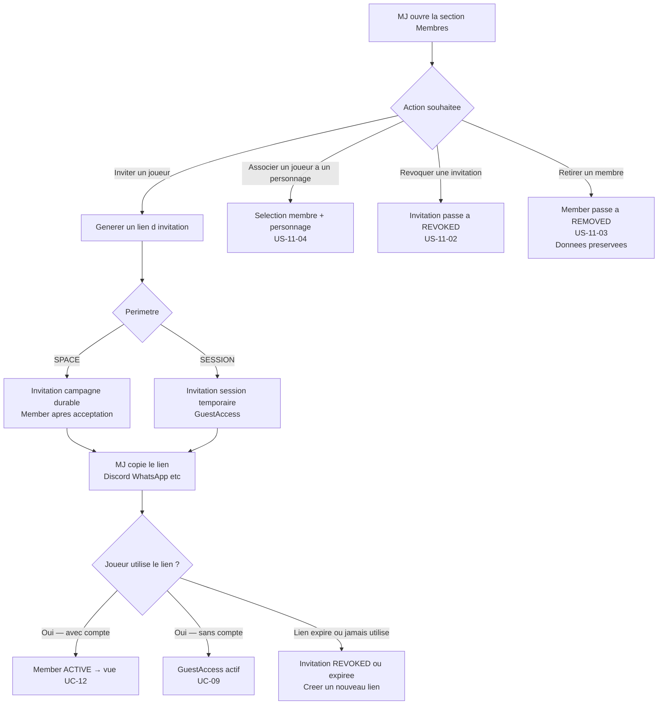
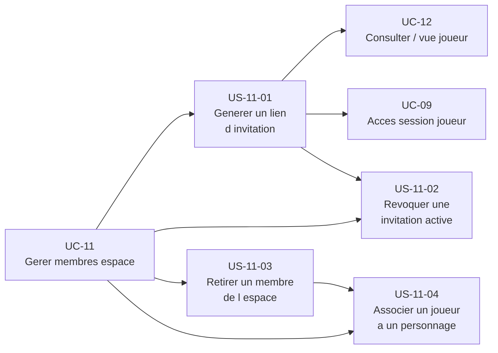

# Epic — Gérer les membres d'un espace partagé (UC-11)

## Objectif utilisateur

Permettre au MJ de contrôler qui accède à son espace : générer des liens d'invitation partageables, associer un joueur à un personnage, révoquer une invitation active, retirer un membre. L'invitation par lien est le seul vecteur MVP — l'invitation par email est hors périmètre.

---

## Personas concernés

| Persona | Motivation principale |
|---|---|
| Émilie | Inviter ses joueurs en 30 secondes via Discord, veut juste un lien à copier sans friction |
| Thomas | Gérer une table stable, associer chaque joueur à son personnage, surveiller les accès actifs |

---

## Use cases couverts

- **UC-11** — Gérer les membres d'un espace partagé (point de vue MJ)
  - Nominal : générer un lien d'invitation (périmètre `SPACE` ou `SESSION`)
  - A1 : associer un joueur à un personnage après qu'il a rejoint
  - A2 : révoquer une invitation active avant qu'elle soit utilisée
  - A3 : retirer un membre de l'espace
  - A4 : lien invité sans compte (`GuestAccess`, lié à UC-09)
  - E1 : joueur déjà membre (doublon détecté)
  - E2 : invitation expirée (pas de réactivation — créer un nouveau lien)

---

## Priorité MoSCoW

| Priorité | Stories |
|---|---|
| Should Have | US-11-01, US-11-02, US-11-03, US-11-04 |

---

## Bounded contexts pressentis

- **Space Management** — gère `Member`, `Invitation`, associations joueur-personnage, liste des membres, statuts.
- **Identity & Access** — valide les tokens d'invitation, crée les `GuestAccess` ou les `Member` à réception du lien.

---

## Vue d'ensemble Mermaid



---

## Diagramme de dépendances



---

## User stories

### US-11-01 — Générer un lien d'invitation

**Priorité** : Should Have

**En tant que** MJ,
**je veux** générer un lien d'invitation partageable pour mon espace ou une session spécifique,
**afin de** inviter mes joueurs sans passer par la plateforme — je partage le lien moi-même (Discord, WhatsApp, etc.).

**Notes de conception** :
- Le MJ choisit le périmètre de l'invitation : `SPACE` (accès durable, lié à un `Member`) ou `SESSION` (accès temporaire, lié à un `GuestAccess`).
- Le lien est généré par `Space Management` et le token est géré par `Identity & Access`.
- L'accès est automatique sur lien valide — pas d'étape d'approbation MJ après que le joueur a cliqué.
- La plateforme ne gère pas l'envoi du lien (pas d'email, pas de notification push). Le MJ copie et partage lui-même.
- Options configurables (toutes optionnelles) : date d'expiration, nombre d'utilisations maximum.
- Si le nombre d'utilisations maximum n'est pas renseigné, il est **illimité** (`maxUses` = `null`, non borné) — sert le cas d'un lien unique partagé pour tout le groupe (décision produit UC-11 Q#5).
- Si un nombre d'utilisations maximum est configuré, le compteur d'usages restants (dérivé de `usedCount` / `maxUses`) est affichable au MJ dans la liste des invitations (décision produit UC-11 Q#1 ; ne couvre pas l'historique des utilisateurs — voir *Stories exclues ou repoussées*).
- Si un joueur utilise un lien périmètre `SPACE` et n'a pas de compte, il est redirigé vers UC-10 (création de compte) avant d'être lié comme `Member`.
- Si un joueur utilise un lien périmètre `SESSION` sans compte, il entre via `GuestAccess` (UC-09).
- E1 : si le joueur est déjà `Member` (`ACTIVE`), le système l'indique sans créer de doublon.

**Règles métier** :
- RB-11-01 : Seul le MJ propriétaire (`OWNER`) d'un espace partagé peut générer une invitation.
- RB-11-02 : Un lien d'invitation peut être limité en durée (date d'expiration) ou en nombre d'utilisations. Ces paramètres sont optionnels. Par défaut, si le nombre d'utilisations n'est pas renseigné, il est **illimité** (`maxUses` = `null`).
- RB-11-03 : L'accès est accordé automatiquement à réception d'un lien valide — aucune validation manuelle du MJ n'est requise.
- RB-11-04 : La plateforme ne gère pas l'envoi du lien. Le MJ le partage via le canal de son choix.
- RB-11-05 : Un lien dont le nombre d'utilisations maximum est atteint ou dont la date d'expiration est dépassée passe à l'état `REVOKED` et ne crée plus d'accès.
- RB-11-06 : Si le joueur est déjà `Member` `ACTIVE`, aucun doublon n'est créé. Le MJ en est informé.

**Critères d'acceptation** :
- [ ] Le MJ peut générer un lien d'invitation depuis la section "Membres" de l'espace.
- [ ] Le MJ choisit le périmètre : `SPACE` ou `SESSION`.
- [ ] Pour le périmètre `SESSION`, le MJ sélectionne la session concernée.
- [ ] Le lien est affiché avec un bouton "Copier" offrant un retour visuel immédiat.
- [ ] Le MJ peut optionnellement configurer une date d'expiration.
- [ ] Le MJ peut optionnellement configurer un nombre d'utilisations maximum.
- [ ] Si le nombre d'utilisations n'est pas configuré, il est illimité par défaut (`maxUses` = `null`).
- [ ] Le lien généré est visible dans la liste des invitations avec son statut (`PENDING`, `ACTIVE`, `REVOKED`).
- [ ] Si un nombre d'utilisations maximum est configuré, le compteur d'usages restants est affiché au MJ dans la liste des invitations.
- [ ] Si le joueur est déjà `Member` `ACTIVE`, le système l'indique sans créer de doublon (E1).
- [ ] Une invitation expirée ne peut pas être réactivée — le MJ doit créer un nouveau lien (E2).

```gherkin
Scenario : MJ genere un lien d invitation campagne (nominal)
  Etant donne qu Emilie est propriétaire de la campagne "Les Ombres du Passé"
  Quand elle ouvre la section Membres et clique sur "Inviter un joueur"
  Et qu elle choisit le perimetre SPACE
  Et qu elle clique sur "Generer le lien"
  Alors un lien d invitation est genere
  Et le bouton "Copier" est disponible avec retour visuel
  Et l invitation apparait dans la liste avec le statut PENDING

Scenario : MJ genere un lien d invitation session
  Etant donne que Thomas veut inviter un joueur pour la session "Session 04"
  Quand il choisit le perimetre SESSION et selectionne "Session 04"
  Alors le lien est associe a cette session
  Et le GuestAccess sera cree a utilisation du lien

Scenario : Joueur deja membre — doublon detecte (E1)
  Etant donne qu un joueur est deja Member ACTIVE de l espace
  Quand le MJ tente de generer une nouvelle invitation pour ce joueur
  Alors le systeme informe le MJ que ce joueur est deja membre
  Et aucun doublon n est cree

Scenario : Invitation expiree non reactivable (E2)
  Etant donne qu une invitation a depassé sa date d expiration
  Quand le MJ consulte la liste des invitations
  Alors l invitation est marquee REVOKED
  Et aucune option de reactivation n est proposee
  Et le MJ peut creer un nouveau lien
```

---

### US-11-02 — Révoquer une invitation active

**Priorité** : Should Have

**En tant que** MJ,
**je veux** révoquer une invitation que j'ai générée,
**afin d'** empêcher qu'elle soit utilisée (lien partagé par erreur, joueur qui ne participe plus, etc.).

**Notes de conception** :
- La révocation est une action explicite du MJ depuis la liste des invitations.
- `Space Management` passe le statut de l'`Invitation` à `REVOKED`. `Identity & Access` invalide le token.
- Une invitation `REVOKED` ne peut plus créer d'accès — un joueur qui clique sur le lien voit le message "Ce lien n'est plus actif" (cohérent avec UC-09 US-09-02).
- La révocation est distincte de l'expiration automatique (dépassement de date ou quota d'usages).
- Pour réinviter, le MJ crée un nouveau lien (US-11-01).

**Règles métier** :
- RB-11-07 : Seul le MJ propriétaire (`OWNER`) peut révoquer une invitation.
- RB-11-08 : La révocation d'une invitation passe son statut à `REVOKED`. Elle ne peut plus créer d'accès, immédiatement après la révocation.
- RB-11-09 : Un joueur qui clique sur un lien `REVOKED` voit un message générique "Ce lien n'est plus actif" — aucune information sur l'espace n'est révélée.
- RB-11-10 : Une invitation déjà `REVOKED` ou expirée ne peut pas être réactivée.

**Critères d'acceptation** :
- [ ] Le MJ peut révoquer une invitation depuis la liste des invitations.
- [ ] Après révocation, l'invitation est marquée `REVOKED` dans la liste.
- [ ] Un joueur qui utilise le lien révoqué voit le message "Ce lien n'est plus actif".
- [ ] Une invitation `REVOKED` ne peut pas être réactivée.
- [ ] Le MJ peut créer un nouveau lien après révocation (redirection vers US-11-01).

```gherkin
Scenario : MJ revoque une invitation active (A2)
  Etant donne que Thomas a genere un lien d invitation dont le statut est PENDING
  Quand il clique sur "Revoquer" dans la liste des invitations
  Alors le statut de l invitation passe a REVOKED
  Et le token est invalide immediatement

Scenario : Joueur tente d utiliser un lien revoque
  Etant donne qu une invitation est passee a l etat REVOKED
  Quand un joueur clique sur le lien
  Alors il voit le message "Ce lien n est plus actif"
  Et aucune information sur l espace n est revele

Scenario : Invitation deja revoquee — pas de reactivation
  Etant donne qu une invitation est a l etat REVOKED
  Quand le MJ consulte la liste des invitations
  Alors aucune option "Reactiver" n est proposee
  Et une option "Nouveau lien" est disponible
```

---

### US-11-03 — Retirer un membre de l'espace

**Priorité** : Should Have

**En tant que** MJ,
**je veux** retirer un membre de mon espace,
**afin de** révoquer son accès sans supprimer ses contributions (personnage, notes partagées).

**Notes de conception** :
- Retirer un membre passe son statut à `REMOVED` dans `Space Management`.
- Les données du membre dans l'espace sont préservées : personnage, notes partagées, historique de session.
- Un membre `REMOVED` ne peut plus accéder à l'espace. Un message d'accès refusé est affiché s'il tente d'utiliser un ancien lien.
- Un membre `REMOVED` peut être réinvité via un nouveau lien (US-11-01) — son statut repasse à `PENDING` puis `ACTIVE`.
- Si le membre retiré avait un personnage associé, ce personnage reste dans l'espace et peut être réassocié à un autre joueur.

**Règles métier** :
- RB-11-11 : Seul le MJ propriétaire (`OWNER`) peut retirer un membre.
- RB-11-12 : Retirer un membre passe son statut à `REMOVED`. Il perd l'accès à l'espace immédiatement.
- RB-11-13 : Les données du membre dans l'espace (personnage, notes partagées) ne sont pas supprimées lors du retrait.
- RB-11-14 : Un membre `REMOVED` peut être réinvité. Un nouveau lien d'invitation (US-11-01) lui est envoyé.
- RB-11-15 : Le personnage associé à un membre `REMOVED` reste dans l'espace et peut être réassocié.

**Critères d'acceptation** :
- [ ] Le MJ peut retirer un membre depuis la liste des membres.
- [ ] Après le retrait, le membre est marqué `REMOVED` et n'accède plus à l'espace.
- [ ] Le personnage et les notes du membre retiré restent dans l'espace.
- [ ] Le MJ peut réinviter un membre `REMOVED` via un nouveau lien.
- [ ] Le membre `REMOVED` qui tente d'accéder via un ancien lien voit un message d'accès refusé.

```gherkin
Scenario : MJ retire un membre de l espace (A3)
  Etant donne que l espace de Thomas a un Member ACTIVE nomme "Julien"
  Quand Thomas clique sur "Retirer" pour Julien
  Alors le statut de Julien passe a REMOVED
  Et Julien ne peut plus acceder a l espace

Scenario : Donnees preservees apres retrait
  Etant donne que Julien avait un personnage et des notes dans l espace
  Quand Thomas retire Julien
  Alors le personnage de Julien reste visible dans l espace
  Et les notes partagees sont conservees

Scenario : Membre retire peut etre reinvite
  Etant donne que Julien est a l etat REMOVED
  Quand Thomas genere un nouveau lien d invitation pour Julien
  Alors Julien peut utiliser ce lien pour rejoindre a nouveau l espace
  Et son ancien personnage peut lui etre reassocie

Scenario : Ancien lien d un membre retire
  Etant donne que Julien est a l etat REMOVED
  Quand Julien tente d acceder a l espace via un ancien lien
  Alors il voit un message d acces refuse
```

---

### US-11-04 — Associer un joueur à un personnage

**Priorité** : Should Have

**En tant que** MJ,
**je veux** associer un membre de mon espace à un personnage existant,
**afin que** le joueur accède à sa fiche de personnage et à ses notes privées (`PLAYER_PRIVATE`) lors des sessions.

**Notes de conception** :
- L'association peut être faite dès qu'un joueur est `Member` `ACTIVE` ou `PENDING` (avant même qu'il utilise son lien).
- Dès l'activation du lien (`Activate()`, `PENDING` → `ACTIVE`), une association déjà faite en `PENDING` devient visible immédiatement dans la vue joueur — aucune action MJ séparée n'est requise (cohérent avec RB-11-03 : l'accès est automatique sur lien valide, sans étape d'approbation).
- L'association est gérée par `Space Management` (relation `Member` <-> `Document` de type `player_character`).
- Un joueur peut être associé à zéro ou plusieurs personnages. Un personnage peut n'être associé qu'à un seul joueur à la fois.
- Après association, le joueur accède à la fiche du personnage et à ses notes `PLAYER_PRIVATE` depuis sa vue joueur.
- Si un `GuestAccess` (sans compte) est utilisé avec un lien pointant vers un personnage, le joueur accède à la **fiche** de ce personnage (`Document` de type `player_character`) — un nouveau lien vers le même personnage permet de retrouver cette fiche. Les notes `PLAYER_PRIVATE` appartiennent à leur auteur : un nouvel invité réassocié au même personnage ne récupère jamais les notes d'un invité précédent.
- Le MJ peut dissocier un joueur de son personnage sans supprimer le personnage.

**Règles métier** :
- RB-11-16 : Seul le MJ propriétaire (`OWNER`) peut associer ou dissocier un joueur et un personnage.
- RB-11-17 : Un `Member` peut être associé à zéro ou plusieurs `Document` de type `player_character`.
- RB-11-18 : Un personnage ne peut être associé qu'à un seul `SpaceMembership` actif à la fois. Cette exclusivité s'étend aux memberships en statut `PENDING` : un personnage associé à un membership PENDING est réservé et ne peut être réassocié à un autre membership tant que le PENDING n'est pas abandonné (revocation ou REMOVED).
- RB-11-19 : Après association, le joueur accède à la fiche du personnage et à ses notes `PLAYER_PRIVATE`.
- RB-11-20 : Un nouveau lien vers le même personnage permet à un `GuestAccess` de récupérer la **fiche** (`Document` de type `player_character`). Les notes `PLAYER_PRIVATE` appartiennent à leur auteur — un nouvel invité réassocié au même personnage ne récupère jamais les notes d'un invité précédent (RB-09-19).
- RB-11-21 : Dissocier un joueur de son personnage ne supprime pas le personnage ni ses notes.

**Critères d'acceptation** :
- [ ] Le MJ peut associer un membre à un personnage existant depuis le panneau membres.
- [ ] Après association, le joueur voit la fiche du personnage et ses notes `PLAYER_PRIVATE` dans sa vue joueur.
- [ ] Un personnage ne peut être associé qu'à un seul membre à la fois.
- [ ] Le MJ peut dissocier un joueur de son personnage sans supprimer le personnage.
- [ ] Une association faite pendant que le membre est `PENDING` devient visible dans sa vue joueur dès l'activation du lien, sans action MJ séparée.
- [ ] Le MJ peut associer plusieurs personnages à un même membre (RB-11-17) ; le panneau membres permet et reflète cette association multiple (forme exacte du contrôle : renvoyée au wireframe).
- [ ] Un `GuestAccess` vers un personnage déjà associé récupère la **fiche** du personnage (`Document` de type `player_character`) ; il n'hérite jamais des notes `PLAYER_PRIVATE` d'un invité précédent.

```gherkin
Scenario : MJ associe un joueur a un personnage (A1)
  Etant donne que Thomas a un Member ACTIVE "Sophie"
  Et que l espace contient un personnage "Aelindra"
  Quand Thomas associe Sophie a Aelindra
  Alors Sophie voit la fiche d Aelindra dans sa vue joueur
  Et Sophie a acces aux notes PLAYER_PRIVATE d Aelindra

Scenario : Personnage deja associe — unicite
  Etant donne qu Aelindra est deja associee a Sophie
  Quand Thomas tente d associer Aelindra a un autre membre
  Alors le systeme indique qu Aelindra est deja associee a Sophie

Scenario : GuestAccess recupere la fiche via lien personnage, pas les notes d un invité précédent
  Etant donne qu un personnage "Aelindra" a une fiche existante dans l espace
  Et qu un nouveau lien GuestAccess pointant vers Aelindra est genere
  Quand le joueur utilise ce lien sans compte
  Alors il accede a la fiche d Aelindra
  Et les notes PLAYER_PRIVATE d un invité précédent ne lui sont pas accessibles

Scenario : Dissociation sans suppression
  Etant donne que Sophie est associee a Aelindra
  Quand Thomas dissocie Sophie d Aelindra
  Alors Aelindra reste dans l espace avec ses notes
  Et Sophie n a plus acces a la fiche d Aelindra
```

---

## Stories exclues ou repoussées

| Story / Feature | Raison |
|---|---|
| Invitation par email | Hors MVP — la plateforme ne gère pas l'envoi d'email d'invitation. Le MJ partage le lien lui-même. |
| Validation manuelle du MJ avant accès | Hors MVP — l'accès est automatique sur lien valide (cohérent avec UC-09). |
| Notification au MJ quand un joueur utilise l'invitation | Could Have — fonctionnalité de notification non prioritaire. |
| Gestion des rôles fin-grain dans l'espace (autre que PLAYER) | Hors périmètre MVP — le seul rôle joueur est `PLAYER`. |
| Historique des actions d'invitation (qui a rejoint quand) | Could Have — audit log non prioritaire. |

---

## Ordre de livraison recommandé

1. **US-11-01** — Générer un lien d'invitation (fondation : sans lien, pas d'invitation possible)
2. **US-11-02** — Révoquer une invitation active (complète le cycle de sécurité des liens)
3. **US-11-03** — Retirer un membre (complète la gestion du cycle de vie des membres)
4. **US-11-04** — Associer un joueur à un personnage (valeur pour Thomas, dépend d'un personnage existant)

---

## Vérification de couverture

| Cas UC-11 | Story couvrant |
|---|---|
| Nominal — générer un lien d'invitation (SPACE ou SESSION) | US-11-01 |
| A1 — associer un joueur à un personnage | US-11-04 |
| A2 — révoquer une invitation active | US-11-02 |
| A3 — retirer un membre de l'espace | US-11-03 |
| A4 — lien invité sans compte (GuestAccess) | US-11-01 (perimetre SESSION) + UC-09 |
| E1 — joueur déjà membre | US-11-01 |
| E2 — invitation expirée, pas de réactivation | US-11-01 + US-11-02 |

---

## Questions ouvertes

1. **RÉSOLU (partiel)** — Le compteur d'usages restants est **dérivable** du domaine (`usedCount` / `maxUses`) et affichable au MJ dans la liste des invitations (voir US-11-01, *Notes de conception* et *Critères d'acceptation*). En revanche, « qui a rejoint / historique des actions » reste **Could Have** — déjà exclu du MVP (*Stories exclues ou repoussées*, « Historique des actions d'invitation »). Cette clôture ne rouvre pas cette exclusion.
2. **RÉSOLU (partiel)** — Le « log d'activité / historique » dans le panneau membres reste **Could Have** — déjà exclu du MVP (*Stories exclues ou repoussées*, « Historique des actions d'invitation »), non recouvert par cette clôture. La visibilité du retrait d'un membre par les autres membres n'est pas tranchable sur pièces (posture UX/produit) — **différée à l'interview utilisateur** (voir UC-11, *Questions à valider en interview*).
3. **RÉSOLU** — Dérivable du domaine : le personnage associé est visible dans la vue joueur **dès l'activation du lien** (`Activate()`, `PENDING` → `ACTIVE`), sans action MJ séparée. L'association peut déjà être faite en statut `PENDING` (US-11-04), et l'accès est automatique sur lien valide, sans étape d'approbation (RB-11-03, cohérent avec UC-09).
4. **RÉSOLU** — Dérivable du domaine : la capacité est déjà décidée (RB-11-17 — un `Member` peut être associé à zéro ou plusieurs `Document` de type `player_character`, `characterIds: DocumentId[]`). L'UI MJ doit permettre et refléter l'association multiple (voir US-11-04, *Critères d'acceptation*). La forme exacte du contrôle (liste multi-sélection, tags, etc.) est renvoyée au wireframe — relève de la couche interface.
5. **[GATE tranché] RÉSOLU** — Par défaut (non renseigné), le nombre d'utilisations maximum est **illimité** (`maxUses` = `null`, non borné) — sert le cas d'un lien unique partagé pour tout le groupe. Ce défaut gouverne le formulaire de génération de lien (US-11-01, *Notes de conception* et RB-11-02). Le domaine porte déjà `maxUses: int?` ; RB-11-05 (passage à `REVOKED` quand la limite est atteinte) n'est pas modifié — une limite non renseignée ne peut jamais être « atteinte ».
