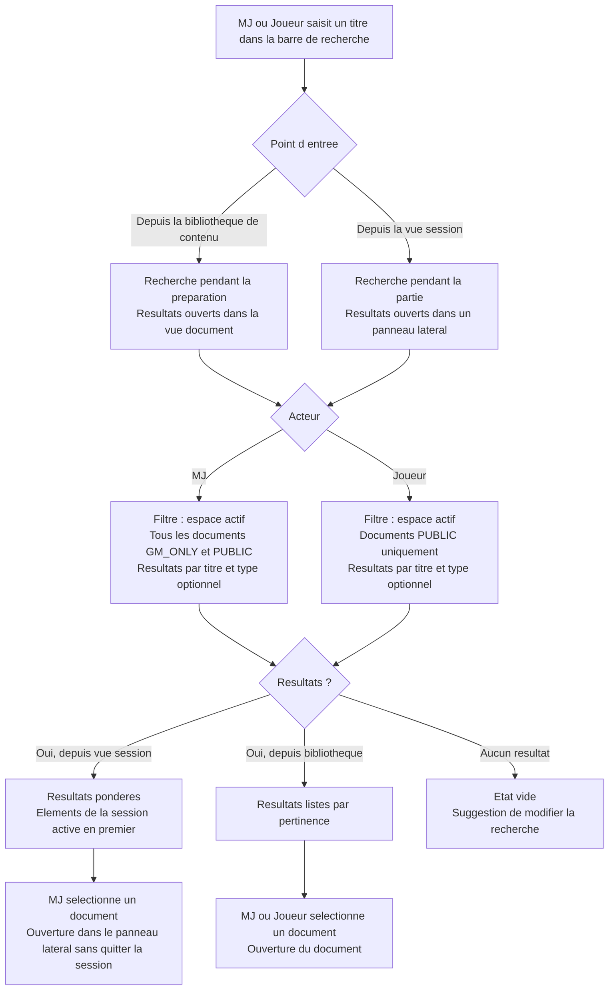
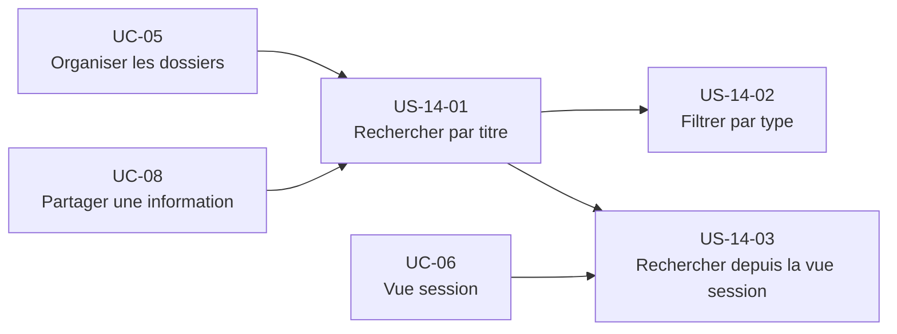

# Epic — Rechercher rapidement une information (UC-14)

## Objectif utilisateur

Permettre au MJ (et au joueur, dans un périmètre restreint) de retrouver rapidement un document de l'espace actif — PNJ, scène, note, lieu, personnage joueur — en cherchant par titre (correspondance) et en filtrant par type (regroupement des résultats). La recherche est disponible depuis la bibliothèque de contenu (préparation) et depuis la vue session (en cours de partie, dans un panneau latéral sans quitter la session).

---

## Personas concernés

| Persona | Motivation principale |
|---|---|
| Émilie | Retrouver un PNJ en pleine session en moins de 2 secondes, sans couper le rythme de la partie |
| Thomas | Retrouver une note de préparation par son titre pendant la phase de préparation |
| Nadia | Retrouver une vieille note de session depuis une session précédente |

---

## Use cases couverts

- **UC-14** — Rechercher rapidement une information
  - Nominal : recherche par titre dans l'espace actif
  - A1 : aucun résultat (état vide avec suggestions)
  - A2 : filtrer les résultats par type de contenu
  - A3 : filtrer par tag (Could Have — mentionné dans stories exclues)
  - A4 : recherche joueur (limitée aux documents `PUBLIC`)
  - E1 : accès non autorisé (documents `GM_ONLY` non retournés aux joueurs)

---

## Priorité MoSCoW

| Priorité | Stories |
|---|---|
| Should Have | US-14-01, US-14-02, US-14-03 |

---

## Bounded contexts pressentis

- **Content Library** — fournit les documents, leurs titres, leurs types, leurs tags et leur visibilité. Porte la logique de filtrage par `visibility`.
- **Conduite de session** — consomme la recherche depuis la vue session ; applique la pondération des éléments de la session active en tête des résultats.

---

## Vue d'ensemble Mermaid



---

## Dépendances Mermaid



---

## User stories

### US-14-01 — Rechercher un document par titre dans l'espace actif

**Priorité** : Should Have

**En tant que** MJ,
**je veux** saisir un titre ou une partie de titre dans la barre de recherche de mon espace actif,
**afin de** retrouver rapidement le document correspondant sans naviguer manuellement dans les dossiers.

**Notes de conception** :
- La recherche porte uniquement sur le **titre** du `Document`. La recherche full-text sur le contenu des blocs est post-MVP.
- Le périmètre est limité à l'**espace actif**. Pas de recherche cross-espaces dans le MVP.
- Le MJ voit tous les documents de l'espace : `GM_ONLY` et `PUBLIC`.
- Les `LIVE_NOTE` des sessions passées sont incluses dans les résultats comme tout document.
- La recherche est insensible à la casse et supporte la correspondance partielle sur le titre.
- L'état vide (A1) propose une suggestion pour modifier la recherche ou créer un document.

**Règles métier** :
- RB-14-01 : La recherche est limitée aux documents de l'espace actif.
- RB-14-02 : Un MJ voit les documents `GM_ONLY` et `PUBLIC` dans ses résultats.
- RB-14-03 : Un joueur ne voit que les documents `PUBLIC` dans ses résultats — les documents `GM_ONLY` ne sont jamais retournés à un joueur.
- RB-14-04 : Les `LIVE_NOTE` des sessions passées sont recherchables comme tout document.

**Critères d'acceptation** :
- [ ] Le MJ peut saisir un titre (ou une partie de titre) dans la barre de recherche.
- [ ] Les résultats affichent les documents dont le titre contient la chaîne saisie (insensible à la casse).
- [ ] Les résultats sont limités à l'espace actif.
- [ ] Les documents `GM_ONLY` et `PUBLIC` sont retournés au MJ.
- [ ] Les `LIVE_NOTE` des sessions passées apparaissent dans les résultats.
- [ ] Aucun résultat : un état vide est affiché avec une suggestion.
- [ ] Le MJ peut ouvrir un document depuis les résultats.

```gherkin
Scénario : Recherche par titre avec résultat (nominal)
  Etant donne que l espace actif contient un document "Seigneur Varek" de type PNJ avec visibility = GM_ONLY
  Quand le MJ saisit "Varek" dans la barre de recherche
  Alors le document "Seigneur Varek" apparait dans les resultats
  Et le document peut etre ouvert depuis les resultats

Scénario : Recherche partielle insensible a la casse
  Etant donne que l espace actif contient un document "Note de session 3" de type LIVE_NOTE
  Quand le MJ saisit "note de session"
  Alors le document "Note de session 3" apparait dans les resultats

Scénario : Aucun resultat (A1)
  Etant donne que l espace actif ne contient aucun document dont le titre contient "Dragon rouge"
  Quand le MJ saisit "Dragon rouge"
  Alors un etat vide est affiche
  Et une suggestion invite a modifier la recherche

Scénario : Recherche joueur - documents GM_ONLY exclus (A4, E1)
  Etant donne que l espace actif contient "Plan secret" avec visibility = GM_ONLY
  Et un document "Carte publique" avec visibility = PUBLIC
  Quand le joueur effectue une recherche sur "plan"
  Alors "Plan secret" n est pas dans les resultats
  Et "Carte publique" n est pas affectee par ce filtre

Scénario : LIVE_NOTE session passee recherchable
  Etant donne qu une session cloturee contient une LIVE_NOTE intitulee "Revelation faction Corbeau"
  Quand le MJ saisit "Corbeau" dans la recherche
  Alors la note "Revelation faction Corbeau" apparait dans les resultats
```

---

### US-14-02 — Filtrer les résultats par type de document

**Priorité** : Should Have

**En tant que** MJ,
**je veux** filtrer les résultats de recherche par type de document,
**afin de** réduire rapidement la liste de résultats lorsque je cherche un document d'un type précis (PNJ, scène, note, lieu...).

**Notes de conception** :
- Le filtre par type est un **filtre additionnel** à la recherche par titre (US-14-01) — il ne remplace pas la recherche par titre.
- La liste des types disponibles est celle portée par `Content Library` (types système et types personnalisés de l'espace).
- L'application du filtre est immédiate, sans rechargement de page.
- L'état vide après filtrage (A1 + A2) affiche un message adapté et propose de retirer le filtre.

**Règles métier** :
- RB-14-05 : Le filtre par type est appliqué en conjonction avec la recherche par titre — les règles de visibilité (RB-14-02, RB-14-03) restent actives.
- RB-14-06 : Les types proposés dans le filtre sont ceux de l'espace actif.

**Critères d'acceptation** :
- [ ] Le MJ peut sélectionner un type de document pour filtrer les résultats.
- [ ] Les résultats affichent uniquement les documents correspondant au titre ET au type sélectionné.
- [ ] L'application du filtre est immédiate.
- [ ] Retirer le filtre de type restaure les résultats sans filtre de type.
- [ ] Aucun résultat après filtrage : un état vide est affiché avec une option pour retirer le filtre.

```gherkin
Scénario : Filtrer les resultats par type PNJ (A2)
  Etant donne que la recherche sur "Varek" retourne un PNJ "Seigneur Varek" et une scene "Confrontation Varek"
  Quand le MJ selectionne le filtre de type "PNJ"
  Alors seul "Seigneur Varek" apparait dans les resultats

Scénario : Aucun resultat apres filtre (A1 + A2)
  Etant donne que la recherche sur "donjon" retourne des resultats
  Et que le MJ applique le filtre de type "PNJ"
  Et qu aucun PNJ n a "donjon" dans son titre
  Alors un etat vide est affiche
  Et une option permet de retirer le filtre de type

Scénario : Retirer le filtre de type
  Etant donne que le filtre de type "PNJ" est applique
  Quand le MJ retire ce filtre
  Alors tous les types de documents reapparaissent dans les resultats
```

---

### US-14-03 — Rechercher depuis la vue session avec pondération de la session active

**Priorité** : Should Have

**En tant que** MJ,
**je veux** rechercher un document depuis la vue session sans quitter la session,
**afin de** retrouver rapidement une information pendant la partie — le résultat s'ouvre dans un panneau latéral et les éléments de la session active apparaissent en tête de liste.

**Notes de conception** :
- La recherche depuis la vue session **ne quitte pas** la vue session. Les résultats s'affichent dans un panneau latéral.
- **Pondération session active** : les documents liés à la session en cours (épinglés, `LIVE_NOTE` de la session en cours, documents du scénario associé) remontent en tête des résultats.
- La pondération est gérée par `Conduite de session` en consommant les métadonnées de la `SessionViewConfig`.
- Les règles de visibilité (RB-14-02 pour le MJ, RB-14-03 pour le joueur) s'appliquent identiquement depuis la vue session.
- Le panneau latéral peut être fermé sans perdre le contexte de session.

**Règles métier** :
- RB-14-07 : Depuis la vue session, les résultats de recherche s'ouvrent dans un panneau latéral — la vue session reste active.
- RB-14-08 : Les documents liés à la session active (épinglés, `LIVE_NOTE` de la session en cours, documents du scénario associé) sont pondérés en tête des résultats.
- RB-14-09 : Les règles de visibilité s'appliquent identiquement depuis la vue session.
- RB-14-10 : L'affichage des résultats de recherche depuis la vue session (et depuis la bibliothèque) est limité à un **top N avec pagination/chargement progressif**, optimisant le périmètre d'affichage pour l'espace disponible et les performances.

**Critères d'acceptation** :
- [ ] Le MJ peut accéder à la barre de recherche depuis la vue session.
- [ ] Les résultats s'affichent dans un panneau latéral sans quitter la vue session.
- [ ] Les documents liés à la session active (épinglés, `LIVE_NOTE` en cours, documents du scénario) remontent en tête de liste.
- [ ] Sélectionner un résultat ouvre le document dans le panneau latéral.
- [ ] Fermer le panneau latéral ramène le MJ à la vue session sans perte de contexte.
- [ ] Les règles de visibilité sont respectées (MJ voit `GM_ONLY` et `PUBLIC`, joueur voit `PUBLIC` uniquement).

```gherkin
Scénario : Recherche depuis la vue session avec ponderation (nominal)
  Etant donne qu une session est en status LIVE
  Et que le document "Seigneur Varek" est epingle dans la session active
  Et que l espace contient aussi "Varek le marchand" non epingle
  Quand le MJ saisit "Varek" depuis la vue session
  Alors "Seigneur Varek" apparait en tete des resultats car lie a la session active
  Et "Varek le marchand" apparait dans les resultats apres

Scénario : Ouverture d un document dans le panneau lateral
  Etant donne qu une session est en status LIVE
  Et que le MJ a saisi "Corbeau" dans la recherche depuis la vue session
  Quand le MJ selectionne le document "Faction des Corbeaux"
  Alors le document s ouvre dans un panneau lateral
  Et la vue session reste active

Scénario : Fermeture du panneau lateral sans perte de contexte
  Etant donne que le panneau lateral de recherche est ouvert
  Quand le MJ ferme le panneau lateral
  Alors la vue session est restauree telle quelle sans perte de contexte

Scénario : Recherche joueur depuis la vue session (A4, E1)
  Etant donne qu une session est en status LIVE
  Et qu un document "Note privee MJ" a visibility = GM_ONLY
  Quand le joueur effectue une recherche depuis la vue session
  Alors "Note privee MJ" n apparait pas dans ses resultats
```

---

## Stories exclues ou repoussées

| Story / Feature | Raison |
|---|---|
| Recherche full-text sur le contenu des blocs | Post-MVP — la recherche porte sur le titre uniquement dans le MVP. Complexité d'indexation non justifiée à ce stade. |
| Recherche cross-espace | Post-MVP — les résultats sont limités à l'espace actif (RB-14-01). |
| Filtrer par tag (A3) | Could Have — à inclure si l'implémentation est triviale (filtre additionnel sur les tags existants de `Content Library`). Repoussé si le coût d'implémentation dépasse la valeur MVP. |
| Historique des recherches récentes | Could Have — apport UX pour les MJ fréquents, non prioritaire pour le MVP. |
| Recherche par date de création ou de modification | Post-MVP — nécessite un tri et des critères additionnels hors périmètre du MVP. |

---

## Ordre de livraison recommandé

1. **US-14-01** — Recherche par titre (fondation : valeur immédiate pour Thomas et Nadia)
2. **US-14-02** — Filtre par type (réduit le bruit sur les espaces riches en contenu, dépend de US-14-01)
3. **US-14-03** — Recherche depuis la vue session avec pondération (valeur maximale pour Émilie, dépend de US-14-01 et UC-06)

---

## Vérification de couverture

| Cas UC-14 | Story couvrant |
|---|---|
| Nominal — recherche par titre dans l'espace actif | US-14-01 |
| A1 — aucun résultat | US-14-01, US-14-02 |
| A2 — filtrer par type de contenu | US-14-02 |
| A3 — filtrer par tag | Exclu MVP (Could Have) |
| A4 — recherche joueur limitée aux documents PUBLIC | US-14-01, US-14-03 |
| E1 — documents GM_ONLY non retournés aux joueurs | US-14-01, US-14-03 |

---

## Questions ouvertes

- **Seuil de pondération session active** — **FERMÉE** : l'ensemble des documents liés à la session active est explicitement énuméré en RB-14-08 (épinglés, `LIVE_NOTE` de session en cours, documents du scénario associé). Le poids relatif fin relève du wireframe/implémentation, hors conception.
- **Nombre de résultats affichés** — **FERMÉE** : décision prise = **top N + pagination (chargement progressif)**. Inscrite en RB-14-10. Justification : optimisation du périmètre d'affichage selon l'espace disponible et les performances.
- **Filtre par tag (A3)** — **FERMÉE** : reste `Could Have — hors MVP` (arbitrage confirmé, voir UC-14 §A3). La fonction tag elle-même répond à un besoin d'organisation propre du MJ, indépendant de la recherche — voir UC-04 pour ses règles métier et son critère d'acceptation ; la recherche par tag n'en est qu'un filtre additionnel optionnel, jamais la justification de son existence.
