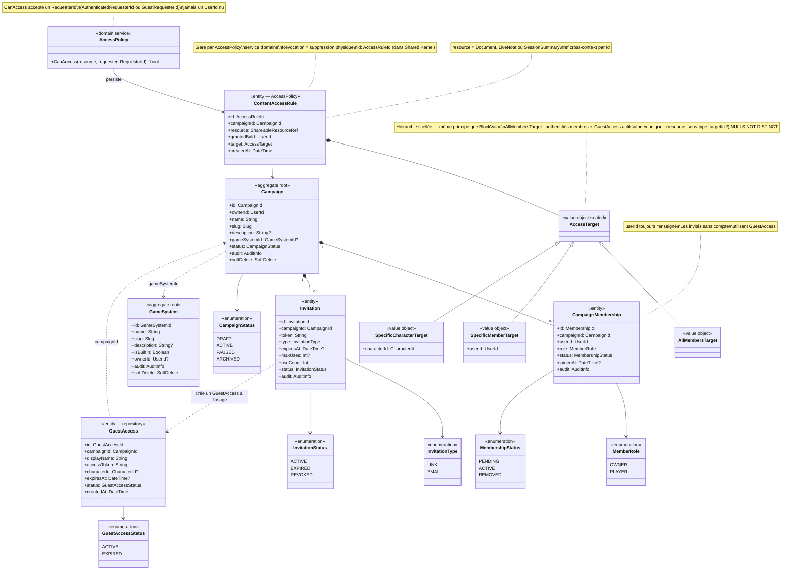

# Diagramme de classes — Campaign Management

Contexte organisationnel. `Campaign` est l'agrégat racine central — il encapsule
ses membres (`CampaignMembership`) et ses invitations (`Invitation`) dont le cycle
de vie lui est entièrement lié.

`GuestAccess` est une entité avec repository distincte de `CampaignMembership` :
un invité sans compte n'est pas un membre au sens plein — c'est un accès temporaire
créé depuis une invitation, sans identité persistante dans le système.
Du point de vue de la visibilité, un GuestAccess actif est traité comme un joueur ordinaire
sur le périmètre de son personnage : PUBLIC, SHARED et PLAYER_PRIVATE si le `characterId`
correspond.

`AccessPolicy` est un service domaine, pas un agrégat. Il persiste des `ContentAccessRule`
immuables. Sa méthode `CanAccess` accepte un `RequesterId` (Shared Kernel) pour gérer
uniformément authentifiés et invités.

`GameSystem` est un agrégat léger indépendant — point d'extension futur pour les règles
de jeu. Référencé optionnellement par une campagne.

