# Diagramme de classes — Content Library

## 4. Content Library — Document, blocs, tags et types

`Document` est l'agrégat racine du contenu modulaire. Tout contenu éditorial dans
Haversack est un `Document` composé de `DocumentBlock`.

Chaque `DocumentBlock` porte une `BlockValue` fortement typée — une hiérarchie de value objects
scellés, un sous-type concret par `BlockKind`. Ce design évite les champs optionnels sans sens.

`DocumentType` est le nouvel agrégat qui définit un schéma de propriétés structurées
optionnellement associé à un `Document`. Indépendant du `DocumentTemplate` (qui initialise
les blocs). Types BUILTIN : PNJ, Personnage joueur, Lieu, Objet, Faction.

`Tag` est une entité légère par campagne. Le soft delete d'un `Tag` déclenche `TagDeleted`
— un handler synchrone purge les `tagIds` de tous les documents concernés.

```mermaid
classDiagram
    direction TB
    class Document {
        <<aggregate root>>
        +id: DocumentId
        +campaignId: CampaignId?
        +role: DocumentRole
        +title: String
        +slug: Slug
        +visibility: Visibility
        +ownerCharacterId: CharacterId?
        +templateId: TemplateId?
        +documentTypeId: DocumentTypeId?
        +properties: JSONB?
        +folderId: FolderId?
        +tagIds: TagId[]
        +audit: AuditInfo
        +softDelete: SoftDelete
    }
    class DocumentBlock {
        <<entity>>
        +id: BlockId
        +documentId: DocumentId
        +kind: BlockKind
        +label: String?
        +order: Int
        +value: BlockValue
        +isPrivate: Boolean
        +audit: AuditInfo
    }
    class BlockValue {
        <<value object abstract>>
    }
    class TextBlockValue {
        <<value object>>
        +content: String
    }
    class FieldBlockValue {
        <<value object>>
        +value: String
    }
    class StatBarBlockValue {
        <<value object>>
        +current: Int
        +max: Int
    }
    class RelationBlockValue {
        <<value object>>
        +targetId: DocumentId
    }
    class ListBlockValue {
        <<value object>>
        +items: String[]
    }
    class ItemBlockValue {
        <<value object>>
        +name: String
        +quantity: Int
        +properties: Map
    }
    class ChecklistBlockValue {
        <<value object>>
        +items: ChecklistItem[]
    }
    class ImageBlockValue {
        <<value object>>
        +url: String
        +caption: String?
    }
    class DocumentType {
        <<aggregate root>>
        +id: DocumentTypeId
        +name: String
        +slug: Slug
        +scope: DocumentTypeScope
        +ownerId: UserId?
        +campaignId: CampaignId?
        +properties: PropertySchema[]
        +audit: AuditInfo
        +softDelete: SoftDelete
    }
    class PropertySchema {
        <<value object>>
        +key: String
        +label: String
        +valueType: PropertyValueType
        +required: Boolean
    }
    class Tag {
        <<entity — repository>>
        +id: TagId
        +campaignId: CampaignId
        +label: String
        +color: String?
        +audit: AuditInfo
        +softDelete: SoftDelete
    }
    class DocumentRole {
        <<enumeration>>
        STANDARD
        SCENARIO
        SCENE
    }
    class DocumentTypeScope {
        <<enumeration>>
        BUILTIN
        CAMPAIGN
        USER
    }
    class PropertyValueType {
        <<enumeration>>
        TEXT
        NUMBER
        BOOLEAN
    }
    class BlockKind {
        <<enumeration>>
        TEXT
        FIELD
        STAT_BAR
        RELATION
        LIST
        ITEM
        CHECKLIST
        IMAGE
    }
    Document "1" *-- "0..*" DocumentBlock
    Document --> DocumentRole
    Document --> Visibility
    Document "0..*" ..> "0..*" Tag : tagIds
    Document ..> DocumentType : documentTypeId (optionnel)
    DocumentBlock *-- BlockValue
    DocumentBlock --> BlockKind
    BlockValue <|-- TextBlockValue
    BlockValue <|-- FieldBlockValue
    BlockValue <|-- StatBarBlockValue
    BlockValue <|-- RelationBlockValue
    BlockValue <|-- ListBlockValue
    BlockValue <|-- ItemBlockValue
    BlockValue <|-- ChecklistBlockValue
    BlockValue <|-- ImageBlockValue
    DocumentType "1" *-- "0..*" PropertySchema
    DocumentType --> DocumentTypeScope
    PropertySchema --> PropertyValueType
    note for Document "campaignId null = document en bibliothèque\n(rattaché à un Scenario.isTemplate = true)\nvisibility = PRIVATE immuable si campaignId null\nfolderId et tagIds toujours null/vides si campaignId null\n──────────────────────────────────────────────────────────────\ndocumentTypeId + properties : coeur du système documentaire\nlibre, typé, filtrable et extensible\n──────────────────────────────────────────────────────────────\nCo-création obligatoire :\n  role = SCENARIO → factory Scenario\n  role = SCENE    → factory Scene\n  PC associé      → factory PlayerCharacter"
    note for DocumentBlock "isPrivate = true → jamais exposé aux joueurs\nMême si Document est SHARED\nZéro ou plusieurs blocs par Document"
    note for Visibility "PRIVATE = MJ uniquement\nPLAYER_PRIVATE = ownerCharacterId (MJ exclu)\nSHARED = membres ciblés via ContentAccessRule\nPUBLIC = tous les membres (joueurs + invités actifs)"
    note for RelationBlockValue "Backlinks orphelins : si targetId pointe vers\nun document soft-deleted, le backlink n'est pas affiché\nFiltré à la requête (isDeleted = false)"
    note for DocumentType "Scopes :\n  BUILTIN → fourni par l'app, non modifiable\n  CAMPAIGN → visible membres de la campagne\n  USER → portable entre campagnes du propriétaire\nTypes BUILTIN : PNJ, Personnage joueur, Lieu, Objet, Faction\nPropertySchema.key : stable après création\n(clé dans JSONB properties)"
    note for Tag "label unique par campagne (insensible casse)\nSoft delete Tag → TagDeleted event\nHandler synchrone nettoie Document.tagIds\nNon partageable entre campagnes"
```

---

## 5. Content Library — Entités métier et dossiers

`PlayerCharacter` est le seul profil spécialisé maintenu en entité distincte :
`CharacterId` est un pivot d'accès dans `AccessPolicy` et `GuestRequesterId`.
Les métadonnées de profil passent par le `DocumentType` BUILTIN "Personnage joueur".

`Scenario` peut vivre en bibliothèque personnelle (`isTemplate = true`) ou comme
instance dans une campagne. La copie profonde à l'instantiation rend l'instance
indépendante du source.

`DocumentTemplate` définit un schéma de blocs. `documentRole` est optionnel (null = toutes roles).
Un template initialise un Document à la création ; le Document devient ensuite un snapshot indépendant.

`Folder` protège l'invariant système et gère son ordre. `defaultDocumentTypeId` s'applique
uniquement aux Documents STANDARD créés dans ce dossier.

```mermaid
classDiagram
    direction TB
    class PlayerCharacter {
        <<entity — repository>>
        +id: CharacterId
        +campaignId: CampaignId
        +documentId: DocumentId
        +name: String
        +ownerId: UserId?
        +linkedDocumentId: DocumentId?
        +status: CharacterStatus
        +audit: AuditInfo
        +softDelete: SoftDelete
    }
    class Scenario {
        <<aggregate root>>
        +id: ScenarioId
        +campaignId: CampaignId?
        +ownerId: UserId?
        +documentId: DocumentId
        +title: String
        +slug: Slug
        +order: Int
        +status: ScenarioStatus
        +isTemplate: Boolean
        +sourceScenarioId: ScenarioId?
        +audit: AuditInfo
        +softDelete: SoftDelete
    }
    class Scene {
        <<entity>>
        +id: SceneId
        +scenarioId: ScenarioId
        +documentId: DocumentId
        +title: String
        +order: Int
        +status: SceneStatus
        +linkedDocumentIds: DocumentId[]
        +audit: AuditInfo
    }
    class DocumentTemplate {
        <<aggregate root>>
        +id: TemplateId
        +name: String
        +documentRole: DocumentRole?
        +gameSystemId: GameSystemId?
        +scope: TemplateScope
        +ownerId: UserId?
        +campaignId: CampaignId?
        +audit: AuditInfo
        +softDelete: SoftDelete
    }
    class BlockSchema {
        <<value object>>
        +kind: BlockKind
        +label: String
        +required: Boolean
        +defaultValue: BlockValue?
    }
    class Folder {
        <<aggregate root>>
        +id: FolderId
        +campaignId: CampaignId
        +name: String
        +slug: Slug
        +defaultTemplateId: TemplateId?
        +defaultDocumentTypeId: DocumentTypeId?
        +isSystem: Boolean
        +order: Int
        +audit: AuditInfo
        +softDelete: SoftDelete
    }
    class DocumentType {
        <<aggregate root>>
    }
    class CharacterStatus {
        <<enumeration>>
        ACTIVE
        RETIRED
        DEAD
    }
    class ScenarioStatus {
        <<enumeration>>
        DRAFT
        READY
        PLAYED
        ARCHIVED
    }
    class SceneStatus {
        <<enumeration>>
        PENDING
        PLAYED
        SKIPPED
    }
    class TemplateScope {
        <<enumeration>>
        BUILTIN
        CAMPAIGN
        USER
    }
    PlayerCharacter --> CharacterStatus
    PlayerCharacter --> Document : documentId
    PlayerCharacter ..> Document : linkedDocumentId (narratif)
    Scenario "1" *-- "0..*" Scene
    Scenario --> ScenarioStatus
    Scenario --> Document : documentId
    Scenario ..> Scenario : sourceScenarioId
    Scene --> SceneStatus
    Scene --> Document : documentId
    Scene ..> Document : linkedDocumentIds
    DocumentTemplate "1" *-- "0..*" BlockSchema
    DocumentTemplate --> TemplateScope
    Document ..> DocumentTemplate : snapshot à la création
    Document ..> Folder : folderId (FK nullable)
    Folder ..> DocumentTemplate : defaultTemplateId
    Folder ..> DocumentType : defaultDocumentTypeId
    note for PlayerCharacter "Toujours dans une campagne (jamais en bibliothèque)\nownerId null = en attente d'association\nou personnage joué par le MJ\nUn même utilisateur peut posséder plusieurs personnages\nLe MJ peut toujours consulter la fiche\nVisibilité Document par défaut : PRIVATE\nlinkedDocumentId : association narrative\nsuppression du lié ne supprime pas le PC"
    note for Scenario "isTemplate = true → campaignId null, ownerId non null\nisTemplate = false → campaignId non null\nsourceScenarioId non null → isTemplate = false\nHistorique des runs reconstruit via les instances\nSeul le ownerId peut modifier un scénario source\nUn Scenario(isTemplate = true) ne peut pas être\nattaché à une Session"
    note for Scene "Cycle de vie lié à Scenario — suppression en cascade\nL'ordre est une responsabilité de l'agrégat Scenario\nlinkedDocumentIds : références légères (PNJ, lieux…)\nsuppression d'un lié → retire la référence"
    note for DocumentTemplate "documentRole null = aucune restriction de rôle\nSnapshot à la création : modifier le template\nne modifie jamais les documents existants\nCombinations valides :\n  BUILTIN → ownerId null, campaignId null\n  CAMPAIGN → ownerId non-null, campaignId non-null\n  USER → ownerId non-null, campaignId null"
    note for BlockSchema "required = true : indicateur UI\net création initiale depuis template\nN'invalide pas un document incomplet"
    note for Folder "isSystem = true → non supprimable\n4 dossiers créés à l'init campagne :\n  Personnages, Joueurs, Scénarios, Notes\nTous renommables\ndefaultDocumentTypeId : s'applique\naux Documents STANDARD uniquement\nOrdre géré par FolderOrderService\nfolderId null dans Document = non classé"
```

