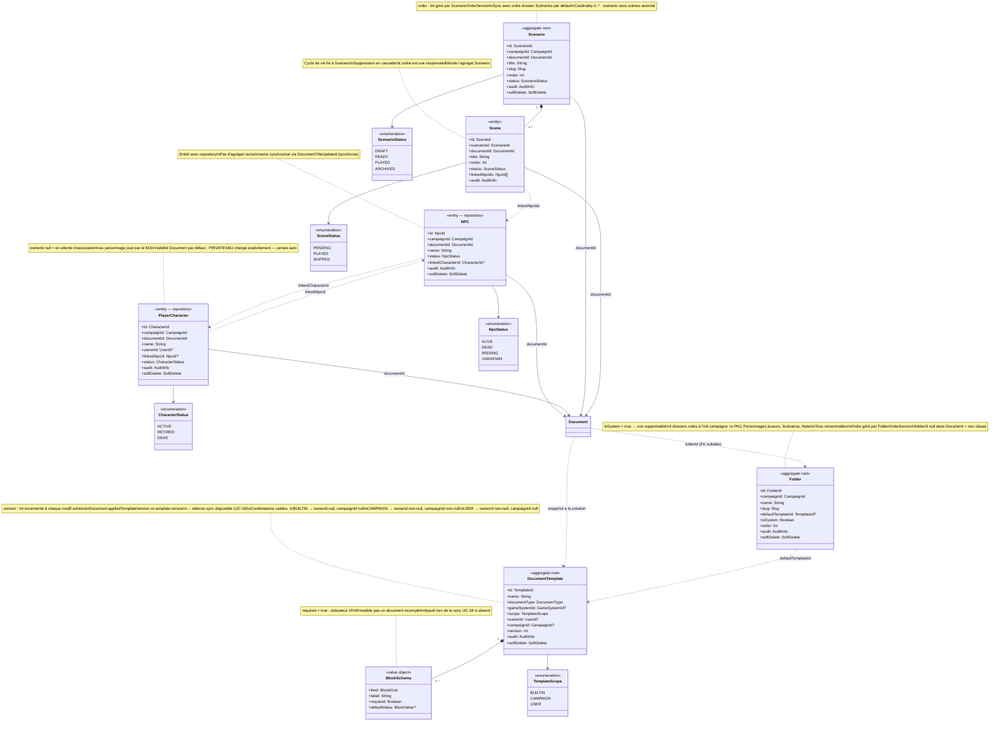

# Diagramme de classes — Content Library

## 4. Content Library — Document, blocs et tags

`Document` est l'agrégat racine du contenu modulaire. Tout contenu éditorial dans
Haversack est un `Document` typé composé de `DocumentBlock`.

Chaque `DocumentBlock` porte une `BlockValue` fortement typée — une hiérarchie
de value objects scellés, un sous-type concret par `BlockKind`. Ce design évite
les champs optionnels sans sens : un `StatBarBlockValue` n'a que `current` et `max`,
un `TextBlockValue` n'a que `content`. Aucune ambiguïté sur ce qui est valide.

`Tag` est une entité légère appartenant à une campagne, créée par le MJ et réutilisable
sur n'importe quel `Document` de la même campagne. `Document.tagIds[]` référence ces Tags.
Le soft delete d'un `Tag` déclenche `TagDeleted` — un handler synchrone purge les `tagIds`
de tous les documents concernés.

```mermaid
classDiagram
    direction TB
    class Document {
        <<aggregate root>>
        +id: DocumentId
        +campaignId: CampaignId
        +type: DocumentType
        +customType: String?
        +title: String
        +slug: Slug
        +visibility: Visibility
        +ownerCharacterId: CharacterId?
        +templateId: TemplateId?
        +folderId: FolderId?
        +appliedTemplateVersion: Int?
        +tagIds: TagId[]
        +audit: AuditInfo
        +softDelete: SoftDelete
    }
    class DocumentBlock {
        <<entity>>
        +id: BlockId
        +documentId: DocumentId
        +kind: BlockKind
        +label: String?
        +order: Int
        +value: BlockValue
        +isPrivate: Boolean
        +isLocked: Boolean
        +audit: AuditInfo
    }
    class BlockValue {
        <<value object abstract>>
    }
    class TextBlockValue {
        <<value object>>
        +content: String
    }
    class FieldBlockValue {
        <<value object>>
        +value: String
    }
    class StatBarBlockValue {
        <<value object>>
        +current: Int
        +max: Int
    }
    class RelationBlockValue {
        <<value object>>
        +targetId: DocumentId
        +targetType: DocumentType
    }
    class ListBlockValue {
        <<value object>>
        +items: String[]
    }
    class ItemBlockValue {
        <<value object>>
        +name: String
        +quantity: Int
        +properties: Map
    }
    class ChecklistBlockValue {
        <<value object>>
        +items: ChecklistItem[]
    }
    class ImageBlockValue {
        <<value object>>
        +url: String
        +caption: String?
    }
    class Tag {
        <<entity — repository>>
        +id: TagId
        +campaignId: CampaignId
        +label: String
        +color: String?
        +audit: AuditInfo
        +softDelete: SoftDelete
    }
    class Visibility {
        <<enumeration — Shared Kernel>>
        PRIVATE
        PLAYER_PRIVATE
        SHARED
        PUBLIC
    }
    class DocumentType {
        <<enumeration>>
        NOTE
        NPC
        CHARACTER
        SCENARIO
        SCENE
        LOCATION
        CUSTOM
    }
    class BlockKind {
        <<enumeration>>
        TEXT
        FIELD
        STAT_BAR
        RELATION
        LIST
        ITEM
        CHECKLIST
        IMAGE
    }
    Document "1" *-- "0..*" DocumentBlock
    Document --> DocumentType
    Document --> Visibility
    Document "0..*" ..> "0..*" Tag : tagIds
    DocumentBlock *-- BlockValue
    DocumentBlock --> BlockKind
    BlockValue <|-- TextBlockValue
    BlockValue <|-- FieldBlockValue
    BlockValue <|-- StatBarBlockValue
    BlockValue <|-- RelationBlockValue
    BlockValue <|-- ListBlockValue
    BlockValue <|-- ItemBlockValue
    BlockValue <|-- ChecklistBlockValue
    BlockValue <|-- ImageBlockValue
    note for Document "customType obligatoire si type = CUSTOM\nCo-création obligatoire pour NPC/CHARACTER/SCENARIO/SCENE\nVoir ADR-22\nfolderId FK nullable (intra-contexte)\nappliedTemplateVersion comparé à DocumentTemplate.version → UC-18"
    note for DocumentBlock "isPrivate = true → jamais exposé aux joueurs\nMême si Document est SHARED\nisLocked = true → non modifiable joueur\n(modélisé, inactif en MVP)\nZéro ou plusieurs blocs par Document"
    note for Visibility "PRIVATE = MJ uniquement\nPLAYER_PRIVATE = ownerCharacterId (MJ exclu)\nSHARED = membres ciblés via ContentAccessRule\nPUBLIC = tous les membres (joueurs + invités actifs)"
    note for RelationBlockValue "Backlinks orphelins : si targetId pointe vers\nun document soft-deleted, le backlink n'est pas affiché\nFiltré à la requête (isDeleted = false) — ADR-23"
    note for Tag "label unique par campagne (insensible casse)\nSoft delete Tag → TagDeleted event\nHandler synchrone nettoie Document.tagIds\nNon partageable entre campagnes\nGéré via UC-19"
```

---

## 5. Content Library — Enveloppes métier et dossiers

Le pattern structurant de Content Library : chaque concept métier (`NPC`, `PlayerCharacter`,
`Scenario`, `Scene`) possède un `Document` pour son contenu variable, et porte
ses propres règles métier dans une enveloppe séparée.

`NPC` et `PlayerCharacter` sont des **profils spécialisés de Document**.
Leur contenu variable reste dans le Document ; leurs tables dédiées portent les métadonnées
requêtables et les règles transverses.

`Scenario` est un agrégat racine car il protège l'ordre et la cohérence de sa collection
de `Scene`. Une scène ne peut pas exister sans son scénario parent.

Le lien `NPC ↔ PlayerCharacter` est une **association narrative bidirectionnelle optionnelle**.
Les deux entités ont des cycles de vie indépendants.

`DocumentTemplate` définit un schéma de blocs attendus. Le champ `version` est incrémenté
à chaque modification du schéma. `Document.appliedTemplateVersion` est comparé à `template.version`
pour détecter qu'une synchronisation est disponible (UC-18).

`Folder` est un agrégat racine léger — il protège l'invariant "un dossier système ne peut pas
être supprimé" et gère son ordre. Les `Document` le référencent par FK (`folderId` nullable).

