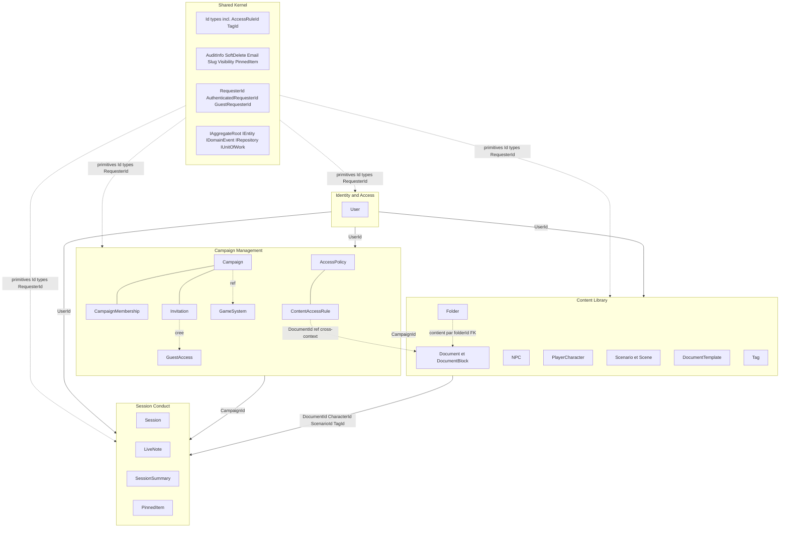

# Diagramme de classes — Context Map

Vue globale des dépendances entre bounded contexts. Les flèches indiquent
la direction de consommation — il n'y a pas de dépendance circulaire.

Le **Shared Kernel** est la fondation commune consommée par tous les contextes.
Il contient uniquement des primitives stables sans règle métier, ainsi que
`RequesterId` (type union pour l'autorisation des GuestAccess).

**Identity & Access** est le contexte upstream — il fournit `UserId` à tous les autres.

**Campaign Management** fournit `CampaignId` aux deux contextes en aval. Il héberge
`AccessPolicy` dont la `ContentAccessRule` référence une `ShareableResourceRef`
(`Document`, `LiveNote` ou `SessionSummary`) par Id uniquement.

**Content Library** fournit ses Id (`DocumentId`, `CharacterId`, `ScenarioId`, `TagId`) à Session Conduct.

