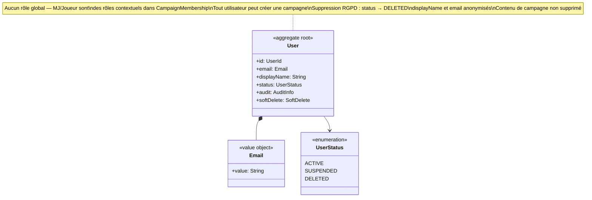

# Diagramme de classes — Identity & Access

Contexte le plus simple et le plus stable. Un seul agrégat racine : `User`.
Il représente uniquement les utilisateurs authentifiés avec une identité persistante.
Les joueurs invités sans compte ne sont pas des `User` — ils vivent dans Campaign Management
sous la forme d'un `GuestAccess`.
`User` ne porte aucun rôle global. MJ et Joueur sont des rôles contextuels portés par
`CampaignMembership.role (MemberRole)` dans Campaign Management. Tout utilisateur authentifié
peut créer une campagne et en devenir le MJ.

