# Diagramme de classes — Session Conduct

Contexte opérationnel. `Session` est le seul agrégat racine — il encapsule les notes
prises en temps réel ou a posteriori (`LiveNote`).

Tous les liens vers les autres contextes (sections 1 à 5) sont des **références légères par Id** :
`campaignId`, `scenarioId`, `participantIds`, `selectedDocumentIds`, `pinnedItems.documentId`.
Session Conduct ne possède aucune entité des autres contextes — il les consomme par Id.

`LiveNote` peut être créée par le MJ ou par un joueur. Le `authorRole` détermine
les règles de visibilité par défaut et les contraintes applicables (voir UC-06).

```mermaid
classDiagram
    direction TB
    class Session {
        <<aggregate root>>
        +id: SessionId
        +campaignId: CampaignId
        +scenarioId: ScenarioId?
        +title: String
        +slug: Slug
        +scheduledAt: DateTime?
        +startedAt: DateTime?
        +endedAt: DateTime?
        +status: SessionStatus
        +participantIds: CharacterId[]
        +selectedDocumentIds: DocumentId[]
        +pinnedItems: PinnedItem[]
        +audit: AuditInfo
        +softDelete: SoftDelete
    }
    class PinnedItem {
        <<value object>>
        +documentId: DocumentId
        +order: Int
        +pinnedAt: DateTime
    }
    class LiveNote {
        <<entity>>
        +id: LiveNoteId
        +sessionId: SessionId
        +content: String
        +authorUserId: UserId?
        +authorGuestAccessId: GuestAccessId?
        +ownerCharacterId: CharacterId?
        +authorRole: LiveNoteAuthorRole
        +visibility: Visibility
        +linkedDocumentId: DocumentId?
        +audit: AuditInfo
    }
    class SessionStatus {
        <<enumeration>>
        PLANNED
        LIVE
        CLOSED
        ARCHIVED
    }
    class LiveNoteAuthorRole {
        <<enumeration>>
        GM
        PLAYER
    }
    Session "1" *-- "0..*" PinnedItem
    Session "1" *-- "0..*" LiveNote
    Session --> SessionStatus
    LiveNote --> LiveNoteAuthorRole
    note for Session "Références cross-context par Id uniquement\n─────────────────────────────────────\ncampaignId → Campaign Management\nscenarioId → Content Library\nparticipantIds → Content Library\nselectedDocumentIds → Content Library (DocumentId[])\npinnedItems.documentId → Content Library\n─────────────────────────────────────\nselectedDocumentIds : auto-déduit depuis scènes du scénario\npar SessionDocumentSelector (application service)\nSurcharge manuelle possible par le MJ\n─────────────────────────────────────\nInvariant : une seule session LIVE par campagne\nTransitions : PLANNED→LIVE→CLOSED→ARCHIVED\nCLOSED = contenu éditable MJ, ARCHIVED = lecture seule"
    note for LiveNote "authorRole = GM : défaut PRIVATE\nPeut partager (SHARED ou PUBLIC)\nJamais PLAYER_PRIVATE\n─────────────────────────────────────\nauthorRole = PLAYER : défaut PLAYER_PRIVATE\nownerCharacterId obligatoire\nPeut partager (SHARED ou PUBLIC)\nJamais PRIVATE\n─────────────────────────────────────\nJoueurs : créent LiveNotes uniquement sur session LIVE\nMJ : crée sur LIVE et CLOSED (rétroactif)\nGuestAccess auteur : authorGuestAccessId porte la vérité métier"
    note for PinnedItem "Capture ordre et date d'épinglage"
```

