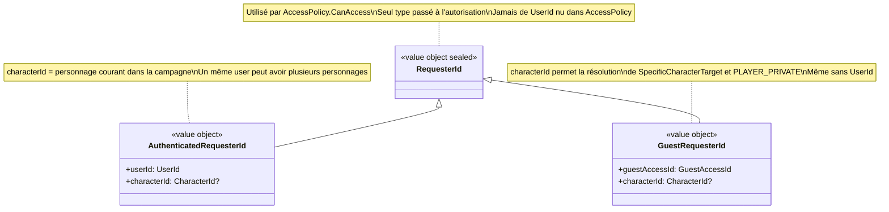

# Diagramme de classes — Shared Kernel — RequesterId

`RequesterId` est un type union scellé du Shared Kernel permettant à `AccessPolicy`
de traiter uniformément les utilisateurs authentifiés et les invités sans compte.
Ce type résout le problème d'autorisation des GuestAccess qui n'ont pas de UserId.

