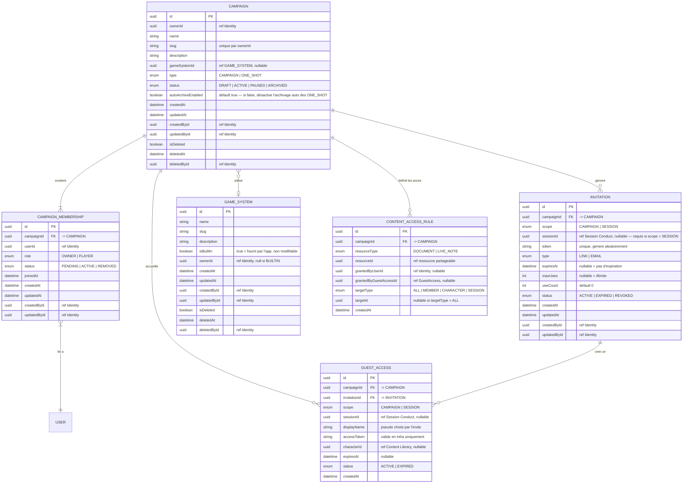

# MCD — Campaign Management

Contexte organisationnel. Gère le cycle de vie des campagnes, des membres,
des invitations, des accès invités et des autorisations de contenu.

### Notes Campaign Management

- `CAMPAIGN.type` : `CAMPAIGN` pour une campagne longue, `ONE_SHOT` pour une partie unique. Même modèle de données, parcours utilisateur différent.
- Archivage automatique `ONE_SHOT` : une campagne `ONE_SHOT` passe à `ARCHIVED` 48h après la fin de sa dernière session si `autoArchiveEnabled = true` et si le MJ n'a pas rouvert la campagne. Déclenché par un scheduler applicatif — `Campaign.AutoArchive()` en domaine.
- `CAMPAIGN` a exactement un membre avec `role = OWNER` — invariant garanti applicativement.
- `CAMPAIGN_MEMBERSHIP.userId` est toujours renseigné — les accès sans compte utilisent `GUEST_ACCESS`.
- `INVITATION.status` passe automatiquement à `EXPIRED` quand `useCount >= maxUses`
  ou quand `expiresAt` est dépassé — logique applicative.
- `INVITATION.scope = SESSION` impose `sessionId` et produit un `GUEST_ACCESS` limité à cette session.
- `INVITATION.scope = CAMPAIGN` impose `sessionId IS NULL`.
- `CONTENT_ACCESS_RULE` est immuable : pas de `updatedAt`, pas de soft delete.
  La révocation est une suppression physique.
- `CONTENT_ACCESS_RULE.resourceId` est une référence cross-context sans FK en base.
- `CONTENT_ACCESS_RULE` renseigne exactement un auteur de partage :
  `grantedByUserId` pour un MJ ou joueur authentifié, `grantedByGuestAccessId` pour un invité.
- `CONTENT_ACCESS_RULE` : index unique sur `(resourceType, resourceId, targetType, targetId)` avec
  `NULLS NOT DISTINCT` pour gérer le cas `targetType = ALL` (targetId = NULL).
- `GAME_SYSTEM.ownerId` : null pour les systèmes BUILTIN, non-null pour les systèmes custom (scope privé MVP).
- Index recommandés : `CAMPAIGN(ownerId)`, `CAMPAIGN_MEMBERSHIP(campaignId, userId)`,
  `INVITATION(token)` unique, `INVITATION(scope, sessionId)`,
  `GUEST_ACCESS(campaignId, sessionId)`, `CONTENT_ACCESS_RULE(campaignId, resourceType, resourceId)`.
