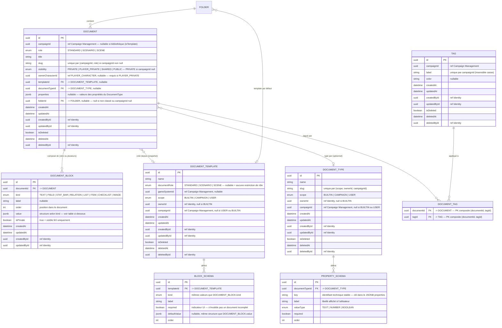
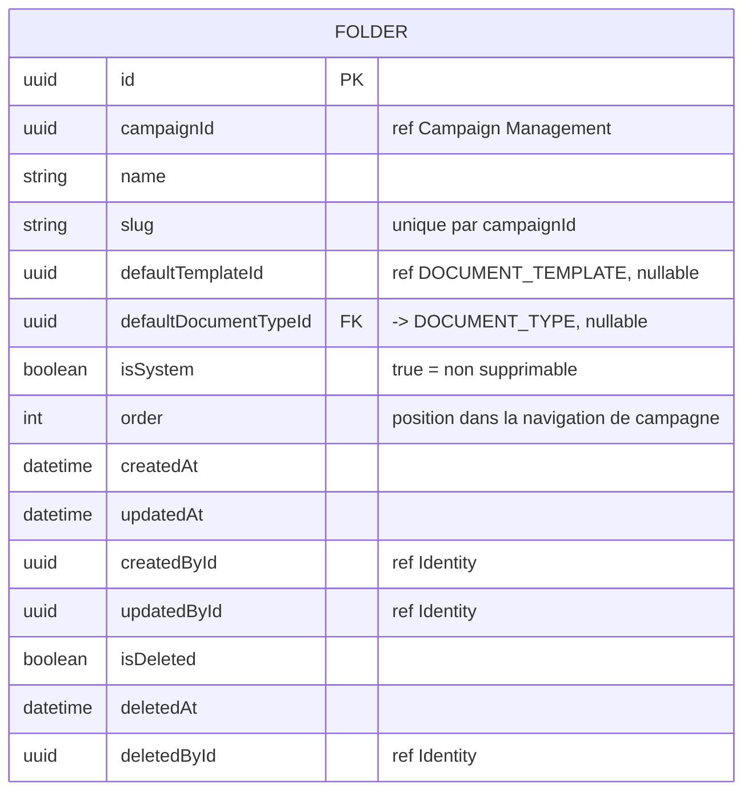
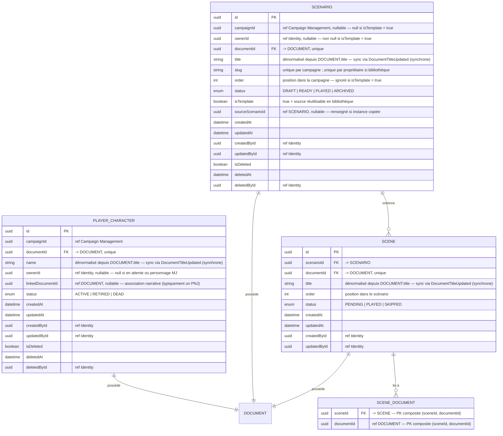

# MCD — Content Library

Contexte central du contenu éditorial. `DOCUMENT` est l'agrégat racine du contenu
modulaire — tout contenu dans Haversack est un Document composé de blocs typés.

`PLAYER_CHARACTER` porte le `CharacterId`, pivot d'accès dans `AccessPolicy`.
`SCENARIO` peut vivre en bibliothèque personnelle du MJ (`isTemplate = true`, `campaignId = null`)
ou en tant qu'instance dans une campagne.

Les types de document (PNJ, Lieu, Objet, Faction, Personnage joueur) sont des `DOCUMENT_TYPE`
BUILTIN ou custom — ils enrichissent les Documents de propriétés structurées sans entité dédiée.
Il n'existe pas de table PNJ dédiée : une fiche PNJ est un `DOCUMENT(role = STANDARD)` avec
`documentTypeId → DOCUMENT_TYPE(BUILTIN, "PNJ")`.

---

## 4.1 Document, blocs, tags et types de document

---

## 4.1b Table FOLDER

**Dossiers système créés à l'initialisation de chaque campagne :**

| name | isSystem | defaultDocumentTypeId |
|---|---|---|
| Personnages | true | → DOCUMENT_TYPE BUILTIN "PNJ" |
| Joueurs | true | → DOCUMENT_TYPE BUILTIN "Personnage joueur" |
| Scénarios | true | null |
| Notes | true | null |

- Dossiers système : `isSystem = true`, non supprimables, renommables.
- `defaultDocumentTypeId` s'applique uniquement aux Documents STANDARD. Le dossier "Scénarios" ne peut pas imposer un type — ses documents sont créés via la factory de l'agrégat `Scenario`.
- Un template initialise les blocs d'un document à la création. Les documents créés sont des snapshots :
  il n'y a pas de version persistée ni de synchronisation automatique en MVP.
- `slug` : unique par `campaignId`, généré à la création, non modifiable après.
- `order` : géré par `FolderOrderService` (application service).
- Index recommandés : `FOLDER(campaignId)`, `FOLDER(campaignId, slug)` unique, `FOLDER(campaignId, isSystem)`.

---

### Notes sur les Tags

- `TAG.label` : contrainte unique sur `(campaignId, LOWER(label))` pour insensibilité à la casse.
- `DOCUMENT_TAG` : PK composite `(documentId, tagId)` — pas de colonne `id`.
- Suppression d'un TAG (`isDeleted = true`) : suppression physique de toutes les lignes `DOCUMENT_TAG` correspondantes via handler synchrone sur `TagDeleted`.
- Index recommandés : `TAG(campaignId)`, `DOCUMENT_TAG(documentId)`, `DOCUMENT_TAG(tagId)`.

### Notes sur DOCUMENT_TYPE

- Types BUILTIN fournis par l'app (PNJ, Personnage joueur, Lieu, Objet, Faction) : protégés applicativement, non modifiables, non supprimables.
- Contraintes de scope (enforce applicatif) :
  - `BUILTIN` → `ownerId IS NULL AND campaignId IS NULL`
  - `CAMPAIGN` → `ownerId IS NOT NULL AND campaignId IS NOT NULL`
  - `USER` → `ownerId IS NOT NULL AND campaignId IS NULL`
- `PROPERTY_SCHEMA.key` est stable après création — sert de clé dans le JSONB `DOCUMENT.properties`.
- Suppression d'un `DOCUMENT_TYPE` custom : `DOCUMENT.documentTypeId → NULL`, `DOCUMENT.properties` conservées.
- Index recommandés : `DOCUMENT_TYPE(scope)`, `PROPERTY_SCHEMA(documentTypeId, order)`.

### Structure de DOCUMENT_BLOCK.value selon kind

| kind | Structure JSON |
|---|---|
| `TEXT` | `{ "content": "string" }` |
| `FIELD` | `{ "value": "string" }` |
| `STAT_BAR` | `{ "current": 14, "max": 20 }` |
| `RELATION` | `{ "targetId": "uuid" }` |
| `LIST` | `{ "items": ["string", "string"] }` |
| `ITEM` | `{ "name": "string", "quantity": 1, "properties": { "weight": "2kg" } }` |
| `CHECKLIST` | `{ "items": [{ "label": "string", "checked": false }] }` |
| `IMAGE` | `{ "url": "string", "caption": "string" }` |

**Convention de migration** : toute modification de la structure JSON d'un `BlockKind` doit être
rétrocompatible ou accompagnée d'une migration de données JSONB.

---

## 4.2 Entités métier

### Notes Content Library

- `PLAYER_CHARACTER.documentId` et `SCENARIO.documentId` ont une contrainte unique — un Document ne peut appartenir qu'à une seule entité métier.
- **Co-création obligatoire** : `PLAYER_CHARACTER`, `SCENARIO` et `SCENE` sont toujours créés via leur factory domaine, jamais par création directe d'un `DOCUMENT`.
- `PLAYER_CHARACTER.name`, `SCENARIO.title`, `SCENE.title` sont dénormalisés depuis `DOCUMENT.title`. Mis à jour via le domain event `DocumentTitleUpdated` dispatché synchrone in-process dans la même transaction.
- `PLAYER_CHARACTER.linkedDocumentId` : référence sans FK en base — association narrative, cycle de vie indépendant.
- **Documents en bibliothèque** (`DOCUMENT.campaignId IS NULL`) : toujours rattachés à un `SCENARIO(isTemplate = true)`. `visibility = PRIVATE` immuable. `folderId IS NULL`, `DOCUMENT_TAG` vide.
- Invariants `SCENARIO` :
  - `isTemplate = true` → `campaignId IS NULL AND ownerId IS NOT NULL`
  - `isTemplate = false AND campaignId IS NULL` → impossible (enforce applicatif)
  - `sourceScenarioId IS NOT NULL` → `isTemplate = false`
- `PLAYER_CHARACTER.ownerId` n'est pas unique par campagne : un utilisateur peut posséder plusieurs personnages.
- Soft delete `PLAYER_CHARACTER` : `isDeleted = true` sur l'entité ET sur son `DOCUMENT` dans la même transaction.
- Soft delete `SCENARIO` : `isDeleted = true` sur le scénario ET son `DOCUMENT`, puis suppression physique des `SCENE` et `isDeleted = true` sur leurs `DOCUMENT`.
- Suppression d'un `DOCUMENT` (soft delete) : suppression physique de tous ses `DOCUMENT_BLOCK`.
- `SCENE_DOCUMENT` : si un `DOCUMENT` référencé est soft-deleted, supprimer physiquement la ligne.
- Invariants de scope `DOCUMENT_TEMPLATE` :
  - `BUILTIN` → `ownerId IS NULL AND campaignId IS NULL`
  - `CAMPAIGN` → `ownerId IS NOT NULL AND campaignId IS NOT NULL`
  - `USER` → `ownerId IS NOT NULL AND campaignId IS NULL`
- **Backlinks** : `SELECT documentId FROM DOCUMENT_BLOCK WHERE kind = 'RELATION' AND value->>'targetId' = :targetId` filtre `DOCUMENT.isDeleted = false` via jointure.
- Index recommandés : `DOCUMENT(campaignId, role)`, `DOCUMENT(campaignId, role, slug)` unique partiel `WHERE campaignId IS NOT NULL`, `DOCUMENT_BLOCK(documentId, order)`, `PLAYER_CHARACTER(campaignId)`, `PLAYER_CHARACTER(ownerId)`, `SCENARIO(campaignId)`, `SCENARIO(ownerId)` pour la bibliothèque, `SCENARIO(campaignId, order)`, `SCENE(scenarioId, order)`.
- Index partiel : `CREATE UNIQUE INDEX ON SCENARIO (ownerId, slug) WHERE isTemplate = true`.
- Index GIN sur `DOCUMENT_BLOCK.value` pour les requêtes JSONB.
- Index GIN sur `DOCUMENT.title` pour la recherche FTS (PostgreSQL `tsvector`, configuration : `french`).
