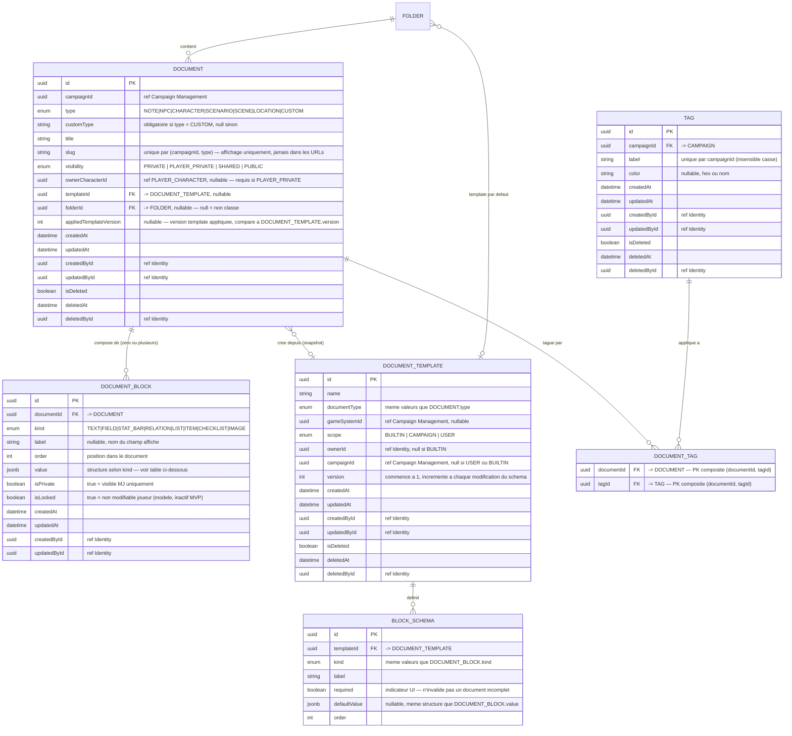
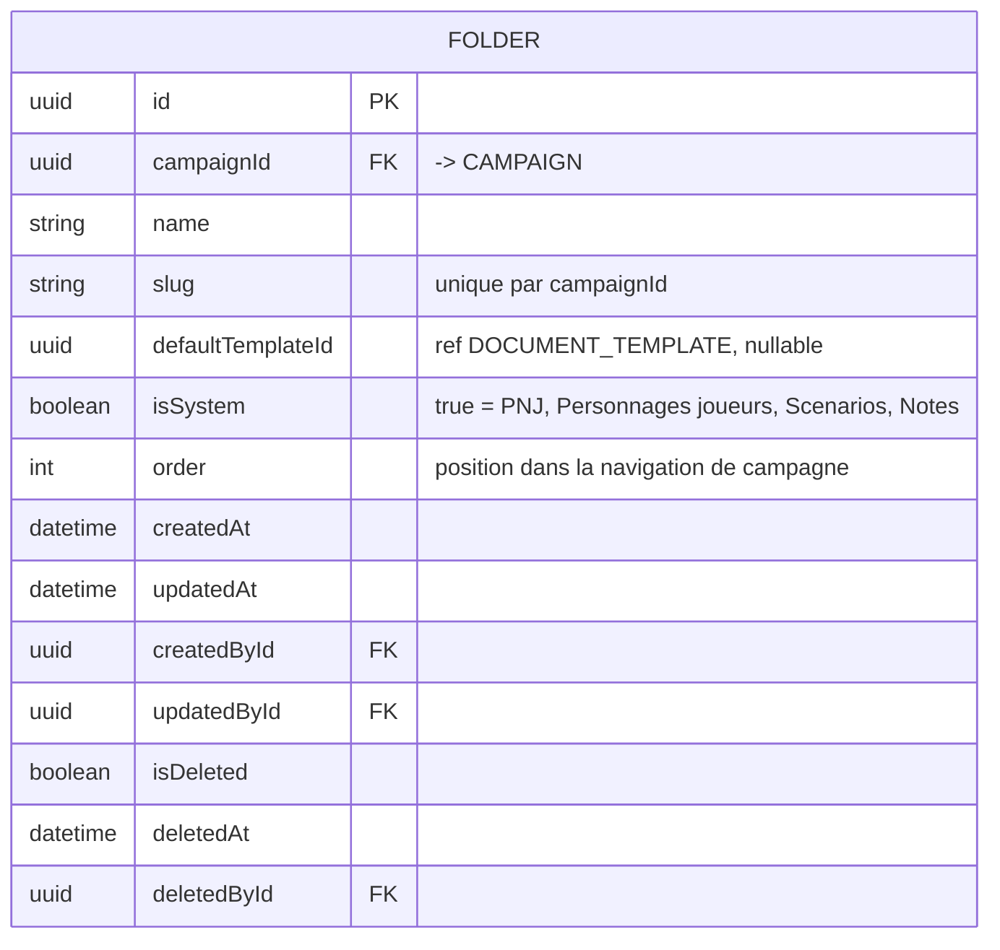
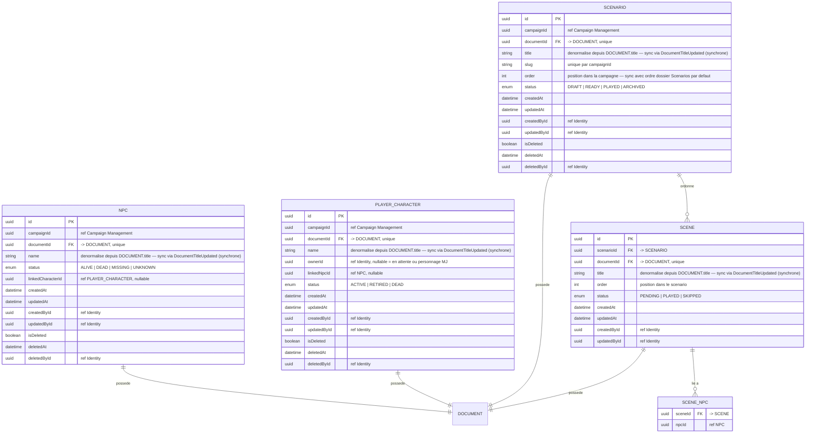

# MCD — Content Library

Contexte central du contenu éditorial. Pattern structurant : chaque entité métier
(`NPC`, `PLAYER_CHARACTER`, `SCENARIO`, `SCENE`) possède un `DOCUMENT` pour son
contenu variable, et porte ses propres métadonnées dans une table séparée.

## 4.1 Document et blocs

## 4.1b Table FOLDER

**Dossiers système créés à l'initialisation de chaque campagne :**

| name | isSystem | defaultTemplateId |
|---|---|---|
| PNJ | true | → template "Fiche PNJ générique" |
| Personnages joueurs | true | → template "Fiche personnage générique" |
| Scénarios | true | null |
| Notes | true | null |

- Dossiers système : `isSystem = true`, non supprimables, renommables.
- `slug` : unique par `campaignId`, généré à la création, non modifiable après.
- `order` : géré par `FolderOrderService` (application service).
- Index recommandés : `FOLDER(campaignId)`, `FOLDER(campaignId, slug)` unique, `FOLDER(campaignId, isSystem)`.

### Notes sur les Tags

- `TAG.label` : contrainte unique sur `(campaignId, LOWER(label))` pour insensibilité à la casse.
- `DOCUMENT_TAG` : PK composite `(documentId, tagId)` — pas de colonne `id`.
- Suppression d'un TAG (`isDeleted = true`) : supprimer physiquement toutes les lignes `DOCUMENT_TAG` correspondantes.
  Ce nettoyage est déclenché par le domain event `TagDeleted` via un handler synchrone.
- Index recommandés : `TAG(campaignId)`, `DOCUMENT_TAG(documentId)`, `DOCUMENT_TAG(tagId)`.

### Structure de DOCUMENT_BLOCK.value selon kind

| kind | Structure JSON |
|---|---|
| `TEXT` | `{ "content": "string" }` |
| `FIELD` | `{ "value": "string" }` |
| `STAT_BAR` | `{ "current": 14, "max": 20 }` |
| `RELATION` | `{ "targetId": "uuid", "targetType": "NPC" }` |
| `LIST` | `{ "items": ["string", "string"] }` |
| `ITEM` | `{ "name": "string", "quantity": 1, "properties": { "weight": "2kg" } }` |
| `CHECKLIST` | `{ "items": [{ "label": "string", "checked": false }] }` |
| `IMAGE` | `{ "url": "string", "caption": "string" }` |

**Convention de migration** : toute modification de la structure JSON d'un `BlockKind` doit être
rétrocompatible ou accompagnée d'une migration de données JSONB.

## 4.2 Entités métier

### Notes Content Library

- `NPC.documentId` et `PLAYER_CHARACTER.documentId` ont une contrainte unique —
  un document ne peut appartenir qu'a une seule entite metier.
- **Co-création obligatoire** : NPC, PLAYER_CHARACTER, SCENARIO et SCENE sont toujours
  créés via leur factory domaine, jamais par création directe d'un DOCUMENT.
- `NPC.name`, `PLAYER_CHARACTER.name`, `SCENARIO.title`, `SCENE.title` sont des champs
  dénormalisés depuis `DOCUMENT.title`. Mis à jour via le domain event `DocumentTitleUpdated`
  dispatchés synchrone in-process dans la même transaction.
- `NPC.linkedCharacterId` et `PLAYER_CHARACTER.linkedNpcId` sont des références
  sans FK en base — association narrative, cycle de vie indépendant.
- Soft delete `NPC` ou `PLAYER_CHARACTER` : mettre `isDeleted = true` sur l'entité
  ET sur son `DOCUMENT` associé dans la même transaction.
- Soft delete `SCENARIO` : mettre `isDeleted = true` sur le scénario ET sur son `DOCUMENT`,
  puis supprimer physiquement les `SCENE` et mettre `isDeleted = true` sur leurs `DOCUMENT`.
- Suppression d'un `DOCUMENT` (soft delete) : supprimer physiquement tous ses `DOCUMENT_BLOCK`.
- `SCENE_NPC` : si un NPC est soft-deleted, supprimer physiquement les lignes correspondantes.
- `DOCUMENT_TEMPLATE` avec `scope = BUILTIN` : pas de modification possible,
  protégé applicativement. `version` commence à 1.
- Contraintes de scope sur `DOCUMENT_TEMPLATE` :
  - `BUILTIN` → `ownerId IS NULL AND campaignId IS NULL`
  - `CAMPAIGN` → `ownerId IS NOT NULL AND campaignId IS NOT NULL`
  - `USER` → `ownerId IS NOT NULL AND campaignId IS NULL`
- **Backlinks** : la requête `SELECT documentId FROM DOCUMENT_BLOCK WHERE kind = 'RELATION'
  AND value->>'targetId' = :targetId` filtre `DOCUMENT.isDeleted = false` via jointure.
  Les backlinks pointant vers des documents supprimés ne sont pas affichés.
- Index recommandés : `DOCUMENT(campaignId, type)`, `DOCUMENT(campaignId, type, slug)` unique,
  `DOCUMENT_BLOCK(documentId, order)`, `NPC(campaignId)`, `PLAYER_CHARACTER(campaignId)`,
  `PLAYER_CHARACTER(ownerId)`, `SCENARIO(campaignId)`, `SCENARIO(campaignId, order)`,
  `SCENE(scenarioId, order)`.
- Index GIN recommandé sur `DOCUMENT_BLOCK.value` pour les requêtes dans le JSON.
- Index GIN recommandé sur `DOCUMENT_BLOCK.value->>'targetId'` pour les backlinks.
- Index GIN recommandé sur `DOCUMENT.title` et `DOCUMENT_BLOCK.value` pour la recherche FTS
  (PostgreSQL `tsvector`, configuration linguistique : `french`).
