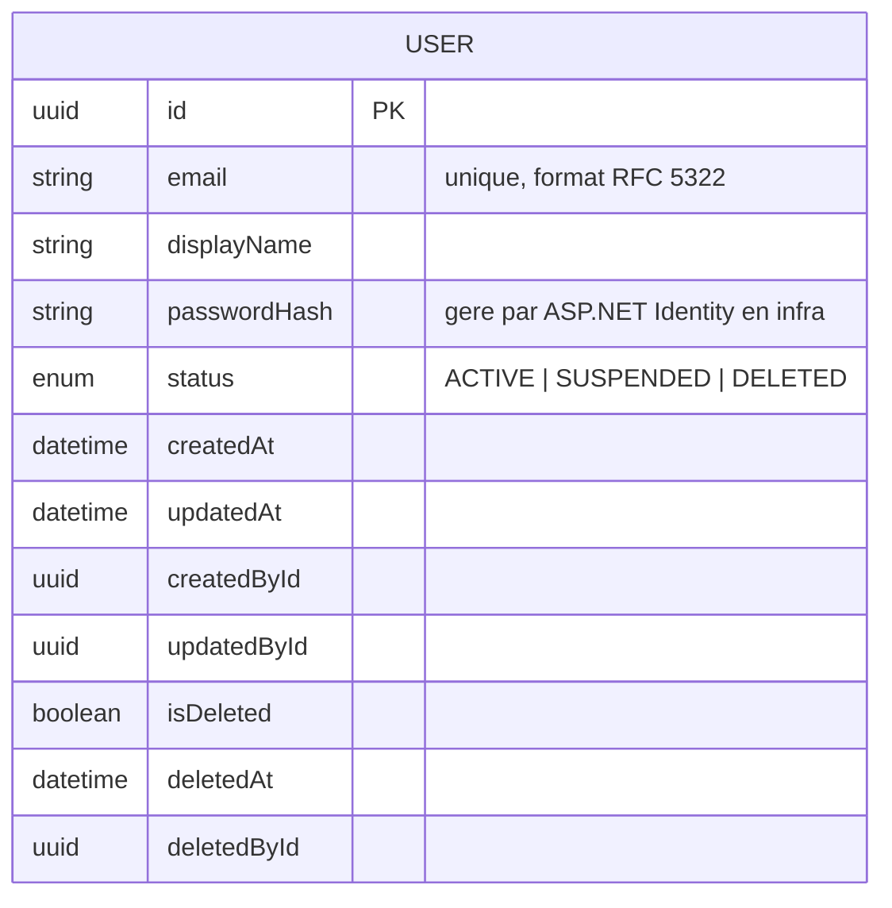

# MCD — Identity & Access

Contexte upstream. Fournit `UserId` à tous les autres contextes.
Contient uniquement les utilisateurs authentifiés avec une identité persistante.
Les joueurs invités sans compte sont dans Campaign Management (`GUEST_ACCESS`).

### Notes Identity & Access

- `email` est unique dans le système — contrainte unique en base.
- `passwordHash` est géré par ASP.NET Core Identity en couche Infrastructure.
  L'entité domaine `User` ne connaît pas ce champ — il est dans le modèle de persistance.
- `USER` ne porte aucun rôle global. Le rôle MJ/Joueur est `MemberRole (OWNER | PLAYER)` dans `CAMPAIGN_MEMBERSHIP`. Tout utilisateur authentifié peut créer une campagne.
- Soft delete obligatoire — un `User` supprimé reste en base pour l'intégrité référentielle.
- Suppression de compte (RGPD) : `status → DELETED`, `displayName` et `email` anonymisés.
  Les contenus de campagne ne sont pas supprimés — `createdById` reste intact pour l'intégrité.
