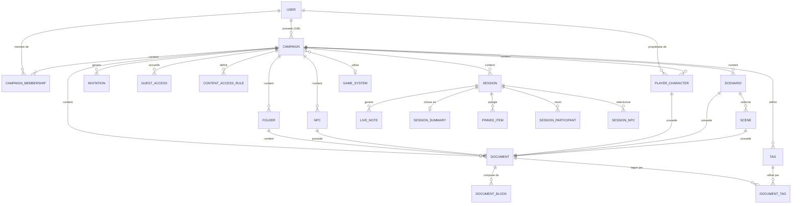

# MCD — Vue globale et conventions

## Conventions

| Notation | Signification |
|---|---|
| `PK` | Clé primaire |
| `FK` | Clé étrangère — contrainte d'intégrité référentielle en base |
| `ref` | Référence cross-context — Id sans contrainte FK en base, cohérence applicative |
| `||--||` | Un à un obligatoire |
| `||--o|` | Un à zéro ou un |
| `||--|{` | Un à un ou plusieurs |
| `||--o{` | Un à zéro ou plusieurs |
| `}o--o|` | Zéro ou plusieurs à zéro ou un |

**Références cross-context** : les champs annotés `ref` traversent les frontières
de bounded context. En base, aucune foreign key n'est posée sur ces colonnes —
la cohérence est garantie par la couche applicative. Le type reste `uuid`.

**Champ `value` dans `DOCUMENT_BLOCK`** : stocké en JSONB (PostgreSQL).
Sa structure interne dépend du `kind` du bloc — voir la section dédiée.

**Champs d'audit** : toutes les tables portent `createdAt`, `updatedAt`, `createdById`, `updatedById`.
Ils sont omis des diagrammes pour la lisibilité mais présents en base sur chaque table.

**Soft delete** : les tables marquées `[soft delete]` portent les colonnes
`isDeleted BOOLEAN DEFAULT false`, `deletedAt TIMESTAMP`, `deletedById UUID`.

**URLs** : les URLs de l'application utilisent les Id UUID. Les slugs ne sont
jamais dans les routes — ils servent à l'affichage et à la recherche uniquement.
Pattern : `/campaigns/{campaignId}/documents/{documentId}`.

---

## 1. Vue globale — relations entre contextes

Diagramme simplifié montrant les entités principales et leurs relations inter-contextes.
Les colonnes détaillées sont dans les sections par bounded context.

