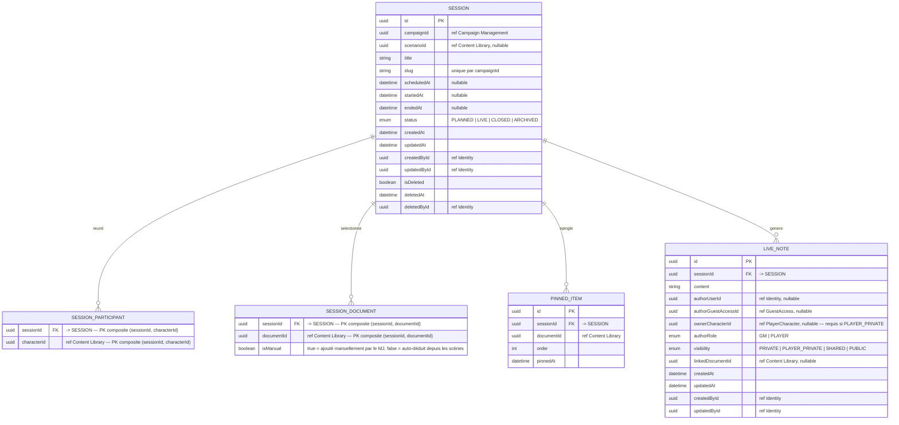

# MCD — Session Conduct

Contexte opérationnel. Gère le cycle de vie des sessions.
Toutes les références vers les autres contextes sont des références cross-context
sans FK en base.

### Notes Session Conduct

- Invariant fort : une seule session avec `status = LIVE` par `campaignId` à un instant donné.
  Index partiel : `CREATE UNIQUE INDEX ON SESSION (campaignId) WHERE status = 'LIVE'`.
- Transitions autorisées : `PLANNED → LIVE → CLOSED → ARCHIVED`. Aucun retour — enforce applicativement.
- `CLOSED` = contenu éditable pour LiveNotes rétroactives MJ. `ARCHIVED` = lecture seule complète.
- Les récapitulatifs post-session sont des `DOCUMENT` standards de campagne ; il n'existe pas
  de table dédiée de résumé dans le MVP.
- **LiveNote — règles de visibilité** :
  - `authorRole = GM` → visibilité parmi `{PRIVATE, SHARED, PUBLIC}`, défaut `PRIVATE`.
    Contrainte `CHECK` : `authorRole = 'GM' → visibility != 'PLAYER_PRIVATE'`.
  - `authorRole = PLAYER` → visibilité parmi `{PLAYER_PRIVATE, SHARED, PUBLIC}`, défaut `PLAYER_PRIVATE`.
    Le joueur peut ensuite partager sa note personnelle.
    Contrainte `CHECK` : `authorRole = 'PLAYER' → visibility != 'PRIVATE'`.
  - `visibility = PLAYER_PRIVATE` → `ownerCharacterId IS NOT NULL`.
  - Une note joueur invitée renseigne `authorGuestAccessId`; l'accès futur reste résolu par `ownerCharacterId`.
  - Les joueurs ne peuvent créer des LiveNotes que sur une session LIVE (enforce applicatif).
  - Le MJ peut créer des LiveNotes sur une session LIVE ou CLOSED.
- `SESSION_DOCUMENT.isManual` : les lignes `isManual = false` sont recalculées par `SessionDocumentSelector`
  à chaque changement de scénario (depuis l'union des `linkedDocumentIds` des scènes). Les lignes `isManual = true` sont conservées.
- `SESSION.scenarioId` doit référencer un `SCENARIO(isTemplate = false)` — un scénario source de bibliothèque ne peut pas être attaché à une session.
- Soft delete `SESSION` : supprimer physiquement `LIVE_NOTE`, `SESSION_PARTICIPANT`, `SESSION_DOCUMENT`.
- `PINNED_ITEM` et `SESSION_PARTICIPANT` : si une entité référencée est soft-deleted
  dans son contexte, supprimer physiquement la ligne ici.
- `LIVE_NOTE` : pas de soft delete, suppression physique.
- `SESSION_PARTICIPANT` : PK composite `(sessionId, characterId)`.
- `SESSION_DOCUMENT` : PK composite `(sessionId, documentId)`.
- Index recommandés : `SESSION(campaignId, status)`, `SESSION_PARTICIPANT(sessionId)`,
  `SESSION_DOCUMENT(sessionId)`, `PINNED_ITEM(sessionId, order)`, `LIVE_NOTE(sessionId)`,
  `LIVE_NOTE(sessionId, authorRole)`.
