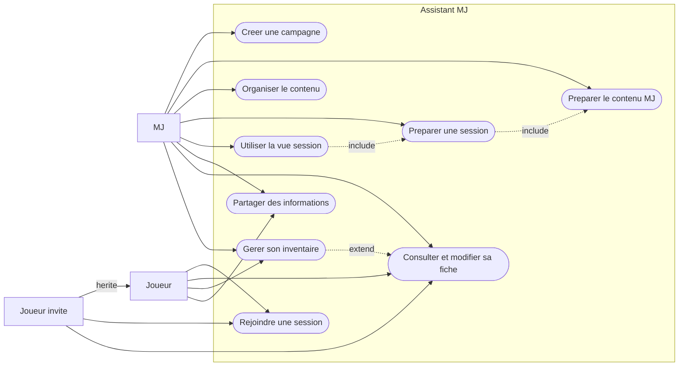
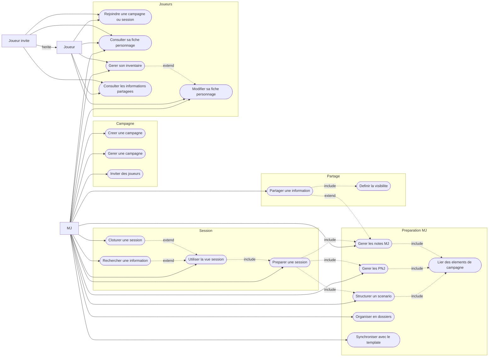
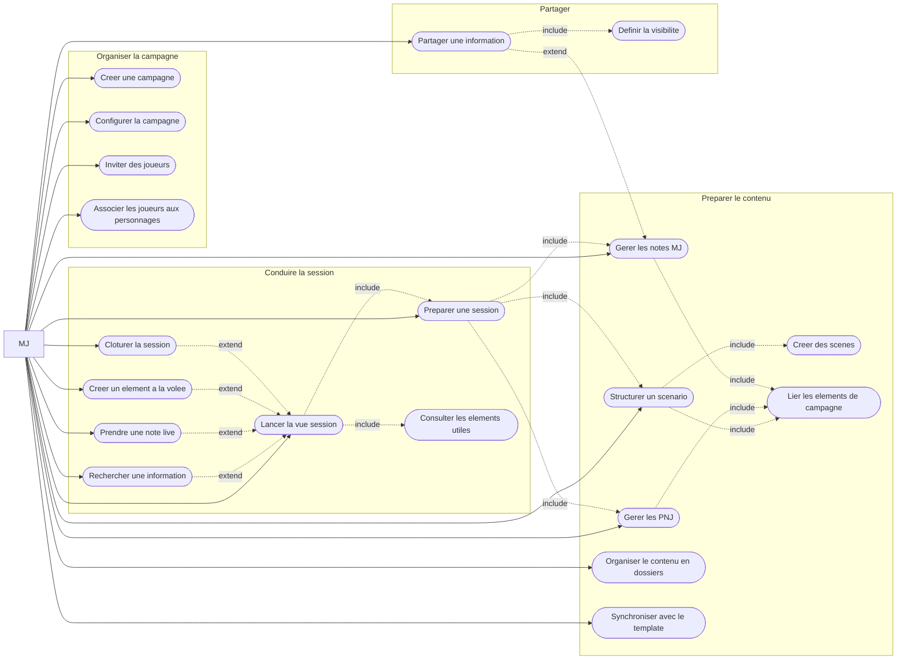
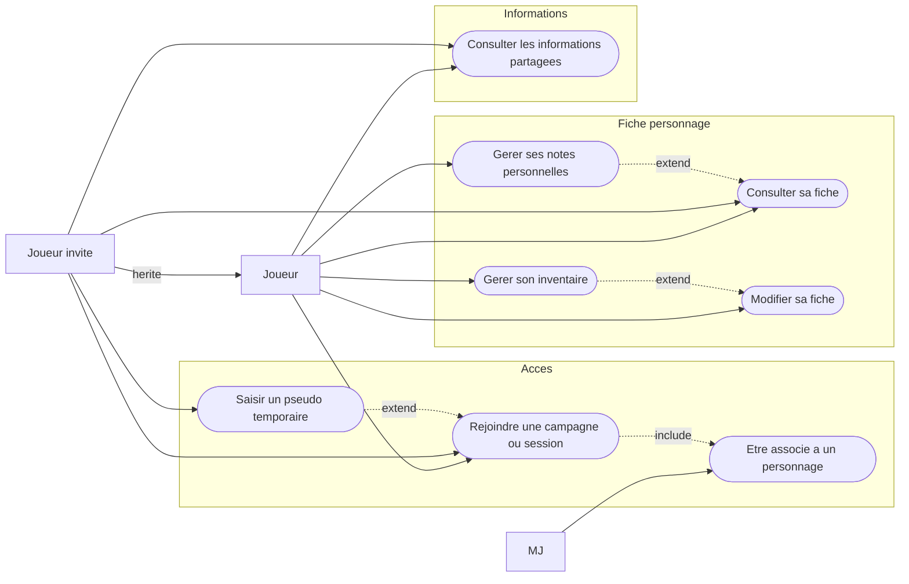
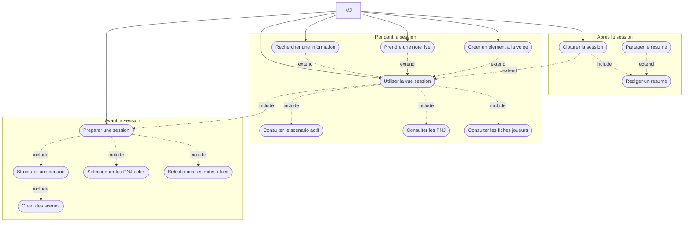

# Haversack — Diagrammes de cas d'utilisation

> Ces diagrammes couvrent le périmètre fonctionnel MVP défini dans les Use Cases.
> Organisés du plus synthétique au plus détaillé.
>
> **Note sur les acteurs** : `MJ` et `Joueur` sont des **rôles contextuels au sein d'une campagne**,
> pas des types d'utilisateurs globaux. Un même utilisateur peut être MJ d'une campagne et joueur
> dans une autre. Tout utilisateur authentifié peut créer une campagne et endosser le rôle MJ.
> `Joueur invité` est un cas technique distinct : accès temporaire sans compte (`GuestAccess`).

---

## Légende

| Notation | Signification |
|---|---|
| Rectangle `[ ]` | Acteur |
| Ovale `([ ])` | Cas d'utilisation |
| `-->` | Association acteur vers cas d'utilisation |
| `-.->` `include` | Inclusion — le cas inclus est toujours exécuté |
| `-.->` `extend` | Extension — le cas étendu est exécuté sous condition |
| `-- hérite -->` | Généralisation entre acteurs |

---

## 1. Diagramme simplifié

Vue d'entrée. Utile pour une présentation ou pour saisir le périmètre
en un coup d'oeil avant de plonger dans les détails.

---

## 2. Vue globale

Périmètre fonctionnel complet — tous les acteurs, tous les cas d'utilisation,
toutes les relations. Référence complète pour le dossier de conception.

---

## 3. Vue centree MJ

Focus sur le coeur du produit : aider le MJ a preparer, organiser
et conduire ses sessions. L'acteur Joueur n'apparait pas ici.

---

## 4. Vue centree joueur

Fonctionnalites cote joueur. Logique simple et secondaire par rapport au MJ.
Le MJ apparait uniquement pour l'association joueur-personnage qu'il controle.

---

## 5. Cycle preparation - session - cloture

Detaille la proposition de valeur centrale du produit :
preparer en amont, conduire efficacement, cloturer proprement.
Chaque package correspond a une phase temporelle distincte.

