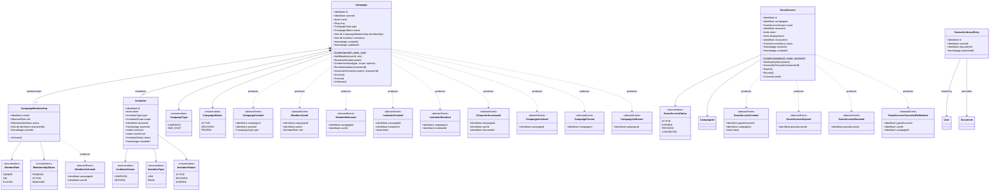

# Campaign Management — Diagramme de classes

```mermaid
classDiagram
    class Campaign {
        +identifiant id
        +identifiant ownerId
        +texte name
        +Slug slug
        +CampaignType type
        +CampaignStatus status
        +liste de CampaignMembership memberships
        +liste de Invitation invitations
        +horodatage createdAt
        +horodatage updatedAt
        +Create(ownerId, name, type)$
        +AddMember(userId, role)
        +RemoveMember(userId)
        +CreateInvitation(type, scope, options)
        +RevokeInvitation(invitationId)
        +AssociateCharacter(userId, characterId)
        +Archive()
        +Freeze()
        +Unfreeze()
    }

    class CampaignMembership {
        +identifiant userId
        +MemberRole role
        +MembershipStatus status
        +liste de identifiant characterIds
        +horodatage joinedAt
        +Activate()
    }

    class Invitation {
        +identifiant id
        +texte token
        +InvitationType type
        +InvitationScope scope
        +identifiant sessionId
        +horodatage expiresAt
        +entier maxUses
        +entier usedCount
        +InvitationStatus status
        +horodatage createdAt
    }

    class GuestAccess {
        +identifiant id
        +identifiant campaignId
        +GuestAccessScope scope
        +identifiant sessionId
        +texte token
        +texte displayName
        +identifiant characterId
        +GuestAccessStatus status
        +horodatage expiresAt
        +horodatage createdAt
        +Create(campaignId, scope, sessionId)$
        +SetDisplayName(name)
        +AssociateCharacter(characterId)
        +Expire()
        +Revoke()
        +Convert(userId)
    }

    class CampaignCreated {
        <<domainEvent>>
        +identifiant campaignId
        +identifiant ownerId
        +CampaignType type
    }

    class MemberJoined {
        <<domainEvent>>
        +identifiant campaignId
        +identifiant userId
        +MemberRole role
    }

    class MemberActivated {
        <<domainEvent>>
        +identifiant campaignId
        +identifiant userId
    }

    class MemberRemoved {
        <<domainEvent>>
        +identifiant campaignId
        +identifiant userId
    }

    class InvitationCreated {
        <<domainEvent>>
        +identifiant campaignId
        +identifiant invitationId
        +texte token
    }

    class InvitationRevoked {
        <<domainEvent>>
        +identifiant campaignId
        +identifiant invitationId
    }

    class CharacterAssociated {
        <<domainEvent>>
        +identifiant campaignId
        +identifiant userId
        +identifiant characterId
    }

    class CampaignArchived {
        <<domainEvent>>
        +identifiant campaignId
    }

    class CampaignFrozen {
        <<domainEvent>>
        +identifiant campaignId
    }

    class CampaignUnfrozen {
        <<domainEvent>>
        +identifiant campaignId
    }

    class GuestAccessCreated {
        <<domainEvent>>
        +identifiant guestAccessId
        +identifiant campaignId
        +texte token
    }

    class GuestAccessExpired {
        <<domainEvent>>
        +identifiant guestAccessId
    }

    class GuestAccessRevoked {
        <<domainEvent>>
        +identifiant guestAccessId
    }

    class GuestAccessConvertedToMember {
        <<domainEvent>>
        +identifiant guestAccessId
        +identifiant userId
        +identifiant campaignId
    }

    class CampaignType {
        <<enumeration>>
        CAMPAIGN
        ONE_SHOT
    }

    class CampaignStatus {
        <<enumeration>>
        ACTIVE
        ARCHIVED
        FROZEN
    }

    class MemberRole {
        <<enumeration>>
        OWNER
        GM
        PLAYER
    }

    class MembershipStatus {
        <<enumeration>>
        PENDING
        ACTIVE
        REMOVED
    }

    class InvitationScope {
        <<enumeration>>
        CAMPAIGN
        SESSION
    }

    class InvitationType {
        <<enumeration>>
        LINK
        EMAIL
    }

    class InvitationStatus {
        <<enumeration>>
        ACTIVE
        REVOKED
        EXPIRED
    }

    class GuestAccessStatus {
        <<enumeration>>
        ACTIVE
        EXPIRED
        REVOKED
        CONVERTED
    }

    Campaign "1" *-- "1..*" CampaignMembership : memberships
    Campaign "1" *-- "0..*" Invitation : invitations
    Campaign --> CampaignType
    Campaign --> CampaignStatus
    CampaignMembership --> MemberRole
    CampaignMembership --> MembershipStatus
    Invitation --> InvitationScope
    Invitation --> InvitationType
    Invitation --> InvitationStatus
    GuestAccess --> GuestAccessStatus
    GuestAccess --> CampaignId

    %% post-MVP
    class ScenarioLibraryEntry {
        +identifiant id
        +identifiant ownerId
        +identifiant documentId
        +horodatage promotedAt
    }

    ScenarioLibraryEntry --> User : owned by
    ScenarioLibraryEntry --> Document : promotes

    Campaign ..> CampaignCreated : produces
    Campaign ..> MemberJoined : produces
    Campaign ..> MemberRemoved : produces
    Campaign ..> InvitationCreated : produces
    Campaign ..> InvitationRevoked : produces
    Campaign ..> CharacterAssociated : produces
    Campaign ..> CampaignArchived : produces
    Campaign ..> CampaignFrozen : produces
    Campaign ..> CampaignUnfrozen : produces
    CampaignMembership ..> MemberActivated : produces
    GuestAccess ..> GuestAccessCreated : produces
    GuestAccess ..> GuestAccessExpired : produces
    GuestAccess ..> GuestAccessRevoked : produces
    GuestAccess ..> GuestAccessConvertedToMember : produces
```
