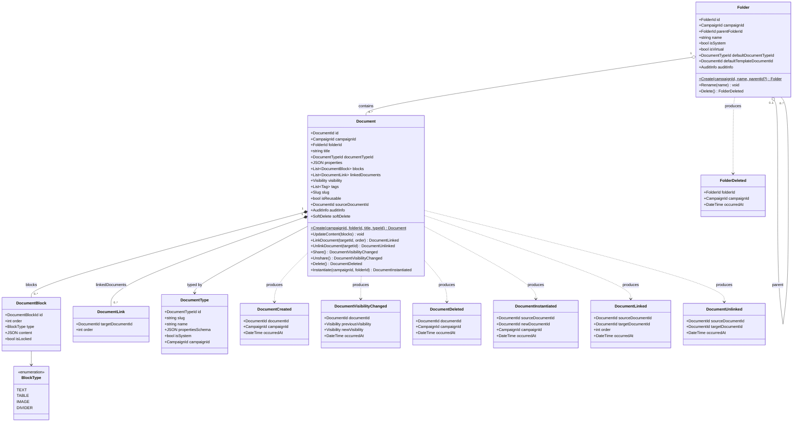

# Content Library — Diagramme de classes

```mermaid
classDiagram
    class Document {
        +DocumentId id
        +CampaignId campaignId
        +FolderId folderId
        +string title
        +DocumentTypeId documentTypeId
        +JSON properties
        +List~DocumentBlock~ blocks
        +List~DocumentLink~ linkedDocuments
        +Visibility visibility
        +List~Tag~ tags
        +Slug slug
        +bool isReusable
        +DocumentId sourceDocumentId
        +AuditInfo auditInfo
        +SoftDelete softDelete
        +Create(campaignId, folderId, title, typeId)$ Document
        +UpdateContent(blocks) void
        +LinkDocument(targetId, order) DocumentLinked
        +UnlinkDocument(targetId) DocumentUnlinked
        +Share() DocumentVisibilityChanged
        +Unshare() DocumentVisibilityChanged
        +Delete() DocumentDeleted
        +Instantiate(campaignId, folderId) DocumentInstantiated
    }

    class DocumentBlock {
        +DocumentBlockId id
        +int order
        +BlockType type
        +JSON content
        +bool isLocked
    }

    class DocumentLink {
        +DocumentId targetDocumentId
        +int order
    }

    class Folder {
        +FolderId id
        +CampaignId campaignId
        +FolderId parentFolderId
        +string name
        +bool isSystem
        +bool isVirtual
        +DocumentTypeId defaultDocumentTypeId
        +DocumentId defaultTemplateDocumentId
        +AuditInfo auditInfo
        +Create(campaignId, name, parentId?)$ Folder
        +Rename(name) void
        +Delete() FolderDeleted
    }

    class DocumentType {
        +DocumentTypeId id
        +string slug
        +string name
        +JSON propertiesSchema
        +bool isSystem
        +CampaignId campaignId
    }

    class BlockType {
        <<enumeration>>
        TEXT
        TABLE
        IMAGE
        DIVIDER
    }

    class DocumentCreated {
        +DocumentId documentId
        +CampaignId campaignId
        +DateTime occurredAt
    }

    class DocumentVisibilityChanged {
        +DocumentId documentId
        +Visibility previousVisibility
        +Visibility newVisibility
        +DateTime occurredAt
    }

    class DocumentDeleted {
        +DocumentId documentId
        +CampaignId campaignId
        +DateTime occurredAt
    }

    class DocumentInstantiated {
        +DocumentId sourceDocumentId
        +DocumentId newDocumentId
        +CampaignId campaignId
        +DateTime occurredAt
    }

    class DocumentLinked {
        +DocumentId sourceDocumentId
        +DocumentId targetDocumentId
        +int order
        +DateTime occurredAt
    }

    class DocumentUnlinked {
        +DocumentId sourceDocumentId
        +DocumentId targetDocumentId
        +DateTime occurredAt
    }

    class FolderDeleted {
        +FolderId folderId
        +CampaignId campaignId
        +DateTime occurredAt
    }

    Document "1" *-- "0..*" DocumentBlock : blocks
    Document "1" *-- "0..*" DocumentLink : linkedDocuments
    Document --> DocumentType : typed by
    Document ..> DocumentCreated : produces
    Document ..> DocumentVisibilityChanged : produces
    Document ..> DocumentDeleted : produces
    Document ..> DocumentInstantiated : produces
    Document ..> DocumentLinked : produces
    Document ..> DocumentUnlinked : produces
    Folder ..> FolderDeleted : produces
    DocumentBlock --> BlockType
    Folder "1" o-- "0..*" Document : contains
    Folder "0..1" o-- "0..*" Folder : parent
```
