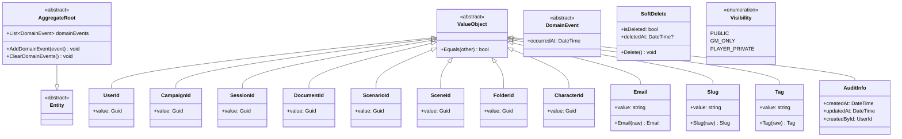

# Core — Diagramme de classes

```mermaid
classDiagram
    class AggregateRoot {
        <<abstract>>
        +List~DomainEvent~ domainEvents
        +AddDomainEvent(event) void
        +ClearDomainEvents() void
    }

    class Entity {
        <<abstract>>
    }

    class ValueObject {
        <<abstract>>
        +Equals(other) bool
    }

    class DomainEvent {
        <<abstract>>
        +occurredAt: DateTime
    }

    class UserId {
        +value: Guid
    }
    class CampaignId {
        +value: Guid
    }
    class SessionId {
        +value: Guid
    }
    class DocumentId {
        +value: Guid
    }
    class ScenarioId {
        +value: Guid
    }
    class SceneId {
        +value: Guid
    }
    class FolderId {
        +value: Guid
    }
    class CharacterId {
        +value: Guid
    }

    class Email {
        +value: string
        +Email(raw) Email
    }

    class Slug {
        +value: string
        +Slug(raw) Slug
    }

    class Tag {
        +value: string
        +Tag(raw) Tag
    }

    class AuditInfo {
        +createdAt: DateTime
        +updatedAt: DateTime
        +createdById: UserId
    }

    class SoftDelete {
        +isDeleted: bool
        +deletedAt: DateTime?
        +Delete() void
    }

    class Visibility {
        <<enumeration>>
        PUBLIC
        GM_ONLY
        PLAYER_PRIVATE
    }

    AggregateRoot --|> Entity
    ValueObject <|-- UserId
    ValueObject <|-- CampaignId
    ValueObject <|-- SessionId
    ValueObject <|-- DocumentId
    ValueObject <|-- ScenarioId
    ValueObject <|-- SceneId
    ValueObject <|-- FolderId
    ValueObject <|-- CharacterId
    ValueObject <|-- Email
    ValueObject <|-- Slug
    ValueObject <|-- Tag
    ValueObject <|-- AuditInfo
```
