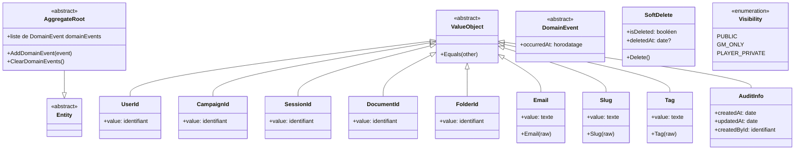

# Core — Diagramme de classes

```mermaid
classDiagram
    class AggregateRoot {
        <<abstract>>
        +liste de DomainEvent domainEvents
        +AddDomainEvent(event)
        +ClearDomainEvents()
    }

    class Entity {
        <<abstract>>
    }

    class ValueObject {
        <<abstract>>
        +Equals(other)
    }

    class DomainEvent {
        <<abstract>>
        +occurredAt: horodatage
    }

    class UserId {
        +value: identifiant
    }
    class CampaignId {
        +value: identifiant
    }
    class SessionId {
        +value: identifiant
    }
    class DocumentId {
        +value: identifiant
    }
    class FolderId {
        +value: identifiant
    }

    class Email {
        +value: texte
        +Email(raw)
    }

    class Slug {
        +value: texte
        +Slug(raw)
    }

    class Tag {
        +value: texte
        +Tag(raw)
    }

    class AuditInfo {
        +createdAt: date
        +updatedAt: date
        +createdById: identifiant
    }

    class SoftDelete {
        +isDeleted: booléen
        +deletedAt: date?
        +Delete()
    }

    class Visibility {
        <<enumeration>>
        PUBLIC
        GM_ONLY
        PLAYER_PRIVATE
    }

    AggregateRoot --|> Entity
    ValueObject <|-- UserId
    ValueObject <|-- CampaignId
    ValueObject <|-- SessionId
    ValueObject <|-- DocumentId
    ValueObject <|-- FolderId
    ValueObject <|-- Email
    ValueObject <|-- Slug
    ValueObject <|-- Tag
    ValueObject <|-- AuditInfo
```
