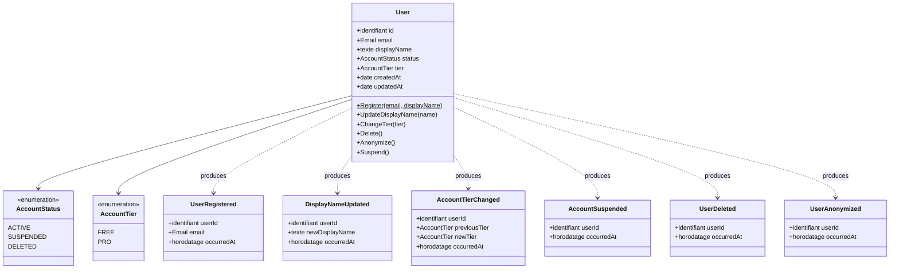

# Identity & Access — Diagramme de classes

```mermaid
classDiagram
    class User {
        +identifiant id
        +Email email
        +texte displayName
        +AccountStatus status
        +AccountTier tier
        +date createdAt
        +date updatedAt
        +Register(email, displayName)$
        +UpdateDisplayName(name)
        +ChangeTier(tier)
        +Delete()
        +Anonymize()
        +Suspend()
    }

    class AccountStatus {
        <<enumeration>>
        ACTIVE
        SUSPENDED
        DELETED
    }

    class AccountTier {
        <<enumeration>>
        FREE
        PRO
    }

    class UserRegistered {
        +identifiant userId
        +Email email
        +horodatage occurredAt
    }

    class AccountTierChanged {
        +identifiant userId
        +AccountTier previousTier
        +AccountTier newTier
        +horodatage occurredAt
    }

    class UserDeleted {
        +identifiant userId
        +horodatage occurredAt
    }

    class UserAnonymized {
        +identifiant userId
        +horodatage occurredAt
    }

    class DisplayNameUpdated {
        +identifiant userId
        +texte newDisplayName
        +horodatage occurredAt
    }

    class AccountSuspended {
        +identifiant userId
        +horodatage occurredAt
    }

    User --> AccountStatus
    User --> AccountTier
    User ..> UserRegistered : produces
    User ..> DisplayNameUpdated : produces
    User ..> AccountTierChanged : produces
    User ..> AccountSuspended : produces
    User ..> UserDeleted : produces
    User ..> UserAnonymized : produces
```
