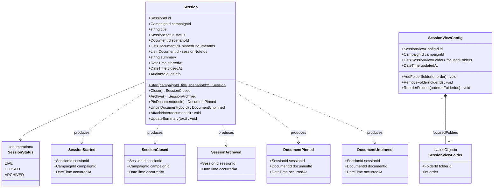

# Session Conduct — Diagramme de classes

```mermaid
classDiagram
    class Session {
        +SessionId id
        +CampaignId campaignId
        +string title
        +SessionStatus status
        +DocumentId scenarioId
        +List~DocumentId~ pinnedDocumentIds
        +List~DocumentId~ sessionNoteIds
        +string summary
        +DateTime startedAt
        +DateTime closedAt
        +AuditInfo auditInfo
        +Start(campaignId, title, scenarioId?)$ Session
        +Close() SessionClosed
        +Archive() SessionArchived
        +PinDocument(docId) DocumentPinned
        +UnpinDocument(docId) DocumentUnpinned
        +AttachNote(documentId) void
        +UpdateSummary(text) void
    }

    class SessionViewConfig {
        +SessionViewConfigId id
        +CampaignId campaignId
        +List~SessionViewFolder~ focusedFolders
        +DateTime updatedAt
        +AddFolder(folderId, order) void
        +RemoveFolder(folderId) void
        +ReorderFolders(orderedFolderIds) void
    }

    class SessionViewFolder {
        <<valueObject>>
        +FolderId folderId
        +int order
    }

    class SessionStatus {
        <<enumeration>>
        LIVE
        CLOSED
        ARCHIVED
    }

    class SessionStarted {
        +SessionId sessionId
        +CampaignId campaignId
        +DateTime occurredAt
    }

    class SessionClosed {
        +SessionId sessionId
        +CampaignId campaignId
        +DateTime occurredAt
    }

    class SessionArchived {
        +SessionId sessionId
        +DateTime occurredAt
    }

    class DocumentPinned {
        +SessionId sessionId
        +DocumentId documentId
        +DateTime occurredAt
    }

    class DocumentUnpinned {
        +SessionId sessionId
        +DocumentId documentId
        +DateTime occurredAt
    }

    Session --> SessionStatus
    Session ..> SessionStarted : produces
    Session ..> SessionClosed : produces
    Session ..> SessionArchived : produces
    Session ..> DocumentPinned : produces
    Session ..> DocumentUnpinned : produces
    SessionViewConfig "1" *-- "0..*" SessionViewFolder : focusedFolders
```
