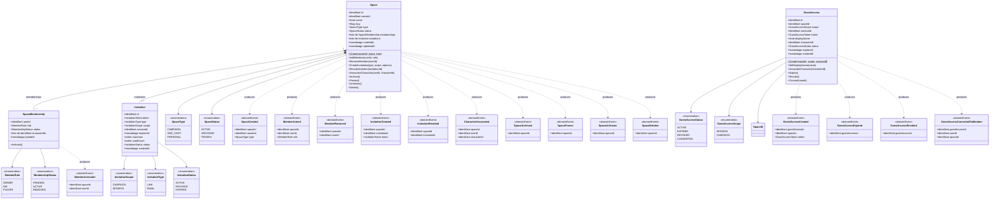

# Space Management — Diagramme de classes

```mermaid
classDiagram
    class Space {
        +identifiant id
        +identifiant ownerId
        +texte name
        +Slug slug
        +SpaceType type
        +SpaceStatus status
        +liste de SpaceMembership memberships
        +liste de Invitation invitations
        +horodatage createdAt
        +horodatage updatedAt
        +Create(ownerId, name, type)$
        +AddMember(userId, role)
        +RemoveMember(userId)
        +CreateInvitation(type, scope, options)
        +RevokeInvitation(invitationId)
        +AssociateCharacter(userId, characterId)
        +Archive()
        +Freeze()
        +Unfreeze()
        +Delete()
    }

    class SpaceMembership {
        +identifiant userId
        +MemberRole role
        +MembershipStatus status
        +liste de identifiant characterIds
        +horodatage joinedAt
        +Activate()
    }

    class Invitation {
        +identifiant id
        +InvitationToken token
        +InvitationType type
        +InvitationScope scope
        +identifiant sessionId
        +horodatage expiresAt
        +entier maxUses
        +entier usedCount
        +InvitationStatus status
        +horodatage createdAt
    }

    class GuestAccess {
        +identifiant id
        +identifiant spaceId
        +GuestAccessScope scope
        +identifiant sessionId
        +GuestAccessToken token
        +texte displayName
        +identifiant characterId
        +GuestAccessStatus status
        +horodatage expiresAt
        +horodatage createdAt
        +Create(spaceId, scope, sessionId)$
        +SetDisplayName(name)
        +AssociateCharacter(characterId)
        +Expire()
        +Revoke()
        +Convert(userId)
    }

    class SpaceCreated {
        <<domainEvent>>
        +identifiant spaceId
        +identifiant ownerId
        +SpaceType type
    }

    class MemberJoined {
        <<domainEvent>>
        +identifiant spaceId
        +identifiant userId
        +MemberRole role
    }

    class MemberActivated {
        <<domainEvent>>
        +identifiant spaceId
        +identifiant userId
    }

    class MemberRemoved {
        <<domainEvent>>
        +identifiant spaceId
        +identifiant userId
    }

    class InvitationCreated {
        <<domainEvent>>
        +identifiant spaceId
        +identifiant invitationId
        +InvitationToken token
    }

    class InvitationRevoked {
        <<domainEvent>>
        +identifiant spaceId
        +identifiant invitationId
    }

    class CharacterAssociated {
        <<domainEvent>>
        +identifiant spaceId
        +identifiant userId
        +identifiant characterId
    }

    class SpaceArchived {
        <<domainEvent>>
        +identifiant spaceId
    }

    class SpaceFrozen {
        <<domainEvent>>
        +identifiant spaceId
    }

    class SpaceUnfrozen {
        <<domainEvent>>
        +identifiant spaceId
    }

    class SpaceDeleted {
        <<domainEvent>>
        +identifiant spaceId
    }

    class GuestAccessCreated {
        <<domainEvent>>
        +identifiant guestAccessId
        +identifiant spaceId
        +GuestAccessToken token
    }

    class GuestAccessExpired {
        <<domainEvent>>
        +identifiant guestAccessId
    }

    class GuestAccessRevoked {
        <<domainEvent>>
        +identifiant guestAccessId
    }

    class GuestAccessConvertedToMember {
        <<domainEvent>>
        +identifiant guestAccessId
        +identifiant userId
        +identifiant spaceId
    }

    class SpaceType {
        <<enumeration>>
        CAMPAIGN
        ONE_SHOT
        PERSONAL
    }

    class SpaceStatus {
        <<enumeration>>
        ACTIVE
        ARCHIVED
        FROZEN
    }

    class MemberRole {
        <<enumeration>>
        OWNER
        GM
        PLAYER
    }

    class MembershipStatus {
        <<enumeration>>
        PENDING
        ACTIVE
        REMOVED
    }

    class InvitationScope {
        <<enumeration>>
        CAMPAIGN
        SESSION
    }

    class InvitationType {
        <<enumeration>>
        LINK
        EMAIL
    }

    class InvitationStatus {
        <<enumeration>>
        ACTIVE
        REVOKED
        EXPIRED
    }

    class GuestAccessStatus {
        <<enumeration>>
        ACTIVE
        EXPIRED
        REVOKED
        CONVERTED
    }

    class GuestAccessScope {
        <<enumeration>>
        SESSION
        CAMPAIGN
    }

    Space "1" *-- "1..*" SpaceMembership : memberships
    Space "1" *-- "0..*" Invitation : invitations
    Space --> SpaceType
    Space --> SpaceStatus
    SpaceMembership --> MemberRole
    SpaceMembership --> MembershipStatus
    Invitation --> InvitationScope
    Invitation --> InvitationType
    Invitation --> InvitationStatus
    GuestAccess --> GuestAccessStatus
    GuestAccess --> GuestAccessScope
    GuestAccess --> SpaceId

    Space ..> SpaceCreated : produces
    Space ..> MemberJoined : produces
    Space ..> MemberRemoved : produces
    Space ..> InvitationCreated : produces
    Space ..> InvitationRevoked : produces
    Space ..> CharacterAssociated : produces
    Space ..> SpaceArchived : produces
    Space ..> SpaceFrozen : produces
    Space ..> SpaceUnfrozen : produces
    Space ..> SpaceDeleted : produces
    SpaceMembership ..> MemberActivated : produces
    GuestAccess ..> GuestAccessCreated : produces
    GuestAccess ..> GuestAccessExpired : produces
    GuestAccess ..> GuestAccessRevoked : produces
    GuestAccess ..> GuestAccessConvertedToMember : produces
```
