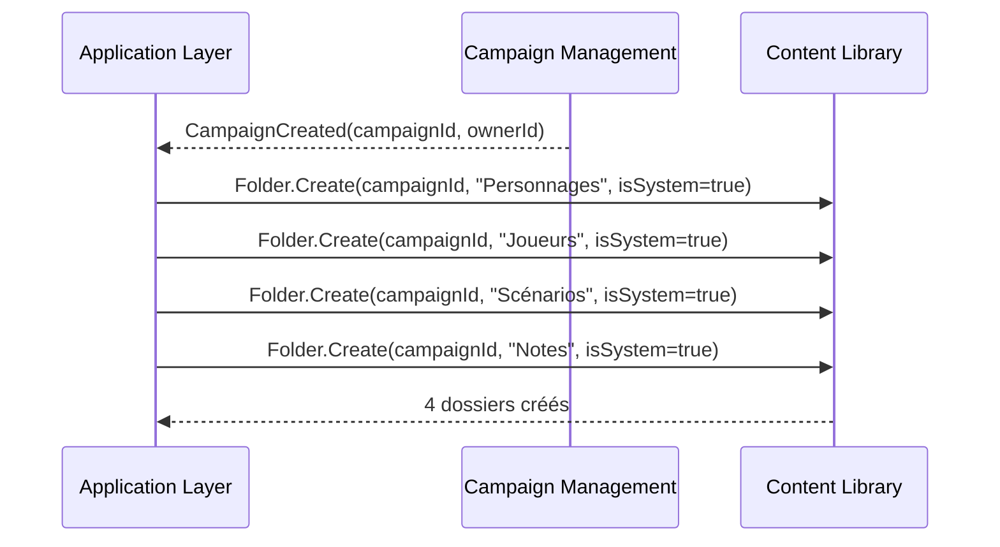
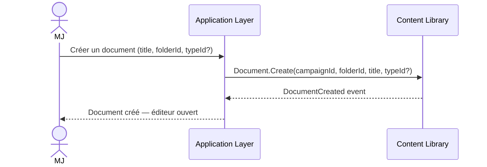
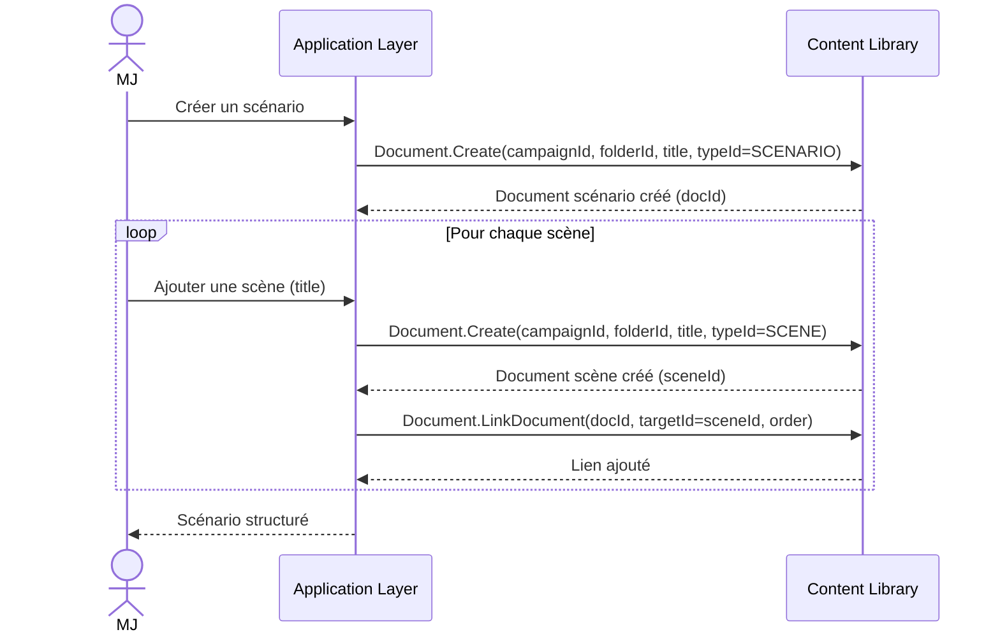
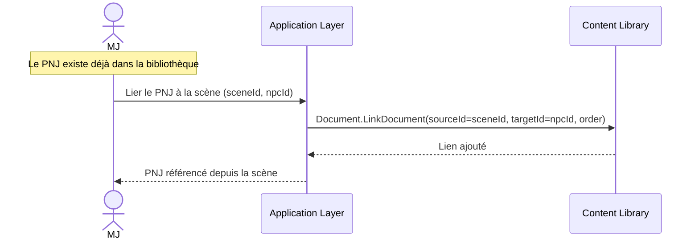
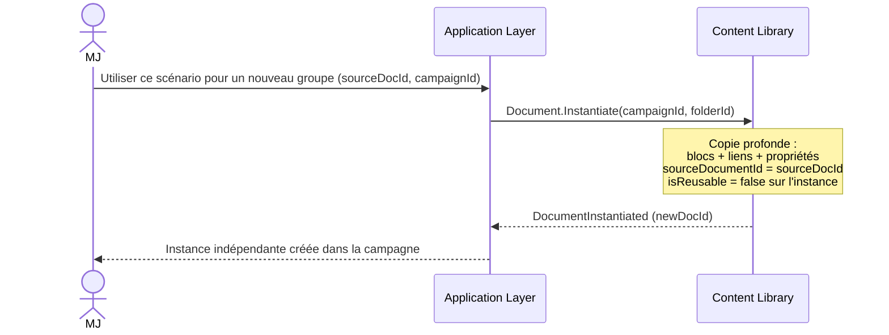
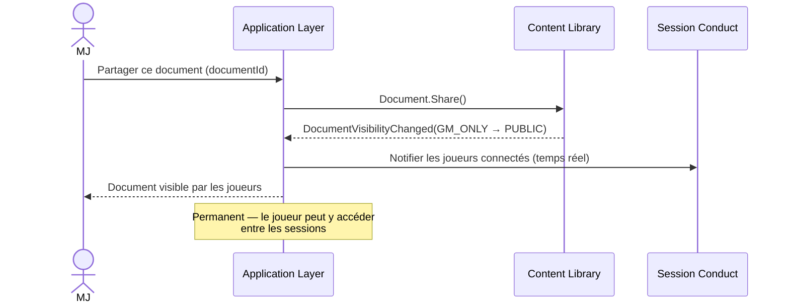
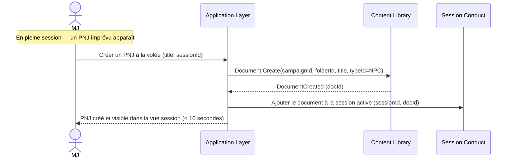
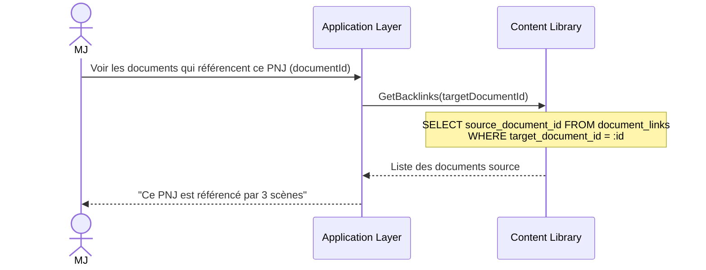

# Content Library — Diagrammes de flux

## 1. Création des dossiers système à la création de campagne

## 2. Créer un document simple (PNJ, note…)

## 3. Créer un scénario avec scènes

## 4. Référencer un PNJ depuis une scène

## 5. Instancier un scénario réutilisable (UC-13)

## 6. Partager un document avec les joueurs

## 7. Création à la volée en session (UC-07)

## 8. Consulter les backlinks d'un document

