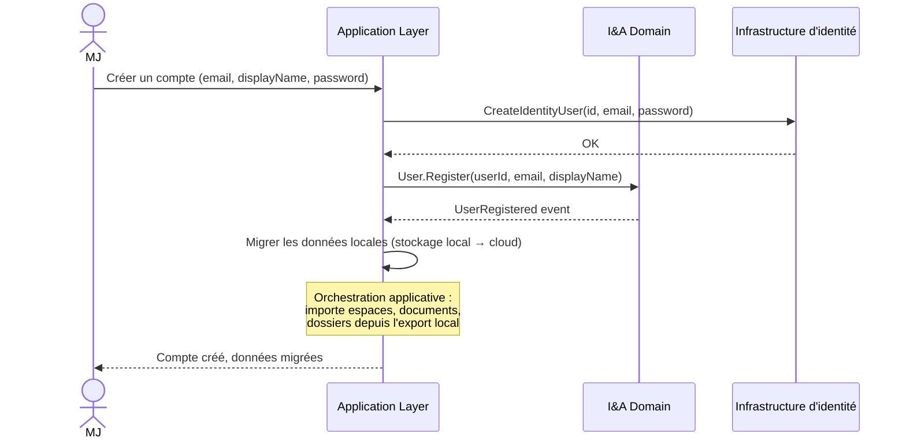
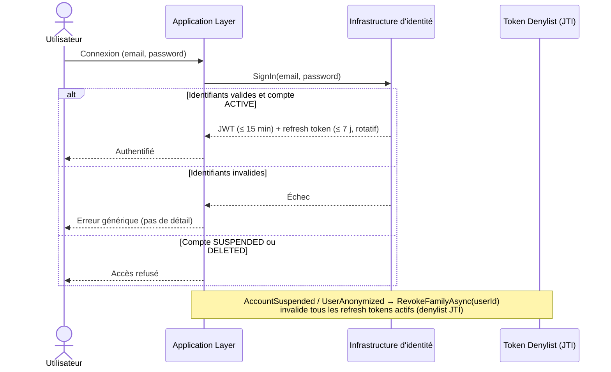
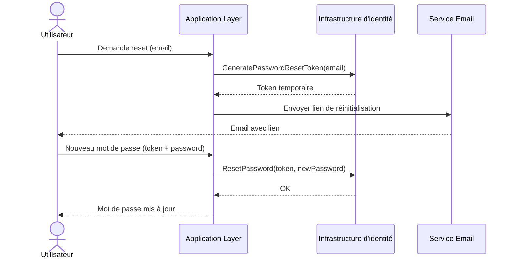
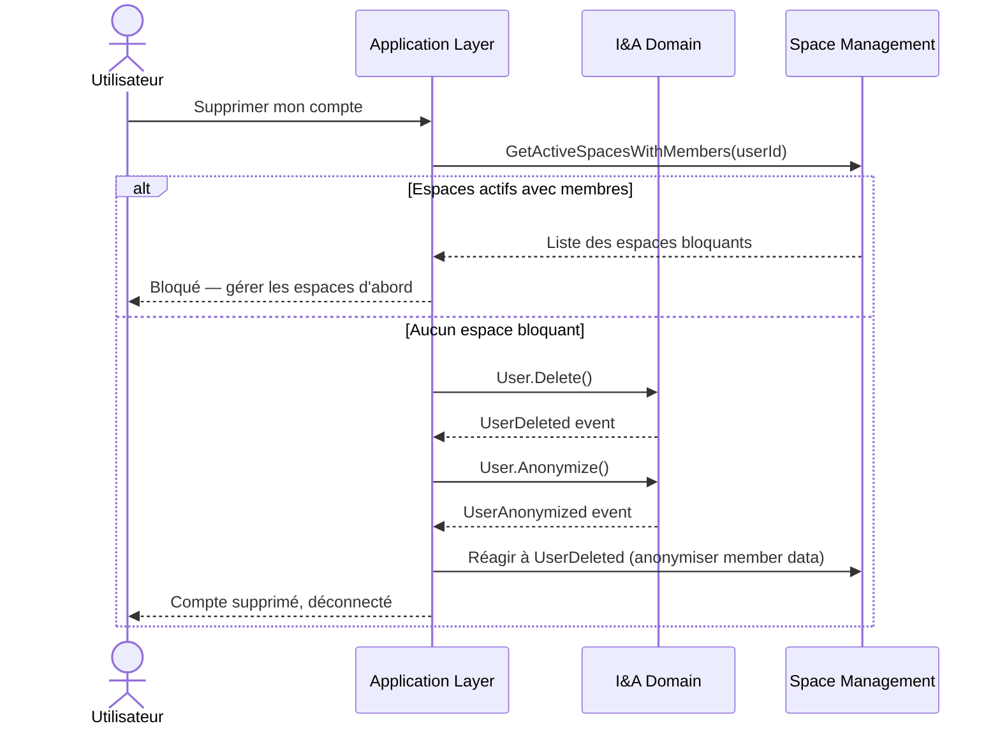
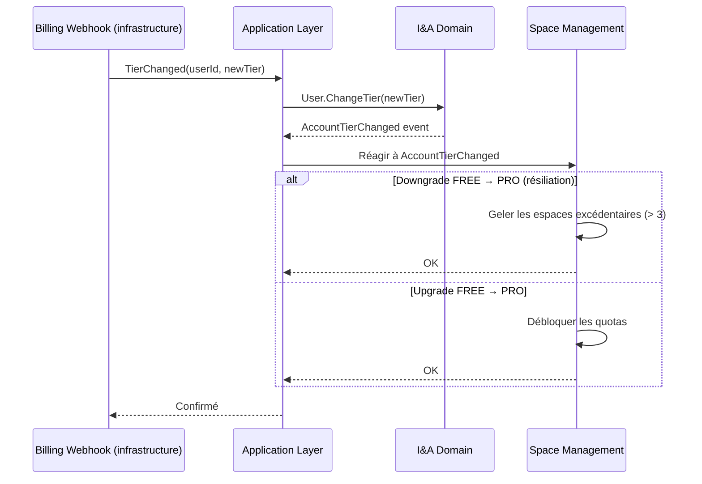
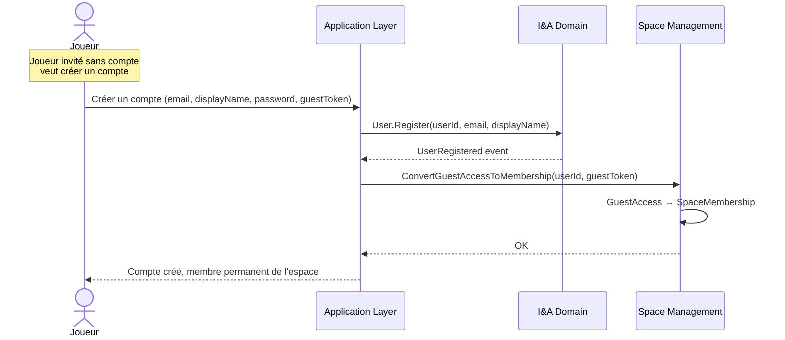

# Identity & Access — Diagrammes de flux

## 1. Inscription depuis le mode local

## 2. Connexion

> Durées et révocation définies dans [ADR-015](../../../../architecture/decisions/ADR-015-securite-authentification-mvp.md) §3 : access token ≤ 15 min, refresh token ≤ 7 j absolu avec rotation et détection de réutilisation (denylist JTI). La révocation de la famille de tokens est déclenchée par `AccountSuspended` et `UserAnonymized` via `ITokenDenylist.RevokeFamilyAsync`.

## 3. Réinitialisation du mot de passe

## 4. Suppression de compte (RGPD)

## 5. Changement de tier (upgrade ou résiliation)

## 6. Conversion GuestAccess → User

