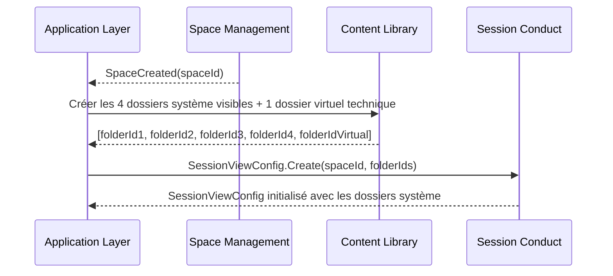
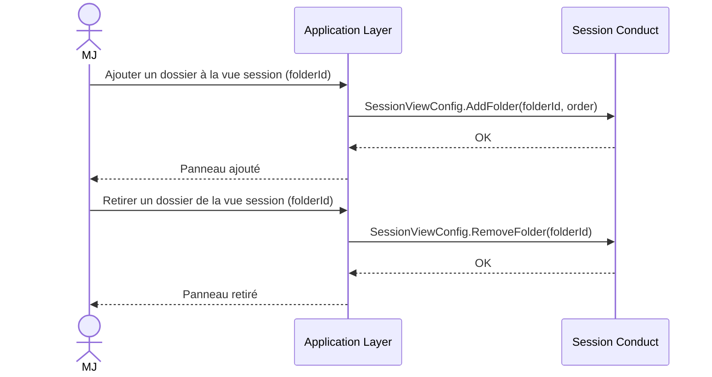
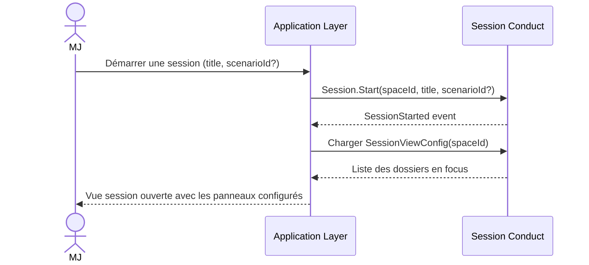
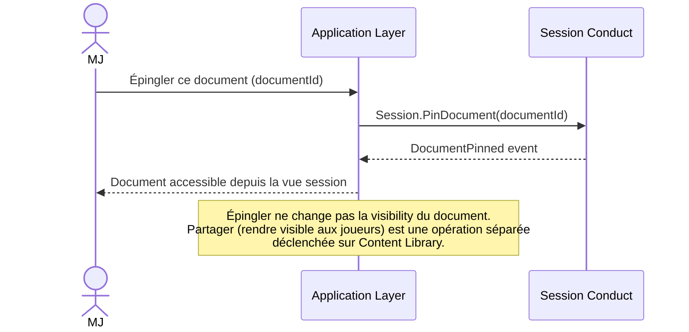
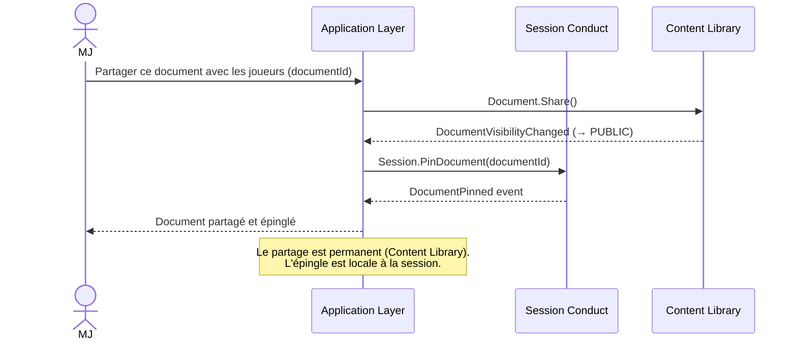
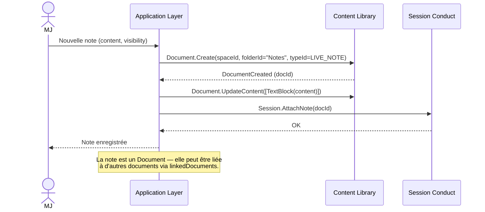
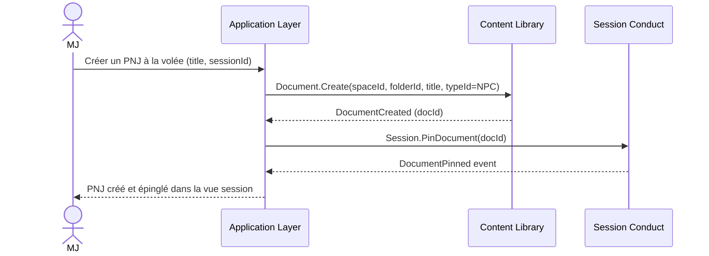
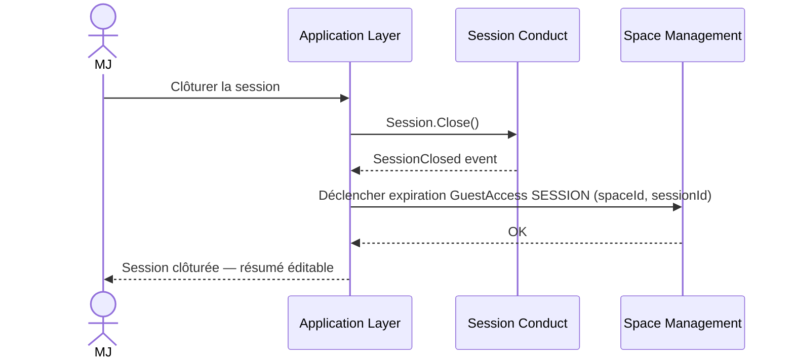
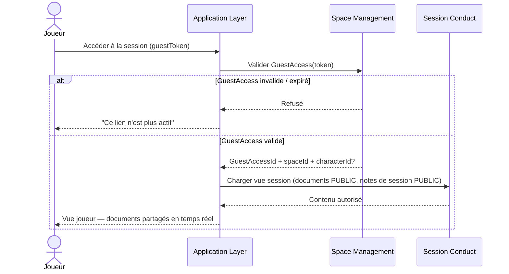

# Session Conduct — Diagrammes de flux

## 1. Initialisation de SessionViewConfig à la création d'espace

## 2. Configurer les panneaux de la vue session

## 3. Démarrer une session

## 4. Épingler un document en session

## 5. Partager un document depuis la vue session

## 6. Créer une note de session

## 7. Création à la volée en session (UC-07)

## 8. Clôturer une session

## 9. Accès joueur à la session (sans compte)

